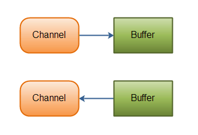
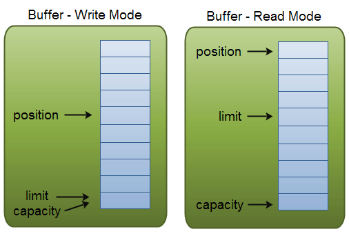

<!-- TOC START min:1 max:3 link:true update:true -->
  - [附带的实例代码在 /codes/src/edu/io 下](#附带的实例代码在-codessrceduio-下)
- [概述](#概述)
- [磁盘操作](#磁盘操作)
- [字节操作](#字节操作)
  - [实现文件复制](#实现文件复制)
  - [装饰者模式](#装饰者模式)
- [字符操作](#字符操作)
  - [编码与解码](#编码与解码)
  - [String 的编码方式](#string-的编码方式)
  - [Reader 和 Writer](#reader-和-writer)
  - [实现逐行输出文本文件的内容](#实现逐行输出文本文件的内容)
- [对象操作](#对象操作)
  - [序列化](#序列化)
  - [Serializable接口](#serializable接口)
  - [transient](#transient)
- [网络](#网络)
  - [InetAddress](#inetaddress)
  - [URL](#url)
- [Sockets(BIO)](#socketsbio)
  - [Datagram](#datagram)
- [NIO](#nio)
  - [流与块](#流与块)
  - [通道](#通道)
  - [Buffer](#buffer)
    - [Buffer的基本用法](#buffer的基本用法)
    - [Buffer的capacity,position和limit](#buffer的capacityposition和limit)
    - [基本的 Channel 实例](#基本的-channel-实例)
  - [Selector](#selector)
    - [selector 创建](#selector-创建)
    - [注册通道](#注册通道)
    - [监听事件](#监听事件)
    - [获取到达的事件](#获取到达的事件)
    - [事件循环](#事件循环)
  - [套接字 NIO 实例](#套接字-nio-实例)
- [AIO](#aio)
  - [AIO,BIO和NIO](#aiobio和nio)
  - [同步阻塞，同步非阻塞，异步阻塞，异步非阻塞IO](#同步阻塞同步非阻塞异步阻塞异步非阻塞io)
- [参考资料](#参考资料)

<!-- TOC END -->

## 附带的实例代码在 /codes/src/edu/io 下
[实例代码](../codes/src/)

# 概述
Java 的 IO 大致可以分为：
  - 磁盘操作：File
  - 字节操作：InputStream 和 OutputStream
  - 字符操作：Reader 和Writer
  - 对象操作：Serializable
  - 网络操作：Socket
  - 新的IO：NIO

# 磁盘操作
File 类用来表示文件和目录的信息，但是它不表示文件的内容

递归一个目录下文件：
```java
public static void listAllFiles(File dir){
  if(dir == null || !dir.exists()) return;

  if(dir.isFile()){
    System.out.println(dir.getName());
    return;
  }
  for(File file : dir.listFiles())
    listAllFiles(file);
}
```

# 字节操作
## 实现文件复制
```java
public static void copyFile(String src, String dist) throws IOException{
    FileInputStream in = new FileInputStream(src);
    //FileOutputStream out = new FileOutputStream(dist);
    //续写：FileOutputStream构造方法,的第二个参数中，加入true
    FileOutputStream out = new FileOutputStream(dist, true);

    byte[] buffer = new byte[20 * 1024];    // 20MB
    int cnt = 0;

    // read() 最多读取 buffer.length 个字节
    // 返回的是实际读取的个数
    // 返回 -1 时候表示读到 eof
    while((cnt = in.read(buffer, 0, buffer.length)) != -1 )
        out.write(buffer, 0, cnt);

    in.close();
    out.close();
}

public static void main(String[] args) throws IOException{

    // 如果找不到源文件，会抛出 FileNotFoundException
    // 如果目标文件不存在，会新建。如果存在，覆盖与否取决于 FileOutputStream 的构造方式，见上
    copyFile("resources/in.txt", "resources/out.txt");
    System.out.println("OK!");
}
```

## 装饰者模式
Java I/O 使用了装饰者模式。以 InputStream 为例：
  - InputStream 是抽象组件
  - FileInputStream 是 InputStream 的子类，属于具体组件，提供了字节流的输入操作
  - FilterInputStream 属于抽象装饰者，装饰者用于装饰组件，为组件提供额外的功能。例如 BufferInputStram 为 FileInputStream 提供缓存的功能


实例化一个具有缓存功能的字节流对象时，只需要在 FileInputStream 对象上再套一层 BufferedInputStream 对象即可。
```java
FileInputStream in = new FileInputStream(filePath);
BufferedInputStream buff = new BufferedInputStream(in);
```
DataInputStram 装饰者提供了对更多数据类型的输入操作，比如 int，double 等基本类型。

# 字符操作
## 编码与解码
- 编码：把字符转换为字节
- 解码：把字节重新组合成字符
- 如果编码和解码过程使用不同的编码方式就会出现乱码

- GBK 编码中，中文字符占 2 个字节，英文字符占 1 个字节
- UTF-8 中，中文字符占 3 个字节，英文字符占 1 个字节
- UTF-16be 中，中文和英文都占 2 个字节

Java 的内存编码使用双字节编码 UTF-16be，这不是指 Java 只支持这一种编码方式，而是说 char 这种类型使用 UTF-16be 进行编码。char 类型占 16 位，也就是两个字节，Java 使用这种双字节编码是为了让一个中文或者一个英文都能使用一个 char 来存储。

## String 的编码方式
String 可以看成一个字符序列，可以指定一个编码方式将它编码为字节序列，
也可以指定一个编码方式将一个字节序列解码为 String
```java
String str1 = "中文";
byte[] bytes = str1.getBytes("UTF-8");
String str2 = new String(bytes, "UTF-8");
System.out.println(str2);
```
```text
"中文"
```
在调用无参数 getBytes() 方法时，默认的编码方式不是 UTF-16be。双字节编码的好处是可以使用一个 char 存储中文和英文，而将 String 转为 bytes[] 字节数组就不再需要这个好处，因此也就不再需要双字节编码。getBytes() 的默认编码方式与平台有关，一般为 UTF-8。

## Reader 和 Writer
不管是磁盘还是网络传输，最小的存储单元都是字节，而不是字符。但是在程序中操作的通常是字符形式的数据，因此需要提供对字符进行操作的方法。
- InputStreamReader 实现从字节流解码成字符流；
- OutputStreamWriter 实现字符流编码成为字节流。

## 实现逐行输出文本文件的内容
```java
public static void readFileContent(String src, String dist) throws IOException{

        FileReader fileReader = new FileReader(src);
        //FileWriter fileWriter = new FileWriter(dist);
        // 续写
        FileWriter fileWriter = new FileWriter(dist, true);

        // 装饰者模式
        BufferedReader bufferedReader = new BufferedReader(fileReader);
        BufferedWriter bufferedWriter = new BufferedWriter(fileWriter);

        String line;
        while((line = bufferedReader.readLine()) != null){
            System.out.println(line);
            bufferedWriter.write(line);
            bufferedWriter.newLine();
            bufferedWriter.flush();
        }

        // 装饰者模式使得 BufferedReader 组合了一个 Reader 对象
        // 在调用 BufferedReader 的 close() 方法时会去调用 Reader 的 close() 方法
        // 因此只要一个 close() 调用即可
        bufferedReader.close();
        bufferedWriter.close();
    }

    public static void main(String[] args) throws IOException{
        // 如果找不到源文件，会抛出 FileNotFoundException
        // 如果目标文件不存在，会新建。如果存在，覆盖与否取决于 FileWriter 的构造方式，见上
        readFileContent("resources/reader_in.txt", "resources/writer_out.txt");
        System.out.println("OK!");
    }
```

# 对象操作
## 序列化
- 序列化：ObjectOutputStream.writeObject()
- 反序列化：ObjectInputStream.readObject()
不会对静态变量进行序列化，因为序列化只是保存对象的状态，静态变量属于类的状态。

## Serializable接口
序列化的类需要实现 Serializable 接口，它只是一个标准，没有任何方法需要实现，但是如果不去实现它的话而进行序列化，会抛出异常。

```java
public static void main(String[] args) throws IOException, ClassNotFoundException {

    A a1 = new A(123, "abc");
    String objectFile = "file/a1";

    ObjectOutputStream objectOutputStream = new ObjectOutputStream(new FileOutputStream(objectFile));
    objectOutputStream.writeObject(a1);
    objectOutputStream.close();

    ObjectInputStream objectInputStream = new ObjectInputStream(new FileInputStream(objectFile));
    A a2 = (A) objectInputStream.readObject();
    objectInputStream.close();
    System.out.println(a2);
}

private static class A implements Serializable {

    private int x;
    private String y;

    A(int x, String y) {
        this.x = x;
        this.y = y;
    }

    @Override
    public String toString() {
        return "x = " + x + "  " + "y = " + y;
    }
}
```

## transient
transient 关键字可以使一些属性不会被序列化

ArrayList 中存储数据的数组 elementData 是用 transient 修饰的，因为这个数组是动态扩展的，并不是所有的空间都被使用，因此就不需要所有的内容都被序列化。通过重写序列化和反序列化方法，使得可以只序列化数组中有内容的那部分数据。

```java
private transient Object[] elementData;
```

# 网络
- InetAddress：用于表示网络上的硬件资源，即 IP 地址；
- URL：统一资源定位符；
- Sockets：使用 TCP 协议实现网络通信；
- Datagram：使用 UDP 协议实现网络通信。

## InetAddress
没有公有的构造函数，只能通过静态方法来创建实例。

1. 根据域名创建InetAddress对象
```java
InetAddress addr1 = InetAddress.getByName("www.baidu.com");
```
```text
[HostName   : www.baidu.com] [HostAddress: 220.181.112.244]
```

2. 根据ip创建InetAddress对象,如果获取不到主机名就返回ip
```java
InetAddress addr2 = InetAddress.getByName("220.181.112.244");
```
```text
[HostName   : 220.181.112.244] [HostAddress: 220.181.112.244]
```

3. 根据主机名创建InetAddress对象
```java
InetAddress addr3 = InetAddress.getByName("IFC-PCB-094");
```
```text
[HostName   : IFC-PCB-094] [HostAddress: 192.168.3.249]
```

4. 获取本机的InetAddress，如果获取不到（可能是安全问题）就会返回 地址：127.0.0.1 和 主机名：localhost
```java
InetAddress addr4 = InetAddress.getLocalHost();
```
```text
[HostName   : IFC-PCB-094] [HostAddress: 192.168.3.249]
```

5. 获取该主机的所有的地址，返回一个InetAddress[] 对象
```java
public static InetAddress[] getAllByName(String host)

InetAddress[] addr = InetAddress.getAllByName("www.baidu.com");
for (InetAddress inetAddress : addr) {
    System.out.println(inetAddress);
}
```
```text
www.baidu.com/220.181.112.244
www.baidu.com/220.181.111.188
```

## URL
在创建java.net URL的实例的时候，你能够利用许多公共构造器，从而让其变得更具灵活性。举个例子来说，这个class提供了一种使用完整URL信息串的构造器，一种使 用把URL信息串分解成为协议、主机名以及文件和资源的构造器，还有一种把URL信息串分解成为协议、主机名、端口号以及文件的构造器。我们首先使用完整 的URL来创建一个URL class的例子：

URL aURL = new URL(“http://www.mycompany.com:8080/index.html”);

在这个例子中，我们创建了一个使用完整URL的URL class，其中明确指出了使用的协议是http，主机名称是www.mycompany.com，端口号码为8080，文件/资源为 index.html。如果组成URL的语法发生了错误，那么构造器就会发出MalformedURLException。

```java
public static void main(String[] args) throws IOException {

    URL url = new URL("http://www.baidu.com");

    /* 字节流 */
    InputStream is = url.openStream();

    /* 字符流 */
    InputStreamReader isr = new InputStreamReader(is, "utf-8");

    /* 提供缓存功能 */
    BufferedReader br = new BufferedReader(isr);

    String line;
    while ((line = br.readLine()) != null) {
        System.out.println(line);
    }

    br.close();
}
```

# Sockets(BIO)
ServerSocket：服务器端类
Socket：客户端类
服务器和客户端通过 InputStream 和 OutputStream 进行输入输出。

在JDK1.4出来之前，我们建立网络连接的时候采用BIO模式，需要先在服务端启动一个ServerSocket，然后在客户端启动Socket来对服务端进行通信，默认情况下服务端需要对每个请求建立一堆线程等待请求，而客户端发送请求后，先咨询服务端是否有线程相应，如果没有则会一直等待或者遭到拒绝请求，如果有的话，客户端会线程会等待请求结束后才继续执行。


## Datagram
- DatagramSocket：通信类
- DatagramPacket：数据包类

# NIO
高速的、面向块的 I/O

## 流与块
I/O 与 NIO 最重要的区别是数据打包和传输的方式，I/O 以流的方式处理数据，而 NIO 以块的方式处理数据。

面向流的 I/O 一次处理一个字节数据：一个输入流产生一个字节数据，一个输出流消费一个字节数据。为流式数据创建过滤器非常容易，链接几个过滤器，以便每个过滤器只负责复杂处理机制的一部分。不利的一面是，面向流的 I/O 通常相当慢。

面向块的 I/O 一次处理一个数据块，按块处理数据比按流处理数据要快得多。但是面向块的 I/O 缺少一些面向流的 I/O 所具有的优雅性和简单性。

I/O 包和 NIO 已经很好地集成了，java.io.* 已经以 NIO 为基础重新实现了，所以现在它可以利用 NIO 的一些特性。例如，java.io.* 包中的一些类包含以块的形式读写数据的方法，这使得即使在面向流的系统中，处理速度也会更快。

## 通道
通道 Channel 是对原 I/O 包中的流的模拟，可以通过它读取和写入数据。

通道与流的不同之处在于，流只能在一个方向上移动(一个流必须是 InputStream 或者 OutputStream 的子类)，而通道是双向的，可以用于读、写或者同时用于读写。

通道包括以下类型：
- FileChannel:从文件中读写数据
- DatagramChannel：通过 UDP 读写网络中数据
- SocketChannel： 通过 TCP 读写网络中的数据
- ServerSocketChannel：可以监听新进来的 TCP 连接，对每一个新进来的连接都会创建一个 SocketChannel

## Buffer
发送给一个通道的所有数据都必须首先放到缓冲区中，同样地，从通道中读取的任何数据都要先读到缓冲区中。也就是说，不会直接对通道进行读写数据，而是要先经过缓冲区。

缓冲区实质上是一个数组，但它不仅仅是一个数组。缓冲区提供了对数据的结构化访问，而且还可以跟踪系统的读/写进程。

缓冲区包括以下类型：
- ByteBuffer
- CharBuffer
- ShortBuffer
- IntBuffer
- LongBuffer
- FloatBuffer
- DoubleBuffer

### Buffer的基本用法
使用 Buffer 读写数据一般遵循以下四个步骤：
1. 写入数据到 Buffer
2. 调用 flip() 方法
3. 从 Buffer 读取数据
4. 调用 clear() 方法或者 compact()

### Buffer的capacity,position和limit
- capacity：最大容量；
- position：当前已经读写的字节数；
- limit：还可以读写的字节数。

position和limit的含义取决于Buffer处在读模式还是写模式。不管Buffer处在什么模式，capacity的含义总是一样的。


1. capacity
  作为一个内存块，Buffer有一个固定的大小值，也叫“capacity”.你只能往里写capacity个byte、long，char等类型。一旦Buffer满了，需要将其清空（通过读数据或者清除数据）才能继续写数据往里写数据。

2. position
  当你写数据到Buffer中时，position表示当前的位置。初始的position值为0.当一个byte、long等数据写到Buffer后， position会向前移动到下一个可插入数据的Buffer单元。position最大可为capacity – 1.

    当读取数据时，也是从某个特定位置读。当将Buffer从写模式切换到读模式，position会被重置为0. 当从Buffer的position处读取数据时，position向前移动到下一个可读的位置。

3. limit
  在写模式下，Buffer的limit表示你最多能往Buffer里写多少数据。 写模式下，limit等于Buffer的capacity。

    当切换Buffer到读模式时， limit表示你最多能读到多少数据。因此，当切换Buffer到读模式时，limit会被设置成写模式下的position值。换句话说，你能读到之前写入的所有数据（limit被设置成已写数据的数量，这个值在写模式下就是position）

### 基本的 Channel 实例
快速复制：
```java
public static void fastCopy(String src, String dist) throws IOException {

    /* 获得源文件的输入字节流 */
    FileInputStream fin = new FileInputStream(src);

    /* 获取输入字节流的文件通道 */
    FileChannel fcin = fin.getChannel();

    /* 获取目标文件的输出字节流 */
    FileOutputStream fout = new FileOutputStream(dist);

    /* 获取输出字节流的文件通道 */
    FileChannel fcout = fout.getChannel();

    /* 为缓冲区分配 1024 个字节 */
    ByteBuffer buffer = ByteBuffer.allocateDirect(1024);

    while (true) {

        /* 从输入通道中读取数据到缓冲区中 */
        int r = fcin.read(buffer);

        /* read() 返回 -1 表示 EOF */
        if (r == -1) {
            break;
        }

        /* 切换读写 */
        buffer.flip();

        /* 把缓冲区的内容写入输出文件中 */
        fcout.write(buffer);

        /* 清空缓冲区 */
        buffer.clear();
    }
}
```

## Selector
NIO 常常被叫做非阻塞 IO，主要是因为 NIO 在网络通信中的非阻塞特性被广泛使用。

NIO 实现了 IO 多路复用中的 Reactor 模型，一个线程 Thread 使用一个选择器 Selector 通过轮询的方式去监听多个通道 Channel 上的事件，从而让一个线程就可以处理多个事件。

通过配置监听的通道 Channel 为非阻塞，那么当 Channel 上的 IO 事件还未到达时，就不会进入阻塞状态一直等待，而是继续轮询其它 Channel，找到 IO 事件已经到达的 Channel 执行。

因为创建和切换线程的开销很大，因此使用一个线程来处理多个事件而不是一个线程处理一个事件，对于 IO 密集型的应用具有很好地性能。

应该注意的是，**只有套接字 Channel 才能配置为非阻塞，而 FileChannel 不能，为 FileChannel 配置非阻塞也没有意义。**


### selector 创建
```java
Selector selector  = Selector.open();
```

### 注册通道
```java
ServerSocketChannel ssChannel = ServerSocketChannel.open();
ssChannel.configureBlocking(false);
ssChannel.register(selector, SelectionKey.OP_ACCEPT)
```
通道必须配置为非阻塞模式，否则使用选择器就没有任何意义了，因为如果通道在某个事件上被阻塞，那么服务器就不能响应其它事件，必须等待这个事件处理完毕才能去处理其它事件，显然这和选择器的作用背道而驰。

注意register()方法的第二个参数。这是一个“interest集合”，意思是在通过Selector监听Channel时对什么事件感兴趣。可以监听四种不同类型的事件：
- SelectionKey.OP_ACCEPT
- SelectionKey.OP_CONNECT
- SelectionKey.OP_READ
- SelectionKey.OP_WRITE

通道触发了一个事件意思是该事件已经就绪。所以，某个channel成功连接到另一个服务器称为“连接就绪”。一个server socket channel准备好接收新进入的连接称为“接收就绪”。一个有数据可读的通道可以说是“读就绪”。等待写数据的通道可以说是“写就绪”。

它们在 SelectionKey 的定义如下：
```java
public static final int OP_READ = 1 << 0;
public static final int OP_WRITE = 1 << 2;
public static final int OP_CONNECT = 1 << 3;
public static final int OP_ACCEPT = 1 << 4;
```

所以如果对不止一种事件感兴趣，那么可以用“位或”操作符将常量连接起来，如下：
```java
int interestSet = SelectionKey.OP_READ | SelectionKey.OP_WRITE;
```

### 监听事件
```java
int num = selector.select();
```
使用 select() 来监听到达的事件，它会一直阻塞直到有至少一个事件到达。

### 获取到达的事件
一旦调用了select()方法，并且返回值表明有一个或更多个通道就绪了，然后可以通过调用selector的selectedKeys()方法，访问“已选择键集（selected key set）”中的就绪通道。如下所示：
```java
Set selectedKeys = selector.selectedKeys();
```

当像Selector注册Channel时，Channel.register()方法会返回一个SelectionKey 对象。这个对象代表了注册到该Selector的通道。可以通过SelectionKey的selectedKeySet()方法访问这些对象。

可以遍历这个已选择的键集合来访问就绪的通道。如下：

```java
Set selectedKeys = selector.selectedKeys();
Iterator keyIterator = selectedKeys.iterator();
while(keyIterator.hasNext()) {
    SelectionKey key = keyIterator.next();
    if(key.isAcceptable()) {
        // a connection was accepted by a ServerSocketChannel.
    } else if (key.isConnectable()) {
        // a connection was established with a remote server.
    } else if (key.isReadable()) {
        // a channel is ready for reading
    } else if (key.isWritable()) {
        // a channel is ready for writing
    }
    keyIterator.remove();
}
```
这个循环遍历已选择键集中的每个键，并检测各个键所对应的通道的就绪事件。

注意每次迭代末尾的keyIterator.remove()调用。Selector不会自己从已选择键集中移除SelectionKey实例。必须在处理完通道时自己移除。下次该通道变成就绪时，Selector会再次将其放入已选择键集中。

SelectionKey.channel()方法返回的通道需要转型成你要处理的类型，如ServerSocketChannel或SocketChannel等。

### 事件循环
因为一次 select() 调用不能处理完所有的事件，并且服务器端有可能需要一直监听事件，因此服务器端处理事件的代码一般会放在一个死循环内。
```java
while (true) {
    int num = selector.select();
    Set<SelectionKey> keys = selector.selectedKeys();
    Iterator<SelectionKey> keyIterator = keys.iterator();
    while (keyIterator.hasNext()) {
        SelectionKey key = keyIterator.next();
        if (key.isAcceptable()) {
            // ...
        } else if (key.isReadable()) {
            // ...
        }
        keyIterator.remove();
    }
}
```

## 套接字 NIO 实例
```java
public class NIOServer {

    public static void main(String[] args) throws IOException {

        Selector selector = Selector.open();

        ServerSocketChannel ssChannel = ServerSocketChannel.open();
        ssChannel.configureBlocking(false);
        ssChannel.register(selector, SelectionKey.OP_ACCEPT);

        ServerSocket serverSocket = ssChannel.socket();
        InetSocketAddress address = new InetSocketAddress("127.0.0.1", 8888);
        serverSocket.bind(address);

        while (true) {

            selector.select();
            Set<SelectionKey> keys = selector.selectedKeys();
            Iterator<SelectionKey> keyIterator = keys.iterator();

            while (keyIterator.hasNext()) {

                SelectionKey key = keyIterator.next();

                if (key.isAcceptable()) {

                    ServerSocketChannel ssChannel1 = (ServerSocketChannel) key.channel();

                    // 服务器会为每个新连接创建一个 SocketChannel
                    SocketChannel sChannel = ssChannel1.accept();
                    sChannel.configureBlocking(false);

                    // 这个新连接主要用于从客户端读取数据
                    sChannel.register(selector, SelectionKey.OP_READ);

                } else if (key.isReadable()) {

                    SocketChannel sChannel = (SocketChannel) key.channel();
                    System.out.println(readDataFromSocketChannel(sChannel));
                    sChannel.close();
                }

                keyIterator.remove();
            }
        }
    }

    private static String readDataFromSocketChannel(SocketChannel sChannel) throws IOException {

        ByteBuffer buffer = ByteBuffer.allocate(1024);
        StringBuilder data = new StringBuilder();

        while (true) {

            buffer.clear();
            int n = sChannel.read(buffer);
            if (n == -1) {
                break;
            }
            buffer.flip();
            int limit = buffer.limit();
            char[] dst = new char[limit];
            for (int i = 0; i < limit; i++) {
                dst[i] = (char) buffer.get(i);
            }
            data.append(dst);
            buffer.clear();
        }
        return data.toString();
    }
}
```
```java
public class NIOClient {

    public static void main(String[] args) throws IOException {
        Socket socket = new Socket("127.0.0.1", 8888);
        OutputStream out = socket.getOutputStream();
        String s = "hello world";
        out.write(s.getBytes());
        out.close();
    }
}
```

# AIO

与NIO不同，当进行读写操作时，只须直接调用API的read或write方法即可。这两种方法均为异步的，对于读操作而言，当有流可读取时，操作系统会将可读的流传入read方法的缓冲区，并通知应用程序；对于写操作而言，当操作系统将write方法传递的流写入完毕时，操作系统主动通知应用程序。  即可以理解为，read/write方法都是异步的，完成后会主动调用回调函数。  在JDK1.7中，这部分内容被称作NIO.2，主要在java.nio.channels包下增加了下面四个异步通道：

AsynchronousSocketChannel
AsynchronousServerSocketChannel
AsynchronousFileChannel
AsynchronousDatagramChannel
其中的read/write方法，会返回一个带回调函数的对象，当执行完读取/写入操作后，直接调用回调函数。

## AIO,BIO和NIO
Java对BIO、NIO、AIO的支持：

  - Java BIO ： 同步并阻塞，服务器实现模式为一个连接一个线程，即客户端有连接请求时服务器端就需要启动一个线程进行处理，如果这个连接不做任何事情会造成不必要的线程开销，当然可以通过线程池机制改善。

  - Java NIO ： 同步非阻塞，服务器实现模式为一个请求一个线程，即客户端发送的连接请求都会注册到多路复用器上，多路复用器轮询到连接有I/O请求时才启动一个线程进行处理。

  - Java AIO(NIO.2) ： 异步非阻塞，服务器实现模式为一个有效请求一个线程，客户端的I/O请求都是由OS先完成了再通知服务器应用去启动线程进行处理

  BIO、NIO、AIO适用场景分析:

    - BIO方式适用于连接数目比较小且固定的架构，这种方式对服务器资源要求比较高，并发局限于应用中，JDK1.4以前的唯一选择，但程序直观简单易理解。

    - NIO方式适用于连接数目多且连接比较短（轻操作）的架构，比如聊天服务器，并发局限于应用中，编程比较复杂，JDK1.4开始支持。

    - AIO方式使用于连接数目多且连接比较长（重操作）的架构，比如相册服务器，充分调用OS参与并发操作，编程比较复杂，JDK7开始支持。

  另外，I/O属于底层操作，需要操作系统支持，并发也需要操作系统的支持，所以性能方面不同操作系统差异会比较明显。

  在高性能的I/O设计中，有两个比较著名的模式Reactor和Proactor模式，其中Reactor模式用于同步I/O，而Proactor运用于异步I/O操作。

## 同步阻塞，同步非阻塞，异步阻塞，异步非阻塞IO
**同步阻塞IO**：在此种方式下，用户进程在发起一个IO操作以后，必须等待IO操作的完成，只有当真正完成了IO操作以后，用户进程才能运行。JAVA传统的IO模型属于此种方式！

**同步非阻塞IO**:在此种方式下，用户进程发起一个IO操作以后边可返回做其它事情，但是用户进程需要时不时的询问IO操作是否就绪，这就要求用户进程不停的去询问，从而引入不必要的CPU资源浪费。其中目前JAVA的NIO就属于同步非阻塞IO。

**异步阻塞IO**：此种方式下是指应用发起一个IO操作以后，不等待内核IO操作的完成，等内核完成IO操作以后会通知应用程序，这其实就是同步和异步最关键的区别，同步必须等待或者主动的去询问IO是否完成，那么为什么说是阻塞的呢？因为此时是通过select系统调用来完成的，而select函数本身的实现方式是阻塞的，而采用select函数有个好处就是它可以同时监听多个文件句柄，从而提高系统的并发性！

 异步非阻塞IO:在此种模式下，用户进程只需要发起一个IO操作然后立即返回，等IO操作真正的完成以后，应用程序会得到IO操作完成的通知，此时用户进程只需要对数据进行处理就好了，不需要进行实际的IO读写操作，因为真正的IO读取或者写入操作已经由内核完成了。目前Java中还没有支持此种IO模型。   

# 参考资料
- [Cyc2018-JavaIO](https://github.com/CyC2018/CS-Notes/blob/master/notes/Java%20IO.md#%E4%B8%83nio)
- [BIO与NIO、AIO的区别](https://blog.csdn.net/weixin_34301132/article/details/85786733)
