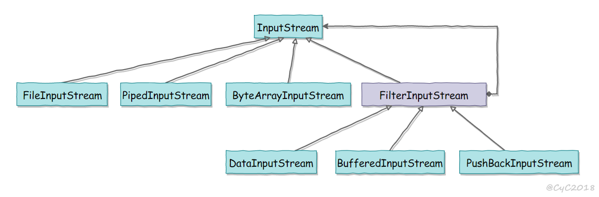

# 概述
Java 的 IO 大致可以分为：
  - 磁盘操作：File
  - 字节操作：InputStream 和 OutputStream
  - 字符操作：Reader 和Writer
  - 对象操作：Serializable
  - 网络操作：Socket
  - 新的IO：NIO

# 磁盘操作
File 类用来表示文件和目录的信息，但是它不表示文件的内容
递归一个目录下文件：
```java
public static void listAllFiles(File dir){
  if(dir == null || !dir.exists()) return;

  if(dir.isFile()){
    System.out.println(dir.getName());
    return;
  }
  for(File file : dir.listFiles())
    listAllFiles(file);
}
```

# 字节操作
## 实现文件复制
```java
public static void copyFile(String src, String dist) throws IOException{
  FileInputStream in = new FileInputStream(src);
  FileOutputStream out = new FileOutputStream(dist);

  byte[] buffer = new byte[20 * 1024];  // 20MB
  int cnt;

  // read() 最多读取 buffer.length 个字节
  // 返回的是实际读取的个数
  // 返回 -1 时候表示读到 eof
  while((cnt = in.read(buffer, 0, buffer.length)) != -1)
    out.write(buffer, 0, cnt);

  in.close();
  out.close();
}
```

## 装饰者模式
Java I/O 使用了装饰者模式。以 InputStream 为例：
  - InputStream 是抽象组件
  - FileInputStream 是 InputStream 的子类，属于具体组件，提供了字节流的输入操作
  - FilterInputStream 属于抽象装饰者，装饰者用于装饰组件，为组件提供额外的功能。例如 BufferInputStram 为 FileInputStream 提供缓存的功能


实例化一个具有缓存功能的字节流对象时，只需要在 FileInputStream 对象上再套一层 BufferedInputStream 对象即可。
```java
FileInputStream in = new FileInputStream(filePath);
BufferedInputStream buff = new BufferedInputStream(in);
```
DataInputStram 装饰者提供了对更多数据类型的输入操作，比如 int，double 等基本类型。

# 字符操作
## 编码与解码
- 编码：把字符转换为字节
- 解码：把字节重新组合成字符
- 如果编码和解码过程使用不同的编码方式就会出现乱码

- GBK 编码中，中文字符占 2 个字节，英文字符占 1 个字节
- UTF-8 中，中文字符占 3 个字节，英文字符占 1 个字节
- UTF-16be 中，中文和英文都占 2 个字节

Java 的内存编码使用双字节编码 UTF-16be，这不是指 Java 只支持这一种编码方式，而是说 char 这种类型使用 UTF-16be 进行编码。char 类型占 16 位，也就是两个字节，Java 使用这种双字节编码是为了让一个中文或者一个英文都能使用一个 char 来存储。

## String 的编码方式
String 可以看成一个字符序列，可以指定一个编码方式将它编码为字节序列，
也可以指定一个编码方式将一个字节序列解码为 String
```java
String str1 = "中文";
byte[] bytes = str1.getBytes("UTF-8");
String str2 = new String(bytes, "UTF-8");
System.out.println(str2);
```
```text
"中文"
```
在调用无参数 getBytes() 方法时，默认的编码方式不是 UTF-16be。双字节编码的好处是可以使用一个 char 存储中文和英文，而将 String 转为 bytes[] 字节数组就不再需要这个好处，因此也就不再需要双字节编码。getBytes() 的默认编码方式与平台有关，一般为 UTF-8。

## Reader 和 Writer
不管是磁盘还是网络传输，最小的存储单元都是字节，而不是字符。但是在程序中操作的通常是字符形式的数据，因此需要提供对字符进行操作的方法。
- InputStreamReader 实现从字节流解码成字符流；
- OutputStreamWriter 实现字符流编码成为字节流。

## 实现逐行输出文本文件的内容
```java
public static void readFileContent(String filePath) throws IOException {

    FileReader fileReader = new FileReader(filePath);
    // 装饰者模式
    BufferedReader bufferedReader = new BufferedReader(fileReader);

    String line;
    while ((line = bufferedReader.readLine()) != null) {
        System.out.println(line);
    }

    // 装饰者模式使得 BufferedReader 组合了一个 Reader 对象
    // 在调用 BufferedReader 的 close() 方法时会去调用 Reader 的 close() 方法
    // 因此只要一个 close() 调用即可
    bufferedReader.close();
}
```

# 对象操作
## 序列化
- 序列化：ObjectOutputStream.writeObject()
- 反序列化：ObjectInputStream.readObject()
不会对静态变量进行序列化，因为序列化只是保存对象的状态，静态变量属于类的状态。

## Serializable接口
序列化的类需要实现 Serializable 接口，它只是一个标准，没有任何方法需要实现，但是如果不去实现它的话而进行序列化，会抛出异常。

```java
public static void main(String[] args) throws IOException, ClassNotFoundException {

    A a1 = new A(123, "abc");
    String objectFile = "file/a1";

    ObjectOutputStream objectOutputStream = new ObjectOutputStream(new FileOutputStream(objectFile));
    objectOutputStream.writeObject(a1);
    objectOutputStream.close();

    ObjectInputStream objectInputStream = new ObjectInputStream(new FileInputStream(objectFile));
    A a2 = (A) objectInputStream.readObject();
    objectInputStream.close();
    System.out.println(a2);
}

private static class A implements Serializable {

    private int x;
    private String y;

    A(int x, String y) {
        this.x = x;
        this.y = y;
    }

    @Override
    public String toString() {
        return "x = " + x + "  " + "y = " + y;
    }
}
```

## transient
transient 关键字可以使一些属性不会被序列化

ArrayList 中存储数据的数组 elementData 是用 transient 修饰的，因为这个数组是动态扩展的，并不是所有的空间都被使用，因此就不需要所有的内容都被序列化。通过重写序列化和反序列化方法，使得可以只序列化数组中有内容的那部分数据。

```java
private transient Object[] elementData;
```

# 网络
- InetAddress：用于表示网络上的硬件资源，即 IP 地址；
- URL：统一资源定位符；
- Sockets：使用 TCP 协议实现网络通信；
- Datagram：使用 UDP 协议实现网络通信。

## InetAddress
没有公有的构造函数，只能通过静态方法来创建实例。

1. 根据域名创建InetAddress对象
```java
InetAddress addr1 = InetAddress.getByName("www.baidu.com");
```
```text
[HostName   : www.baidu.com] [HostAddress: 220.181.112.244]
```

2. 根据ip创建InetAddress对象,如果获取不到主机名就返回ip
```java
InetAddress addr2 = InetAddress.getByName("220.181.112.244");
```
```text
[HostName   : 220.181.112.244] [HostAddress: 220.181.112.244]
```

3. 根据主机名创建InetAddress对象
```java
InetAddress addr3 = InetAddress.getByName("IFC-PCB-094");
```
```text
[HostName   : IFC-PCB-094] [HostAddress: 192.168.3.249]
```

4. 获取本机的InetAddress，如果获取不到（可能是安全问题）就会返回 地址：127.0.0.1 和 主机名：localhost
```java
InetAddress addr4 = InetAddress.getLocalHost();
```
```text
[HostName   : IFC-PCB-094] [HostAddress: 192.168.3.249]
```

5. 获取该主机的所有的地址，返回一个InetAddress[] 对象
```java
public static InetAddress[] getAllByName(String host)

InetAddress[] addr = InetAddress.getAllByName("www.baidu.com");
for (InetAddress inetAddress : addr) {
    System.out.println(inetAddress);
}
```
```text
www.baidu.com/220.181.112.244
www.baidu.com/220.181.111.188
```

## URL
在创建java.net URL的实例的时候，你能够利用许多公共构造器，从而让其变得更具灵活性。举个例子来说，这个class提供了一种使用完整URL信息串的构造器，一种使 用把URL信息串分解成为协议、主机名以及文件和资源的构造器，还有一种把URL信息串分解成为协议、主机名、端口号以及文件的构造器。我们首先使用完整 的URL来创建一个URL class的例子：

URL aURL = new URL(“http://www.mycompany.com:8080/index.html”);

在这个例子中，我们创建了一个使用完整URL的URL class，其中明确指出了使用的协议是http，主机名称是www.mycompany.com，端口号码为8080，文件/资源为 index.html。如果组成URL的语法发生了错误，那么构造器就会发出MalformedURLException。

```java
public static void main(String[] args) throws IOException {

    URL url = new URL("http://www.baidu.com");

    /* 字节流 */
    InputStream is = url.openStream();

    /* 字符流 */
    InputStreamReader isr = new InputStreamReader(is, "utf-8");

    /* 提供缓存功能 */
    BufferedReader br = new BufferedReader(isr);

    String line;
    while ((line = br.readLine()) != null) {
        System.out.println(line);
    }

    br.close();
}
```

# Sockets
ServerSocket：服务器端类
Socket：客户端类
服务器和客户端通过 InputStream 和 OutputStream 进行输入输出。


## Datagram
- DatagramSocket：通信类
- DatagramPacket：数据包类

# NIO
高速的、面向块的 I/O

## 流与块
I/O 与 NIO 最重要的区别是数据打包和传输的方式，I/O 以流的方式处理数据，而 NIO 以块的方式处理数据。

面向流的 I/O 一次处理一个字节数据：一个输入流产生一个字节数据，一个输出流消费一个字节数据。为流式数据创建过滤器非常容易，链接几个过滤器，以便每个过滤器只负责复杂处理机制的一部分。不利的一面是，面向流的 I/O 通常相当慢。

面向块的 I/O 一次处理一个数据块，按块处理数据比按流处理数据要快得多。但是面向块的 I/O 缺少一些面向流的 I/O 所具有的优雅性和简单性。

I/O 包和 NIO 已经很好地集成了，java.io.* 已经以 NIO 为基础重新实现了，所以现在它可以利用 NIO 的一些特性。例如，java.io.* 包中的一些类包含以块的形式读写数据的方法，这使得即使在面向流的系统中，处理速度也会更快。

## 通道
通道 Channel 是对原 I/O 包中的流的模拟，可以通过它读取和写入数据。

通道与流的不同之处在于，流只能在一个方向上移动(一个流必须是 InputStream 或者 OutputStream 的子类)，而通道是双向的，可以用于读、写或者同时用于读写。

通道包括以下类型：
- FileChannel:从文件中读写数据
- DatagramChannel：通过 UDP 读写网络中数据
- SocketChannel： 通过 TCP 读写网络中的数据
- ServerSocketChannel：可以监听新进来的 TCP 连接，对每一个新进来的连接都会创建一个 SocketChannel

## Buffer
发送给一个通道的所有数据都必须首先放到缓冲区中，同样地，从通道中读取的任何数据都要先读到缓冲区中。也就是说，不会直接对通道进行读写数据，而是要先经过缓冲区。

缓冲区实质上是一个数组，但它不仅仅是一个数组。缓冲区提供了对数据的结构化访问，而且还可以跟踪系统的读/写进程。

缓冲区包括以下类型：
- ByteBuffer
- CharBuffer
- ShortBuffer
- IntBuffer
- LongBuffer
- FloatBuffer
- DoubleBuffer

### Buffer的基本用法
使用 Buffer 读写数据一般遵循以下四个步骤：
1. 写入数据到 Buffer
2. 调用 flip() 方法
3. 从 Buffer 读取数据
4. 调用 clear() 方法或者 compact()


### 基本的 Channel 实例
```java
RandomAccessFile aFile = new RandomAccessFile("data/nio-data.txt", "rw");
FileChannel inChannel = aFile.getChannel();

ByteBuffer buf = ByteBuffer.allocate(48);

int bytesRead = inChannel.read(buf);
while (bytesRead != -1) {

System.out.println("Read " + bytesRead);
// buf.flip() 的调用，首先读取数据到Buffer，然后反转Buffer,接着再从Buffer中读取数据
buf.flip();

while(buf.hasRemaining()){
System.out.print((char) buf.get());
}

buf.clear();
bytesRead = inChannel.read(buf);
}
aFile.close();
```
