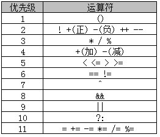
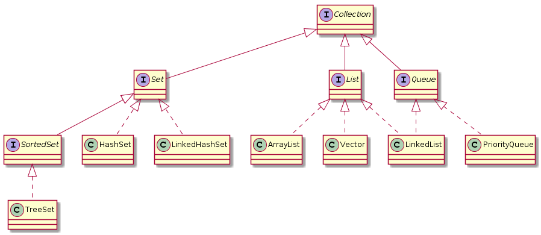

<!-- TOC START min:1 max:3 link:true update:true -->
- [基本概念](#基本概念)
	- [main(String[] args) 方法](#mainstring-args-方法)
	- [如何在main()方法前输出hello](#如何在main方法前输出hello)
	- [Java程序初始化](#java程序初始化)
	- [构造函数](#构造函数)
	- [为什么有些接口没有任何方法?](#为什么有些接口没有任何方法)
	- [反射机制](#反射机制)
	- [如何实现C语言的函数指针](#如何实现c语言的函数指针)
- [面向对象技术](#面向对象技术)
	- [面向对象的主要特征：抽象，继承，封装和多态。](#面向对象的主要特征抽象继承封装和多态)
	- [继承](#继承)
	- [多态的实现机制](#多态的实现机制)
	- [重载和重写](#重载和重写)
		- [重写(override)](#重写override)
		- [重载（Overload）](#重载overload)
	- [接口与抽象类](#接口与抽象类)
	- [内部类](#内部类)
- [关键字](#关键字)
	- [static关键字有什么用](#static关键字有什么用)
	- [switch的使用](#switch的使用)
	- [volatile](#volatile)
	- [strictfp](#strictfp)
	- [泛型](#泛型)
- [基本类型和运算](#基本类型和运算)
	- [Java基本类型](#java基本类型)
	- [包装类型](#包装类型)
	- [缓存池](#缓存池)
	- [不可变类](#不可变类)
	- [强制类型转换注意事项](#强制类型转换注意事项)
	- [运算符优先级](#运算符优先级)
	- ["<<" 和 ">>"异同](#异同)
	- ["==",equals 和 hashCode](#equals-和-hashcode)
	- [String，StringBuffer，StringBuilder，StringTokenizer](#stringstringbufferstringbuilderstringtokenizer)
		- [Java 8 和 Java 9 的 String](#java-8-和-java-9-的-string)
		- [不可变的好处](#不可变的好处)
		- [String实例化](#string实例化)
		- [char型变量是否可以存储一个汉字](#char型变量是否可以存储一个汉字)
		- [new String("abc")创建了几个对象？](#new-stringabc创建了几个对象)
	- [Java中数组是不是对象](#java中数组是不是对象)
	- [Java数组初始化方式：](#java数组初始化方式)
	- [length属性和length()方法](#length属性和length方法)
- [Object 通用方法](#object-通用方法)
	- [概览](#概览)
	- [equals()](#equals)
	- [hashCode()](#hashcode)
	- [toString()](#tostring)
	- [clone()](#clone)
- [异常处理](#异常处理)
	- [finally块中代码什么时候执行](#finally块中代码什么时候执行)
	- [运行时异常和普通异常](#运行时异常和普通异常)
- [输入输出流](#输入输出流)
	- [Java IO流的实现机制是什么？](#java-io流的实现机制是什么)
	- [管理文件和目录的类：](#管理文件和目录的类)
	- [Java NIO](#java-nio)
	- [System.out.println](#systemoutprintln)
- [Java平台与内存管理](#java平台与内存管理)
	- [JVM加载class文件机制](#jvm加载class文件机制)
	- [什么是GC--垃圾回收器](#什么是gc--垃圾回收器)
	- [Java是否存在内存泄漏](#java是否存在内存泄漏)
	- [Java中堆和栈](#java中堆和栈)
- [Java容器](#java容器)
	- [Collection](#collection)
	- [Map](#map)
	- [迭代器 Iterator](#迭代器-iterator)
	- [ArrayList, Vector, LinkedList](#arraylist-vector-linkedlist)
	- [HashMap，HashTable，TreeMap，WeakHashMap](#hashmaphashtabletreemapweakhashmap)
	- [Collection和Collections](#collection和collections)
- [多线程](#多线程)
	- [如何实现多线程](#如何实现多线程)
	- [run()和start()](#run和start)
	- [终止线程的方法](#终止线程的方法)
	- [synchronized和Lock](#synchronized和lock)

<!-- TOC END -->


# 基本概念

## main(String[] args) 方法
1. main函数必须由public和static修饰，也可以加上final，synchronized，但是不可以用abstract
2. 每个类都可以申请main()函数，但只有和文件名相同的类的main函数会在启动时候调用
3. main()函数返回值必须是void

## 如何在main()方法前输出hello
静态块会在类被加载前调用。
```java
public class Test{
	static{System.out.println("Hello")};
	public static void main(String[] args){
		System.out.println("main")
	}
}
```

## Java程序初始化
-	父类（静态变量、静态语句块）
-	子类（静态变量、静态语句块）
-	父类（实例变量、普通语句块）
-	父类（构造函数）
-	子类（实例变量、普通语句块）
-	子类（构造函数）
例题见书([Java程序员面试笔试宝典](https://book.douban.com/subject/20270192/))50页。

## 构造函数
1. 构造函数与类名相同，不能有返回值，也不能用void
2. 每个类可以有多个构造函数
3. 构造函数可以有0个，1个及以上个参数
4. 主要完成对象的初始化工作
5. 构造函数不能被继承，因此，不能被覆盖(override)，但是构造函数能被重载(overload)
6. 子类可以通过super关键字显式调用父类构造函数，**当父类没有提供无参数的构造函数时候，子类的构造函数必须显式调用父类的构造函数。**
7. 如果父类和子类都没有定义构造函数，编译器会为父类和子类默认生产一个无参构造。

## 为什么有些接口没有任何方法?
1. 接口中成员的作用域修饰符都是public，接口中的常量默认使用public static final修饰
2. **有些接口内部没有声明任何办法，叫做标识接口**
3. Java中已存在的标识接口有Cloneable和Serializable等
4. 主要的作用是配合instanceof来判断对象的类型是否实现了一个给定的标识接口  

例子见书([Java程序员面试笔试宝典](https://book.douban.com/subject/20270192/))54页

## 反射机制
1. 它允许程序在运行时进行自我检查，同时也允许对其内部的成员进行操作
2. 主要作用：
   1. 得到一个对象所属的类
   2. 获取一个类的所有成员变量和方法
   3. 在运行时创建对象
   4. 在运行时调用对象的方法
```java
class Base{
	public void f() {System.out.println("Base")};
}
class Sub{
	public void f() {System.out.println("Sub")};
}
```
```java
public class Test{
	public static void main(String[] args){
		try{//使用反射机制加载类
			Class c = Class.forName("Sub");
			Base b = (Base)c.newInstance();
			b.f();	// 输出 Sub
		}catch(Exception e){e.printStackTrack();}
	}
}
```
3. 获得Class类方法：
   1. Class.forName
   2. 类名.Class
   3. 实例.getClass

## 如何实现C语言的函数指针
1. 可以先定义一个接口
2. 然后在接口中声明要调用的方法
3. 接着用不同类实现这个接口
4. 最后把这个实体类的一个对象作为参数传递给调用程序，程序可以用参数对象的方法。
```java
//接口中定义了一个用来比较大小的方法
interface IntCmp{
	public int cmp(int a, int b);
}
```
```java
//用不同类实现接口
class CmpASC implements IntCmp{
	public int cmp(int a, int b){...}
}
class CmpDESC implements IntCmp{
	public int cmp(int a, int b){...}
}
```
```java
public class Test{
	//在排序函数中用接口作为参数
	public static void insertSort(int[] array, IntCmp cmp){...}

	public static void main(String[] args){
		// 在调用函数时候传入实例对象
		int[] array=[7,3,11,26,4,2,56];
		insertSort(array, new CmpASC());
		insertSort(array, new CmpDESC());
		...
	}
}
```

# 面向对象技术
## 面向对象的主要特征：抽象，继承，封装和多态。

## 继承
1. Java不支持多重继承，但是可以通过实现多个接口
2. 子类只能继承父类的非私有（public和protected）成员变量和方法
3. 子类成员变量或是函数签名（相同的方法名，参数个数和类型）与父类相同时，覆盖父类的成员变量和方法。

## 多态的实现机制
1. 重载
2. 覆盖。Java中，基类的引用变量不仅可以指向基类的实例对象，也可以指向其子类的实例对象。接口的引用变量也可以指向其实现类的实例对象。
3. 程序调用的方法在运行期才动态绑定，就是引用变量所指向的具体实例对象的方法，是内存里那个正在运行的那个对象的方法，而不是引用变量的类型中定义的方法。（运行时多态）
4. 成员变量无法实现多态的，成员变量的取值是父类的还是子类不取决于创建对象的类型，而是取决于所定义变量的类型，是在编译期间决定的。   

java提供了两种多态机制：
1. 编译时多态--重载
2. 运行时多态--方法覆盖

## 重载和重写
### 重写(override)
存在于继承体系中，指子类实现了一个与父类在方法声明上完全相同的一个方法（父类中方法不能为private）

为了满足里式替换原则，重写有以下三个限制：
	- 子类方法的访问权限必须大于等于父类方法；
	- 子类方法的返回类型必须是父类方法返回类型或为其子类型。
	- 子类方法抛出的异常类型必须是父类抛出异常类型或为其子类型。

使用 @Override 注解，可以让编译器帮忙检查是否满足上面的三个限制条件。

下面的示例中，SubClass 为 SuperClass 的子类，SubClass 重写了 SuperClass 的 func() 方法。其中：

	- 子类方法访问权限为 public，大于父类的 protected。
	- 子类的返回类型为 ArrayList，是父类返回类型 List 的子类。
	- 子类抛出的异常类型为 Exception，是父类抛出异常 Throwable 的子类。
	- 子类重写方法使用 @Override 注解，从而让编译器自动检查是否满足限制条件。

```java
class SuperClass {
   protected List<Integer> func() throws Throwable {
       return new ArrayList<>();
   }
}

class SubClass extends SuperClass {
   @Override
   public ArrayList<Integer> func() throws Exception {
       return new ArrayList<>();
   }
}
```
在调用一个方法时，先从本类中查找看是否有对应的方法，如果没有查找到再到父类中查看，看是否有继承来的方法。否则就要对参数进行转型，转成父类之后看是否有对应的方法。总的来说，方法调用的优先级为：
	- this.func(this)
	- super.func(this)
	- this.func(super)
	- super.func(super)
```java
/*
   A
   |
   B
   |
   C
   |
   D
*/


class A {

   public void show(A obj) {
       System.out.println("A.show(A)");
   }

   public void show(C obj) {
       System.out.println("A.show(C)");
   }
}

class B extends A {

   @Override
   public void show(A obj) {
       System.out.println("B.show(A)");
   }
}

class C extends B {
}

class D extends C {
}
```
```java
public static void main(String[] args) {

   A a = new A();
   B b = new B();
   C c = new C();
   D d = new D();

   // 在 A 中存在 show(A obj)，直接调用
   a.show(a); // A.show(A)
   // 在 A 中不存在 show(B obj)，将 B 转型成其父类 A
   a.show(b); // A.show(A)
   // 在 B 中存在从 A 继承来的 show(C obj)，直接调用
   b.show(c); // A.show(C)
   // 在 B 中不存在 show(D obj)，但是存在从 A 继承来的 show(C obj)，将 D 转型成其父类 C
   b.show(d); // A.show(C)

   // 引用的还是 B 对象，所以 ba 和 b 的调用结果一样
   A ba = new B();
   ba.show(c); // A.show(C)
   ba.show(d); // A.show(C)
}
```

### 重载（Overload）
存在于同一个类中，指一个方法与已经存在的方法名称上相同，但是参数类型、个数、顺序至少有一个不同。

应该注意的是，返回值不同，其它都相同不算是重载。

## 接口与抽象类
1. 相同点：
   1. 都不能被实例化
   2. 接口的实现类或者抽象类的子类都只有实现了方法后才能被实例化
2. 不同：
   1. 接口只有定义
   2. 接口用implements，抽象类用extends
   3. 接口中定义的成员变量默认为**public static final修饰,而且必须赋值,所以方法只能用public，abstract修饰**
	 4. 抽象类中可以有自己的成员数据变量，默认为default，可以用private，protected，public，方法不能用private, static,synchronized,native等修饰

## 内部类
1. 静态内部类只能访问外部类中的静态成员和静态方法
2. 非静态内部类可以自由引用外部类的属性和方法，但是不可以定义静态的属性和方法。**非静态内部类中不能有静态成员**
3. 局部内部类就像局部变量，不能被public protected，private和static修饰，只能访问方法中定义为final类型的局部变量。
例：
```java
class OuterClass{
	public void f(){ class innerClass{} } 	//	局部内部类
}
```
4. 匿名内部类
   1. 没有类名，不使用关键字class,extends,implements
   2. 不能有构造函数
   3. 不能定义静态成员，方法和类
   4. 不能是public,protected,private,static
   5. 一个匿名内部类一定是在new后面，这个匿名类必须继承一个父类或实现一个接口。

# 关键字
## static关键字有什么用
1. static成员变量：静态变量属于类，在内存中只有一个复制（所以实例都指向同一个内存地址）--达到一种全局的效果
2. static成员方法：static方法中不能使用this和super，只能访问所属类的静态成员变量和成员方法。  
static方法一个重要的应用是**单例模式**：隐藏构造函数，只能通过类的方法获取类的唯一对象。
```java
class Singleton{
	private static Singleton instance = null;
	private Singleton() {} //private构造函数
	public static getInstance() {
		if(instance==null)
			instance=new Singleton();
		return instance;
	}
}
```
3. static代码块：独立于成员变量和成员函数的代码块。常用来初始化静态变量。**只会执行一次**
4. static内部类：可以不依赖于外部类实例对象而被实例化，只能访问外部类中的静态成员和静态方法。
```java
public class Outer{
	static int n = 5;
	static class Inner{
		void access(){System.out.println("n="+n);}
	}
	public static void main(String[] args){
		Outer.Inner inner = new Outer.Inner();	//不依赖于外部类实例对象而被实例化
		inner.access();		//可以访问到 n=5
	}
}
```

## switch的使用
1. 由于byte，short，char可以隐式转换为int，所以这些类以及他们的包装类都可以作为swith的变量。但是long，float，double不行。
2. Java 7开始支持String类，实现是通过hashcode实现的

## volatile
1. 在Java中，编译器为了提高效率，把经常被访问的变量缓存（比如寄存器中）起来，程序读取这个变量的时候直接去缓存中读取，而不是内存中。在多线程编程中，另外的线程如果改了该指（在内存中），就会引起问题。
2. volatile是一个类型修饰符，被volatile类型定义的变量，系统每次用到它都是直接从对应的内存中提取，所以所有线程在任何时候所看到的变量的值都是相同的。
3. 可以用来停止线程。
```java
...
private volatile Boolean flag;
public void stop(){flag = false;}
public void run(){
	whilc(flag)
		//do something
}
```
## strictfp
strictfp是strict float point的缩写。JVM在计算浮点数时候，如果没有指定strictfp，浮点计算可能不精确，而且结果在不同平台上可能不一样。  
可以用strictfp来修饰一个类，接口或者方法，那么在该范围内，浮点计算都是精确的。  
当一个类被strictfp修饰时候，它的所有方法都会被strictfp修饰。  
```java
public strictfp class Test{...}
```

## 泛型
```java
public class Box<T> {
    // T stands for "Type"
    private T t;
    public void set(T t) { this.t = t; }
    public T get() { return t; }
}
```
[Java 泛型详解](http://www.importnew.com/24029.html)

# 基本类型和运算
## Java基本类型
8种：byte,short,int,long,float,double,char,boolean  
他们都有相应的封装类

区别：
1. 原始数据类型在传递参数时候是传值传递，封装类型是引用传递
2. 默认值不同：原始数据类型默认值根据类型不同，封装类型实例变量默认值为null

## 包装类型
基本类型都有对应的包装类型，基本类型与其对应的包装类型之间的赋值使用自动装箱与拆箱完成。
```java
Integer x = 2;     // 装箱
int y = x;         // 拆箱
```

## 缓存池
new Integer(123) 与 Integer.valueOf(123) 的区别在于：
	- new Integer(123) 每次都会新建一个对象；
	- Integer.valueOf(123) 会使用缓存池中的对象，多次调用会取得同一个对象的引用。
```java
Integer x = new Integer(123);
Integer y = new Integer(123);
System.out.println(x == y);    // false
Integer z = Integer.valueOf(123);
Integer k = Integer.valueOf(123);
System.out.println(z == k);   // true
```
valueOf() 方法的实现比较简单，就是先判断值是否在缓存池中，如果在的话就直接返回缓存池的内容。
```java
public static Integer valueOf(int i) {
    if (i >= IntegerCache.low && i <= IntegerCache.high)
        return IntegerCache.cache[i + (-IntegerCache.low)];
    return new Integer(i);
}
```
在 Java 8 中，Integer 缓存池的大小默认为 -128~127。
```java
static final int low = -128;
static final int high;
static final Integer cache[];

static {
    // high value may be configured by property
    int h = 127;
    String integerCacheHighPropValue =
        sun.misc.VM.getSavedProperty("java.lang.Integer.IntegerCache.high");
    if (integerCacheHighPropValue != null) {
        try {
            int i = parseInt(integerCacheHighPropValue);
            i = Math.max(i, 127);
            // Maximum array size is Integer.MAX_VALUE
            h = Math.min(i, Integer.MAX_VALUE - (-low) -1);
        } catch( NumberFormatException nfe) {
            // If the property cannot be parsed into an int, ignore it.
        }
    }
    high = h;

    cache = new Integer[(high - low) + 1];
    int j = low;
    for(int k = 0; k < cache.length; k++)
        cache[k] = new Integer(j++);

    // range [-128, 127] must be interned (JLS7 5.1.7)
    assert IntegerCache.high >= 127;
}
```
编译器会在自动装箱过程调用 valueOf() 方法，因此多个值相同且值在缓存池范围内的 Integer 实例使用自动装箱来创建，那么就会引用相同的对象。
```java
Integer m = 123;
Integer n = 123;
System.out.println(m == n); // true
```
基本类型对应的缓冲池如下：
	- boolean values true and false
	- all byte values
	- short values between -128 and 127
	- int values between -128 and 127
	- char in the range \u0000 to \u007F
在使用这些基本类型对应的包装类型时，如果该数值范围在缓冲池范围内，就可以直接使用缓冲池中的对象。

在 jdk 1.8 所有的数值类缓冲池中，Integer 的缓冲池 IntegerCache 很特殊，这个缓冲池的下界是 - 128，上界默认是 127，但是这个上界是可调的，在启动 jvm 的时候，通过 -XX:AutoBoxCacheMax=<size> 来指定这个缓冲池的大小，该选项在 JVM 初始化的时候会设定一个名为 java.lang.IntegerCache.high 系统属性，然后 IntegerCache 初始化的时候就会读取该系统属性来决定上界。

## 不可变类
1. 不可变类是指创建了这个类的实例后，不允许修改他的值，它的成员变量就不能被修改了。
2. 如何创建不可变类：
   1. 类中所有成员变量被private修饰
   2. 类中没有写或者修改成员变量的方法
   3. 确保类中所有方法不会被子类覆盖
   4. 如果一个类成员不是不可变量，在成员初始化或者使用get方法获得该成员变量时候，通过clone方法确保类的不可变性。
   5. 如果有必要，覆盖Object类中的equals和hashcode方法。
   6. 由于类的不可变性，在创建对象时候就需要初始化成员变量，因此最好提供一个带参数的构造函数来初始化成员变量
```java
class ImmutableClass{
	private Date d;
	//提供一个带参数的构造函数来初始化成员变量
	public ImmutableClass(Date d){
		this.d=(Date)d.clone();	//解除引用关系
	}
	public Date getDate(){return (Date)d.clone();}
}
```

## 强制类型转换注意事项
1. 在涉及byte,short, char类型运算时候，首先会把变量的值强制转化为int类型。所以两个short类型相加，最后得到的结果是int型，对byte和char同样。所以对于语句short s1=1；s1=s1+1；时候编译器会报错，因为在执行s1+1时候，得到的结果是int型，要 s1=(short)(s1+1) 才行
2. 有一个例外，+=为Java规定的运算法，使用+=时候并不涉及到类型转换

## 运算符优先级


## "<<" 和 ">>"异同
1. "<<"运算符标识左移，左移n位表示原来的值乘2的n次方，可以用来代替乘法，因为更快。
2. ">>"右移，分为：
	1. ">>"有符号右移，若参与运算的数字为正数，则在高位补0，若为负数，在高位补1
	2. ">>>"为无符号右移，不管正负数，都在高位补0

## "==",equals 和 hashCode
1. "=="可以用来比较两个基础数据类型的值，但如果是两个对象（引用类型），==可以比较两个变量是否指向同一个地址，但是内容就不能比较了。
2. Object类中的equals是直接调用==的，它和==的区别就是equals是可以覆盖的，通过覆盖达到比较内容的目的。
3. hashCode()是从Object类继承过来，hashCode()返回对象在内存中地址转换成的一个int值，所以如果不重写，任何对象的hashCode()方法都是不相等的。
   1. 一般来讲，equals是给用户调用的，hashCode()一般不会，它更多用在hashmap，hashset，hashtable中判断key是不是重复的
   2. 一般在覆盖equals方法的同时就应该覆盖hashCode方法，不然会导致该类在和基于三列的集合类结合一起使用时候会出问题。

## String，StringBuffer，StringBuilder，StringTokenizer
String是不可变类，StringBuffer是可变类。当一个字符串需要经常被修改的时候，使用StringBuffer比String好很多。  

### Java 8 和 Java 9 的 String
在 Java 8 中，String 内部使用 char 数组存储数据。
```java
public final class String
    implements java.io.Serializable, Comparable<String>, CharSequence {
    /** The value is used for character storage. */
    private final char value[];
}
```
在 Java 9 之后，String 类的实现改用 byte 数组存储字符串，同时使用 coder 来标识使用了哪种编码。
```java
public final class String
    implements java.io.Serializable, Comparable<String>, CharSequence {
    /** The value is used for character storage. */
    private final byte[] value;

    /** The identifier of the encoding used to encode the bytes in {@code value}. */
    private final byte coder;
}
```
value 数组被声明为 final，这意味着 value 数组初始化之后就不能再引用其它数组。并且 String 内部没有改变 value 数组的方法，因此可以保证 String 不可变。

### 不可变的好处
1. 可以缓存 hash 值

因为 String 的 hash 值经常被使用，例如 String 用做 HashMap 的 key。不可变的特性可以使得 hash 值也不可变，因此只需要进行一次计算。

2. String Pool 的需要

如果一个 String 对象已经被创建过了，那么就会从 String Pool 中取得引用。只有 String 是不可变的，才可能使用 String Pool。

3. 安全性

String 经常作为参数，String 不可变性可以保证参数不可变。例如在作为网络连接参数的情况下如果 String 是可变的，那么在网络连接过程中，String 被改变，改变 String 对象的那一方以为现在连接的是其它主机，而实际情况却不一定是。

4. 线程安全

String 不可变性天生具备线程安全，可以在多个线程中安全地使用。

### String实例化
```java
String s = "Hello"；
String s = new String("Hello");
```
StringBuffer实例化只有一种方法：
```java
StringBuffer sb = new StringBuffer("Hello");
```
String字符串修改实现原理：  
首先先创建一个StringBuffer,其次调用StringBuffer的append()方法，最后调用toString()方法。示例如下：
```java
String s="Hello"; s+="World";
// 等价于：  
StringBuffer sb = new StringBuffer(s);
sb.append("World");
s=sb.toString();
```
StringBuilder和StringBuffer一样都是字符串缓冲区，StringBuilder不是线程安全的，在单线程环境下，Stringbuilder效率会更高一点。StringBuffer 是线程安全的，内部使用 synchronized 进行同步

StringTokenizer是用来分割字符串的工具类。

### char型变量是否可以存储一个汉字
1. 可以，因为Java默认使用Unicode编码方式，每个字符占两个字节
2. 在String中，英文字符占用一个字符，中文占两个字符，以减少存储空间，提高效率。

### new String("abc")创建了几个对象？
1个或2个，取决于字符串常量池中是否已经存在"abc".

## Java中数组是不是对象
数组是对象，数组不仅有其自己的属性，也有一些方法可以调用。  
每个数组类型都有其对应的类型，可以使用instanceof来判断数据类型，例如:
```java
int[] a = {1,2};
int[][] b = new int[2][4];
String[] args = {"a","b"};

a instanceof int[]
b instanceof int[][]
c instanceof String[]
```

## Java数组初始化方式：
1. int[] a = new int[5];
2. int[] a = {1,2,3,4,5};
3. int[] a; a = new int[5];
4. int[] a; a = new int[]{1,2,3,4,5};

二维数组：  
声明：
1. type name[][]
2. type[][] name
3. type[] namep[]

初始化：
1. int[][] arr = {{1,3},{3,4,5}};
2. int[][] a = new int[2][]; a[0] = new int[]{1,2};  a[1] = new int[]{3,4,5};

## length属性和length()方法
1. 在数组中，数组是一个对象，里面含有length属性来获取数组的长度
2. length()方法是针对字符串而言的，String提供了length()方法来计算字符串的长度。

# Object 通用方法
## 概览
```java
public native int hashCode()

public boolean equals(Object obj)

protected native Object clone() throws CloneNotSupportedException

public String toString()

public final native Class<?> getClass()

protected void finalize() throws Throwable {}

public final native void notify()

public final native void notifyAll()

public final native void wait(long timeout) throws InterruptedException

public final void wait(long timeout, int nanos) throws InterruptedException

public final void wait() throws InterruptedException
```

## equals()
对于基本类型，== 判断两个值是否相等，基本类型没有 equals() 方法。
对于引用类型，== 判断两个变量是否引用同一个对象，而 equals() 判断引用的对象是否等价。
```java
Integer x = new Integer(1);
Integer y = new Integer(1);
System.out.println(x.equals(y)); // true
System.out.println(x == y);      // false
```
```java
/*
检查是否为同一个对象的引用，如果是直接返回 true；
检查是否是同一个类型，如果不是，直接返回 false；
将 Object 对象进行转型；,判断每个关键域是否相等。
*/
public class EqualExample {

    private int x;
    private int y;
    private int z;

    public EqualExample(int x, int y, int z) {
        this.x = x;
        this.y = y;
        this.z = z;
    }

    @Override
    public boolean equals(Object o) {
        if (this == o) return true;
        if (o == null || getClass() != o.getClass()) return false;

        EqualExample that = (EqualExample) o;

        if (x != that.x) return false;
        if (y != that.y) return false;
        return z == that.z;
    }
}
```

## hashCode()
hashCode() 返回散列值，而 equals() 是用来判断两个对象是否等价。等价的两个对象散列值一定相同，但是散列值相同的两个对象不一定等价。

在覆盖 equals() 方法时应当总是覆盖 hashCode() 方法，保证等价的两个对象散列值也相等。

下面的代码中，新建了两个等价的对象，并将它们添加到 HashSet 中。我们希望将这两个对象当成一样的，只在集合中添加一个对象，但是因为 EqualExample 没有实现 hashCode() 方法，因此这两个对象的散列值是不同的，最终导致集合添加了两个等价的对象。
```java
EqualExample e1 = new EqualExample(1, 1, 1);
EqualExample e2 = new EqualExample(1, 1, 1);
System.out.println(e1.equals(e2)); // true
HashSet<EqualExample> set = new HashSet<>();
set.add(e1);
set.add(e2);
System.out.println(set.size());   // 2
```

## toString()
默认返回 ToStringExample@4554617c 这种形式，其中 @ 后面的数值为散列码的无符号十六进制表示。
```java
public class ToStringExample {

    private int number;

    public ToStringExample(int number) {
        this.number = number;
    }
}
```
```java
ToStringExample example = new ToStringExample(123);
System.out.println(example.toString());	// ToStringExample@4554617c
```

## clone()
1. Java在处理基本数据类型（int,char,double）时候，采用按值传递，除此之外其他类型都是采用引用传递。
2. 对象除了在函数调用时候是按引用传递，在使用“=”赋值时候也是引用传递。
3. 在不影响原因对象的情况下创建一个具有相同状态的对象，就需要使用clone()方法。
   1. 实现clone()的类需要继承Cloneable接口（这是一个标识接口）
   2. 在类中重写Object类的clone方法(clone方法是Object的一个protected方法)
   3. 在clone方法中调用super.clone()方法。
   4. 把浅复制的引用指向原型对象新的克隆体。
```java
// 浅复制
class Obj implements Cloneable{
	private a=0;
	public int getA(){return a;}
	public void setA(int b){this.a=b;}
	public void changeA(int c){this.a=c;}
	//override
	public Object clone(){
		Object o = null;
		try{
		//在clone方法中调用super.clone()方法
			o = (Obj)super.clone();
		}catch(CloneNotSupportedException e) {
			e.printStackTrack();
		}
		return o;
	}
}
```
```java
// 深复制--在用clone方法复制完后，对对象中的非基本类型的属性也调用clone方法完成深复制。
class Obj implements Cloneable{
	private Data data = new Date();
	...
	public Objec clone(){
		Object o = null;
		try{
		//在clone方法中调用super.clone()方法
			o = (Obj)super.clone();
		}catch(CloneNotSupportedException e) {
			e.printStackTrack();
		}
		//对对象中的非基本类型的属性也调用clone方法
		o.date = (Date)this.getDate().clone();
		return o;
	}
}
```
3. clone() 的替代方案
使用 clone() 方法来拷贝一个对象即复杂又有风险，它会抛出异常，并且还需要类型转换。Effective Java 书上讲到，最好不要去使用 clone()，可以使用拷贝构造函数或者拷贝工厂来拷贝一个对象。
```java
public class CloneConstructorExample {
    private int[] arr;
    public CloneConstructorExample() {
        arr = new int[10];
        for (int i = 0; i < arr.length; i++) {
            arr[i] = i;
        }
    }
	//拷贝构造函数
    public CloneConstructorExample(CloneConstructorExample original) {
        arr = new int[original.arr.length];
        for (int i = 0; i < original.arr.length; i++) {
            arr[i] = original.arr[i];
        }
    }
    public void set(int index, int value) {
        arr[index] = value;
    }
    public int get(int index) {
        return arr[index];
    }
}
```

# 异常处理
## finally块中代码什么时候执行
finally块的代码也会在return之前执行。  
如果try-finally或者catch-finally中都有return，finally中的return会覆盖别处的return，最终返回到调用者那里的是finally中的return值。  

finally是不是一定执行？   
不一定：
1. 当程序进入到try之前就出现异常。
2. 程序在try中强制退出时候也不会执行finally代码。  

## 运行时异常和普通异常
Java提供了两种错误异常类：Error和Exception,父类都是Throwable
1. Error表示程序在运行期间出了非常严重的错误，这种错误是不克恢复的，属于JVM层次的错误。会导致程序终止执行。也不推荐程序去捕捉Error，因为这是应该被修复的错误。OutOfMemoryError，ThreadDeath都属于错误。
2. Exception包含checked exception和runtime exception
   1. 检查异常 checked exception
   常见于IO（IOException及其子类）和SQL异常，这种异常都发生在编译阶段，Java编译器强制程序去捕捉此类型异常，一般在如下几种情况中使用：
      1. 异常发生不会导致程序出错，进行处理之后可以继续。比如：连接数据库失败之后，重新尝试连接
	    2. 程序依赖于不可靠的外部条件，例如系统IO
   2. runtime exception
   编译器没有强制对其进行捕获并处理。如果不对这类异常进行处理，当出现这种异常时候，JVM会来处理。常见的包括：NullPointerException,ClassCastException,ArrayIndexOutOfBoundsException,ArithmeticException等。
   出现运行时异常时候，系统会把异常一直往上层抛，知道遇到处理代码为止。如果没有处理快，就会由线程或者main抛出，线程或程序也就退出了。
3. 在处理异常时候，还要注意：
   1. 先捕获子类，再捕获基类的异常处理
   2. 尽早抛出异常，同时对捕获的异常进行处理
   3. 可以根据实际的需求自定义异常类
   4. 异常能处理就处理，不能处理就抛出

# 输入输出流
##Java IO流的实现机制是什么？
流可以分为两大类：字节流和字符流。
1. 字节流以字节（8bit）为单位，包含两个抽象类：InputStream和OutputStream。
2. 字符流以字符（16bit）为单位，一次可以读取多个字节，它包含两个抽象类：Reader和Writer
3. 两者最主要的区别为：在处理输入输出时候，字节流不会用到缓存，而字符流用到缓存。
4. Java IO类在涉及时候采用了Decorator 装饰者设计模式。

## 管理文件和目录的类：
File类，常用的几个方法为：File(String pathname), createNewFile(), delete(), isFile(), isDirectory(), listFiles(), mkdir(), exists()

题：如何列出某个目录下的所有目录和文件？
```java
class Test{
	public static void main(String[] args){
		File file = new File("C:\\testDir");
		if(!file.exists()){ // 判断目录是否存在
			System.out.println("dirctory is empty");
			return;
		}
		File[] fileList = file.listFiles();
		for(int i=0; i < fileList.length; i++){
			if(fileList[i].isDirectory())
				System.out.println("dictory is: " + fileList[i].getName());
			else
				System.out.println("file is: " + fileList[i].getName());
		}
	}
}
```

## Java NIO
详见 JavaIO 笔记中的 [NIO](./JavaIo.md#NIO)

## System.out.println
```
System.out.println(1+2+"");	// 3
System.out.println(""+1+2);	// 12
```

# Java平台与内存管理
## JVM加载class文件机制
当运行指定程序时，JVM会将编译生成的.class文件按照需求和一定的规则加载到内存中。
这个过程是由类加载器来完成的，ClassLoader和它的子类。
Java的三种类加载器：
1. Bootstrap Loader（C++写的）：负责加载系统类（jre/lib/rt.jar的类）
2. ExtClass Loader：负责加载扩展类（jar/lib/ext/\*jar的类）
3. APPClassLoader：负责加载应用类

## 什么是GC--垃圾回收器
GC主要负责：分配内存，确保被引用对象的内存不被错误地回收，回收不再被引用的对象的内存空间。  
对于垃圾回收器来说，它使用有向图来记录和管理堆内存中的所有对象，通过这个有向图可以识别哪些对象是可达的，哪些是不可达的。  
几种垃圾回收器算法：
1. 引用计数算法 reference counting collector
简单但是效率低下。在堆中对每个对象都有个引用计数器；当对象被引用时，计数器加1，当引用被置空或者离开作用域时，计数器减1. JVM并没有采用这种方法，因为它没法解决互相引用问题。
2. 追踪回收算法  tracing collector
追踪回收算法利用JVM维护的对象引用图，从根节点开始遍历对象的引用图，同时标记遍历到的对象，当遍历结束后收回未被标记的对象。
3. 压缩回收算法  compacting collector
把堆中活动的对象移动到堆的一端，这样就会在堆中另一端留出很大的空闲区域，相当于对堆中碎片进行了处理，但是代价是性能损失。
4. 复制回收算法  coping collector
把堆分成两个大小相同的区域，在任何时候，只有一个区域被使用，知道该区域被用完，此时GC中断程序执行，通过变量方式把活动对象复制到另一个区域，在复制过程中他们是紧挨着分布的，这样可以消除碎片。
5. 按代回收算法 generation collector
复制回收算法主要缺点是复制次数太多。由于程序有“程序创建的大部分对象的生命周期都很短，只有一部分对象有很长的生命周期”的特点，按代回收将堆分成两个或者多个子堆，每个子堆代表一代。算法在运行过程中优先收集“年幼的对象”，如果一个对象经过多次收集仍然存活，就把该对象转移到高一级的堆中，减少对其的扫描次数。  

开发人员可以通过System.gc()通知垃圾回收器运行，但不推荐，因为该方法会停止所有响应。

## Java是否存在内存泄漏
Java中容易引起内存泄漏的几个方面：
1. 静态集合类，例如hashmap和vector。如果这些容器是静态的，由于他们生命周期与程序一致，容易引起内存泄漏。
2. 各种连接没有关闭，比如Connection，Statement，ResultSet。数据库链接，网络和IO。
3. 没有关闭监听器
4. 变量不合理的作用域。
5. 单例模式可能会造成内存泄漏。例子看书131页。主要是说：在Singleton中存在一个对对象BigClass的引用，由于单例对象是以静态变量的方式存储，所以导致BigClass类的对象不能够被回收。

## Java中堆和栈
栈内存主要用来存放 **基本数据类型** 和 **引用变量**。  
堆内存用来存放 **运行时创建的对象**，通过new关键字创建出来的对象都存放在堆中，一个JVM实例维护一个堆，多线程也是共享这个堆。

# Java容器
容器主要包括Collection和 Map 两种，Collection 存储着对象的集合，而 Map 存储着键值对（两个对象）的映射表。
## Collection

1. Set
- TreeSet：基于红黑树实现，支持有序性操作，例如根据一个范围查找元素的操作。但是查找效率不如 HashSet，HashSet 查找的时间复杂度为 O(1)，TreeSet 则为 O(logN)。
- HashSet：基于哈希表实现，支持快速查找，但不支持有序性操作。并且失去了元素的插入顺序信息，也就是说使用 Iterator 遍历 HashSet 得到的结果是不确定的。
- LinkedHashSet：具有 HashSet 的查找效率，且内部使用双向链表维护元素的插入顺序。
2. List
- ArrayList：基于动态数组实现，支持随机访问。
- Vector：和 ArrayList 类似，但它是线程安全的。
- LinkedList：基于双向链表实现，只能顺序访问，但是可以快速地在链表中间插入和删除元素。不仅如此，LinkedList 还可以用作栈、队列和双向队列。
3. Queue
- LinkedList：可以用它来实现双向队列。
- PriorityQueue：基于堆结构实现，可以用它来实现优先队列。

## Map

- TreeMap：基于红黑树实现。
- HashMap：基于哈希表实现。
- HashTable：和 HashMap 类似，但它是线程安全的，这意味着同一时刻多个线程可以同时写入 HashTable 并且不会导致数据不一致。它是遗留类，不应该去使用它。现在可以使用 ConcurrentHashMap 来支持线程安全，并且 ConcurrentHashMap 的效率会更高，因为 ConcurrentHashMap 引入了分段锁。
- LinkedHashMap：使用双向链表来维护元素的顺序，顺序为插入顺序或者最近最少使用（LRU）顺序。


## 迭代器 Iterator
迭代器(Iterator)是一个对象，工作室遍历并选择序列中的对象。使用的注意事项：
1. 使用容器的iterator()方法返回一个Iterator对象，然后通过Iterator的next()方法返回第一个元素
2. Iterator的hasNext()方法判断容器是否还有元素，如果有可以通过next()访问
3. remove()可以删除容器中元素

在使用iterator方法时候经常遇到CurrentModificationException是因为在遍历容器的同时增加或者删除，或者多线程操作时候。原理是：  
在调用容器的iterator()方法返回Iterator对象时候，容器中的个数的值会传给一个遍历expectedModCount，在调用next()时候会比较expectedModCount和实际的modCount比较，不匹配的话就会报异常。   
解决的办法可以是：
1. 在遍历时候把要删除的元素放在另外一个集合，遍历结束后调用removeAll()或者iter.remove()
2. 在多线程中可以使用线程安全的容器如CurrentHashMap，CopyOnWriteArrayList等。
3. 可以在时候迭代器遍历容器的时候，把对容器的操作放到synchronized代码块中，但是在并发比较高的时候，这种做法严重影响效率。

## ArrayList, Vector, LinkedList
均为可伸缩数组，即可以动态改变长度数组。ArrayList和Vector都是基于Object[] array来实现的，数据存储是连续的，所以访问速度快，但是插入元素需要移动容器元素，所以慢。两者都有初始化容量大小，Vector默认每次扩充到2倍（扩充大小可设置），ArrayList为1.5倍，且不可以设置。两者最大的不同是Vector是线程安全的。   
LinkedList是采用双向列表实现的，对数据的索引需要从列表头开始遍历，随机访问效率较低，但是插入元素效率较高。LinkedList是线程不安全的。

## HashMap，HashTable，TreeMap，WeakHashMap
1. HashMap是HashTable的非线程安全实现，HashTable不允许null作为键值。
2. HashMap把HashTable的contains方法改成了containsValue和containsKey方便理解
3. Hashtable使用Enumeration，HashMap使用Iterator
4. 使用的hash算法一样，性能差距不大
TreeMap实现了SortMap接口，能够把保存的记录按键排序，因此，取出来的是排序后的键值。LinkedHashMap是HashMap的一个子类，如果需要输出的顺序和输入的顺序相同，便可以采用。   
如何实现HashMap同步？  
Map m = Collections.synchronizedMap(new HashMap()).原理是：该方法返回了一个同步的Map，该Map封装了底层的HashMap的所有方法。   

## Collection和Collections
Collection是一个接口集合。它提供了对集合对象进行基本操作的通用接口方法。实现该接口的类主要是List和Set。该接口设计的目的是为各类具体的集合提供最大化的统一的操作方式。   
Collections是针对集合类的一个包装类，它提供一系列静态方法以实现对各种集合的搜索，排序，线程安全等操作。Collections类不能实例化，如图一个工具类，服务于Collection框架。

# 多线程
## 如何实现多线程
1. 继承Thread类，重写run
Thread本质上也是实现了Runnable接口的一个实例，它代表一个线程的实例，启动线程的唯一办法是通过Thread的start方法，这是一个native方法。
```java
class MyThread extends Thread{
	public void run{ System.out.println("Thread Body");}
}
public class Test{
	public static void main(String[] args){
		MyThread t = new MyThread();
		t.start();
	}
}
```
2. 实现Runnable接口，并实现run()方法
```java
class MyThread implements Runnable{
	public void run{ System.out.println("Thread Body");}
}
public class Test{
	public static void main(String[] args){
		MyThread t = new MyThread();
		Thread thread = new Thread(t);
		thread.start();
	}
}
```
不管是通过继承Thread类还是通过Runnable接口实现多线程方法，最终都是要通过调用Thread对象的API来控制线程。

3. 实现Callable接口，重写call()方法。
Callable接口实际是属于Executor框架中的功能类：
   1. Callable可以在任务结束后提供一个返回值，Runnable不行
   2. Callable中的call()可以抛出异常
   3. 运行Callable可以拿到一个Future对象，表示异步计算的结果，它提供了检查计算是否完成的方法。可以使用Future监视目标线程调用call()方法的情况，当调用Future的get()方法获取结果，当前线程就会阻塞，直到call()方法结束返回结果。
```java
import java.util.concurrent.*;
public class CallableAndFuture{
//创建线程类
	public static class CallableTest implements Callable<String> {
		public String call() throws Exception{ return "Hello World";}
	}
	public static void main(String[] args){
		ExecutorService threadPool = Executor.newSingleThreadExecutor();
		//启动线程
		Future<String> future = threadPool.submit(new CallableTest());
		try{
			System.out.println(future.get());
		}catch(Exception e){
			e.printStackTrack();)
	}
}
}
```

## run()和start()
系统通过start()方法启动线程，此刻线程处于就绪状态，JVM调用run方法完成实际操作。   
如果直接调用线程类的run()方法，这会被当做一个普通的函数调用。

## 终止线程的方法
终止线程可以使用suspend()和stop()，两者区别为：stop()在终止线程，会释放所有已经锁定的监视资源。调用suspend()方法容易发生死锁，因为该方法不会释放锁。所以这两种方法已经不建议用来停止线程了。   
建议的方法有：   
1. 设置flag来控制循环
```java
...
private volatile Boolean flag;
public void stop(){flag = false;}
public void run(){
	whilc(flag)
		//do something
}
```
2. 如果线程处于非运行状态时候（sleep和IO阻塞），可以用interrupt()。

## synchronized和Lock
synchronized使用Object对象本身的notify，wait，notifyAll控制调度，而Lock主要通过Condition控制线程。区别主要有：
1. 用法不一样。synchronized既可以加到方法上，也可以在特定代码块中。Lock需要显式地指出起始位置。
2. 性能不一样。Lock不仅拥有和synchronized相同的并发性和内存语义，还有锁投票，定时，等候和中断锁。在竞争不激烈时候，性能差距不大，但是竞争激烈时候，synchronized性能下降很快，ReentrantLock性格基本不变。
3. 锁机制不一样。synchronized获得锁和释放的方式都是在块结构中，当获取多个锁时，必须以相反的顺序释放，并自动解锁。Lock需要开发人员手动释放锁，并且必须在finally中释放。Lock的tryLock()方法可以采用非阻塞的方式获取锁。
