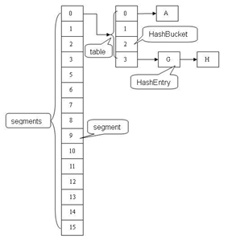

<!-- TOC START min:1 max:3 link:true update:true -->
- [ArratList](#arratlist)
  - [概览](#概览)
  - [ArrayList属性](#arraylist属性)
  - [构造函数](#构造函数)
  - [扩容](#扩容)
  - [Remove](#remove)
  - [get](#get)
  - [checkForComodification()](#checkforcomodification)
  - [fast-fail 快速失败](#fast-fail-快速失败)
- [Vector](#vector)
  - [概览](#概览-1)
  - [属性](#属性)
  - [构造函数](#构造函数-1)
  - [扩容](#扩容-1)
  - [get](#get-1)
  - [Vector与ArrayList的区别](#vector与arraylist的区别)
  - [替代方案](#替代方案)
- [synchronizedList](#synchronizedlist)
- [CopyOnWriteArrayList](#copyonwritearraylist)
  - [读写分离](#读写分离)
  - [适用场景](#适用场景)
- [LinkedList](#linkedlist)
  - [概述](#概述)
  - [属性和构造函数](#属性和构造函数)
  - [Node](#node)
  - [增](#增)
    - [addAll](#addall)
    - [add](#add)
  - [get](#get-2)
  - [ArrayList 和 LinkedList 区别](#arraylist-和-linkedlist-区别)
- [HashMap](#hashmap)
  - [存储结构](#存储结构)
  - [其他几个重要字段](#其他几个重要字段)
  - [put](#put)
    - [inflateTable](#inflatetable)
    - [putForNullKey](#putfornullkey)
  - [addEntry](#addentry)
    - [hash](#hash)
    - [取模](#取模)
  - [resize 扩容](#resize-扩容)
- [HashMap 1.8](#hashmap-18)
  - [属性区别](#属性区别)
  - [get()](#get-3)
  - [put()](#put-1)
  - [resize()](#resize)
  - [引申：红黑树](#引申红黑树)
  - [为什么是8的时候转红黑树？](#为什么是8的时候转红黑树)
- [HashTable](#hashtable)
  - [构造函数](#构造函数-2)
  - [put()](#put-2)
  - [rehash()](#rehash)
  - [其他与 HashMap的比较](#其他与-hashmap的比较)
- [ConcurrentHashMap 1.7](#concurrenthashmap-17)
  - [数据结构](#数据结构)
  - [get](#get-4)
  - [put()](#put-3)
  - [size](#size)
  - [resize()](#resize-1)
- [Concurrent 1.8](#concurrent-18)
  - [属性](#属性-1)
  - [实例初始化](#实例初始化)
    - [table 初始化](#table-初始化)
  - [put()](#put-4)
  - [get()](#get-5)
  - [resize()](#resize-2)
  - [JDK 1.8 的改动](#jdk-18-的改动)
- [Linked Hash Map](#linked-hash-map)
  - [get](#get-6)
  - [用 LinkedHashMap 实现 LRU 缓存](#用-linkedhashmap-实现-lru-缓存)
- [HashSet](#hashset)
  - [概览](#概览-2)
  - [属性](#属性-2)
  - [方法](#方法)
    - [add(E)](#adde)
    - [remove(Object o)](#removeobject-o)
- [WeakHashMap](#weakhashmap)
  - [概述](#概述-1)
  - [ConcurrentCache](#concurrentcache)
- [参考资料](#参考资料)

<!-- TOC END -->


# ArratList
如果没有特别说明，以下源码分析基于 JDK 1.8。

在 IDEA 中 double shift 调出 Search EveryWhere，查找源码文件，找到之后就可以阅读源码。

## 概览
```java
public class ArrayList<E> extends AbstractList<E>
        implements List<E>, RandomAccess, Cloneable, java.io.Serializable
{
  /* 省略以下内容，下文会有具体代码 */
}
```
ArrayList 是一个数组队列，相当于 动态数组。与Java中的数组相比，它的容量能动态增长。它继承于AbstractList，实现了List, RandomAccess, Cloneable, java.io.Serializable这些接口。

ArrayList 继承了AbstractList，实现了List。它是一个数组队列，提供了相关的添加、删除、修改、遍历等功能。

ArrayList 实现了RandmoAccess接口，即提供了随机访问功能。RandmoAccess(标识接口)是java中用来被List实现，为List提供快速访问功能的。在ArrayList中，我们即可以通过元素的序号快速获取元素对象；这就是快速随机访问。

ArrayList 实现了Cloneable(标识接口接口，即覆盖了函数clone()，能被克隆。

ArrayList 实现java.io.Serializable(标识接口接口，这意味着ArrayList支持序列化，能通过序列化去传输。

和Vector不同，**ArrayList中的操作不是线程安全的！** 所以，建议在单线程中才使用ArrayList，而在多线程中可以选择Vector或者CopyOnWriteArrayList。

## ArrayList属性
ArrayList属性主要就是当前数组长度size，以及存放数组的对象elementData数组，除此之外还有一个经常用到的属性就是从AbstractList继承过来的modCount属性，代表ArrayList集合的修改次数。
```java
// 默认容量
private static final int DEFAULT_CAPACITY = 10;

// Shared empty array instance used for empty instances. 用于空实例的空数组
// new ArrayList(0)
private static final Object[] EMPTY_ELEMENTDATA = {};

/**
 * Shared empty array instance used for default sized empty instances. We
 * distinguish this from EMPTY_ELEMENTDATA to know how much to inflate when
 * first element is added.
 * new ArrayList()
 */
private static final Object[] DEFAULTCAPACITY_EMPTY_ELEMENTDATA = {};

/**
 * The array buffer into which the elements of the ArrayList are stored.
 * The capacity of the ArrayList is the length of this array buffer. Any
 * empty ArrayList with elementData == DEFAULTCAPACITY_EMPTY_ELEMENTDATA
 * will be expanded to DEFAULT_CAPACITY when the first element is added.
 */
transient Object[] elementData; // non-private to simplify nested class access

// 数组实际大小
private int size;
```

## 构造函数
ArrayList 有3个构造函数：
```java
/**
 * 构造一个指定大小的 list
 *
 * @param  initialCapacity  指定的容量
 * @throws IllegalArgumentException 如果指定容量 initialCapacity 为负数
 */
public ArrayList(int initialCapacity) {
    if (initialCapacity > 0) {
        this.elementData = new Object[initialCapacity];
    } else if (initialCapacity == 0) {
      // 注意这里用的是 EMPTY_ELEMENTDATA
        this.elementData = EMPTY_ELEMENTDATA;
    } else {
        throw new IllegalArgumentException("Illegal Capacity: "+
                                           initialCapacity);
    }
}

/**
 * 无参构造，这里用的就是 DEFAULTCAPACITY_EMPTY_ELEMENTDATA，这样的话容量是使用默认的
 * DEFAULT_CAPACITY = 10，不跟上面的有参构造混淆
 */
public ArrayList() {
    this.elementData = DEFAULTCAPACITY_EMPTY_ELEMENTDATA;
}

/**
 * 1. 将collection对象转换成数组，然后将数组的地址的赋给elementData
 * 2. 更新size的值，同时判断size的大小，如果是size等于0，直接将空对象EMPTY_ELEMENTDATA的地址赋给elementData
 * 3. 如果size的值大于0，则执行Arrays.copy方法，把collection对象的内容（可以理解为深拷贝）copy到elementData中。
 */
public ArrayList(Collection<? extends E> c) {
    elementData = c.toArray();
    if ((size = elementData.length) != 0) {
        // c.toArray might (incorrectly) not return Object[] (see 6260652)
        if (elementData.getClass() != Object[].class)
            elementData = Arrays.copyOf(elementData, size, Object[].class);
    } else {
        // replace with empty array.
        this.elementData = EMPTY_ELEMENTDATA;
    }
}
```

## 扩容
添加元素时使用 ensureCapacityInternal() 方法来保证容量足够，如果不够时，需要使用 grow() 方法进行扩容，**新容量的大小为 oldCapacity + (oldCapacity >> 1)，也就是旧容量的 1.5 倍。**。

ensureCapacityInternal(int minCapacity) 方法主要的逻辑是传入当前数组实际个数 size+1 作为数组添加完元素后需要的容量大小，如果这个大小大于了数组大小(elementData.length)，就会调用 grow(minCapacity)进行扩容。

扩容操作需要调用 Arrays.copyOf() 把原数组整个复制到新数组中，这个操作代价很高，因此最好在创建 ArrayList 对象时就指定大概的容量大小，减少扩容操作的次数。
```java
public boolean add(E e) {
    ensureCapacityInternal(size + 1);  // Increments modCount!!
    elementData[size++] = e;
    return true;
}
```

确保添加的元素有地方存储，当第一次添加元素的时候 this.size+1 的值是 1，所以第一次添加的时候会将当前 elementData 数组的长度变为 10
```java
private void ensureCapacityInternal(int minCapacity) {
    ensureExplicitCapacity(calculateCapacity(elementData, minCapacity));
}

private static int calculateCapacity(Object[] elementData, int minCapacity) {
    // 当 数组为 DEFAULTCAPACITY_EMPTY_ELEMENTDATA 时候，会将容量设置为 10
    // DEFAULTCAPACITY_EMPTY_ELEMENTDATA 是通过无参构造得到的
    if (elementData == DEFAULTCAPACITY_EMPTY_ELEMENTDATA) {
        return Math.max(DEFAULT_CAPACITY, minCapacity);
    }
    return minCapacity;
}
```

将修改次数（modCount）自增1，判断是否需要扩充数组长度,判断条件就是用当前所需的数组最小长度(minCapacity)与数组的长度对比，如果大于0，则增长数组长度。
```java
private void ensureExplicitCapacity(int minCapacity) {
    modCount++;
    // overflow-conscious code
    if (minCapacity - elementData.length > 0)
        grow(minCapacity);
}

/**
 * 增大容量确保数组能存储下 minCapacity 个元素
 *
 * @param minCapacity 所需的最小容量要求
 */
private void grow(int minCapacity) {
    // overflow-conscious code
    int oldCapacity = elementData.length;
    int newCapacity = oldCapacity + (oldCapacity >> 1); // 扩容1.5倍
    if (newCapacity - minCapacity < 0)
        newCapacity = minCapacity;
    if (newCapacity - MAX_ARRAY_SIZE > 0)
        newCapacity = hugeCapacity(minCapacity);
    // minCapacity is usually close to size, so this is a win:
    elementData = Arrays.copyOf(elementData, newCapacity);
}
```

add还有一个函数是给定位置的插入,方法跟上面类似，只是要做 index 的检测，然后像上面一样确认
容量，必要时进行容量扩容，最后再把 index 开始的元素往后移一个位置 System.arraycopy，最后把元素
插入到指定位置中
```java
public void add(int index, E element) {
    rangeCheckForAdd(index);

    ensureCapacityInternal(size + 1);  // Increments modCount!!
    System.arraycopy(elementData, index, elementData, index + 1,
                     size - index);
    elementData[index] = element;
    size++;
}
```

## Remove
Remove 有两个函数，一个是根据 index， 一个根据元素

需要调用 System.arraycopy() 将 index+1 后面的元素都复制到 index 位置上，该操作的时间复杂度为 O(N)，可以看出 ArrayList 删除元素的代价是非常高的。
```java
/**
 * @param index 要删除的位置
 * @return 删除完后的 list
 * @throws IndexOutOfBoundsException {@inheritDoc}
 */
public E remove(int index) {
    rangeCheck(index);

    modCount++;
    E oldValue = elementData(index);

    int numMoved = size - index - 1;
    if (numMoved > 0)
        System.arraycopy(elementData, index+1, elementData, index,
                         numMoved);
    elementData[--size] = null; // clear to let GC do its work

    return oldValue;
}
```
根据元素来进行删除,从这里可以看出，ArrayList 是可以存 null 值的。有一点需要注意的就是它只
删除第一个匹配的元素（如果数组中含有该元素）
```java
/**
 * @param o 要删除的元素
 * @return true if this list contained the specified element
 */
public boolean remove(Object o) {
    if (o == null) {
        for (int index = 0; index < size; index++)
            if (elementData[index] == null) {
                fastRemove(index);
                return true;
            }
    } else {
        for (int index = 0; index < size; index++)
            if (o.equals(elementData[index])) {
                fastRemove(index);
                return true;
            }
    }
    return false;
}

/*
 * 不进行 index 检查，不返回删除的元素
 */
private void fastRemove(int index) {
    modCount++;
    int numMoved = size - index - 1;
    if (numMoved > 0)
        System.arraycopy(elementData, index+1, elementData, index,
                         numMoved);
    elementData[--size] = null; // clear to let GC do its work
}
```

## get
```java
public E get(int index) {
    rangeCheck(index);
    checkForComodification();
    return ArrayList.this.elementData(offset + index);
}
```
## checkForComodification()
```java
private void checkForComodification() {
    // 这是 ArrayList 中的一个内部类 SubList 中的一个方法，所以在调用 ArrayList 的 modCount
    // 时候要加上 ArrayList.this, this.modCount 调用的是 SubList 的 modCount
    if (ArrayList.this.modCount != this.modCount)
        throw new ConcurrentModificationException();
}
```
## fast-fail 快速失败
modCount 用来记录 ArrayList 结构发生变化的次数。结构发生变化是指添加或者删除至少一个元素的所有操作，或者是调整内部数组的大小，仅仅只是设置元素的值不算结构发生变化。

在进行序列化或者迭代等操作时，需要比较操作前后 modCount 是否改变，如果改变了需要抛出 ConcurrentModificationException。

```java
private void writeObject(java.io.ObjectOutputStream s)
    throws java.io.IOException{
    // Write out element count, and any hidden stuff
    int expectedModCount = modCount;
    s.defaultWriteObject();

    // Write out size as capacity for behavioural compatibility with clone()
    s.writeInt(size);

    // Write out all elements in the proper order.
    for (int i=0; i<size; i++) {
        s.writeObject(elementData[i]);
    }

    if (modCount != expectedModCount) {
        throw new ConcurrentModificationException();
    }
}
```

# Vector
## 概览
```java
public class Vector<E>
    extends AbstractList<E>
    implements List<E>, RandomAccess, Cloneable, java.io.Serializable{ // 略去其他部分
    }
```
跟 ArrayList 一致，Vector 继承了AbstractList，实现了List。它是一个数组队列，提供了相关的添加、删除、修改、遍历等功能。

Vector  实现了RandmoAccess接口，即提供了随机访问功能。RandmoAccess是java中用来被List实现，为List提供快速访问功能的。在 Vector 中，我们即可以通过元素的序号快速获取元素对象；这就是快速随机访问。

Vector  实现了Cloneable接口，即覆盖了函数 clone() ，能被克隆。

**Vector是线程安全的。**

ArrayList 实现 Serializable 接口，这意味着ArrayList支持序列化，能通过序列化去传输。

## 属性
Vector 主要属性如下:
```java
    // 存储元素的数字
    protected Object[] elementData;
    // count
    protected int elementCount;
    // 每次增加的增量(如果不指定则:容量每次增大一倍)
    protected int capacityIncrement;
```

## 构造函数
Vector 一共有 4 个构造函数
```java
/**
     * 指定初始容量和自增量
     * @param   initialCapacity     初始容量
     * @param   capacityIncrement   自增量
     * @throws IllegalArgumentException if the specified initial capacity is negative
     */
public Vector(int initialCapacity, int capacityIncrement) {
    super();
    if (initialCapacity < 0)
        throw new IllegalArgumentException("Illegal Capacity: "+
                                           initialCapacity);
    this.elementData = new Object[initialCapacity];
    this.capacityIncrement = capacityIncrement;
}

/**
 * 指定初始容量，设置 自增量为 0，这样在扩容时候容量会 *2
 * @param   initialCapacity   初始容量
 * @throws IllegalArgumentException if the specified initial capacity is negative
 */
public Vector(int initialCapacity) {
    this(initialCapacity, 0);
}

/**
 * 无参构造，指定初始容量为 10，
 */
public Vector() {
    this(10);
}

/**
 * 用一个 Collection 对象构造 Vector
 * @param c Collection 对象
 * @throws NullPointerException if the specified collection is null
 */
public Vector(Collection<? extends E> c) {
    elementData = c.toArray();
    elementCount = elementData.length;
    // c.toArray might (incorrectly) not return Object[] (see 6260652)
    if (elementData.getClass() != Object[].class)
        elementData = Arrays.copyOf(elementData, elementCount, Object[].class);
}
```

## 扩容
Vector 的扩容机制和 ArrayList 基本一样，不同在于 Vector 中的方法都有 synchronized 保证线程安全

而且每次扩容是 \*2(在不指定自增量的情况下)
```java
public synchronized void addElement(E obj) {
    modCount++;
    ensureCapacityHelper(elementCount + 1);
    elementData[elementCount++] = obj;
}
private void ensureCapacityHelper(int minCapacity) {
    // overflow-conscious code
    if (minCapacity - elementData.length > 0)
        grow(minCapacity);
}
private void grow(int minCapacity) {
    // overflow-conscious code
    int oldCapacity = elementData.length;
    // 在不指定自增量的情况下,扩容为原容量 *2
    int newCapacity = oldCapacity + ((capacityIncrement > 0) ?
                                     capacityIncrement : oldCapacity);
    if (newCapacity - minCapacity < 0)
        newCapacity = minCapacity;
    if (newCapacity - MAX_ARRAY_SIZE > 0)
        newCapacity = hugeCapacity(minCapacity);
    elementData = Arrays.copyOf(elementData, newCapacity);
}
```

## get
```java
/**
 * 获取 index 位置的元素
 * @param index
 * @return index 位置的元素
 * @throws ArrayIndexOutOfBoundsException if the index is out of range ({@code index < 0 || index >= size()})
 */
public synchronized E get(int index) {
    if (index >= elementCount)
        throw new ArrayIndexOutOfBoundsException(index);

    return elementData(index);
}
```

## Vector与ArrayList的区别
- Vector 是同步的，因此开销就比 ArrayList 要大，访问速度更慢。最好使用 ArrayList 而不是 Vector，因为同步操作完全可以由程序员自己来控制；
- Vector 每次扩容请求其大小的 2 倍空间，而 ArrayList 是 1.5 倍。

## 替代方案
可以使用 Collections.synchronizedList(); 得到一个线程安全的 ArrayList。
```java
List<String> list = new ArrayList<>();
List<String> synList = Collections.synchronizedList(list);
```
也可以使用 concurrent 并发包下的 CopyOnWriteArrayList 类。
```java
List<String> list = new CopyOnWriteArrayList<>();
```

# synchronizedList
synchronizedList 是 Collections 类中的一个静态类，它和 Vector 主要的区别是 synchronizedList 使用静态块

synchronizedList中的部分代码
```java
public E get(int index) {
    synchronized (mutex) {return list.get(index);}
}
public E set(int index, E element) {
    synchronized (mutex) {return list.set(index, element);}
}
public void add(int index, E element) {
    synchronized (mutex) {list.add(index, element);}
}
public E remove(int index) {
    synchronized (mutex) {return list.remove(index);}
}
```

# CopyOnWriteArrayList
## 读写分离
写操作在一个复制的数组上进行，读操作还是在原始数组中进行，读写分离，互不影响。

写操作需要加锁，防止并发写入时导致写入数据丢失。

写操作结束之后需要把原始数组指向新的复制数组。
```java
/**
 * 增加元素
 * @param e element to be appended to this list
 * @return {@code true} (as specified by {@link Collection#add})
 */
public boolean add(E e) {
    final ReentrantLock lock = this.lock;
    lock.lock();
    try {
        Object[] elements = getArray();   
        int len = elements.length;
        // 创建一个新的数组，然后复制原始数组，长度+1
        Object[] newElements = Arrays.copyOf(elements, len + 1);
        newElements[len] = e;
        // 将新数组赋予回原始数组
        setArray(newElements);
        return true;
    } finally {
        lock.unlock();
    }
}

final void setArray(Object[] a) {
    array = a;
}
```

读操作还是在原始数组中进行
```java
@SuppressWarnings("unchecked")
private E get(Object[] a, int index) {
    return (E) a[index];
}
```

## 适用场景
CopyOnWriteArrayList 在写操作的同时允许读操作，大大提高了读操作的性能，因此很适合读多写少的应用场景。

但是 CopyOnWriteArrayList 有其缺陷：
  - 内存占用：在写操作时需要复制一个新的数组，使得内存占用为原来的两倍左右；
  - 数据不一致：读操作不能读取实时性的数据，因为部分写操作的数据还未同步到读数组中。

所以 CopyOnWriteArrayList 不适合内存敏感以及对实时性要求很高的场景。

# LinkedList
## 概述
```java
public class LinkedList<E>
    extends AbstractSequentialList<E>
    implements List<E>, Deque<E>, Cloneable, java.io.Serializable
    {}
```
概括的说，LinkedList 是线程不安全的，允许元素为null的双向链表。
其底层数据结构是链表，它实现List<E>, Deque<E>, Cloneable, java.io.Serializable接口，它实现了Deque<E>,所以它也可以作为一个双端队列。和ArrayList比，没有实现RandomAccess所以其以下标，随机访问元素速度较慢。

因其底层数据结构是链表，所以可想而知，它的增删只需要移动指针即可，故时间效率较高。不需要批量扩容，也不需要预留空间，所以空间效率比ArrayList高。

缺点就是需要随机访问元素时，时间效率很低，**虽然底层在根据下标查询Node的时候，会根据index判断目标Node在前半段还是后半段，然后决定是顺序还是逆序查询，以提升时间效率**。不过随着n的增大，总体时间效率依然很低。

当每次增、删时，都会修改modCount。

## 属性和构造函数
```java
transient int size = 0;
// 头结点
transient Node<E> first;
// 尾节点
transient Node<E> last;
/**
 * 无参构造，啥都没干
 */
public LinkedList() {
}

/**
 * 将一个 Collection 对象加到链表中，从尾部加
 * @param  c the collection whose elements are to be placed into this list
 * @throws NullPointerException if the specified collection is null
 */
public LinkedList(Collection<? extends E> c) {
    this();
    addAll(c);
}
```

## Node
可以看出，这是一个双向链表。
```java
private static class Node<E> {
    E item;
    Node<E> next;
    Node<E> prev;

    Node(Node<E> prev, E element, Node<E> next) {
        this.item = element;
        this.next = next;
        this.prev = prev;
    }
}
```

## 增
### addAll
```java
//addAll ,在尾部批量增加
public boolean addAll(Collection<? extends E> c) {
    return addAll(size, c);
}
//以index为插入下标，插入集合c中所有元素
public boolean addAll(int index, Collection<? extends E> c) {
    checkPositionIndex(index);   // 检查 index 在 [0,size] 中
    // 先将 collection 转成数组
    Object[] a = c.toArray();
    int numNew = a.length;
    if (numNew == 0)  // 空数组则返回
        return false;

    Node<E> pred, succ;
    if (index == size) {  // 从尾部加入
        succ = null;
        pred = last;
    } else {  // 从 index 位置加入
        succ = node(index);
        pred = succ.prev;
    }

    for (Object o : a) {
        @SuppressWarnings("unchecked") E e = (E) o;
        Node<E> newNode = new Node<>(pred, e, null);
        if (pred == null)
            first = newNode;
        else
            pred.next = newNode;
        pred = newNode; //步进，当前的节点为前置节点了，为下次添加节点做准备
    }

    if (succ == null) { //循环结束后，判断，如果后置节点是null。 说明此时是在队尾append的。
        last = pred;  // 设置尾节点
    } else {
        pred.next = succ;
        succ.prev = pred;
    }

    size += numNew;
    modCount++;
    return true;
}
```

### add
```java
/**
 * 在链表尾部加入新节点
 * @param e element to be appended to this list
 * @return {@code true} (as specified by {@link Collection#add})
 */
public boolean add(E e) {
    linkLast(e);
    return true;
}
/**
 * 添加 e 为尾节点
 */
void linkLast(E e) {
    final Node<E> l = last;
    final Node<E> newNode = new Node<>(l, e, null);
    last = newNode;
    if (l == null)  // 空链表
        first = newNode;  // 设置头结点
    else
        l.next = newNode;
    size++;
    modCount++;
}
```

## get
```java
/**
  * 返回特定位置的节点
  *
  * @param index index of the element to return
  * @return the element at the specified position in this list
  * @throws IndexOutOfBoundsException {@inheritDoc}
  */
 public E get(int index) {
     checkElementIndex(index);
     return node(index).item;
 }
 /**
  * Returns the (non-null) Node at the specified element index.
  * 通过下标获取某个node 的时候，（add select），会根据index处于前半段还是后半段 进行一个折半，以提升查询效率
  */
 Node<E> node(int index) {
     if (index < (size >> 1)) {
         Node<E> x = first;
         for (int i = 0; i < index; i++)
             x = x.next;
         return x;
     } else {
         Node<E> x = last;
         for (int i = size - 1; i > index; i--)
             x = x.prev;
         return x;
     }
 }
```
## ArrayList 和 LinkedList 区别


# HashMap
## 存储结构
HashMap的主干是一个Entry数组。Entry是HashMap的基本组成单元，每一个Entry包含一个key-value键值对。
```java
//HashMap的主干数组，可以看到就是一个Entry数组，初始值为空数组{}，主干数组的长度一定是2的次幂
transient Entry<K,V>[] table = (Entry<K,V>[]) EMPTY_TABLE;
```
Entry 是 HashMap 中一个静态内部类
```java
static class Entry<K,V> implements Map.Entry<K,V> {
    final K key;
    V value;
    Entry<K,V> next;//存储指向下一个Entry的引用，单链表结构
    int hash;//对key的hashcode值进行hash运算后得到的值，存储在Entry，避免重复计算

    /**
    * Creates new entry.
    */
    Entry(int h, K k, V v, Entry<K,V> n) {
        value = v;
        next = n;
        key = k;
        hash = h;
    }
    ...
}
```
所以Entry 存储着键值对。它包含了四个字段，从 next 字段我们可以看出 Entry 是一个链表。即数组中的每个位置被当成一个桶，一个桶存放一个链表。HashMap 使用拉链法来解决冲突，同一个链表中存放哈希值相同的 Entry。

应该注意到链表的插入是以头插法方式进行的


## 其他几个重要字段
```java
//实际存储的key-value键值对的个数
transient int size;
//阈值，当table == {}时，该值为初始容量（初始容量默认为16）；当table被填充了，也就是为table分配内存空间后，threshold一般为 capacity*loadFactory。HashMap在新增节点时候，如果 HashMap 的 size 大于 threshold，并且即将发生哈希冲突时候，就会出发扩容
int threshold;
//负载因子，代表了table的填充度有多少，默认是0.75
final float loadFactor;
//用于快速失败，由于HashMap非线程安全，在对HashMap进行迭代时，如果期间其他线程的参与导致HashMap的结构发生变化了（比如put，remove等操作），需要抛出异常ConcurrentModificationException
transient int modCount;
```

## put
```java
public V put(K key, V value) {
  //如果table数组为空数组{}，进行数组填充（为table分配实际内存空间），入参为threshold，
  // 此时threshold为initialCapacity 默认是1<<4(2^4=16)
    if (table == EMPTY_TABLE) {
        inflateTable(threshold);
    }
    // 键为 null 单独处理,存储位置为table[0]或table[0]的冲突链上
    if (key == null)
        return putForNullKey(value);
    int hash = hash(key);
    // 确定桶下标
    int i = indexFor(hash, table.length);
    // 先找出是否已经存在键为 key 的键值对，如果存在的话就更新这个键值对的值为 value
    for (Entry<K,V> e = table[i]; e != null; e = e.next) {
        Object k;
        if (e.hash == hash && ((k = e.key) == key || key.equals(k))) {
            V oldValue = e.value;
            e.value = value;
            e.recordAccess(this);
            return oldValue;
        }
    }

    modCount++;
    // 插入新键值对
    addEntry(hash, key, value, i);
    return null;
}
```

### inflateTable
```java
private void inflateTable(int toSize) {
    int capacity = roundUpToPowerOf2(toSize);//capacity一定是2的次幂
    // 此处为threshold赋值，取capacity*loadFactor和MAXIMUM_CAPACITY+1的最小值，
    // capaticy一定不会超过MAXIMUM_CAPACITY，除非loadFactor大于1
    threshold = (int) Math.min(capacity * loadFactor, MAXIMUM_CAPACITY + 1);
    table = new Entry[capacity];  // 声明 Entry 数组
    initHashSeedAsNeeded(capacity);
}
```

### putForNullKey
HashMap 允许插入键为 null 的键值对。但是因为无法调用 null 的 hashCode() 方法，
也就无法确定该键值对的桶下标，只能通过强制指定一个桶下标来存放。HashMap 使用第 0 个桶存放键为 null 的键值对。
```java
private V putForNullKey(V value) {
    // 这里为什么循环我想了一下，应该是因为有的元素的hashcode算出来为0，所以第 0 桶
    // 任然有可能出现冲突链，所以要在冲突链中找 key==null 的那对键值
    for (Entry<K,V> e = table[0]; e != null; e = e.next) {
        if (e.key == null) {
            V oldValue = e.value;
            e.value = value;
            e.recordAccess(this);
            return oldValue;
        }
    }
    modCount++;
    addEntry(0, null, value, 0);
    return null;
}
```

## addEntry
使用链表的头插法，也就是新的键值对插在链表的头部，而不是链表的尾部。
```java
void addEntry(int hash, K key, V value, int bucketIndex) {
    // 当size超过临界阈值threshold，并且即将发生哈希冲突时进行扩容
    if ((size >= threshold) && (null != table[bucketIndex])) {
        resize(2 * table.length);
        hash = (null != key) ? hash(key) : 0;
        bucketIndex = indexFor(hash, table.length);
    }

    createEntry(hash, key, value, bucketIndex);
}

void createEntry(int hash, K key, V value, int bucketIndex) {
    // 这是 bucketIndex 对应的桶的首个键值对
    Entry<K,V> e = table[bucketIndex];
    // 头插法，链表头部指向新的键值对
    table[bucketIndex] = new Entry<>(hash, key, value, e);
    size++;
}
```

### hash
```java
final int hash(Object k) {
    int h = hashSeed;
    if (0 != h && k instanceof String) {
        return sun.misc.Hashing.stringHash32((String) k);
    }

    h ^= k.hashCode();

    // This function ensures that hashCodes that differ only by
    // constant multiples at each bit position have a bounded
    // number of collisions (approximately 8 at default load factor).
    h ^= (h >>> 20) ^ (h >>> 12);
    return h ^ (h >>> 7) ^ (h >>> 4);
}

public final int hashCode() {
    return Objects.hashCode(key) ^ Objects.hashCode(value);
}
```

### 取模
确定桶下标的最后一步是将 key 的 hash 值对桶个数取模：hash%capacity，如果能保证 capacity 为 2 的 n 次方，那么就可以将这个操作转换为位运算。
```java
static int indexFor(int h, int length) {
    return h & (length-1);  // 相当于 hash%capacity，得到 hash 对应的桶下标
}
```

## resize 扩容
从 addEntry 的以下代码中可以看到 HashMap 的扩容方法
```java
// 当size超过临界阈值threshold，并且即将发生哈希冲突时进行扩容
if ((size >= threshold) && (null != table[bucketIndex])) {
    resize(2 * table.length);
    hash = (null != key) ? hash(key) : 0;
    bucketIndex = indexFor(hash, table.length);
}
```
可以看出，扩容的长度是之前的两倍 *resize(2 * table.length);*
```java
void resize(int newCapacity) {
    Entry[] oldTable = table;
    int oldCapacity = oldTable.length;
    if (oldCapacity == MAXIMUM_CAPACITY) {    // 最大容量 1 << 30
        threshold = Integer.MAX_VALUE;
        return;
    }

    Entry[] newTable = new Entry[newCapacity];
    transfer(newTable, initHashSeedAsNeeded(newCapacity));
    table = newTable;
    threshold = (int)Math.min(newCapacity * loadFactor, MAXIMUM_CAPACITY + 1);
}
```
在对数组进行扩容后，键值对就需要重新计算所属的桶下标，transfer到扩容后的新的地址，在transfer数据中需要注意的是，如果hashSeed有变化，需要重新计算原有key的hash值。
```java
void transfer(Entry[] newTable, boolean rehash) {
    int newCapacity = newTable.length;
　　　　　//for循环中的代码，逐个遍历链表，重新计算索引位置，将老数组数据复制到新数组中去（数组不存储实际数据，所以仅仅是拷贝引用而已）
    for (Entry<K,V> e : table) {
        while(null != e) {
            Entry<K,V> next = e.next;
            if (rehash) {
                e.hash = null == e.key ? 0 : hash(e.key);
            }
            int i = indexFor(e.hash, newCapacity);
　　　　　　 //将当前entry的next链指向新的索引位置,newTable[i]有可能为空，有可能也是个entry链，如果是entry链，直接在链表头部插入。
            e.next = newTable[i];
            newTable[i] = e;
            e = next;
        }
    }
}
```
在进行扩容时，需要把键值对重新放到对应的桶上。HashMap 使用了一个特殊的机制，可以降低重新计算桶下标的操作。

假设原数组长度 capacity 为 16，扩容之后 new capacity 为 32：
```text
capacity     : 00010000
new capacity : 00100000
```
对于一个 Key，
  - 它的哈希值如果在第 5 位上为 0，那么取模得到的结果和之前一样；
  - 如果为 1，那么得到的结果为原来的结果 +16。
**这样做可以尽量减少之前已经散列好的数组，减少数据移动操作。**

# HashMap 1.8
JDK 1.8对HashMap进行了比较大的优化，底层实现由之前的“数组+链表”改为“数组+链表+红黑树”


## 属性区别
由于添加了红黑树，属性上增加了树相关的属性
```java
static final int TREEIFY_THRESHOLD = 8; // 链表节点转换红黑树节点的阈值, 9个节点转
static final int UNTREEIFY_THRESHOLD = 6;   // 红黑树节点转换链表节点的阈值, 6个节点转
static final int MIN_TREEIFY_CAPACITY = 64; // 转红黑树时, table的最小长度
```

## get()
因为红黑树的引入，get() 和 put() 都有了变化

get() 的主要流程如下：
  1. 先对table进行校验，校验是否为空，length是否大于0
  2. 使用table.length - 1和hash值进行位与运算，得出在table上的索引位置，将该索引位置的节点赋值给first节点，校验该索引位置是否为空
  3. 检查first节点的hash值和key是否和入参的一样，如果一样则first即为目标节点，直接返回first节点
  4. 如果first的next节点不为空则继续遍历
  5. 如果first节点为TreeNode，则调用getTreeNode方法（见下文代码块1）查找目标节点
  6. 如果first节点不为TreeNode，则调用普通的遍历链表方法查找目标节点
  7. 如果查找不到目标节点则返回空

```java
public V get(Object key) {
    Node<K,V> e;
    return (e = getNode(hash(key), key)) == null ? null : e.value;
}

final Node<K,V> getNode(int hash, Object key) {
    Node<K,V>[] tab; Node<K,V> first, e; int n; K k;
    // table不为空 && table长度大于0 && table索引位置(根据hash值计算出)不为空
    if ((tab = table) != null && (n = tab.length) > 0 &&
        (first = tab[(n - 1) & hash]) != null) {    
        if (first.hash == hash && // always check first node
            ((k = first.key) == key || (key != null && key.equals(k))))
            return first;	// first的key等于传入的key则返回first对象
        if ((e = first.next) != null) { // 向下遍历
            if (first instanceof TreeNode)  // 判断是否为TreeNode
            	// 如果是红黑树节点，则调用红黑树的查找目标节点方法getTreeNode
                return ((TreeNode<K,V>)first).getTreeNode(hash, key);
            // 走到这代表节点为链表节点
            do { // 向下遍历链表, 直至找到节点的key和传入的key相等时,返回该节点
                if (e.hash == hash &&
                    ((k = e.key) == key || (key != null && key.equals(k))))
                    return e;
            } while ((e = e.next) != null);
        }
    }
    return null;    // 找不到符合的返回空
}
```

## put()
1. 校验table是否为空或者length等于0，如果是则调用resize方法（见下文resize方法）进行初始化
2. 通过hash值计算索引位置，将该索引位置的头节点赋值给p节点，如果该索引位置节点为空则使用传入的参数新增一个节点并放在该索引位置
3. 判断p节点的key和hash值是否跟传入的相等，如果相等, 则p节点即为要查找的目标节点，将p节点赋值给e节点
4. 如果p节点不是目标节点，则判断p节点是否为TreeNode，如果是则调用红黑树的putTreeVal方法（见下文代码块4）查找目标节点
5. 走到这代表p节点为普通链表节点，则调用普通的链表方法进行查找，并定义变量binCount来统计该链表的节点数
6. 如果p的next节点为空时，则代表找不到目标节点，则新增一个节点并插入链表尾部，并校验节点数是否超过8个，如果超过则调用treeifyBin方法将链表节点转为红黑树节点
7. 如果遍历的e节点存在hash值和key值都与传入的相同，则e节点即为目标节点，跳出循环
8. 如果e节点不为空，则代表目标节点存在，使用传入的value覆盖该节点的value，并返回oldValue
9. 如果插入节点后节点数超过阈值，则调用resize方法（见下文resize方法）进行扩容

```java
public V put(K key, V value) {
    return putVal(hash(key), key, value, false, true);
}

final V putVal(int hash, K key, V value, boolean onlyIfAbsent,
               boolean evict) {
    Node<K,V>[] tab; Node<K,V> p; int n, i;
    // table是否为空或者length等于0, 如果是则调用resize方法进行初始化
    if ((tab = table) == null || (n = tab.length) == 0)
        n = (tab = resize()).length;    
    // 通过hash值计算索引位置, 如果table表该索引位置节点为空则新增一个
    if ((p = tab[i = (n - 1) & hash]) == null)// 将索引位置的头节点赋值给p
        tab[i] = newNode(hash, key, value, null);
    else {  // table表该索引位置不为空
        Node<K,V> e; K k;
        if (p.hash == hash && // 判断p节点的hash值和key值是否跟传入的hash值和key值相等
            ((k = p.key) == key || (key != null && key.equals(k))))
            e = p;  // 如果相等, 则p节点即为要查找的目标节点，赋值给e
        // 判断p节点是否为TreeNode, 如果是则调用红黑树的putTreeVal方法查找目标节点
        else if (p instanceof TreeNode)
            e = ((TreeNode<K,V>)p).putTreeVal(this, tab, hash, key, value);
        else {	// 走到这代表p节点为普通链表节点
            for (int binCount = 0; ; ++binCount) {  // 遍历此链表, binCount用于统计节点数
                if ((e = p.next) == null) { // p.next为空代表不存在目标节点则新增一个节点插入链表尾部
                    p.next = newNode(hash, key, value, null);
                    // 计算节点是否超过8个, 减一是因为循环是从p节点的下一个节点开始的
                    if (binCount >= TREEIFY_THRESHOLD - 1)
                        treeifyBin(tab, hash);// 如果超过8个，调用treeifyBin方法将该链表转换为红黑树
                    break;
                }
                if (e.hash == hash && // e节点的hash值和key值都与传入的相等, 则e即为目标节点,跳出循环
                    ((k = e.key) == key || (key != null && key.equals(k))))
                    break;
                p = e;  // 将p指向下一个节点
            }
        }
        // e不为空则代表根据传入的hash值和key值查找到了节点,将该节点的value覆盖,返回oldValue
        if (e != null) {
            V oldValue = e.value;
            if (!onlyIfAbsent || oldValue == null)
                e.value = value;
            afterNodeAccess(e); // 用于LinkedHashMap
            return oldValue;
        }
    }
    ++modCount;
    if (++size > threshold) // 插入节点后超过阈值则进行扩容
        resize();
    afterNodeInsertion(evict);  // 用于LinkedHashMap
    return null;
}
```

## resize()
这里只展示部分代码，主要的区别在于 1.8 里面再重新计算索引位置的时候，如果 e 的 hash 值与老表的容量
（为一串只有1个为2的二进制数，例如16为0000 0000 0001 0000）进行位与运算为 0，则说明 e 节点扩容后的索引位置跟老表的索引位置一样，进行链表拼接操作：
如果 loTail 为空，代表该节点为第一个节点，则将 loHead 赋值为该节点；否则将节点添加在 loTail 后面，并将 loTail 赋值为新增的节点。

如果 e 的 hash 值与老表的容量（为一串只有1个为2的二进制数，例如16为0000 0000 0001 0000）进行位与运算为1，
则说明 e 节点扩容后的索引位置为：老表的 索引位置＋oldCap，进行链表拼接操作：
如果 hiTail 为空，代表该节点为第一个节点，则将 hiHead 赋值为该节点；否则将节点添加在 hiTail 后面，并将 hiTail 赋值为新增的节点。

在 JDK 1.7 中，Entry 链表采用的是 **头插法** ，而在1.8中，采用 **尾插法**（见上面的 put() ）。
同时，因为 1.7 的头插法，在 resize() 之后，链表的中节点顺序其实会跟原链表反过来。而 1.8 中不会存在这个情况。
```java
// 前面还有部分代码
// 定义新表,容量为刚计算出来的新容量
Node<K,V>[] newTab = (Node<K,V>[])new Node[newCap];
table = newTab; // 将当前的表赋值为新定义的表
if (oldTab != null) {   // 如果老表不为空, 则需遍历将节点赋值给新表
    for (int j = 0; j < oldCap; ++j) {  // 遍历老表
        Node<K,V> e;
        if ((e = oldTab[j]) != null) {  // 将索引值为j的老表头节点赋值给e
            oldTab[j] = null; // 将老表的节点设置为空, 以便垃圾收集器回收空间
            // 如果e.next为空, 则代表老表的该位置只有1个节点,
            // 通过hash值计算新表的索引位置, 直接将该节点放在该位置
            if (e.next == null)
                newTab[e.hash & (newCap - 1)] = e;
            else if (e instanceof TreeNode)
            	 // 调用treeNode的hash分布(跟下面最后一个else的内容几乎相同)
                ((TreeNode<K,V>)e).split(this, newTab, j, oldCap);
            else { // preserve order--保证 resize 前后每个 Node 下的链表的顺序和原理
                Node<K,V> loHead = null, loTail = null; // 存储跟原索引位置相同的节点
                Node<K,V> hiHead = null, hiTail = null; // 存储索引位置为:原索引+oldCap的节点
                Node<K,V> next;
                do {
                    next = e.next;
                    //如果e的hash值与老表的容量进行与运算为0,则扩容后的索引位置跟老表的索引位置一样
                    if ((e.hash & oldCap) == 0) {   
                        if (loTail == null) // 如果loTail为空, 代表该节点为第一个节点
                            loHead = e; // 则将loHead赋值为第一个节点
                        else    
                            loTail.next = e;    // 否则将节点添加在loTail后面(尾插法)
                        loTail = e; // 并将loTail赋值为新增的节点
                    }
                    //如果e的hash值与老表的容量进行与运算为1,则扩容后的索引位置为:老表的索引位置＋oldCap
                    else {  
                        if (hiTail == null) // 如果hiTail为空, 代表该节点为第一个节点
                            hiHead = e; // 则将hiHead赋值为第一个节点
                        else
                            hiTail.next = e;    // 否则将节点添加在hiTail后面(尾插法)
                        hiTail = e; // 并将hiTail赋值为新增的节点
                    }
                } while ((e = next) != null);
                if (loTail != null) {
                    loTail.next = null; // 最后一个节点的next设为空
                    newTab[j] = loHead; // 将原索引位置的节点设置为对应的头结点
                }
                if (hiTail != null) {
                    hiTail.next = null; // 最后一个节点的next设为空
                    newTab[j + oldCap] = hiHead; // 将索引位置为原索引+oldCap的节点设置为对应的头结点
                }
            }
        }
    }
}
return newTab;
```

## 引申：红黑树
红黑树的操作时间跟二叉查找树的时间复杂度是一样的，执行查找、插入、删除等操作的时间复杂度为O（logn）

[红黑树](https://www.jianshu.com/p/e136ec79235c)

## 为什么是8的时候转红黑树？
源码里有如下描述：
```text
Because TreeNodes are about twice the size of regular nodes, we
use them only when bins contain enough nodes to warrant use
(see TREEIFY_THRESHOLD). And when they become too small (due to
removal or resizing) they are converted back to plain bins.  In
usages with well-distributed user hashCodes, tree bins are
rarely used.  Ideally, under random hashCodes, the frequency of
nodes in bins follows a Poisson distribution
(http://en.wikipedia.org/wiki/Poisson_distribution) with a
parameter of about 0.5 on average for the default resizing
threshold of 0.75, although with a large variance because of
resizing granularity. Ignoring variance, the expected
occurrences of list size k are (exp(-0.5)*pow(0.5, k)/factorial(k)). 
The first values are:
0:    0.60653066
1:    0.30326533
2:    0.07581633
3:    0.01263606
4:    0.00157952
5:    0.00015795
6:    0.00001316
7:    0.00000094
8:    0.00000006
more: less than 1 in ten million
```
大体翻译为：TreeNodes占用空间是普通Nodes的两倍，所以只有当bin包含足够多的节点时才会转成TreeNodes，而是否足够多就是由TREEIFY_THRESHOLD的值决定的。当bin中节点数变少时，又会转成普通的bin。并且我们查看源码的时候发现，链表长度达到8就转成红黑树，当长度降到6就转成普通bin。

当hashCode离散性很好的时候，树型bin用到的概率非常小，因为数据均匀分布在每个bin中，几乎不会有bin中链表长度会达到阈值。但是在随机hashCode下，离散性可能会变差，然而JDK又不能阻止用户实现这种不好的hash算法，因此就可能导致不均匀的数据分布。不过理想情况下随机hashCode算法下所有bin中节点的分布频率会遵循泊松分布，我们可以看到，一个bin中链表长度达到8个元素的概率为0.00000006，几乎是不可能事件。所以，之所以选择8，不是拍拍屁股决定的，而是根据概率统计决定的。

# HashTable
Hashtable的底层结构是数组+链表，下面主要比较 HashTable 和 HashMap的区别
## 构造函数
Hashtable的构造方法如下：
```java
public Hashtable(int initialCapacity, float loadFactor) {
       if (initialCapacity < 0)
           throw new IllegalArgumentException("Illegal Capacity: "+
                                              initialCapacity);
       if (loadFactor <= 0 || Float.isNaN(loadFactor))
           throw new IllegalArgumentException("Illegal Load: "+loadFactor);

       if (initialCapacity==0)
           initialCapacity = 1;
       this.loadFactor = loadFactor;
       table = new Entry<?,?>[initialCapacity];
       threshold = (int)Math.min(initialCapacity * loadFactor, MAX_ARRAY_SIZE + 1);
   }
   public Hashtable(int initialCapacity) {
       this(initialCapacity, 0.75f);
   }
   public Hashtable() {
       this(11, 0.75f);
   }
   public Hashtable(Map<? extends K, ? extends V> t) {
       this(Math.max(2*t.size(), 11), 0.75f);
       putAll(t);
   }
```
可以看到，Hashtable和HashMap的构造方法相同的是，均是对初始容量和加载因子完成了设置；不同的地方有2点：
1. HashMap对底层数组采取的懒加载，即当执行第一次插入时才会创建数组；而Hashtable在初始化时就创建了数组；
2. HashMap中数组的默认初始容量是16，并且必须的是2的指数倍数；而Hashtable中默认的初始容量是11，并且不要求必须是2的指数倍数。

## put()
```java
public synchronized V put(K key, V value) {
   //值不允许为null
   if (value == null) {
       throw new NullPointerException();
   }

   // Makes sure the key is not already in the hashtable.
   Entry<?,?> tab[] = table;
   //得到键的hash
   int hash = key.hashCode();
   //得到对应hash在数组中的桶索引
   int index = (hash & 0x7FFFFFFF) % tab.length;
   @SuppressWarnings("unchecked")
   //得到桶中链表头节点
   Entry<K,V> entry = (Entry<K,V>)tab[index];
   //从头开始遍历
   for(; entry != null ; entry = entry.next) {
       //一旦hash值相等并且键相等，替换旧值
       if ((entry.hash == hash) && entry.key.equals(key)) {
           V old = entry.value;
           entry.value = value;
           return old;
       }
   }
   //如果没有找到相同键，那么添加新节点(头插法)
   addEntry(hash, key, value, index);
   return null;
}

private void addEntry(int hash, K key, V value, int index) {
    modCount++;
    Entry<?,?> tab[] = table;
    //如果尺寸超过了阈值，进行rehash
    if (count >= threshold) {
        // Rehash the table if the threshold is exceeded
        rehash();

        tab = table;
        hash = key.hashCode();
        index = (hash & 0x7FFFFFFF) % tab.length;
    }
    // Creates the new entry.
    @SuppressWarnings("unchecked")
    Entry<K,V> e = (Entry<K,V>) tab[index];   // 头插法
    tab[index] = new Entry<>(hash, key, value, e);
    count++;
}
```
在上面的put方法中可以看到很多点与 HashMap 中不同的地方:
1. Hashtable的put()是线程安全的，而HashMap的put()方法不是线程安全的
2. HashMap中键和值均允许为null；Hashtable中均不允许
3. 计算hash的方式不同。Hashtable中使用键的哈希码作为哈希值，而HashMap中的哈希值将根据键的哈希值经过计算得到
4. 得到数组中桶的方式不一样。HashMap 中采用 h & (length-1)，因为 HashMap 中桶的个数必须是 2 的指数倍数，但是 HashTable 因为桶个数并不限制在 2 的指数倍数，所以在写法上跟 HashMap 不一致
  (hash & 0x7FFFFFFF) % tab.length

## rehash()
从上面可以看出，在当插入一个节点时，如果哈希表的尺寸已经达到了扩容的阈值，那么进行 rehash()，之后再将节点插入到链表的头部，这一点和 HashMap(1.7) 是一样的，即新节点总是位于桶的头结点。

所以 HashTable 和 HashMap 一样，rehash() 时桶中的链表顺序会颠倒
```java
protected void rehash() {
       int oldCapacity = table.length;
       Entry<?,?>[] oldMap = table;

       // 扩容，newCapacity=2*oldCapacity+1
       int newCapacity = (oldCapacity << 1) + 1;
       if (newCapacity - MAX_ARRAY_SIZE > 0) {
           if (oldCapacity == MAX_ARRAY_SIZE)
               // Keep running with MAX_ARRAY_SIZE buckets
               return;
           newCapacity = MAX_ARRAY_SIZE;
       }
       Entry<?,?>[] newMap = new Entry<?,?>[newCapacity];

       modCount++;
       threshold = (int)Math.min(newCapacity * loadFactor, MAX_ARRAY_SIZE + 1);
       table = newMap;

       //rehash
       for (int i = oldCapacity ; i-- > 0 ;) {
           for (Entry<K,V> old = (Entry<K,V>)oldMap[i] ; old != null ; ) {
               Entry<K,V> e = old;
               old = old.next;

               int index = (e.hash & 0x7FFFFFFF) % newCapacity;
               e.next = (Entry<K,V>)newMap[index];
               newMap[index] = e;
           }
       }
   }
```

## 其他与 HashMap的比较
- HashMap 的迭代器是 fail-fast 迭代器(因为不是线程安全的)。

# ConcurrentHashMap 1.7
HashMap 不是线程安全的，但是 HashTable 在线程多的情况下效率会下降很快(所以线程争一个锁)
所以在多线程情况也不是很理想.

ConcurrentHashMap所使用的锁分段技术，首先将数据分成一段一段的存储，然后给每一段数据配一把锁，当一个线程占用锁访问其中一个段数据的时候，其他段的数据也能被其他线程访问。有些方法需要跨段，比如size()和containsValue()，它们可能需要锁定整个表而而不仅仅是某个段，这需要按顺序锁定所有段，操作完毕后，又按顺序释放所有段的锁。


## 数据结构
ConcurrentHashMap是由Segment数组结构和HashEntry数组结构组成。

Segment是一种可重入锁ReentrantLock，在ConcurrentHashMap里扮演锁的角色，HashEntry则用于存储键值对数据。

一个ConcurrentHashMap里包含一个Segment数组，Segment的结构和HashMap类似，是一种数组和链表结构， 一个Segment里包含一个HashEntry数组，每个HashEntry是一个链表结构的元素， 每个Segment守护者一个HashEntry数组里的元素,当对HashEntry数组的数据进行修改时，必须首先获得它对应的Segment锁。
```java
final Segment<K,V>[] segments;
```
```java
static final class Segment<K,V> extends ReentrantLock implements Serializable {

    static final int MAX_SCAN_RETRIES =
        Runtime.getRuntime().availableProcessors() > 1 ? 64 : 1;

    transient volatile HashEntry<K,V>[] table;  // 跟 HashMap 类似的 Entry类

    transient int count;

    transient int modCount;

    transient int threshold;

    final float loadFactor;
}
```
```java
static final class HashEntry<K,V> {  
     final K key;  
     final int hash;  
     volatile V value;  
     final HashEntry<K,V> next;  
 }
```

## get
```java
public V get(Object key) {
    int hash = hash(key.hashCode());
    return segmentFor(hash).get(key, hash);
}
```
segmentFor这个函数用于确定操作应该在哪一个segment中进行
```java
final Segment<K,V> segmentFor(int hash) {
    return segments[(hash >>> segmentShift) & segmentMask];
}
```
这个函数用了位操作来确定Segment，根据传入的hash值向右无符号右移segmentShift位，然后和segmentMask进行与操作，结合我们之前说的segmentShift和segmentMask的值，就可以得出以下结论：假设Segment的数量是2的n次方，根据元素的hash值的高n位就可以确定元素到底在哪一个Segment中。

segmentShift和segmentMask:假设构造函数确定了Segment的数量是2的n次方，那么segmentShift就等于32减去n，而segmentMask就等于2的n次方减一.
(这种确定 Segment 位置的方法和 HashMap 中 h & (length-1) 是一个意思)。

ConcurrentHashMap的get操作是直接委托给Segment的get方法，直接看Segment的get方法：
```java
  V get(Object key, int hash) {  
   if (count != 0) { // read-volatile 当前桶的数据个数是否为0
       HashEntry<K,V> e = getFirst(hash);  得到头节点
       while (e != null) {  
           if (e.hash == hash && key.equals(e.key)) {  
               V v = e.value;  
               if (v != null)  
                   return v;  
               return readValueUnderLock(e); // recheck  
           }  
           e = e.next;  
       }  
   }  
   return null;  
}
```
get操作不需要锁。除非读到的值是空的才会加锁重读，我们知道HashTable容器的get方法是需要加锁的，那么ConcurrentHashMap的get操作是如何做到不加锁的呢？原因是它的get方法里将要使用的共享变量都定义成volatile

第一步是访问count变量，这是一个volatile变量，由于所有的修改操作在进行结构修改时都会在最后一步写count 变量，通过这种机制保证get操作能够得到几乎最新的结构更新。对于非结构更新，也就是结点值的改变，由于HashEntry的value变量是 volatile的，也能保证读取到最新的值。

接下来就是根据hash和key对hash链进行遍历找到要获取的结点，如果没有找到，直接访回null。对hash链进行遍历不需要加锁的原因在于链指针next是final的。但是头指针却不是final的，这是通过getFirst(hash)方法返回，也就是存在 table数组中的值。这使得getFirst(hash)可能返回过时的头结点，例如，当执行get方法时，刚执行完getFirst(hash)之后，另一个线程执行了删除操作并更新头结点，这就导致get方法中返回的头结点不是最新的。这是可以允许，通过对count变量的协调机制，get能读取到几乎最新的数据，虽然可能不是最新的。要得到最新的数据，只有采用完全的同步。

最后，如果找到了所求的结点，判断它的值如果非空就直接返回，否则在有锁的状态下再读一次。这是因为 put的时候就进行了判断，如果为空就要抛NullPointerException。空值的唯一源头就是HashEntry中的默认值，因为 HashEntry中的value不是final的，非同步读取有可能读取到空值。仔细看下put操作的语句：tab[index] = new HashEntry<K,V>(key, hash, first, value)，在这条语句中，HashEntry构造函数中对value的赋值以及对tab[index]的赋值可能被重新排序，这就可能导致结点的值为空。这里当v为空时，可能是一个线程正在改变节点，而之前的get操作都未进行锁定，根据bernstein条件，读后写或写后读都会引起数据的不一致，所以这里要对这个e重新上锁再读一遍，以保证得到的是正确值。


## put()
在 1.7 中，put() 操作跟 HashMap 很类似，区别就是 CHM(ConcurrentHashMap) 在 put() 时候，将对应的 Segment 加了锁保证线程安全。

在 1.7 中，在哈希冲突时候任然也是采用头插法。
```java
public V put(K key, V value) {
        if (value == null)          //ConcurrentHashMap 中不允许用 null 作为映射值
            throw new NullPointerException();
        int hash = hash(key.hashCode());        // 计算键对应的散列码
        // 根据散列码找到对应的 Segment
        return segmentFor(hash).put(key, hash, value, false);
 }

V put(K key, int hash, V value, boolean onlyIfAbsent) {
    lock();  // 加锁，这里是锁定某个 Segment 对象而非整个 ConcurrentHashMap
    try {
        int c = count;

        if (c++ > threshold)     // 如果超过再散列的阈值
            rehash();              // 执行再散列，table 数组的长度将扩充一倍

        HashEntry<K,V>[] tab = table;
        // 把散列码值与 table 数组的长度减 1 的值相“与”
        // 得到该散列码对应的 table 数组的下标值
        int index = hash & (tab.length - 1);
        // 找到散列码对应的具体的那个桶
        HashEntry<K,V> first = tab[index];

        HashEntry<K,V> e = first;
        while (e != null && (e.hash != hash || !key.equals(e.key)))
            e = e.next;

        V oldValue;
        if (e != null) {            // 如果键 / 值对以经存在
            oldValue = e.value;
            if (!onlyIfAbsent)
                e.value = value;    // 设置 value 值
        }
        else {                        // 键 / 值对不存在
            oldValue = null;
            ++modCount;         // 要添加新节点到链表中，所以 modCont 要加 1  
            // 创建新节点，并添加到链表的头部
            tab[index] = new HashEntry<K,V>(key, hash, first, value);
            count = c;               // 写 count 变量
        }
        return oldValue;
    } finally {
        unlock();                     // 解锁
    }
}
 ```

## size
每个 Segment 维护了一个 count 变量来统计该 Segment 中的键值对个数。
```java
/**
 * The number of elements. Accessed only either within locks
 * or among other volatile reads that maintain visibility.
 */
transient int count;
```
在执行 size 操作时，需要遍历所有 Segment 然后把 count 累计起来。

ConcurrentHashMap 在执行 size 操作时先尝试不加锁，如果连续两次不加锁操作得到的结果一致，那么可以认为这个结果是正确的。

尝试次数使用 RETRIES_BEFORE_LOCK 定义，该值为 2，retries 初始值为 -1，因此尝试次数为 3。

如果尝试的次数超过 3 次，就需要对每个 Segment 加锁。
```java
/**
 * Number of unsynchronized retries in size and containsValue
 * methods before resorting to locking. This is used to avoid
 * unbounded retries if tables undergo continuous modification
 * which would make it impossible to obtain an accurate result.
 */
static final int RETRIES_BEFORE_LOCK = 2;

public int size() {
    // Try a few times to get accurate count. On failure due to
    // continuous async changes in table, resort to locking.
    final Segment<K,V>[] segments = this.segments;
    int size;
    boolean overflow; // true if size overflows 32 bits
    long sum;         // sum of modCounts
    long last = 0L;   // previous sum
    int retries = -1; // first iteration isn't retry
    try {
        for (;;) {
            // 超过尝试次数，则对每个 Segment 加锁
            if (retries++ == RETRIES_BEFORE_LOCK) {
                for (int j = 0; j < segments.length; ++j)
                    ensureSegment(j).lock(); // force creation
            }
            sum = 0L;
            size = 0;
            overflow = false;
            for (int j = 0; j < segments.length; ++j) {
                Segment<K,V> seg = segmentAt(segments, j);
                if (seg != null) {
                    sum += seg.modCount;
                    int c = seg.count;
                    if (c < 0 || (size += c) < 0)
                        overflow = true;
                }
            }
            // 连续两次得到的结果一致，则认为这个结果是正确的
            if (sum == last)
                break;
            last = sum;
        }
    } finally {
        if (retries > RETRIES_BEFORE_LOCK) {
            for (int j = 0; j < segments.length; ++j)
                segmentAt(segments, j).unlock();
        }
    }
    return overflow ? Integer.MAX_VALUE : size;
}
```

## resize()
相对于HashMap的resize，ConcurrentHashMap的rehash原理类似，但是Doug Lea为rehash做了一定的优化，避免让所有的节点都进行复制操作：由于扩容是基于2的幂指来操作，假设扩容前某HashEntry对应到Segment中数组的index为i，数组的容量为capacity，那么扩容后该HashEntry对应到新数组中的index只可能为i或者i+capacity，因此大多数HashEntry节点在扩容前后index可以保持不变。基于此，rehash方法中会定位第一个后续所有节点在扩容后index都保持不变的节点，然后将这个节点之前的所有节点重排即可。
```java
private void rehash(HashEntry<K,V> node) {  
    HashEntry<K,V>[] oldTable = table;  
    int oldCapacity = oldTable.length;  
    // 2 倍  
    int newCapacity = oldCapacity << 1;  
    threshold = (int)(newCapacity * loadFactor);  
    // 创建新数组  
    HashEntry<K,V>[] newTable =  
        (HashEntry<K,V>[]) new HashEntry[newCapacity];  
    // 新的掩码，如从 16 扩容到 32，那么 sizeMask 为 31，对应二进制 ‘000...00011111’  
    int sizeMask = newCapacity - 1;  

    // 遍历原数组，老套路，将原数组位置 i 处的链表拆分到 新数组位置 i 和 i+oldCap 两个位置  
    for (int i = 0; i < oldCapacity ; i++) {  
        // e 是链表的第一个元素  
        HashEntry<K,V> e = oldTable[i];  
        if (e != null) {  
            HashEntry<K,V> next = e.next;  
            // 计算应该放置在新数组中的位置，  
            // 假设原数组长度为 16，e 在 oldTable[3] 处，那么 idx 只可能是 3 或者是 3 + 16 = 19  
            int idx = e.hash & sizeMask;  
            if (next == null)   // 该位置处只有一个元素，那比较好办  
                newTable[idx] = e;  
            else { // Reuse consecutive sequence at same slot  
                // e 是链表表头  
                HashEntry<K,V> lastRun = e;  
                // idx 是当前链表的头结点 e 的新位置  
                int lastIdx = idx;  

                // 下面这个 for 循环会找到一个 lastRun 节点，这个节点之后的所有元素是将要放到一起的  
                for (HashEntry<K,V> last = next;  
                     last != null;  
                     last = last.next) {  
                    int k = last.hash & sizeMask;  
                    if (k != lastIdx) {  
                        lastIdx = k;  
                        lastRun = last;  
                    }  
                }  
                // 将 lastRun 及其之后的所有节点组成的这个链表放到 lastIdx 这个位置  
                newTable[lastIdx] = lastRun;  
                // 下面的操作是处理 lastRun 之前的节点，  
                //    这些节点可能分配在另一个链表中，也可能分配到上面的那个链表中  
                for (HashEntry<K,V> p = e; p != lastRun; p = p.next) {  
                    V v = p.value;  
                    int h = p.hash;  
                    int k = h & sizeMask;  
                    HashEntry<K,V> n = newTable[k];  
                    newTable[k] = new HashEntry<K,V>(h, p.key, v, n);  
                }  
            }  
        }  
    }  
    // 将新来的 node 放到新数组中刚刚的 两个链表之一 的 头部  
    int nodeIndex = node.hash & sizeMask; // add the new node  
    node.setNext(newTable[nodeIndex]);  
    newTable[nodeIndex] = node;  
    table = newTable;  
}  
```

# Concurrent 1.8
1.8的实现已经抛弃了Segment分段锁机制，利用CAS+Synchronized来保证并发更新的安全，底层采用数组+链表+红黑树的存储结构。

## 属性
大致的属性和 1.7 差不多，几个重要的区别在下面：
```java
static final int TREEIFY_THRESHOLD = 8; // 链表节点转换红黑树节点的阈值, 9个节点转
static final int UNTREEIFY_THRESHOLD = 6;   // 红黑树节点转换链表节点的阈值, 6个节点转
static final int MIN_TREEIFY_CAPACITY = 64; // 转红黑树时, table的最小长度

// 默认为0，用来控制table的初始化和扩容操作 -1-代表table正在初始化  -N 表示有N-1个线程正在进行扩容操作
// 如果table未初始化，表示table需要初始化的大小。如果table初始化完成，表示table的容量阈值，超过了就要进行扩容，默认是table大小的0.75倍
private transient volatile int sizeCtl;

// Node：保存key，value及key的hash值的数据结构。
class Node<K,V> implements Map.Entry<K,V> {
    final int hash;   // final 确保不被修改和线程安全
    final K key;
    volatile V val;   // 其中value和next都用volatile修饰，保证并发的可见性。
    volatile Node<K,V> next;
    ... 省略部分代码
}

// ForwardingNode：一个特殊的Node节点，hash值为-1，其中存储nextTable的引用。
// 只有table发生扩容的时候，ForwardingNode才会发挥作用，作为一个占位符放在table中表示当前节点为null或则已经被移动。
final class ForwardingNode<K,V> extends Node<K,V> {
    final Node<K,V>[] nextTable;
    ForwardingNode(Node<K,V>[] tab) {
        super(MOVED, null, null, null);
        this.nextTable = tab;
    }
}
```

## 实例初始化
实例化 ConcurrentHashMap 时带参数时，会根据参数调整table的大小，假设参数为100，最终会调整成256，确保table的大小总是2的幂次方
```java
// 函数 tableSizeFor((int)size) 确保了返回的数是一个 2 的 n 次幂
// 注意这里只是只会初始化sizeCtl值，并不会直接初始化table，而是延缓到第一次put操作。
public ConcurrentHashMap(int initialCapacity,
                         float loadFactor, int concurrencyLevel) {
    if (!(loadFactor > 0.0f) || initialCapacity < 0 || concurrencyLevel <= 0)
        throw new IllegalArgumentException();
    if (initialCapacity < concurrencyLevel)   // Use at least as many bins
        initialCapacity = concurrencyLevel;   // as estimated threads
    long size = (long)(1.0 + (long)initialCapacity / loadFactor);
    int cap = (size >= (long)MAXIMUM_CAPACITY) ?
        MAXIMUM_CAPACITY : tableSizeFor((int)size);
    this.sizeCtl = cap;
}
```
### table 初始化
table初始化操作会延缓到第一次put行为。但是put是可以并发执行的，Doug Lea是如何实现table只初始化一次的？
```java
/**
 * Initializes table, using the size recorded in sizeCtl.
 */
private final Node<K,V>[] initTable() {
    Node<K,V>[] tab; int sc;
    while ((tab = table) == null || tab.length == 0) {
      //如果一个线程发现 sizeCtl<0 ，意味着另外的线程执行 CAS 操作成功，当前线程只需要让出cpu时间片，然后直接返回，因为 table 已经被其他线程初始化好了
        if ((sc = sizeCtl) < 0)
            Thread.yield(); // lost initialization race; just spin
        // 这里的 SIZECTL 是 sizeCtl 的地址偏移量
        // 某个线程执行 CAS 成功, 将 sizeCtl 设置为 -1, sc值不变，还是 sizeCtl 初始的值
        else if (U.compareAndSwapInt(this, SIZECTL, sc, -1)) {  
            try {
                if ((tab = table) == null || tab.length == 0) {
                    int n = (sc > 0) ? sc : DEFAULT_CAPACITY;
                    @SuppressWarnings("unchecked")
                    Node<K,V>[] nt = (Node<K,V>[])new Node<?,?>[n];
                    table = tab = nt;
                    sc = n - (n >>> 2);
                }
            } finally {
                sizeCtl = sc;
            }
            break;
        }
    }
    return tab;
}
```
sizeCtl默认为0，如果ConcurrentHashMap实例化时有传参数，sizeCtl会是一个2的幂次方的值。
所以执行第一次put操作的线程会执行Unsafe.compareAndSwapInt方法修改sizeCtl为-1，
有且只有一个线程能够修改成功，其它线程通过Thread.yield()让出CPU时间片等待table初始化完成。

## put()
假设table已经初始化完成，put操作采用CAS+synchronized实现并发插入或更新操作，具体实现如下。
```java
final V putVal(K key, V value, boolean onlyIfAbsent) {
    if (key == null || value == null) throw new NullPointerException();
    // 1.计算hash值
    int hash = spread(key.hashCode());
    int binCount = 0;
    for (Node<K,V>[] tab = table;;) {
        Node<K,V> f; int n, i, fh;
        if (tab == null || (n = tab.length) == 0)
            tab = initTable();  // 初始化 table
        // 2.i 指的就是该 hash 值在表中对应的 index 位置
        // 3.
        else if ((f = tabAt(tab, i = (n - 1) & hash)) == null) {  
            if (casTabAt(tab, i, null, new Node<K,V>(hash, key, value, null)))
                break;                   // no lock when adding to empty bin
        }
        else if ((fh = f.hash) == MOVED)
            tab = helpTransfer(tab, f);
        ...省略部分代码
    }
    addCount(1L, binCount);
    return null;
}

// 代码中一些 cas 函数
static final <K,V> Node<K,V> tabAt(Node<K,V>[] tab, int i) {
    return (Node<K,V>)U.getObjectVolatile(tab, ((long)i << ASHIFT) + ABASE);
}
static final <K,V> boolean casTabAt(Node<K,V>[] tab, int i,
                                    Node<K,V> c, Node<K,V> v) {
    return U.compareAndSwapObject(tab, ((long)i << ASHIFT) + ABASE, c, v);
}
static final <K,V> void setTabAt(Node<K,V>[] tab, int i, Node<K,V> v) {
    U.putObjectVolatile(tab, ((long)i << ASHIFT) + ABASE, v);
}
```
主要的过程：
1. 计算 hash
```java
static final int spread(int h) {return (h ^ (h >>> 16)) & HASH_BITS;}
```

2. table 中定位索引位置
```java
i = (n - 1) & hash)
```

3. 获取table中对应索引元素
```text
f = tabAt(tab, i)
```
这里是采用了 Unsafe.getObjectVolatile 来获取（tabAt 代码见上面)。因为在java内存模型中，我们已经知道每个线程都有一个工作内存，里面存储着table的副本，虽然table是volatile修饰的，但不能保证线程每次都拿到table中的最新元素，Unsafe.getObjectVolatile可以直接获取指定内存的数据，保证了每次拿到数据都是最新的。

4. 如果f为null，说明table中这个位置第一次插入元素，利用Unsafe.compareAndSwapObject方法插入Node节点。
```text
casTabAt(tab, i, null, new Node<K,V>(hash, key, value, null)
```
  - 如果CAS成功，说明Node节点已经插入，随后 addCount(1L, binCount) 方法会检查当前容量是否需要进行扩容.
  - 如果CAS失败，说明有其它线程提前插入了节点，自旋(有一层for循环套在外面)重新尝试在这个位置插入节点。

5. 如果f的hash值为-1，说明当前f是ForwardingNode节点，意味有其它线程正在扩容，则一起进行扩容操作。

6. 其余情况把新的Node节点按链表或红黑树的方式插入到合适的位置，这个过程采用同步内置锁实现并发，代码如下:
```java
// 这里的代码就是上个代码段中省略的部分，主要作用是在 CAS 失败情况下用 synchronized 加锁进行 putVal()
synchronized (f) {
    // 在节点f上进行同步，节点插入之前，再次利用tabAt(tab, i) == f判断，防止被其它线程修改。
    if (tabAt(tab, i) == f) {
        if (fh >= 0) {  // 链表结构
            binCount = 1;
            for (Node<K,V> e = f;; ++binCount) {
                K ek;
                if (e.hash == hash &&
                    ((ek = e.key) == key ||
                     (ek != null && key.equals(ek)))) {   // key 值相等，根据 onlyIfAbsent 的值确定是否替换原值
                    oldVal = e.val;
                    if (!onlyIfAbsent)
                        e.val = value;
                    break;
                }
                Node<K,V> pred = e;     // 尾插法插入节点
                if ((e = e.next) == null) {
                    pred.next = new Node<K,V>(hash, key,
                                              value, null);
                    break;
                }
            }
        }
        else if (f instanceof TreeBin) {  // f是红黑树根节点，则在树结构上遍历元素，更新或增加节点。
            Node<K,V> p;
            binCount = 2;
            if ((p = ((TreeBin<K,V>)f).putTreeVal(hash, key,
                                           value)) != null) {
                oldVal = p.val;
                if (!onlyIfAbsent)
                    p.val = value;
            }
        }
    }
}
if (binCount != 0) {
    if (binCount >= TREEIFY_THRESHOLD)
        treeifyBin(tab, i);
    if (oldVal != null)
        return oldVal;
    break;
}
```
1. 如果f.hash >= 0，说明f是链表结构的头结点，遍历链表，如果找到对应的node节点，则修改value，否则在链表尾部加入节点。
2. 如果f是TreeBin类型节点，说明f是红黑树根节点，则在树结构上遍历元素，更新或增加节点。
3. 如果链表中节点数binCount >= TREEIFY_THRESHOLD(默认是8)，则把链表转化为红黑树结构。

## get()
ConcurrentHashMap的get方法就是从Hash表中读取数据，而且与扩容不冲突。该方法没有同步锁。

通过键值的hash计算索引位置，如果满足条件，直接返回对应的值；

如果相应节点的hash值小于0 ，即该节点在进行扩容，直接在调用ForwardingNodes节点的find方法进行查找。

否则，遍历当前节点直到找到对应的元素。
```java
public V get(Object key) {
    Node<K,V>[] tab; Node<K,V> e, p; int n, eh; K ek;
    int h = spread(key.hashCode());
    //满足条件直接返回对应的值
    if ((tab = table) != null && (n = tab.length) > 0 &&
        (e = tabAt(tab, (n - 1) & h)) != null) {
        if ((eh = e.hash) == h) {
            if ((ek = e.key) == key || (ek != null && key.equals(ek)))
                return e.val;
        }
        //e.hash<0，正在扩容
        else if (eh < 0)
            return (p = e.find(h, key)) != null ? p.val : null;
        //遍历当前节点
        while ((e = e.next) != null) {
            if (e.hash == h &&
                ((ek = e.key) == key || (ek != null && key.equals(ek))))
                return e.val;
        }
    }
    return null;
}
```

## resize()
```java
/**
 * Moves and/or copies the nodes in each bin to new table. See
 * above for explanation.
 *
 * transferIndex 表示转移时的下标，初始为扩容前的 length。
 *
 * 我们假设长度是 32
 */
private final void transfer(Node<K,V>[] tab, Node<K,V>[] nextTab) {
    int n = tab.length, stride;
    // 将 length / 8 然后除以 CPU核心数。如果得到的结果小于 16，那么就使用 16。
    // 这里的目的是让每个 CPU 处理的桶一样多，避免出现转移任务不均匀的现象，如果桶较少的话，默认一个 CPU（一个线程）处理 16 个桶
    if ((stride = (NCPU > 1) ? (n >>> 3) / NCPU : n) < MIN_TRANSFER_STRIDE)
        stride = MIN_TRANSFER_STRIDE; // subdivide range 细分范围 stridea：TODO
    // 新的 table 尚未初始化
    if (nextTab == null) {            // initiating
        try {
            // 扩容  2 倍
            Node<K,V>[] nt = (Node<K,V>[])new Node<?,?>[n << 1];
            // 更新
            nextTab = nt;
        } catch (Throwable ex) {      // try to cope with OOME
            // 扩容失败， sizeCtl 使用 int 最大值。
            sizeCtl = Integer.MAX_VALUE;
            return;// 结束
        }
        // 更新成员变量
        nextTable = nextTab;
        // 更新转移下标，就是 老的 tab 的 length
        transferIndex = n;
    }
    // 新 tab 的 length
    int nextn = nextTab.length;
    // 创建一个 fwd 节点，用于占位。当别的线程发现这个槽位中是 fwd 类型的节点，则跳过这个节点。
    ForwardingNode<K,V> fwd = new ForwardingNode<K,V>(nextTab);
    // 首次推进为 true，如果等于 true，说明需要再次推进一个下标（i--），反之，如果是 false，那么就不能推进下标，需要将当前的下标处理完毕才能继续推进
    boolean advance = true;
    // 完成状态，如果是 true，就结束此方法。
    boolean finishing = false; // to ensure sweep before committing nextTab
    // 死循环,i 表示下标，bound 表示当前线程可以处理的当前桶区间最小下标
    for (int i = 0, bound = 0;;) {
        Node<K,V> f; int fh;
        // 如果当前线程可以向后推进；这个循环就是控制 i 递减。同时，每个线程都会进入这里取得自己需要转移的桶的区间
        while (advance) {
            int nextIndex, nextBound;
            // 对 i 减一，判断是否大于等于 bound （正常情况下，如果大于 bound 不成立，说明该线程上次领取的任务已经完成了。那么，需要在下面继续领取任务）
            // 如果对 i 减一大于等于 bound（还需要继续做任务），或者完成了，修改推进状态为 false，不能推进了。任务成功后修改推进状态为 true。
            // 通常，第一次进入循环，i-- 这个判断会无法通过，从而走下面的 nextIndex 赋值操作（获取最新的转移下标）。其余情况都是：如果可以推进，将 i 减一，然后修改成不可推进。如果 i 对应的桶处理成功了，改成可以推进。
            if (--i >= bound || finishing)
                advance = false;// 这里设置 false，是为了防止在没有成功处理一个桶的情况下却进行了推进
            // 这里的目的是：1. 当一个线程进入时，会选取最新的转移下标。2. 当一个线程处理完自己的区间时，如果还有剩余区间的没有别的线程处理。再次获取区间。
            else if ((nextIndex = transferIndex) <= 0) {
                // 如果小于等于0，说明没有区间了 ，i 改成 -1，推进状态变成 false，不再推进，表示，扩容结束了，当前线程可以退出了
                // 这个 -1 会在下面的 if 块里判断，从而进入完成状态判断
                i = -1;
                advance = false;// 这里设置 false，是为了防止在没有成功处理一个桶的情况下却进行了推进
            }// CAS 修改 transferIndex，即 length - 区间值，留下剩余的区间值供后面的线程使用
            else if (U.compareAndSwapInt
                     (this, TRANSFERINDEX, nextIndex,
                      nextBound = (nextIndex > stride ?
                                   nextIndex - stride : 0))) {
                bound = nextBound;// 这个值就是当前线程可以处理的最小当前区间最小下标
                i = nextIndex - 1; // 初次对i 赋值，这个就是当前线程可以处理的当前区间的最大下标
                advance = false; // 这里设置 false，是为了防止在没有成功处理一个桶的情况下却进行了推进，这样对导致漏掉某个桶。下面的 if (tabAt(tab, i) == f) 判断会出现这样的情况。
            }
        }// 如果 i 小于0 （不在 tab 下标内，按照上面的判断，领取最后一段区间的线程扩容结束）
        //  如果 i >= tab.length(不知道为什么这么判断)
        //  如果 i + tab.length >= nextTable.length  （不知道为什么这么判断）
        if (i < 0 || i >= n || i + n >= nextn) {
            int sc;
            if (finishing) { // 如果完成了扩容
                nextTable = null;// 删除成员变量
                table = nextTab;// 更新 table
                sizeCtl = (n << 1) - (n >>> 1); // 更新阈值
                return;// 结束方法。
            }// 如果没完成
            if (U.compareAndSwapInt(this, SIZECTL, sc = sizeCtl, sc - 1)) {// 尝试将 sc -1. 表示这个线程结束帮助扩容了，将 sc 的低 16 位减一。
                if ((sc - 2) != resizeStamp(n) << RESIZE_STAMP_SHIFT)// 如果 sc - 2 不等于标识符左移 16 位。如果他们相等了，说明没有线程在帮助他们扩容了。也就是说，扩容结束了。
                    return;// 不相等，说明没结束，当前线程结束方法。
                finishing = advance = true;// 如果相等，扩容结束了，更新 finising 变量
                i = n; // 再次循环检查一下整张表
            }
        }
        else if ((f = tabAt(tab, i)) == null) // 获取老 tab i 下标位置的变量，如果是 null，就使用 fwd 占位。
            advance = casTabAt(tab, i, null, fwd);// 如果成功写入 fwd 占位，再次推进一个下标
        else if ((fh = f.hash) == MOVED)// 如果不是 null 且 hash 值是 MOVED。
            advance = true; // already processed // 说明别的线程已经处理过了，再次推进一个下标
        else {// 到这里，说明这个位置有实际值了，且不是占位符。对这个节点上锁。为什么上锁，防止 putVal 的时候向链表插入数据
            synchronized (f) {
                // 判断 i 下标处的桶节点是否和 f 相同
                if (tabAt(tab, i) == f) {
                    Node<K,V> ln, hn;// low, height 高位桶，低位桶
                    // 如果 f 的 hash 值大于 0 。TreeBin 的 hash 是 -2
                    if (fh >= 0) {
                        // 对老长度进行与运算（第一个操作数的的第n位于第二个操作数的第n位如果都是1，那么结果的第n为也为1，否则为0）
                        // 由于 Map 的长度都是 2 的次方（000001000 这类的数字），那么取于 length 只有 2 种结果，一种是 0，一种是1
                        //  如果是结果是0 ，Doug Lea 将其放在低位，反之放在高位，目的是将链表重新 hash，放到对应的位置上，让新的取于算法能够击中他。
                        int runBit = fh & n;
                        Node<K,V> lastRun = f; // 尾节点，且和头节点的 hash 值取于不相等
                        // 遍历这个桶
                        for (Node<K,V> p = f.next; p != null; p = p.next) {
                            // 取于桶中每个节点的 hash 值
                            int b = p.hash & n;
                            // 如果节点的 hash 值和首节点的 hash 值取于结果不同
                            if (b != runBit) {
                                runBit = b; // 更新 runBit，用于下面判断 lastRun 该赋值给 ln 还是 hn。
                                lastRun = p; // 这个 lastRun 保证后面的节点与自己的取于值相同，避免后面没有必要的循环
                            }
                        }
                        if (runBit == 0) {// 如果最后更新的 runBit 是 0 ，设置低位节点
                            ln = lastRun;
                            hn = null;
                        }
                        else {
                            hn = lastRun; // 如果最后更新的 runBit 是 1， 设置高位节点
                            ln = null;
                        }// 再次循环，生成两个链表，lastRun 作为停止条件，这样就是避免无谓的循环（lastRun 后面都是相同的取于结果）
                        for (Node<K,V> p = f; p != lastRun; p = p.next) {
                            int ph = p.hash; K pk = p.key; V pv = p.val;
                            // 如果与运算结果是 0，那么就还在低位
                            if ((ph & n) == 0) // 如果是0 ，那么创建低位节点
                                ln = new Node<K,V>(ph, pk, pv, ln);
                            else // 1 则创建高位
                                hn = new Node<K,V>(ph, pk, pv, hn);
                        }
                        // 其实这里类似 hashMap
                        // 设置低位链表放在新链表的 i
                        setTabAt(nextTab, i, ln);
                        // 设置高位链表，在原有长度上加 n
                        setTabAt(nextTab, i + n, hn);
                        // 将旧的链表设置成占位符
                        setTabAt(tab, i, fwd);
                        // 继续向后推进
                        advance = true;
                    }// 如果是红黑树
                    else if (f instanceof TreeBin) {
                        TreeBin<K,V> t = (TreeBin<K,V>)f;
                        TreeNode<K,V> lo = null, loTail = null;
                        TreeNode<K,V> hi = null, hiTail = null;
                        int lc = 0, hc = 0;
                        // 遍历
                        for (Node<K,V> e = t.first; e != null; e = e.next) {
                            int h = e.hash;
                            TreeNode<K,V> p = new TreeNode<K,V>
                                (h, e.key, e.val, null, null);
                            // 和链表相同的判断，与运算 == 0 的放在低位
                            if ((h & n) == 0) {
                                if ((p.prev = loTail) == null)
                                    lo = p;
                                else
                                    loTail.next = p;
                                loTail = p;
                                ++lc;
                            } // 不是 0 的放在高位
                            else {
                                if ((p.prev = hiTail) == null)
                                    hi = p;
                                else
                                    hiTail.next = p;
                                hiTail = p;
                                ++hc;
                            }
                        }
                        // 如果树的节点数小于等于 6，那么转成链表，反之，创建一个新的树
                        ln = (lc <= UNTREEIFY_THRESHOLD) ? untreeify(lo) :
                            (hc != 0) ? new TreeBin<K,V>(lo) : t;
                        hn = (hc <= UNTREEIFY_THRESHOLD) ? untreeify(hi) :
                            (lc != 0) ? new TreeBin<K,V>(hi) : t;
                        // 低位树
                        setTabAt(nextTab, i, ln);
                        // 高位数
                        setTabAt(nextTab, i + n, hn);
                        // 旧的设置成占位符
                        setTabAt(tab, i, fwd);
                        // 继续向后推进
                        advance = true;
                    }
                }
            }
        }
    }
}
```

## JDK 1.8 的改动
JDK 1.7 使用分段锁机制来实现并发更新操作，核心类为 Segment，它继承自重入锁 ReentrantLock，并发度与 Segment 数量相等。

JDK 1.8 使用了 CAS 操作来支持更高的并发度，在 CAS 操作失败时使用内置锁 synchronized。

并且 JDK 1.8 的实现也在链表过长时会转换为红黑树。

# Linked Hash Map
内部维护了一个双向链表，用来维护插入顺序或者 LRU（最近最少使用） 数据
```java
/**
     * The head (eldest) of the doubly linked list.
     */
    transient LinkedHashMap.Entry<K,V> head;

    /**
     * The tail (youngest) of the doubly linked list.
     */
    transient LinkedHashMap.Entry<K,V> tail;

    /**
     * accessOrder 决定了顺序，默认为 false，此时维护的是插入顺序。如果是 true，则会使用 LRU 顺序
     */
    final boolean accessOrder;
```

## get
```java
public V get(Object key) {
    Node<K,V> e;
    if ((e = getNode(hash(key), key)) == null)
        return null;
    if (accessOrder)
        afterNodeAccess(e);
    return e.value;
}
```
当进行了一次 get 操作之后，如果 accessOrder 为 true，会在执行一次 afterNodeAccess(Node<K,V> e)，作用是将该节点移到链表末尾
```java
void afterNodeAccess(Node<K,V> e) { // move node to last
    LinkedHashMap.Entry<K,V> last;
    if (accessOrder && (last = tail) != e) {
        LinkedHashMap.Entry<K,V> p =
            (LinkedHashMap.Entry<K,V>)e, b = p.before, a = p.after;
        p.after = null;
        if (b == null) // 处理该链表只有这一个节点的情况
            head = a;
        else
            b.after = a;  // p 的前一个节点的 after 改为 p 的 after 节点

        if (a != null)
            a.before = b;   // p 的后续节点的 before 改为 p 的 before
                            // 这样相当于把 p 删除了，等待移到最后
        else
            last = b;
        if (last == null)
            head = p;
        else {
            p.before = last;    // 把 p 链接到链表末尾
            last.after = p;
        }
        tail = p;
        ++modCount;
    }
}
```
在进行完 put 操作之后，会调用 afterNodeInsertion 操作，*boolean evict* 在 HashMap 中的 putVal 中是为 true.

removeEldestEntry() 默认为 false，如果需要让它为 true，需要继承 LinkedHashMap 并且覆盖这个方法的实现（就是说要自己写个 removeEldestEntry方法，按照自己的要求返回 true or false），这在实现 LRU 的缓存中特别有用，通过移除最近最久未使用的节点，从而保证缓存空间足够，并且缓存的数据都是热点数据.
```java
void afterNodeInsertion(boolean evict) { // possibly remove eldest
    LinkedHashMap.Entry<K,V> first;
    if (evict && (first = head) != null && removeEldestEntry(first)) {
        K key = first.key;
        removeNode(hash(key), key, null, false, true);
    }
}
```
```java
protected boolean removeEldestEntry(Map.Entry<K,V> eldest) {
    return false;
}
```

## 用 LinkedHashMap 实现 LRU 缓存
以下是使用 LinkedHashMap 实现的一个 LRU 缓存：
  - 设定最大缓存空间 MAX_ENTRIES 为 3；
  - 使用 LinkedHashMap 的构造函数将 accessOrder 设置为 true，开启 LRU 顺序；
  - 覆盖 removeEldestEntry() 方法实现，在节点多于 MAX_ENTRIES 就会将最近最久未使用的数据移除。
```java
class LRUCache<K, V> extends LinkedHashMap<K, V> {
    private static final int MAX_ENTRIES = 3;

    protected boolean removeEldestEntry(Map.Entry eldest) {
        return size() > MAX_ENTRIES;
    }

    LRUCache() {
        super(MAX_ENTRIES, 0.75f, true);
    }
}
```
```java
public static void main(String[] args) {
    LRUCache<Integer, String> cache = new LRUCache<>();
    cache.put(1, "a");
    cache.put(2, "b");
    cache.put(3, "c");
    cache.get(1);
    cache.put(4, "d");
    System.out.println(cache.keySet());
}
```
```text
[3, 1, 4]
```

# HashSet
## 概览
```java
public class HashSet<E>
     extends AbstractSet<E>
     implements Set<E>, Cloneable, java.io.Serializable { }
```
HashSet 是一个 没有重复元素的集合 。

它是由HashMap实现的， 不保证元素的顺序 ，而且 HashSet允许使用 null 元素 。

HashSet是 非同步的 。如果多个线程同时访问一个哈希 set，而其中至少一个线程修改了该 set，那么它必须 保持外部同步。这通常是通过对自然封装该 set 的对象执行同步操作来完成的。如果不存在这样的对象，则应该使用 Collections.synchronizedSet 方法来“包装” set。最好在创建时完成这一操作，以防止对该 set 进行意外的不同步访问：
```java
Set s = Collections.synchronizedSet(new HashSet(...));
```
HashSet通过iterator()返回的 迭代器是fail-fast的。

## 属性
```java
// 底层使用HashMap来保存HashSet的元素
private transient HashMap<E,Object> map;
// Dummy value to associate with an Object in the backing Map
// 由于Set只使用到了HashMap的key，所以此处定义一个静态的常量Object类，来充当HashMap的value
// ！！这样可以避免NullPointer错误
private static final Object PRESENT = new Object();
```

## 方法
### add(E)
```java
//这个方法就可以得知HashSet添加的元素是不能够重复的，原因是什么呢，set将每次添加的元素度是通过map中的key来保存，当有相同的key时，也就是添加了相同的元素，那么map会讲value给覆盖掉，而key还是原来的key，所以，这就是set不能够重复的原因。这个方法的PRESENT可以看下面的注释，
//返回值的式子的意思很好理解，map中增加元素是先通过key查找有没有相同的key值，如果有，则覆盖value，返回oldValue。没有，则创建一个新的entry，并且返回null值。如果key等于null，也会返回null值。所以return会有一个==null的判断
    public boolean add(E e) {
        return map.put(e, PRESENT)==null;
    }
```

### remove(Object o)
```java
//map中通过key来移除对应的元素，如果有该key，会返回其value值，没有，则返回null
public boolean remove(Object o) {
    return map.remove(o)==PRESENT;
}

//HashMap中的remove，看一眼就懂了。
public V remove(Object key) {
    Entry<K,V> e = removeEntryForKey(key);
    return (e == null ? null : e.value);
}
```

其他一些函数，比如 contains(Object), isEmpty(), size() 也是用的HashMap的对应方法

# WeakHashMap
## 概述
WeakHashMap 的 Entry 继承自 WeakReference，被 WeakReference 关联的对象在下一次垃圾回收时会被回收。

WeakHashMap 主要用来实现缓存，通过使用 WeakHashMap 来引用缓存对象，由 JVM 对这部分缓存进行回收。
```java
private static class Entry<K,V> extends WeakReference<Object> implements Map.Entry<K,V>
{...}
```

## ConcurrentCache
Tomcat 中的 ConcurrentCache 使用了 WeakHashMap 来实现缓存功能。

ConcurrentCache 采取的是分代缓存：

  - 经常使用的对象放入 eden 中，eden 使用 ConcurrentHashMap 实现，不用担心会被回收（伊甸园）；
  - 不常用的对象放入 longterm，longterm 使用 WeakHashMap 实现，这些老对象会被垃圾收集器回收。
  - 当调用 get() 方法时，会先从 eden 区获取，如果没有找到的话再到 longterm 获取，当从 longterm 获取到就把对象放入 eden 中，从而保证经常被访问的节点不容易被回收。
  - 当调用 put() 方法时，如果 eden 的大小超过了 size，那么就将 eden 中的所有对象都放入 longterm 中，利用虚拟机回收掉一部分不经常使用的对象。

```java
public final class ConcurrentCache<K, V> {

    private final int size;

    private final Map<K, V> eden;

    private final Map<K, V> longterm;

    public ConcurrentCache(int size) {
        this.size = size;
        this.eden = new ConcurrentHashMap<>(size);
        this.longterm = new WeakHashMap<>(size);
    }

    public V get(K k) {
        V v = this.eden.get(k);
        if (v == null) {
            v = this.longterm.get(k);
            if (v != null)
                this.eden.put(k, v);
        }
        return v;
    }

    public void put(K k, V v) {
        if (this.eden.size() >= size) {
            this.longterm.putAll(this.eden);
            this.eden.clear();
        }
        this.eden.put(k, v);
    }
}
```

# 参考资料
- [Cyc-2018:Java 容器](https://github.com/CyC2018/CS-Notes/blob/master/notes/Java%20%E5%AE%B9%E5%99%A8.md#hashmap)
- [Java集合：HashMap详解（JDK 1.8）](https://blog.csdn.net/v123411739/article/details/78996181)
- [Hashtable源码分析](https://blog.csdn.net/qq_19431333/article/details/76165464)
- [深入浅出HashMap](https://www.jianshu.com/p/c0642afe03e0)
