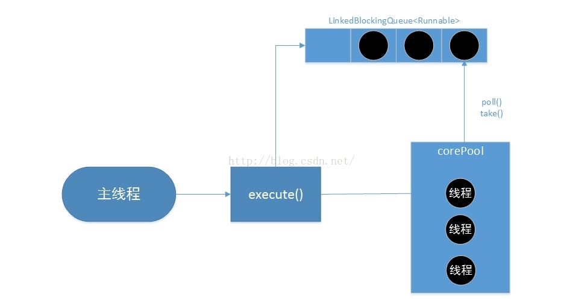
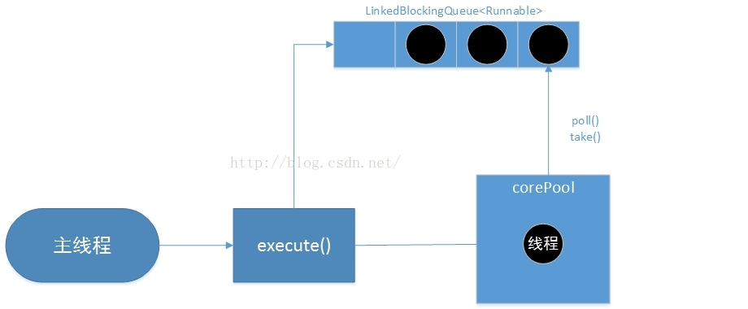
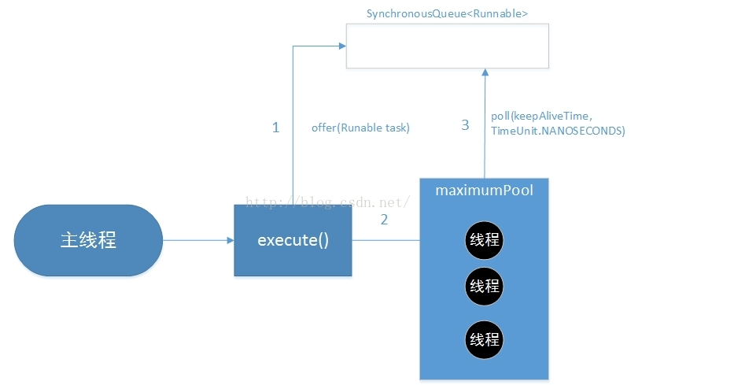

# Executor（线程池种类）
Executor 管理多个异步任务的执行，而无需程序员显式地管理线程的生命周期。这里的异步是指多个任务的执行互不干扰，不需要进行同步操作。

Executor 主要有三种(下面有每种线程池的详解)：
- CachedThreadPool：一个任务创建一个线程；
- FixedThreadPool：所有任务只能使用固定大小的线程池；
- SingleThreadExecutor：相当于大小为 1 的 FixedThreadPool。

```java
public static void main(String[] args) {
    ExecutorService executorService = Executors.newCachedThreadPool();
    for (int i = 0; i < 5; i++) {
        executorService.execute(new MyRunnable());
    }
    executorService.shutdown();
}
```
## 线程池(ThreadPoolExecutor)详解
Executors 工具类，可以为我们创建一个线程池，其本质就是 new 了一个 ThreadPoolExecutor 对象。

### 线程池创建
ThreadPoolExecutor参数最全的构造方法：
```java
public ThreadPoolExecutor(int corePoolSize,
                          int maximumPoolSize,
                          long keepAliveTime,
                          TimeUnit unit,
                          BlockingQueue<Runnable> workQueue,
                          ThreadFactory threadFactory,
                          RejectedExecutionHandler handler) {
}																
```
1. corePoolSize：线程池的核心线程数，说白了就是，即便是线程池里没有任何任务，也会有corePoolSize个线程在候着等任务。
2. maximumPoolSize:最大线程数，不管你提交多少任务，线程池里最多工作线程数就是maximumPoolSize。
3. keepAliveTime:线程的存活时间。当线程池里的线程数大于corePoolSize时，如果等了keepAliveTime时长还没有任务可执行，则线程退出。
4. unit：这个用来指定keepAliveTime的单位，比如秒:TimeUnit.SECONDS。
5. workQueue：一个阻塞队列，提交的任务将会被放到这个队列里。
6. threadFactory：线程工厂，用来创建线程，主要是为了给线程起名字，默认工厂的线程名字：pool-1-thread-3。
7. handler：拒绝策略，当线程池里线程被耗尽，且队列也满了的时候会调用。

### 线程池执行流程


当一个任务通过execute(Runnable)方法欲添加到线程池时：

	1. 如果此时线程池中的数量小于corePoolSize，即使线程池中的线程都处于空闲状态，也要创建新的线程来处理被添加的任务。
	2. 如果此时线程池中的数量等于 corePoolSize，但是缓冲队列 workQueue未满，那么任务被放入缓冲队列。
	3. 如果此时线程池中的数量大于corePoolSize，缓冲队列workQueue满，并且线程池中的数量小于maximumPoolSize，建新的线程来处理被添加的任务。
	4. 如果此时线程池中的数量大于corePoolSize，缓冲队列workQueue满，并且线程池中的数量等于maximumPoolSize，那么通过 handler所指定的策略来处理此任务,表示线程池拒绝接收任务。

### execute(Runnable command) 源码：
```java
int c = ctl.get();
// 1. 判断当前活跃线程数是否小于corePoolSize,如果小于，则调用addWorker创建线程执行任务
if (workerCountOf(c) < corePoolSize) {
    if (addWorker(command, true))
        return;
    c = ctl.get();
}
// 2. 如果不小于corePoolSize，则将任务添加到workQueue队列。
if (isRunning(c) && workQueue.offer(command)) {
    int recheck = ctl.get();
    if (! isRunning(recheck) && remove(command))
        reject(command);
    else if (workerCountOf(recheck) == 0)
        addWorker(null, false);
}
// 3. 如果放入workQueue失败，则创建线程执行任务，如果这时创建线程失败(当前线程数不小于
// maximumPoolSize时)，就会调用reject(内部调用handler)拒绝接受任务。
else if (!addWorker(command, false))
    reject(command);
```

### addWorker(Runnable firstTask, boolean core) 源码：
```java
private boolean addWorker(Runnable firstTask, boolean core) {
    retry:
    for (;;) {
        int c = ctl.get();
        int rs = runStateOf(c);

        // Check if queue empty only if necessary.
        if (rs >= SHUTDOWN &&
            ! (rs == SHUTDOWN &&
               firstTask == null &&
               ! workQueue.isEmpty()))
            return false;

        for (;;) {
            int wc = workerCountOf(c);
            // core 为 true 则能加入到线程池的数量限制为 corePoolSize,否则为 maximumPoolSize
            if (wc >= CAPACITY ||
                wc >= (core ? corePoolSize : maximumPoolSize))
                return false;

						// 这里可以看出，这里并不判断其他线程是不是空闲的，如果现在线程数少于 corePoolSize，就可以直接新建线程
            if (compareAndIncrementWorkerCount(c))	// cas 操作成功，进入下面的线程创建阶段
                break retry;
            c = ctl.get();  // Re-read ctl
            if (runStateOf(c) != rs)
                continue retry;
            // else CAS failed due to workerCount change; retry inner loop
        }
    }

    boolean workerStarted = false;
    boolean workerAdded = false;
    Worker w = null;
    try {
			// 新建线程用于执行任务
        w = new Worker(firstTask);
        final Thread t = w.thread;
        if (t != null) {
            final ReentrantLock mainLock = this.mainLock;
            mainLock.lock();
            try {
                // Recheck while holding lock.
                // Back out on ThreadFactory failure or if
                // shut down before lock acquired.
                int rs = runStateOf(ctl.get());

                if (rs < SHUTDOWN ||
                    (rs == SHUTDOWN && firstTask == null)) {
                    if (t.isAlive()) // precheck that t is startable
                        throw new IllegalThreadStateException();
                    workers.add(w);
                    int s = workers.size();
                    if (s > largestPoolSize)
                        largestPoolSize = s;
                    workerAdded = true;
                }
            } finally {
                mainLock.unlock();
            }
            if (workerAdded) {
                t.start();		// 启动线程
                workerStarted = true;
            }
        }
    } finally {
        if (! workerStarted)
            addWorkerFailed(w);
    }
    return workerStarted;
}
```

### Worker
可以看到在创建 Worker 时会调用 threadFactory 来创建一个线程。addWorker 的 t.start() 中启动一个线程就会触发Worker的run方法被线程调用。
```java
Worker(Runnable firstTask) {
    setState(-1); // inhibit interrupts until runWorker
    this.firstTask = firstTask;
    this.thread = getThreadFactory().newThread(this);		
}

/** Delegates main run loop to outer runWorker  */
public void run() {
    runWorker(this);																		// 2
}
```

### runWorker()
线程调用runWorker，会while循环调用getTask方法从workerQueue里读取任务，然后执行任务。只要getTask方法不返回null,此线程就不会退出。
```java
final void runWorker(Worker w) {
    Thread wt = Thread.currentThread();
    Runnable task = w.firstTask;
    w.firstTask = null;
    w.unlock(); // allow interrupts
    boolean completedAbruptly = true;
    try {
        while (task != null || (task = getTask()) != null) {
            w.lock();
            // If pool is stopping, ensure thread is interrupted;
            // if not, ensure thread is not interrupted.  This
            // requires a recheck in second case to deal with
            // shutdownNow race while clearing interrupt
            if ((runStateAtLeast(ctl.get(), STOP) ||
                 (Thread.interrupted() &&
                  runStateAtLeast(ctl.get(), STOP))) &&
                !wt.isInterrupted())
                wt.interrupt();
            try {
                beforeExecute(wt, task);
                Throwable thrown = null;
                try {
                    task.run();
                } catch (RuntimeException x) {
                    thrown = x; throw x;
                } catch (Error x) {
                    thrown = x; throw x;
                } catch (Throwable x) {
                    thrown = x; throw new Error(x);
                } finally {
                    afterExecute(task, thrown);
                }
            } finally {
                task = null;
                w.completedTasks++;
                w.unlock();
            }
        }
        completedAbruptly = false;
    } finally {
        processWorkerExit(w, completedAbruptly);
    }
}
```
### getTask()
```java
private Runnable getTask() {
    boolean timedOut = false; // Did the last poll() time out?

    for (;;) {
        int c = ctl.get();
        int rs = runStateOf(c);

        // Check if queue empty only if necessary.
        if (rs >= SHUTDOWN && (rs >= STOP || workQueue.isEmpty())) {
            decrementWorkerCount();
            return null;
        }

        int wc = workerCountOf(c);

        // allowCoreThreadTimeOut，这个变量默认值是false。wc>corePoolSize则是判断当前线程数是否大于corePoolSize。
        boolean timed = allowCoreThreadTimeOut || wc > corePoolSize;

        // 没有任务需要执行，workerCount - 1 并返回 null
        if ((wc > maximumPoolSize || (timed && timedOut))
            && (wc > 1 || workQueue.isEmpty())) {
            if (compareAndDecrementWorkerCount(c))
                return null;
            continue;
        }

        try {

				/* 如果当前线程数大于corePoolSize，则会调用workQueue的poll方法获取任务，超时时间是keepAliveTime。
           如果超过keepAliveTime时长，poll返回了null，上边提到的while循序就会退出，线程也就执行完了。

					如果当前线程数小于 corePoolSize，则会调用 workQueue 的 take() 方法阻塞在当前。
          注：take() 方法如果没有取到头部元素会阻塞
        */
            Runnable r = timed ?
                workQueue.poll(keepAliveTime, TimeUnit.NANOSECONDS) :
                workQueue.take();
            if (r != null)
                return r;
            timedOut = true;
        } catch (InterruptedException retry) {
            timedOut = false;
        }
    }
}
```

## 流程图

### FixedThreadPool
创建固定长度的线程池，每次提交任务创建一个线程，直到达到线程池的最大数量，线程池的大小不再变化。

这个线程池可以创建固定线程数的线程池。特点就是可以重用固定数量线程的线程池。它的构造源码如下：
```java
public static ExecutorService newFixedThreadPool(int nThreads) {
        return new ThreadPoolExecutor(nThreads, nThreads, 0L,
                                      TimeUnit.MILLISECONDS,
                                      new LinkedBlockingQueue<Runnable>());
}
```
-	FixedThreadPool的corePoolSize和maxiumPoolSize都被设置为创建FixedThreadPool时指定的参数nThreads。
-	0L则表示当线程池中的线程数量操作核心线程的数量时，多余的线程将被立即停止
-	最后一个参数表示FixedThreadPool使用了无界队列LinkedBlockingQueue作为线程池的做工队列，由于是无界的，当线程池的线程数达到corePoolSize后，新任务将在无界队列中等待，因此线程池的线程数量不会超过corePoolSize，同时maxiumPoolSize也就变成了一个无效的参数，并且运行中的线程池并不会拒绝任务。


执行过程如下：
1. 如果当前工作中的线程数量少于corePool的数量，就创建新的线程来执行任务。
2. 当线程池的工作中的线程数量达到了corePool，则将任务加入LinkedBlockingQueue。
3. 线程执行完1中的任务后会从队列中去任务。

注意LinkedBlockingQueue是无界队列，所以可以一直添加新任务到线程池。

### SingleThreadExecutor
SingleThreadExecutor是使用单个worker线程的Executor。特点是使用单个工作线程执行任务。它的构造源码如下：
```java
public static ExecutorService newSingleThreadExecutor() {
        return new FinalizableDelegatedExecutorService
            (new ThreadPoolExecutor(1, 1,
                                    0L, TimeUnit.MILLISECONDS,
                                    new LinkedBlockingQueue<Runnable>()));
}
```
SingleThreadExecutor的corePoolSize和maxiumPoolSize都被设置1。


执行过程如下：
1. 如果当前工作中的线程数量少于corePool的数量，就创建一个新的线程来执行任务。
2. 当线程池的工作中的线程数量达到了corePool，则将任务加入LinkedBlockingQueue。
3. 线程执行完1中的任务后会从队列中去任务。
注意：由于在线程池中只有一个工作线程，所以任务可以按照添加顺序执行。

### CachedThreadPool
CachedThreadPool是一个”无限“容量的线程池，它会根据需要创建新线程。特点是可以根据需要来创建新的线程执行任务，没有特定的corePool。下面是它的构造方法：
```java
public static ExecutorService newCachedThreadPool() {
        return new ThreadPoolExecutor(0, Integer.MAX_VALUE,
                                      60L, TimeUnit.SECONDS,
                                      new SynchronousQueue<Runnable>());
}
```
CachedThreadPool的corePoolSize被设置为0，即corePool为空；maximumPoolSize被设置为Integer.MAX_VALUE，即maximum是无界的。这里keepAliveTime设置为60秒，意味着空闲的线程最多可以等待任务60秒，否则将被回收。

CachedThreadPool使用没有容量的SynchronousQueue作为主线程池的工作队列，它是一个没有容量的阻塞队列。每个插入操作必须等待另一个线程的对应移除操作。这意味着，如果主线程提交任务的速度高于线程池中处理任务的速度时，CachedThreadPool会不断创建新线程。极端情况下，CachedThreadPool会因为创建过多线程而耗尽CPU资源。其运行图如下：


执行过程如下：
1. 首先执行SynchronousQueue.offer(Runnable task)。如果在当前的线程池中有空闲的线程正在执行SynchronousQueue.poll()，那么主线程执行的offer操作与空闲线程执行的poll操作配对成功，主线程把任务交给空闲线程执行。，execute()方法执行成功，否则执行步骤2
2. 当线程池为空(初始maximumPool为空)或没有空闲线程时，配对失败，将没有线程执行SynchronousQueue.poll操作，这个时候相当于任务并没有成功的加入到任务队列中（workQueue.offer(command) 返回 false）。这种情况下，线程池会创建一个新的线程执行任务。
3. 在创建完新的线程以后，将会执行poll操作。当步骤2的线程执行完成后，将等待60秒，如果此时主线程提交了一个新任务，那么这个空闲线程将执行新任务，否则被回收。因此长时间不提交任务的CachedThreadPool不会占用系统资源。
4. SynchronousQueue是一个不存储元素阻塞队列，每次要进行offer操作时必须等待poll操作，否则不能继续添加元素。

# 阻塞队列（runnableTaskQueue）
-	ArrayBlockingQueue:一个基于数组结构的有界阻塞队列，此队列按照先进先出原则对元素进行排序；
-	LinkedBlockingQueue:一个基于链表结构的阻塞队列，按照先进先出对元素进行排序。吞吐量通常要高于ArrayBlockingQueue。静态工厂方法Excutors.newFixedThreadPool()使用了这个队列；
-	SynchronousQueue:一个不存储元素的阻塞队列。每个插入操作必须等到另一个线程调用移除操作，否则插入操作一直处于阻塞状态。吞吐量要高于LinkedBlockingQueue。静态工厂方法Excutors.newCachedThreadPool()使用了这个队列；
-	PriorityBlockingQueue:一个具有优先级的无界阻塞队列。


# Daemon
守护线程是程序运行时在后台提供服务的线程，不属于程序中不可或缺的部分。

当所有非守护线程结束时，程序也就终止，同时会杀死所有守护线程。

main() 属于非守护线程。

使用 setDaemon() 方法将一个线程设置为守护线程。

```java
public static void main(String[] args) {
    Thread thread = new Thread(new MyRunnable());
    thread.setDaemon(true);
}
```

# sleep()
Thread.sleep(millisec) 方法会休眠当前正在执行的线程，millisec 单位为毫秒。

sleep() 可能会抛出 InterruptedException，因为异常不能跨线程传播回 main() 中，因此必须在本地进行处理。线程中抛出的其它异常也同样需要在本地进行处理。

```java
public void run() {
    try {
        Thread.sleep(3000);
    } catch (InterruptedException e) {
        e.printStackTrace();
    }
}
```

# yield()
对静态方法 Thread.yield() 的调用声明了当前线程已经完成了生命周期中最重要的部分，可以切换给其它线程来执行。该方法只是对线程调度器的一个建议，而且也只是建议具有相同优先级的其它线程可以运行。

 在 ConcurrentHashMap 1.8 中的 初始化过程中运用到了 yield()。
```java
public void run() {
    Thread.yield();
}
```

# 参考资料
- [线程池的工作原理与源码解读及各常用线程池的执行流程图](https://blog.csdn.net/lchq1995/article/details/85230399)
- [Java四种线程池](https://www.cnblogs.com/baizhanshi/p/5469948.html)
