<!-- TOC START min:1 max:3 link:true update:true -->
- [一、线程状态转换](#一线程状态转换)
	- [新建-New](#新建-new)
	- [可运行-Runnable](#可运行-runnable)
	- [阻塞-blocking](#阻塞-blocking)
	- [无限期等待-Waiting](#无限期等待-waiting)
	- [限期等待-Timed Waiting](#限期等待-timed-waiting)
	- [死亡-Terminated](#死亡-terminated)
- [二、使用线程](#二使用线程)
	- [run()和start()](#run和start)
	- [实现接口 VS 继承 Thread](#实现接口-vs-继承-thread)
	- [线程实现](#线程实现)
		- [使用内核线程实现](#使用内核线程实现)
		- [使用用户线程实现](#使用用户线程实现)
		- [使用用户线程加轻量级进程混合实现](#使用用户线程加轻量级进程混合实现)
		- [Java 线程的实现](#java-线程的实现)
- [三、线程机制](#三线程机制)
- [四、中断](#四中断)
	- [InterruptedException](#interruptedexception)
	- [interrupt()](#interrupt)
	- [Executor 的中断操作](#executor-的中断操作)
- [互斥同步](#互斥同步)
	- [volatile](#volatile)
	- [synchronized](#synchronized)
	- [ReentrantLock](#reentrantlock)
	- [比较](#比较)
		- [其他不同](#其他不同)
	- [synchronized, 偏向锁，轻量锁，重量级锁](#synchronized-偏向锁轻量锁重量级锁)
	- [公平锁和非公平锁](#公平锁和非公平锁)
		- [实现原理](#实现原理)
		- [公平锁示例](#公平锁示例)
		- [非公平锁示例](#非公平锁示例)
		- [优缺点](#优缺点)
	- [使用选择](#使用选择)
- [六、线程之间的协作](#六线程之间的协作)
	- [join()](#join)
	- [wait() notify() notifyAll()](#wait-notify-notifyall)
	- [await() signal() signalAll()](#await-signal-signalall)
- [七、J.U.C - AQS](#七juc---aqs)
	- [CountDownLatch](#countdownlatch)
	- [CyclicBarrier](#cyclicbarrier)
	- [Semaphore](#semaphore)
- [八、J.U.C - 其它组件](#八juc---其它组件)
	- [FutureTask](#futuretask)
	- [BlockingQueue](#blockingqueue)
	- [ForkJoin](#forkjoin)
- [九、线程不安全示例](#九线程不安全示例)
- [十、Java 内存模型](#十java-内存模型)
	- [主内存与工作内存](#主内存与工作内存)
	- [内存间交互操作](#内存间交互操作)
	- [内存模型三大特性](#内存模型三大特性)
		- [1. 原子性](#1-原子性)
		- [2. 可见性](#2-可见性)
		- [3. 有序性](#3-有序性)
	- [先行发生原则](#先行发生原则)
		- [1. 单一线程原则](#1-单一线程原则)
		- [2. 管程锁定规则](#2-管程锁定规则)
		- [3. volatile 变量规则](#3-volatile-变量规则)
		- [4. 线程启动规则](#4-线程启动规则)
		- [5. 线程加入规则](#5-线程加入规则)
		- [6. 线程中断规则](#6-线程中断规则)
		- [7. 对象终结规则](#7-对象终结规则)
		- [8. 传递性](#8-传递性)
- [十一、线程安全](#十一线程安全)
	- [不可变](#不可变)
	- [互斥同步](#互斥同步-1)
	- [非阻塞同步](#非阻塞同步)
		- [乐观锁和悲观锁](#乐观锁和悲观锁)
		- [1. CAS](#1-cas)
		- [2. AtomicInteger](#2-atomicinteger)
		- [3. ABA](#3-aba)
	- [无同步方案](#无同步方案)
		- [1. 栈封闭](#1-栈封闭)
		- [2. 线程本地存储（Thread Local Storage）](#2-线程本地存储thread-local-storage)
		- [3. 可重入代码（Reentrant Code）](#3-可重入代码reentrant-code)
- [十二、锁优化](#十二锁优化)
	- [自旋锁](#自旋锁)
	- [锁消除](#锁消除)
	- [锁粗化](#锁粗化)
	- [轻量级锁](#轻量级锁)
	- [偏向锁](#偏向锁)
- [十三、多线程开发良好的实践](#十三多线程开发良好的实践)

<!-- TOC END -->

**转载自[CyC2018](https://github.com/CyC2018/CS-Notes)的学习笔记**

# 一、线程状态转换


## 新建-New
创建后没有启动

## 可运行-Runnable
可能正在运行，也可能正在等待 CPU 时间片。

包含了操作系统线程状态中的 Running 和 Ready。

## 阻塞-blocking
等待获取一个排它锁，如果其线程释放了锁就会结束此状态。

## 无限期等待-Waiting
等待其它线程显式地唤醒，否则不会被分配 CPU 时间片。

## 限期等待-Timed Waiting
无需等待其它线程显式地唤醒，在一定时间之后会被系统自动唤醒。

调用 Thread.sleep() 方法使线程进入限期等待状态时，常常用“使一个线程睡眠”进行描述。

调用 Object.wait() 方法使线程进入限期等待或者无限期等待时，常常用“挂起一个线程”进行描述。

睡眠和挂起是用来描述行为，而阻塞和等待用来描述状态。

阻塞和等待的区别在于，阻塞是被动的，它是在等待获取一个排它锁。而等待是主动的，通过调用 Thread.sleep() 和 Object.wait() 等方法进入。

## 死亡-Terminated
可以是线程结束任务之后自己结束，或者产生了异常而结束。

# 二、使用线程
1. 继承Thread类，重写run
Thread本质上也是实现了Runnable接口的一个实例，它代表一个线程的实例，启动线程的唯一办法是通过Thread的start方法，这是一个native方法。
```java
class MyThread extends Thread{
	public void run{ System.out.println("Thread Body");}
}
public class Test{
	public static void main(String[] args){
		MyThread t = new MyThread();
		t.start();
	}
}
```
2. 实现Runnable接口，并实现run()方法
```java
class MyThread implements Runnable{
	public void run{ System.out.println("Thread Body");}
}
public class Test{
	public static void main(String[] args){
		MyThread t = new MyThread();
		Thread thread = new Thread(t);
		thread.start();
	}
}
```
不管是通过继承Thread类还是通过Runnable接口实现多线程方法，最终都是要通过调用Thread对象的API来控制线程。

3. 实现Callable接口，重写call()方法。
Callable接口实际是属于Executor框架中的功能类：
   1. Callable可以在任务结束后提供一个返回值，Runnable不行
   2. Callable中的call()可以抛出异常
   3. 运行Callable可以拿到一个Future对象，表示异步计算的结果，它提供了检查计算是否完成的方法。
	 可以使用Future监视目标线程调用call()方法的情况，当调用Future的get()方法获取结果，当前线程就会阻塞，直到call()方法结束返回结果。
```java
import java.util.concurrent.*;
public class CallableAndFuture{
//创建线程类
	public static class CallableTest implements Callable<String> {
		public String call() throws Exception{ return "Hello World";}
	}
	public static void main(String[] args){
		ExecutorService threadPool = Executor.newSingleThreadExecutor();
		//启动线程
		Future<String> future = threadPool.submit(new CallableTest());
		try{
			System.out.println(future.get());
		}catch(Exception e){
			e.printStackTrack();)
	}
}
}
```

## run()和start()
系统通过start()方法启动线程，此刻线程处于就绪状态，JVM调用run方法完成实际操作。   
如果直接调用线程类的run()方法，这会被当做一个普通的函数调用。

## 实现接口 VS 继承 Thread
实现接口会更好一些，因为：
  - Java 不支持多重继承，因此继承了 Thread 类就无法继承其它类，但是可以实现多个接口；
  - 类可能只要求可执行就行，继承整个 Thread 类开销过大。

## 线程实现
从底层角度来说，实现线程主要有3种方式：使用内核线程实现、使用用户线程实现和使用用户线程加轻
量级进程混合实现。

### 使用内核线程实现
内核线程（Kernel-Level Thread,KLT）就是直接由操作系统内核（Kernel，下称内核）支
持的线程，这种线程由内核来完成线程切换，内核通过操纵调度器（Scheduler）对线程进行
调度，并负责将线程的任务映射到各个处理器上。

程序一般使用内核线程的一种高级接口——轻量级进程（Light Weight Process,LWP），轻量级进程就是线程，
由于每个轻量级进程都由一个内核线程支持，因此只有先支持内核线程，才能有轻量级进程。这种轻量
级进程与内核线程之间1:1的关系称为一对一的线程模型。

<div align="center">  </div><br>

由于是基于内核线程实现的，所以各种线程操作，如创建、析构及同步，都需要
进行系统调用。而系统调用的代价相对较高，需要在用户态（User Mode）和内核态（Kernel
Mode）中来回切换。其次，每个轻量级进程都需要有一个内核线程的支持，因此轻量级进
程要消耗一定的内核资源（如内核线程的栈空间），因此一个系统支持轻量级进程的数量是
有限的。

### 使用用户线程实现
狭义上的用户线程指的是完全建立在用户空间的线程库上，系统内核不能感知线程存
在的实现。用户线程的建立、同步、销毁和调度完全在用户态中完成，不需要内核的帮助。
如果程序实现得当，这种线程不需要切换到内核态，因此操作可以是非常快速且低消耗的，
也可以支持规模更大的线程数量，部分高性能数据库中的多线程就是由用户线程实现的。这
种进程与用户线程之间1：N的关系称为一对多的线程模型。

<div align="center"> 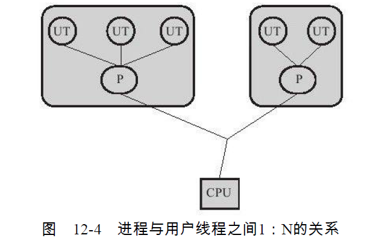 </div><br>

所有的线程操作都需要用户程序自己处理。线程的创建、切换和调度都是需要考虑的问题，而且
由于操作系统只把处理器资源分配到进程，那诸如“阻塞如何处理”、“多处理器系统中如何
将线程映射到其他处理器上”这类问题解决起来将会异常困难.

### 使用用户线程加轻量级进程混合实现
在这种混合实现下，既存在用户线程，也存在轻量级进程。用户线程还是完全建立在用户空间中，因此用户线程的创建、切换、析构等操作依然廉价，并且可以支持大规模的用户线程并发。而操作系统提供支持的轻量级进程则作为用户线程和内
核线程之间的桥梁，用户线程的系统调用要通过轻量级线程来完成，大大降低了整个进程被完全阻塞的风险。在这种混合模
式中，用户线程与轻量级进程的数量比是不定的，即为N：M的关系。

<div align="center"> 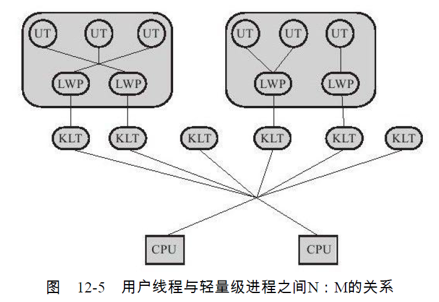 </div><br>

### Java 线程的实现
Java线程在JDK 1.2之前，是基于称为“绿色线程”（Green Threads）的用户线程实现的，
而在JDK 1.2中，线程模型替换为基于操作系统原生线程模型来实现。

操作系统支持怎样的线程模型，在很大程度上决定了Java虚拟机的线程是怎样映射
的，这点在不同的平台上没有办法达成一致。

对于Sun JDK来说，它的Windows版与Linux版都是使用一对一的线程模型实现的，一条
Java线程就映射到一条轻量级进程之中，因为Windows和Linux系统提供的线程模型就是一对
一的。

# 三、线程机制
[线程机制](./Java并发-线程机制.md)
内容偏多，新建一文介绍线程机制.

内容主要包括：线程池的种类，原理，阻塞队列，sleep(), yield()

# 四、中断
一个线程执行完毕之后会自动结束，如果在运行过程中发生异常也会提前结束
## InterruptedException
通过调用一个线程的 interrupt() 来中断该线程，如果该线程处于阻塞，等待的状态，就会抛出 InterruptedException，从而提前结束该线程，但是不能中断 I/O 阻塞和 synchronized 锁阻塞

对于以下代码，在 main() 中启动一个线程之后再中断它，由于线程中调用了 Thread.sleep() 方法，因此会抛出 InterruptedException，从而提前结束进程，不在执行后面的语句

```java
public class InterruptExample {
    private static class MyThread1 extends Thread {
        @Override
        public void run() {
            try {
                Thread.sleep(2000);
                System.out.println("Thread run");
            } catch (InterruptedException e) {
                e.printStackTrace();
            }
        }
    }
}

public static void main(String[] args) throws InterruptedException {
    Thread thread1 = new MyThread1();
    thread1.start();
    thread1.interrupt();
    System.out.println("Main run");
}
```
```text
Main run
java.lang.InterruptedException: sleep interrupted
    at java.lang.Thread.sleep(Native Method)
    at InterruptExample.lambda$main$0(InterruptExample.java:5)
    at InterruptExample$$Lambda$1/713338599.run(Unknown Source)
    at java.lang.Thread.run(Thread.java:745)
```

## interrupt()
如果一个线程的 run() 方法执行一个无限循环，并且没有执行 sleep() 等会抛出 InterruptedException 的操作，interrupt() 方法就无法使线程提前结束

但是调用 interrupt() 方法会设置线程的中断标记，此时调用 interrupt() 方法会返回 true。因此可以在循环体检查 interrupt() 方法来判断线程是否处于中断状态，从而提前结束线程。

```java
public class InterruptExample {
    private static class MyThread2 extends Thread {
        @Override
        public void run() {
            while (!interrupted()) {
                // ..
            }
            System.out.println("Thread end");
        }
    }
}

public static void main(String[] args) throws InterruptedException {
    Thread thread2 = new MyThread2();
    thread2.start();
    thread2.interrupt();
}
```
```text
Thread end
```

## Executor 的中断操作
调用 Executor 的 shutdown() 方法会等待线程都执行完毕之后再关闭，但是如果调用的是 shutdownNow() 方法，相当于调用每个线程的 interrupt() 方法
```java
public static void main(String[] args) {
    ExecutorService executorService = Executors.newCachedThreadPool();
    executorService.execute(() -> {
        try {
            Thread.sleep(2000);
            System.out.println("Thread run");
        } catch (InterruptedException e) {
            e.printStackTrace();
        }
    });
    executorService.shutdownNow();
    System.out.println("Main run");
}
```
```text
Main run
java.lang.InterruptedException: sleep interrupted
    at java.lang.Thread.sleep(Native Method)
    at ExecutorInterruptExample.lambda$main$0(ExecutorInterruptExample.java:9)
    at ExecutorInterruptExample$$Lambda$1/1160460865.run(Unknown Source)
    at java.util.concurrent.ThreadPoolExecutor.runWorker(ThreadPoolExecutor.java:1142)
    at java.util.concurrent.ThreadPoolExecutor$Worker.run(ThreadPoolExecutor.java:617)
    at java.lang.Thread.run(Thread.java:745)
```

如果只想中断 Executor 的一个线程，可以通过使用 **submit() 方法来提交一个线程，它会返回一个 Future<?> 对象，调用该对象的 cancel(true) 方法就可以中断线程**
```java
Future<?> future = executorService.submit(() -> {
    // ..
});
future.cancel(true);
```

# 互斥同步

## volatile
当一个变量被定义为 volatile 之后：
1. 保证此变量对所有线程的可见性，一个线程修改了这个变量，新值对于其他线程来说是可以立即得知的。普通
	变量的值在线程间传递需要通过主内存，即需要先写回主内存再读取。

2. 禁止指令重排序优化。例如：在 DCL（双锁检测）单例代码中，赋值 instance = new Single() 后会执行一个"lock addl $0x0,(%esp)"操作，作用相当于一个内存屏障（
	指重排序时不能把后面的指令重排序到内存屏障之前的位置），这个指令意思是本 CPU 的 cache 写入内存，引起别的 CPU 或者其他内核无效化其 Cache。
	达到 volatile 变量的修改对其他 CPU 立即可见的效果。

## synchronized
1. 同步一个代码块
	```java
	public void func() {
	  synchronized (this) {
	      // ...
	  }
	}
	```
	它只作用于同一个对象，如果调用两个对象上的同步代码，就不会进行同步。

	对于以下代码，ExecutorService 执行了两个线程，由于调用的是一个对象的同步块，因此会发生同步。

	```java
	public class SynchronizedExample {

	    public void func1() {
	        synchronized (this) {
	            for (int i = 0; i < 10; i++) {
	                System.out.print(i + " ");
	            }
	        }
	    }
	}

	public static void main(String[] args) {
    SynchronizedExample e1 = new SynchronizedExample();
    ExecutorService executorService = Executors.newCachedThreadPool();
    executorService.execute(() -> e1.func1());
    executorService.execute(() -> e1.func1());
	}
	```
	```text
	0 1 2 3 4 5 6 7 8 9 0 1 2 3 4 5 6 7 8 9
	```

	对于以下代码，两个线程调用了不同对象的同步代码块，因此两个线程就不要同步。
  ```java
	public static void main(String[] args) {
    SynchronizedExample e1 = new SynchronizedExample();
    SynchronizedExample e2 = new SynchronizedExample();
    ExecutorService executorService = Executors.newCachedThreadPool();
    executorService.execute(() -> e1.func1());
    executorService.execute(() -> e2.func1());
	}
	```
	```text
	0 0 1 1 2 2 3 3 4 4 5 5 6 6 7 7 8 8 9 9
	```
2. 同步一个方法
	```java
	public synchronized void func () {
    // ...
	}
	```
	它和同步代码块一样，**作用于同一个对象**。

3. 同步一个类
	```java
	public void func() {
    synchronized (SynchronizedExample.class) {
        // ...
    }
	}
	```
	作用于整个类，也就是说两个线程调用同一个类的不同对象的这种同步语句，也会进行同步。
	```java
	public class SynchronizedExample {

    public void func2() {
        synchronized (SynchronizedExample.class) {
            for (int i = 0; i < 10; i++) {
                System.out.print(i + " ");
            }
        }
    }
	}

	public static void main(String[] args) {
    SynchronizedExample e1 = new SynchronizedExample();
    SynchronizedExample e2 = new SynchronizedExample();
    ExecutorService executorService = Executors.newCachedThreadPool();
    executorService.execute(() -> e1.func2());
    executorService.execute(() -> e2.func2());
	}
	```
	```text
	0 1 2 3 4 5 6 7 8 9 0 1 2 3 4 5 6 7 8 9
	```

4. 同步一个静态方法
	**作用于整个类**。
	```java
	public synchronized static void fun() {
    // ...
	}
	```

## ReentrantLock
ReentrantLock 是 java.util.concurrent（J.U.C）包中的锁。
```java
/*  codes/edu/concurrent/lock/LockExample.java  */
public class LockExample {

    private Lock lock = new ReentrantLock();

    public void func() {
        lock.lock();
        try {
            for (int i = 0; i < 10; i++) {
                System.out.print(i + " ");
            }
        } finally {
            lock.unlock(); // 确保释放锁，从而避免发生死锁。
        }
    }
}

public static void main(String[] args) {
    LockExample lockExample = new LockExample();
    ExecutorService executorService = Executors.newCachedThreadPool();
    executorService.execute(() -> lockExample.func());
    executorService.execute(() -> lockExample.func());
}
```
```text
0 1 2 3 4 5 6 7 8 9 0 1 2 3 4 5 6 7 8 9
```

## 比较

**1. 锁的实现**

synchronized 是 JVM 实现的，而 ReentrantLock 是 JDK 实现的。

**2. 性能**

新版本 Java 对 synchronized 进行了很多优化，例如自旋锁等，synchronized 与 ReentrantLock 大致相同。

**3. 等待可中断**

当持有锁的线程长期不释放锁的时候，正在等待的线程可以选择放弃等待，改为处理其他事情。

ReentrantLock 可中断，而 synchronized 不行。

**4. 公平锁**

公平锁是指多个线程在等待同一个锁时，必须按照申请锁的时间顺序来依次获得锁。

synchronized 中的锁是非公平的，ReentrantLock 默认情况下也是非公平的，但是也可以是公平的。

**5. 锁绑定多个条件**

一个 ReentrantLock 可以同时绑定多个 Condition 对象。

### 其他不同
synchronized使用Object对象本身的notify，wait，notifyAll控制调度，而Lock主要通过Condition控制线程。区别主要有：
1. 用法不一样。synchronized既可以加到方法上，也可以在特定代码块中。Lock需要显式地指出起始位置。
2. 锁机制不一样。synchronized获得锁和释放的方式都是在块结构中，当获取多个锁时，必须以相反的顺序释放，并自动解锁。Lock需要开发人员手动释放锁，并且必须在finally中释放。Lock的tryLock()方法可以采用非阻塞的方式获取锁。

## synchronized, 偏向锁，轻量锁，重量级锁
[synchronized原理分析](https://segmentfault.com/a/1190000017255044)

[synchronized的源码分析](https://www.jianshu.com/p/c13c0a80dbca)

## 公平锁和非公平锁
公平锁就是保障了多线程下各线程获取锁的顺序，先到的线程优先获取锁，而非公平锁则无法提供这个保障。

### 实现原理
那如何能保证每个线程都能拿到锁呢，队列FIFO是一个完美的解决方案，也就是先进先出，java的ReenTrantLock也就是用队列实现的公平锁和非公平锁。

在公平的锁中，如果有另一个线程持有锁或者有其他线程在等待队列中等待这个所，那么新发出的请求的线程将被放入到队列中。而非公平锁上，只有当锁被某个线程持有时，新发出请求的线程才会被放入队列中（此时和公平锁是一样的）。所以，它们的差别在于非公平锁会有更多的机会去抢占锁。
```java
//非公平锁
final boolean nonfairTryAcquire(int acquires) {
	 final Thread current = Thread.currentThread();
	 int c = getState();
	 if (c == 0) {
		 //区别重点看这里
			 if (compareAndSetState(0, acquires)) {
					 setExclusiveOwnerThread(current);
					 return true;
			 }
	 }
	 else if (current == getExclusiveOwnerThread()) {
			 int nextc = c + acquires;
			 if (nextc < 0) // overflow
					 throw new Error("Maximum lock count exceeded");
			 setState(nextc);
			 return true;
	 }
	 return false;
}

//公平锁
protected final boolean tryAcquire(int acquires) {
	 final Thread current = Thread.currentThread();
	 int c = getState();
	 if (c == 0) {
		 //hasQueuedPredecessors这个方法就是最大区别所在
			 if (!hasQueuedPredecessors() &&
					 compareAndSetState(0, acquires)) {
					 setExclusiveOwnerThread(current);
					 return true;
			 }
	 }
	 else if (current == getExclusiveOwnerThread()) {
			 int nextc = c + acquires;
			 if (nextc < 0)
					 throw new Error("Maximum lock count exceeded");
			 setState(nextc);
			 return true;
	 }
	 return false;
}
// hasQueuedPredecessors的实现
public final boolean hasQueuedPredecessors() {
		Node t = tail; // Read fields in reverse initialization order
		Node h = head;
		Node s;
		return h != t &&
				((s = h.next) == null || s.thread != Thread.currentThread());
}
```
分析以上代码，我们可以看到公平锁就是在获取锁之前会先判断等待队列是否为空或者自己是否位于队列头部，该条件通过才能继续获取锁。

非公平锁的获取其实取决于 请求锁，释放锁和获取锁的先后顺序：
1. 若在释放锁的时候总是没有新的进程来进行 CAS 获取锁操作，该进程还是会被放到 队列末尾，则非公平锁等于公平锁；
2. 若释放锁的时候，正好一个进程来尝试获取锁，而此时位于队列头的进程还没有被唤醒（因为线程上下文切换是需要不少开销的），此时后来的进程则优先获得锁，成功打破公平，成为非公平锁；

其实对于非公平锁，只要线程进入了等待队列，队列里面依然是FIFO的原则，跟公平锁的顺序是一样的。因为公平锁与非公平锁的release()部分代码是共用AQS的代码。
```java
private void unparkSuccessor(Node node) {
    int ws = node.waitStatus;
    if (ws < 0)
        compareAndSetWaitStatus(node, ws, 0);
	 // 获取线程队列下一个节点
    Node s = node.next;
		// 这个 if 语句是当 s 为空或已取消，从后往前遍历队列唤醒等待队列中最前边的那个未放弃线程
    if (s == null || s.waitStatus > 0) {
        s = null;
        for (Node t = tail; t != null && t != node; t = t.prev)
            if (t.waitStatus <= 0)
                s = t;
    }
    if (s != null)
       //唤醒队列头的线程
        LockSupport.unpark(s.thread);
}
```
### 公平锁示例
```java
/*  codes/edu/concurrent/lock/MyFairLock.java  */
import java.util.concurrent.locks.ReentrantLock;
public class MyFairLock {
    /**
     *     true 表示 ReentrantLock 的公平锁，默认是 false
     */
    private  ReentrantLock lock = new ReentrantLock(true);

    public   void testFair(){
        try {
            lock.lock();
            System.out.println(Thread.currentThread().getName() +"获得了锁");
        }finally {
            lock.unlock();
        }
    }
    public static void main(String[] args) {
        MyFairLock fairLock = new MyFairLock();
        Runnable runnable = () -> {
            System.out.println(Thread.currentThread().getName()+"启动");
            fairLock.testFair();
        };
        Thread[] threadArray = new Thread[10];
        for (int i=0; i<10; i++) {
            threadArray[i] = new Thread(runnable);
        }
        for (int i=0; i<10; i++) {
            threadArray[i].start();
        }
    }
}
```
```TEXT
Thread-0启动
Thread-0获得了锁
Thread-1启动
Thread-1获得了锁
Thread-2启动
Thread-2获得了锁
Thread-3启动
Thread-3获得了锁
Thread-4启动
Thread-4获得了锁
Thread-5启动
Thread-5获得了锁

```
### 非公平锁示例
```java
/*  codes/edu/concurrent/lock/MyNonfairLock.java  */
public class MyNonfairLock {
    /**
     *     false 表示 ReentrantLock 的非公平锁
     */
    private  ReentrantLock lock = new ReentrantLock(false);

    public  void testFail(){
        try {
            lock.lock();
            System.out.println(Thread.currentThread().getName() +"获得了锁");
        }finally {
            lock.unlock();
        }
    }
    public static void main(String[] args) {
        MyNonfairLock nonfairLock = new MyNonfairLock();
        Runnable runnable = () -> {
            System.out.println(Thread.currentThread().getName()+"启动");
            nonfairLock.testFail();
        };
        Thread[] threadArray = new Thread[10];
        for (int i=0; i<10; i++) {
            threadArray[i] = new Thread(runnable);
        }
        for (int i=0; i<10; i++) {
            threadArray[i].start();
        }
    }
}
```
```TEXT
Thread-1启动
Thread-0启动
Thread-0获得了锁
Thread-1获得了锁
Thread-8启动
Thread-8获得了锁
Thread-3启动
Thread-3获得了锁
Thread-4启动
Thread-4获得了锁
```
### 优缺点
非公平锁性能高于公平锁性能。因为在恢复一个被挂起的线程与该线程真正运行之间存在着严重的延迟，非公平锁能更充分的利用cpu的时间片，尽量的减少cpu空闲的状态时间。

## synchronized 和 ReentrantLock 使用选择

除非需要使用 ReentrantLock 的高级功能，否则优先使用 synchronized。这是因为 synchronized 是 JVM 实现的一种锁机制，JVM 原生地支持它，而 ReentrantLock 不是所有的 JDK 版本都支持。并且使用 synchronized 不用担心没有释放锁而导致死锁问题，因为 JVM 会确保锁的释放。

# 六、线程之间的协作

当多个线程可以一起工作去解决某个问题时，如果某些部分必须在其它部分之前完成，那么就需要对线程进行协调。

## join()

在线程中调用另一个线程的 join() 方法，会将当前线程挂起，而不是忙等待，直到目标线程结束。

对于以下代码，虽然 b 线程先启动，但是因为在 b 线程中调用了 a 线程的 join() 方法，b 线程会等待 a 线程结束才继续执行，因此最后能够保证 a 线程的输出先于 b 线程的输出。

```java
public class JoinExample {

    private class A extends Thread {
        @Override
        public void run() {
            System.out.println("A");
        }
    }

    private class B extends Thread {

        private A a;

        B(A a) {
            this.a = a;
        }

        @Override
        public void run() {
            try {
                a.join();
            } catch (InterruptedException e) {
                e.printStackTrace();
            }
            System.out.println("B");
        }
    }

    public void test() {
        A a = new A();
        B b = new B(a);
        b.start();
        a.start();
    }
}
```

```java
public static void main(String[] args) {
    JoinExample example = new JoinExample();
    example.test();
}
```

```
A
B
```

## wait() notify() notifyAll()

调用 wait() 使得线程等待某个条件满足，线程在等待时会被挂起，当其他线程的运行使得这个条件满足时，其它线程会调用 notify() 或者 notifyAll() 来唤醒挂起的线程。

它们都属于 Object 的一部分，而不属于 Thread。

只能用在同步方法或者同步控制块中使用，否则会在运行时抛出 IllegalMonitorStateException。

使用 wait() 挂起期间，线程会释放锁。这是因为，如果没有释放锁，那么其它线程就无法进入对象的同步方法或者同步控制块中，那么就无法执行 notify() 或者 notifyAll() 来唤醒挂起的线程，造成死锁。

```java
public class WaitNotifyExample {

    public synchronized void before() {
        System.out.println("before");
        notifyAll();
    }

    public synchronized void after() {
        try {
            wait();
        } catch (InterruptedException e) {
            e.printStackTrace();
        }
        System.out.println("after");
    }
}
```

```java
public static void main(String[] args) {
    ExecutorService executorService = Executors.newCachedThreadPool();
    WaitNotifyExample example = new WaitNotifyExample();
    executorService.execute(() -> example.after());
    executorService.execute(() -> example.before());
}
```

```html
before
after
```

**wait() 和 sleep() 的区别**

- wait() 是 Object 的方法，而 sleep() 是 Thread 的静态方法；
- wait() 会释放锁，sleep() 不会。

## await() signal() signalAll()
java.util.concurrent 类库中提供了 Condition 类来实现线程之间的协调，可以在 Condition 上调用 await() 方法使线程等待，其它线程调用 signal() 或 signalAll() 方法唤醒等待的线程。

相比于 wait() 这种等待方式，await() 可以指定等待的条件，因此更加灵活。

使用 Lock 来获取一个 Condition 对象。
```java
/*  codes/edu/concurrent/lock/AwaitSignalExample.java  */
public class AwaitSignalExample {

    private Lock lock = new ReentrantLock();
    private Condition condition = lock.newCondition();

    public void before() {
        lock.lock();
        try {
            System.out.println("before");
            condition.signalAll();		// 唤醒等待的线程
        } finally {
            lock.unlock();
        }
    }

    public void after() {
        lock.lock();
        try {
            condition.await();				// 等待 condition 的 signal
            System.out.println("after");
        } catch (InterruptedException e) {
            e.printStackTrace();
        } finally {
            lock.unlock();
        }
    }
}
```

```java
public static void main(String[] args) {
    ExecutorService executorService = Executors.newCachedThreadPool();
    AwaitSignalExample example = new AwaitSignalExample();
    executorService.execute(() -> example.after());
    executorService.execute(() -> example.before());
}
```

```html
before
after
```

# 七、J.U.C - AQS

java.util.concurrent（J.U.C）大大提高了并发性能，AQS(AbstractQueuedSynchronizer) 被认为是 J.U.C 的核心。

## CountDownLatch

用来控制一个线程等待多个线程。

维护了一个计数器 cnt，每次调用 countDown() 方法会让计数器的值减 1，减到 0 的时候，那些因为调用 await() 方法而在等待的线程就会被唤醒。

<div align="center">  </div><br>

```java
/*  codes/edu/concurrent/aqs/CountdownLatchExample.java  */
public class CountdownLatchExample {
    public static void main(String[] args) throws InterruptedException {
        final int totalThread = 10;
        CountDownLatch countDownLatch = new CountDownLatch(totalThread);
        ExecutorService executorService = Executors.newCachedThreadPool();
        for (int i = 0; i < totalThread; i++) {
            executorService.execute(() -> {
                System.out.print("run..");
                countDownLatch.countDown();
            });
        }
        countDownLatch.await();
        System.out.println("end");
        executorService.shutdown();
    }
}
```

```html
run..run..run..run..run..run..run..run..run..run..end
```

## CyclicBarrier

用来控制多个线程互相等待，只有当多个线程都到达时，这些线程才会继续执行。

和 CountdownLatch 相似，都是通过维护计数器来实现的。线程执行 await() 方法之后计数器会减 1，并进行等待，直到计数器为 0，所有调用 await() 方法而在等待的线程才能继续执行。

CyclicBarrier 和 CountdownLatch 的一个区别是，CyclicBarrier 的计数器通过调用 reset() 方法可以循环使用，所以它才叫做循环屏障。

CyclicBarrier 有两个构造函数，其中 parties 指示计数器的初始值，barrierAction 在所有线程都到达屏障的时候会执行一次。

```java
public CyclicBarrier(int parties, Runnable barrierAction) {
    if (parties <= 0) throw new IllegalArgumentException();
    this.parties = parties;
    this.count = parties;
    this.barrierCommand = barrierAction;
}

public CyclicBarrier(int parties) {
    this(parties, null);
}
```

<div align="center">  </div><br>

```java
/*  codes/edu/concurrent/aqs/CyclicBarrierExample.java  */
public class CyclicBarrierExample {
    public static void main(String[] args) {
        final int totalThread = 10;
        CyclicBarrier cyclicBarrier = new CyclicBarrier(totalThread);
        ExecutorService executorService = Executors.newCachedThreadPool();
        for (int i = 0; i < totalThread; i++) {
            executorService.execute(() -> {
                System.out.print("before..");
                try {
                    cyclicBarrier.await();
                } catch (InterruptedException | BrokenBarrierException e) {
                    e.printStackTrace();
                }
                System.out.print("after..");
            });
        }
        executorService.shutdown();
    }
}
```

```html
before..before..before..before..before..before..before..before..before..before..after..after..after..after..after..after..after..after..after..after..
```

## Semaphore

Semaphore 类似于操作系统中的信号量，可以控制对互斥资源的访问线程数。

以下代码模拟了对某个服务的并发请求，每次只能有 3 个客户端同时访问，请求总数为 10。

```java
/*  codes/edu/concurrent/aqs/SemaphoreExample.java  */
public class SemaphoreExample {
    public static void main(String[] args) {
        final int clientCount = 3;
        final int totalRequestCount = 10;
        Semaphore semaphore = new Semaphore(clientCount);
        ExecutorService executorService = Executors.newCachedThreadPool();
        for (int i = 0; i < totalRequestCount; i++) {
            executorService.execute(()->{
                try {
                    semaphore.acquire();
                    System.out.print(semaphore.availablePermits() + " ");
                } catch (InterruptedException e) {
                    e.printStackTrace();
                } finally {
                    semaphore.release();
                }
            });
        }
        executorService.shutdown();
    }
}
```

```html
2 1 2 2 2 2 2 1 2 2
```

# 八、J.U.C - 其它组件

## FutureTask

在介绍 Callable 时我们知道它可以有返回值，返回值通过 Future<V> 进行封装。FutureTask 实现了 RunnableFuture 接口，该接口继承自 Runnable 和 Future<V> 接口，这使得 FutureTask 既可以当做一个任务执行，也可以有返回值。

```java
public class FutureTask<V> implements RunnableFuture<V>
{}
```

```java
public interface RunnableFuture<V> extends Runnable, Future<V>
{}
```

FutureTask 可用于异步获取执行结果或取消执行任务的场景。当一个计算任务需要执行很长时间，那么就可以用 FutureTask 来封装这个任务，主线程在完成自己的任务之后再去获取结果。

```java
/*  codes/edu/concurrent/aqs/FutureTaskExample.java  */
public class FutureTaskExample {
  public class FutureTaskExample {
  public static void main(String[] args) throws Exception {
    FutureTask<Integer> futureTask = new FutureTask<>(new Callable<Integer>() {
      @Override
      public Integer call() throws Exception {
        int result = 0;
        for(int i = 0; i < 100; i++){
					result += i;
					Thread.sleep(10);
				}
				return result;
			}
		});

		Thread computer = new Thread(futureTask);
		computer.start();
    while(!futureTask.isDone()){
			System.out.println("Processing...");
			Thread.sleep(1000);
		}
		System.out.println("Finish, result = " + futureTask.get());
	}
}
}
```

```html
Processing...
Processing...
Finish, result = 4950
```

## BlockingQueue

java.util.concurrent.BlockingQueue 接口有以下阻塞队列的实现：

-  **FIFO 队列** ：LinkedBlockingQueue、ArrayBlockingQueue（固定长度）
-  **优先级队列** ：PriorityBlockingQueue

提供了阻塞的 take() 和 put() 方法：如果队列为空 take() 将阻塞，直到队列中有内容；如果队列为满 put() 将阻塞，直到队列有空闲位置。

**使用 BlockingQueue 实现生产者消费者问题**

```java
/*  codes/edu/concurrent/aqs/ProducerConsumer.java  */
public class ProducerConsumer {

    private static BlockingQueue<String> queue = new ArrayBlockingQueue<>(5);

    private static class Producer extends Thread {
        @Override
        public void run() {
            try {
                queue.put("product");
            } catch (InterruptedException e) {
                e.printStackTrace();
            }
            System.out.print("produce..");
        }
    }

    private static class Consumer extends Thread {

        @Override
        public void run() {
            try {
                String product = queue.take();
            } catch (InterruptedException e) {
                e.printStackTrace();
            }
            System.out.print("consume..");
        }
    }
}
```

```java
public static void main(String[] args) {
    for (int i = 0; i < 2; i++) {
        Producer producer = new Producer();
        producer.start();
    }
    for (int i = 0; i < 5; i++) {
        Consumer consumer = new Consumer();
        consumer.start();
    }
    for (int i = 0; i < 3; i++) {
        Producer producer = new Producer();
        producer.start();
    }
}
```

```html
produce..produce..consume..consume..produce..consume..produce..consume..produce..consume..
```

## ForkJoin

主要用于并行计算中，和 MapReduce 原理类似，都是把大的计算任务拆分成多个小任务并行计算。

```java
/*  codes/edu/concurrent/aqs/ForkJoinExample.java  */

public class ForkJoinExample extends RecursiveTask<Integer> {

    private final int threshold = 5;
    private int first;
    private int last;

    public ForkJoinExample(int first, int last) {
        this.first = first;
        this.last = last;
    }

    @Override
    protected Integer compute() {
        int result = 0;
        if (last - first <= threshold) {
            // 任务足够小则直接计算
            for (int i = first; i <= last; i++) {
                result += i;
            }
        } else {
            // 拆分成小任务
            int middle = first + (last - first) / 2;
            ForkJoinExample leftTask = new ForkJoinExample(first, middle);
            ForkJoinExample rightTask = new ForkJoinExample(middle + 1, last);
            leftTask.fork();
            rightTask.fork();
            result = leftTask.join() + rightTask.join();
        }
        return result;
    }
}
```

```java
public static void main(String[] args) throws ExecutionException, InterruptedException {
    ForkJoinExample example = new ForkJoinExample(1, 10000);
    ForkJoinPool forkJoinPool = new ForkJoinPool();
    Future result = forkJoinPool.submit(example);
    System.out.println(result.get());
}
```

ForkJoin 使用 ForkJoinPool 来启动，它是一个特殊的线程池，线程数量取决于 CPU 核数。

```java
public class ForkJoinPool extends AbstractExecutorService
{}
```

ForkJoinPool 实现了工作窃取算法来提高 CPU 的利用率。每个线程都维护了一个双端队列，用来存储需要执行的任务。工作窃取算法允许空闲的线程从其它线程的双端队列中窃取一个任务来执行。窃取的任务必须是最晚的任务，避免和队列所属线程发生竞争。例如下图中，Thread2 从 Thread1 的队列中拿出最晚的 Task1 任务，Thread1 会拿出 Task2 来执行，这样就避免发生竞争。但是如果队列中只有一个任务时还是会发生竞争。

<div align="center">  </div><br>

# 九、线程不安全示例

如果多个线程对同一个共享数据进行访问而不采取同步操作的话，那么操作的结果是不一致的。

以下代码演示了 1000 个线程同时对 cnt 执行自增操作，操作结束之后它的值有可能小于 1000。

```java
public class ThreadUnsafeExample {

    private int cnt = 0;

    public void add() {
        cnt++;
    }

    public int get() {
        return cnt;
    }
}
```

```java
public static void main(String[] args) throws InterruptedException {
    final int threadSize = 1000;
    ThreadUnsafeExample example = new ThreadUnsafeExample();
    final CountDownLatch countDownLatch = new CountDownLatch(threadSize);
    ExecutorService executorService = Executors.newCachedThreadPool();
    for (int i = 0; i < threadSize; i++) {
        executorService.execute(() -> {
            example.add();
            countDownLatch.countDown();
        });
    }
    countDownLatch.await();
    executorService.shutdown();
    System.out.println(example.get());
}
```

```html
997
```

# 十、Java 内存模型

Java 内存模型试图屏蔽各种硬件和操作系统的内存访问差异，以实现让 Java 程序在各种平台下都能达到一致的内存访问效果。

## 主内存与工作内存

处理器上的寄存器的读写的速度比内存快几个数量级，为了解决这种速度矛盾，在它们之间加入了高速缓存。

加入高速缓存带来了一个新的问题：缓存一致性。如果多个缓存共享同一块主内存区域，那么多个缓存的数据可能会不一致，需要一些协议来解决这个问题。

<div align="center"> 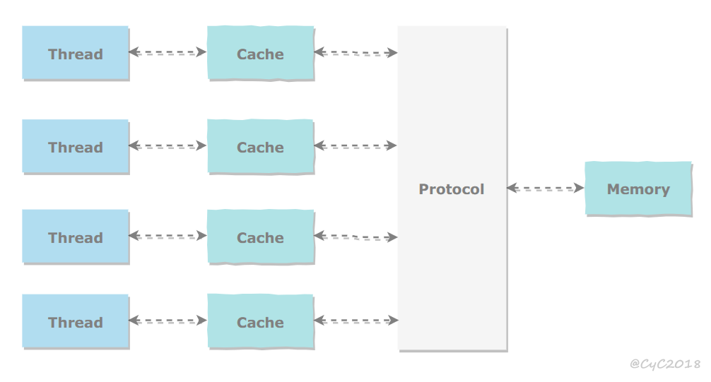 </div><br>

所有的变量都存储在主内存中，每个线程还有自己的工作内存，工作内存存储在高速缓存或者寄存器中，保存了该线程使用的变量的主内存副本拷贝。

线程只能直接操作工作内存中的变量，不同线程之间的变量值传递需要通过主内存来完成。

<div align="center"> 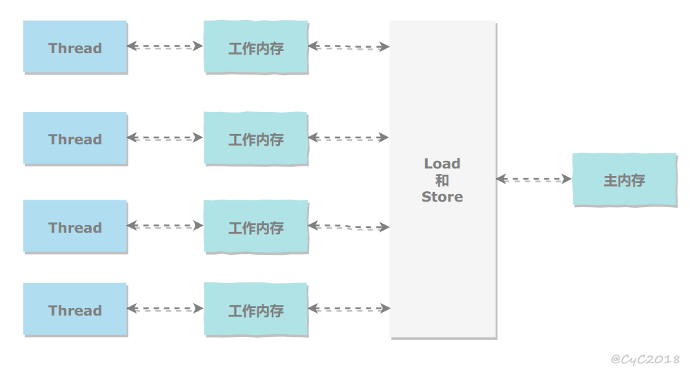 </div><br>

## 内存间交互操作

Java 内存模型定义了 8 个操作来完成主内存和工作内存的交互操作。

<div align="center">  </div><br>

- read：把一个变量的值从主内存传输到工作内存中
- load：在 read 之后执行，把 read 得到的值放入工作内存的变量副本中
- use：把工作内存中一个变量的值传递给执行引擎
- assign：把一个从执行引擎接收到的值赋给工作内存的变量
- store：把工作内存的一个变量的值传送到主内存中
- write：在 store 之后执行，把 store 得到的值放入主内存的变量中
- lock：作用于主内存的变量，它把一个变量标识为一个线程独占状态
- unlock：作用于主内存的变量，它把一个处于锁定状态的变量释放出来，释放
后的变量才可以被其他线程锁定。

## 内存模型三大特性

### 1. 原子性

Java 内存模型保证了 read、load、use、assign、store、write、lock 和 unlock 操作具有原子性，例如对一个 int 类型的变量执行 assign 赋值操作，这个操作就是原子性的。但是 Java 内存模型允许虚拟机将没有被 volatile 修饰的 64 位数据（long，double）的读写操作划分为两次 32 位的操作来进行，即 load、store、read 和 write 操作可以不具备原子性。

有一个错误认识就是，int 等原子性的类型在多线程环境中不会出现线程安全问题。前面的线程不安全示例代码中，cnt 属于 int 类型变量，1000 个线程对它进行自增操作之后，得到的值为 997 而不是 1000。

为了方便讨论，将内存间的交互操作简化为 3 个：load、assign、store。

下图演示了两个线程同时对 cnt 进行操作，load、assign、store 这一系列操作整体上看不具备原子性，那么在 T1 修改 cnt 并且还没有将修改后的值写入主内存，T2 依然可以读入旧值。可以看出，这两个线程虽然执行了两次自增运算，但是主内存中 cnt 的值最后为 1 而不是 2。因此对 int 类型读写操作满足原子性只是说明 load、assign、store 这些单个操作具备原子性。

<div align="center"> 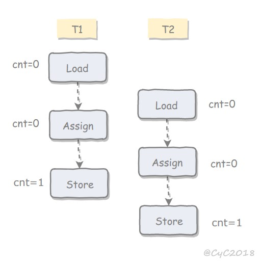 </div><br>

AtomicInteger 能保证多个线程修改的原子性。

<div align="center"> 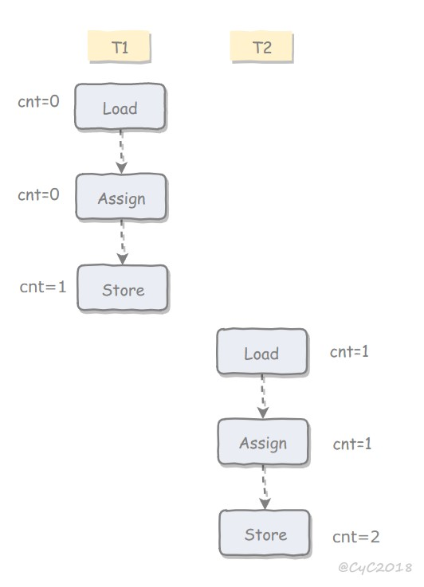 </div><br>

使用 AtomicInteger 重写之前线程不安全的代码之后得到以下线程安全实现：

```java
public class AtomicExample {
    private AtomicInteger cnt = new AtomicInteger();

    public void add() {
        cnt.incrementAndGet();
    }

    public int get() {
        return cnt.get();
    }
}
```

```java
public static void main(String[] args) throws InterruptedException {
    final int threadSize = 1000;
    AtomicExample example = new AtomicExample(); // 只修改这条语句
    final CountDownLatch countDownLatch = new CountDownLatch(threadSize);
    ExecutorService executorService = Executors.newCachedThreadPool();
    for (int i = 0; i < threadSize; i++) {
        executorService.execute(() -> {
            example.add();
            countDownLatch.countDown();
        });
    }
    countDownLatch.await();
    executorService.shutdown();
    System.out.println(example.get());
}
```

```html
1000
```

除了使用原子类之外，也可以使用 synchronized 互斥锁来保证操作的原子性。它对应的内存间交互操作为：lock 和 unlock，在虚拟机实现上对应的字节码指令为 monitorenter 和 monitorexit。

```java
public class AtomicSynchronizedExample {
    private int cnt = 0;

    public synchronized void add() {
        cnt++;
    }

    public synchronized int get() {
        return cnt;
    }
}
```

```java
public static void main(String[] args) throws InterruptedException {
    final int threadSize = 1000;
    AtomicSynchronizedExample example = new AtomicSynchronizedExample();
    final CountDownLatch countDownLatch = new CountDownLatch(threadSize);
    ExecutorService executorService = Executors.newCachedThreadPool();
    for (int i = 0; i < threadSize; i++) {
        executorService.execute(() -> {
            example.add();
            countDownLatch.countDown();
        });
    }
    countDownLatch.await();
    executorService.shutdown();
    System.out.println(example.get());
}
```

```html
1000
```

### 2. 可见性

可见性指当一个线程修改了共享变量的值，其它线程能够立即得知这个修改。Java 内存模型是通过在变量修改后将新值同步回主内存，在变量读取前从主内存刷新变量值来实现可见性的，这对于普通变量还是 volatile 变量都是如此，区别是 volatile 的特殊规章保证了新值能立即同步到主内存。

主要有有三种实现可见性的方式：

- volatile
- synchronized，对一个变量执行 unlock 操作之前，必须把变量值同步回主内存。
- final，被 final 关键字修饰的字段在构造器中一旦初始化完成，并且没有发生 this 逃逸（其它线程通过 this 引用访问到初始化了一半的对象），那么其它线程就能看见 final 字段的值。

**对前面的线程不安全示例中的 cnt 变量使用 volatile 修饰，不能解决线程不安全问题，因为 volatile 并不能保证操作的原子性。**

### 3. 有序性

有序性是指：在本线程内观察，所有操作都是有序的。在一个线程观察另一个线程，所有操作都是无序的，无序是因为发生了指令重排序。在 Java 内存模型中，允许编译器和处理器对指令进行重排序，重排序过程不会影响到单线程程序的执行，却会影响到多线程并发执行的正确性。

volatile 关键字通过添加内存屏障的方式来禁止指令重排，即重排序时不能把后面的指令放到内存屏障之前。

也可以通过 synchronized 来保证有序性，它保证每个时刻只有一个线程执行同步代码，相当于是让线程顺序执行同步代码。

## 先行发生原则

上面提到了可以用 volatile 和 synchronized 来保证有序性。除此之外，JVM 还规定了先行发生原则，让一个操作无需控制就能先于另一个操作完成，它是判断数据是否存在竞争，线程是否安全的主要依据。

### 1. 单一线程原则

> Single Thread rule

在一个线程内，在程序前面的操作先行发生于后面的操作。

<div align="center"> 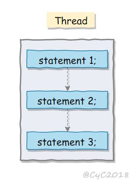 </div><br>

### 2. 管程锁定规则

> Monitor Lock Rule

一个 unlock 操作先行发生于后面对同一个锁的 lock 操作。

<div align="center">  </div><br>

### 3. volatile 变量规则

> Volatile Variable Rule

对一个 volatile 变量的写操作先行发生于后面对这个变量的读操作。

<div align="center">  </div><br>

### 4. 线程启动规则

> Thread Start Rule

Thread 对象的 start() 方法调用先行发生于此线程的每一个动作。

<div align="center"> 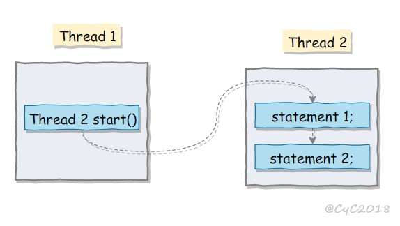 </div><br>

### 5. 线程加入规则

> Thread Join Rule

Thread 对象的结束先行发生于 join() 方法返回。

<div align="center"> 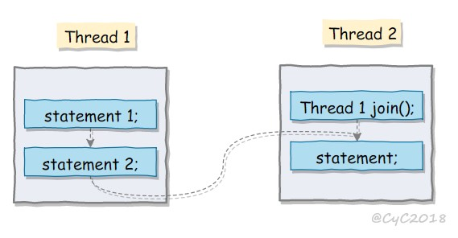 </div><br>

### 6. 线程中断规则

> Thread Interruption Rule

对线程 interrupt() 方法的调用先行发生于被中断线程的代码检测到中断事件的发生，可以通过 interrupted() 方法检测到是否有中断发生。

### 7. 对象终结规则

> Finalizer Rule

一个对象的初始化完成（构造函数执行结束）先行发生于它的 finalize() 方法的开始。

### 8. 传递性

> Transitivity

如果操作 A 先行发生于操作 B，操作 B 先行发生于操作 C，那么操作 A 先行发生于操作 C。

# 十一、线程安全

多个线程不管以何种方式访问某个类，并且在主调代码中不需要进行同步，都能表现正确的行为。

线程安全有以下几种实现方式：

## 不可变

不可变（Immutable）的对象一定是线程安全的，不需要再采取任何的线程安全保障措施。只要一个不可变的对象被正确地构建出来，永远也不会看到它在多个线程之中处于不一致的状态。多线程环境下，应当尽量使对象成为不可变，来满足线程安全。

不可变的类型：

- final 关键字修饰的基本数据类型
- String
- 枚举类型
- Number 部分子类，如 Long 和 Double 等数值包装类型，BigInteger 和 BigDecimal 等大数据类型。但同为 Number 的原子类 AtomicInteger 和 AtomicLong 则是可变的。

对于集合类型，可以使用 Collections.unmodifiableXXX() 方法来获取一个不可变的集合。

```java
public class ImmutableExample {
    public static void main(String[] args) {
        Map<String, Integer> map = new HashMap<>();
        Map<String, Integer> unmodifiableMap = Collections.unmodifiableMap(map);
        unmodifiableMap.put("a", 1);
    }
}
```

```html
Exception in thread "main" java.lang.UnsupportedOperationException
    at java.util.Collections$UnmodifiableMap.put(Collections.java:1457)
    at ImmutableExample.main(ImmutableExample.java:9)
```

Collections.unmodifiableXXX() 先对原始的集合进行拷贝，需要对集合进行修改的方法都直接抛出异常。

```java
public V put(K key, V value) {
    throw new UnsupportedOperationException();
}
```

## 互斥同步

互斥同步最主要的问题就是线程阻塞和唤醒所带来的性能问题，因此这种同步也称为阻塞同步。

互斥同步属于一种悲观的并发策略，总是认为只要不去做正确的同步措施，那就肯定会出现问题。无论共享数据是否真的会出现竞争，它都要进行加锁（这里讨论的是概念模型，实际上虚拟机会优化掉很大一部分不必要的加锁）、用户态核心态转换、维护锁计数器和检查是否有被阻塞的线程需要唤醒等操作。

Java 中的互斥同步就是 synchronized 和 ReentrantLock。

## 非阻塞同步

### 乐观锁和悲观锁

#### 悲观锁
总是假设最坏的情况，每次去拿数据的时候都认为别人会修改，所以每次在拿数据的时候都会上锁，这样别人想拿这个数据就会阻塞直到它拿到锁（共享资源每次只给一个线程使用，其它线程阻塞，用完后再把资源转让给其它线程）。传统的关系型数据库里边就用到了很多这种锁机制，比如行锁，表锁等，读锁，写锁等，都是在做操作之前先上锁。Java中synchronized和ReentrantLock等独占锁就是悲观锁思想的实现。

#### 乐观锁
总是假设最好的情况，每次去拿数据的时候都认为别人不会修改，所以不会上锁，但是在更新的时候会判断一下在此期间别人有没有去更新这个数据，可以使用版本号机制和CAS算法实现。乐观锁适用于多读的应用类型，这样可以提高吞吐量，像数据库提供的类似于write_condition机制，其实都是提供的乐观锁。在Java中java.util.concurrent.atomic包下面的原子变量类就是使用了乐观锁的一种实现方式CAS实现的。

#### 两种锁的使用场景
从上面对两种锁的介绍，我们知道两种锁各有优缺点，不可认为一种好于另一种，像乐观锁适用于写比较少的情况下（多读场景），即冲突真的很少发生的时候，这样可以省去了锁的开销，加大了系统的整个吞吐量。但如果是多写的情况，一般会经常产生冲突，这就会导致上层应用会不断的进行retry，这样反倒是降低了性能，所以一般多写的场景下用悲观锁就比较合适。

#### 乐观锁常见的两种实现方式
乐观锁一般会使用版本号机制（参考MySQL的MVCC）或CAS算法实现。

### 1. CAS

随着硬件指令集的发展，我们可以使用基于冲突检测的乐观并发策略：先进行操作，如果没有其它线程争用共享数据，那操作就成功了，否则采取补偿措施（不断地重试，直到成功为止）。这种乐观的并发策略的许多实现都不需要将线程阻塞，因此这种同步操作称为非阻塞同步。

乐观锁需要操作和冲突检测这两个步骤具备原子性，这里就不能再使用互斥同步来保证了，只能靠硬件来完成。硬件支持的原子性操作最典型的是：比较并交换（Compare-and-Swap，CAS）。CAS 指令需要有 3 个操作数，分别是内存地址 V、旧的预期值 A 和新值 B。当执行操作时，只有当 V 的值等于 A，才将 V 的值更新为 B。

### 2. AtomicInteger

J.U.C 包里面的整数原子类 AtomicInteger 的方法调用了 Unsafe 类的 CAS 操作。

以下代码使用了 AtomicInteger 执行了自增的操作。

```java
private AtomicInteger cnt = new AtomicInteger();

public void add() {
    cnt.incrementAndGet();
}
```
一下代码是 AtomicInteger 的源码：
```java
public class AtomicInteger extends Number implements java.io.Serializable {
    // setup to use Unsafe.compareAndSwapInt for updates
    private static final Unsafe unsafe = Unsafe.getUnsafe();
    private static final long valueOffset;

    static {
        try {
            valueOffset = unsafe.objectFieldOffset
                (AtomicInteger.class.getDeclaredField("value"));
        } catch (Exception ex) { throw new Error(ex); }
    }

    private volatile int value;
    public final int get() {return value;}
}
```
1. Unsafe，是CAS的核心类，由于Java方法无法直接访问底层系统，需要通过本地（native）方法来访问，Unsafe相当于一个后门，基于该类可以直接操作特定内存的数据。
2. 变量 valueOffset，表示该变量值在内存中的偏移地址，因为Unsafe就是根据内存偏移地址获取数据的。
3. 变量 value 用 volatile 修饰，保证了多线程之间的内存可见性。

以下代码是 incrementAndGet() 的源码，它调用了 Unsafe 的 getAndAddInt() 。

```java
public final int incrementAndGet() {
    return unsafe.getAndAddInt(this, valueOffset, 1);
}
```

以下代码是 getAndAddInt() 源码，var1 指示对象内存地址，var2 指示该字段相对对象内存地址的偏移，var4 指示操作需要加的数值，这里为 1。通过 getIntVolatile(var1, var2) 得到旧的预期值，通过调用 compareAndSwapInt() 来进行 CAS 比较，如果该字段内存地址中的值等于 var5，那么就更新内存地址为 var1+var2 的变量为 var5+var4。

可以看到 getAndAddInt() 在一个循环中进行，发生冲突的做法是不断的进行重试。

```java
public final int getAndAddInt(Object var1, long var2, int var4) {
    int var5;
    do {
        var5 = this.getIntVolatile(var1, var2);
    } while(!this.compareAndSwapInt(var1, var2, var5, var5 + var4));

    return var5;
}
```
假设线程A和线程B同时执行getAndAdd操作（分别跑在不同CPU上）：
	1. AtomicInteger里面的value原始值为3，即主内存中AtomicInteger的value为3，根据Java内存模型，线程A和线程B各自持有一份value的副本，值为3。
	2. 线程A通过getIntVolatile(var1, var2)拿到value值3，这时线程A被挂起。
	3. 线程B也通过getIntVolatile(var1, var2)方法获取到value值3，运气好，线程B没有被挂起，并执行compareAndSwapInt方法比较内存值也为3，成功修改内存值为2。
	4. 这时线程A恢复，执行compareAndSwapInt方法比较，发现自己手里的值(3)和内存的值(2)不一致，说明该值已经被其它线程提前修改过了，那只能重新来一遍了。
	5. 重新获取value值，因为变量value被volatile修饰，所以其它线程对它的修改，线程A总是能够看到，线程A继续执行compareAndSwapInt进行比较替换，直到成功。

### 3. ABA

如果一个变量初次读取的时候是 A 值，它的值被改成了 B，后来又被改回为 A，那 CAS 操作就会误认为它从来没有被改变过。

J.U.C 包提供了一个带有标记的原子引用类 AtomicStampedReference 来解决这个问题，它可以通过控制变量值的版本来保证 CAS 的正确性。大部分情况下 ABA 问题不会影响程序并发的正确性，如果需要解决 ABA 问题，改用传统的互斥同步可能会比原子类更高效。

## 无同步方案

要保证线程安全，并不是一定就要进行同步。如果一个方法本来就不涉及共享数据，那它自然就无须任何同步措施去保证正确性。

### 1. 栈封闭

多个线程访问同一个方法的局部变量时，不会出现线程安全问题，因为局部变量存储在虚拟机栈中，属于线程私有的。

```java
public class StackClosedExample {
    public void add100() {
        int cnt = 0;
        for (int i = 0; i < 100; i++) {
            cnt++;
        }
        System.out.println(cnt);
    }
}
```

```java
public static void main(String[] args) {
    StackClosedExample example = new StackClosedExample();
    ExecutorService executorService = Executors.newCachedThreadPool();
    executorService.execute(() -> example.add100());
    executorService.execute(() -> example.add100());
    executorService.shutdown();
}
```

```html
100
100
```

### 2. 线程本地存储（Thread Local Storage）

如果一段代码中所需要的数据必须与其他代码共享，那就看看这些共享数据的代码是否能保证在同一个线程中执行。如果能保证，我们就可以把共享数据的可见范围限制在同一个线程之内，这样，无须同步也能保证线程之间不出现数据争用的问题。

符合这种特点的应用并不少见，大部分使用消费队列的架构模式（如“生产者-消费者”模式）都会将产品的消费过程尽量在一个线程中消费完。其中最重要的一个应用实例就是经典 Web 交互模型中的“一个请求对应一个服务器线程”（Thread-per-Request）的处理方式，这种处理方式的广泛应用使得很多 Web 服务端应用都可以使用线程本地存储来解决线程安全问题。

可以使用 java.lang.ThreadLocal 类来实现线程本地存储功能。

对于以下代码，thread1 中设置 threadLocal 为 1，而 thread2 设置 threadLocal 为 2。过了一段时间之后，thread1 读取 threadLocal 依然是 1，不受 thread2 的影响。

```java
public class ThreadLocalExample {
    public static void main(String[] args) {
        ThreadLocal threadLocal = new ThreadLocal();
        Thread thread1 = new Thread(() -> {
            threadLocal.set(1);
            try {
                Thread.sleep(1000);
            } catch (InterruptedException e) {
                e.printStackTrace();
            }
            System.out.println(threadLocal.get());
            threadLocal.remove();
        });
        Thread thread2 = new Thread(() -> {
            threadLocal.set(2);
            threadLocal.remove();
        });
        thread1.start();
        thread2.start();
    }
}
```

```html
1
```

为了理解 ThreadLocal，先看以下代码：

```java
public class ThreadLocalExample1 {
    public static void main(String[] args) {
        ThreadLocal threadLocal1 = new ThreadLocal();
        ThreadLocal threadLocal2 = new ThreadLocal();
        Thread thread1 = new Thread(() -> {
            threadLocal1.set(1);
            threadLocal2.set(1);
        });
        Thread thread2 = new Thread(() -> {
            threadLocal1.set(2);
            threadLocal2.set(2);
        });
        thread1.start();
        thread2.start();
    }
}
```

它所对应的底层结构图为：

<div align="center"> 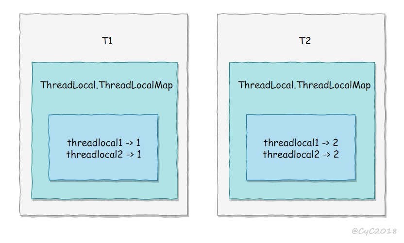 </div><br>

每个 Thread 都有一个 ThreadLocal.ThreadLocalMap 对象。

```java
/* ThreadLocal values pertaining to this thread. This map is maintained
 * by the ThreadLocal class. */
ThreadLocal.ThreadLocalMap threadLocals = null;
```

当调用一个 ThreadLocal 的 set(T value) 方法时，先得到当前线程的 ThreadLocalMap 对象，然后将 ThreadLocal->value 键值对插入到该 Map 中。

```java
public void set(T value) {
    Thread t = Thread.currentThread();
    ThreadLocalMap map = getMap(t);
    if (map != null)
        map.set(this, value);
    else
        createMap(t, value);
}
```

get() 方法类似。

```java
public T get() {
    Thread t = Thread.currentThread();
    ThreadLocalMap map = getMap(t);
    if (map != null) {
        ThreadLocalMap.Entry e = map.getEntry(this);
        if (e != null) {
            @SuppressWarnings("unchecked")
            T result = (T)e.value;
            return result;
        }
    }
    return setInitialValue();
}
```

ThreadLocal 从理论上讲并不是用来解决多线程并发问题的，因为根本不存在多线程竞争。

在一些场景 (尤其是使用线程池) 下，由于 ThreadLocal.ThreadLocalMap 的底层数据结构导致 ThreadLocal 有内存泄漏的情况，应该尽可能在每次使用 ThreadLocal 后手动调用 remove()，以避免出现 ThreadLocal 经典的内存泄漏甚至是造成自身业务混乱的风险。

### 3. 可重入代码（Reentrant Code）

这种代码也叫做纯代码（Pure Code），可以在代码执行的任何时刻中断它，转而去执行另外一段代码（包括递归调用它本身），而在控制权返回后，原来的程序不会出现任何错误。

可重入代码有一些共同的特征，例如不依赖存储在堆上的数据和公用的系统资源、用到的状态量都由参数中传入、不调用非可重入的方法等。

# 十二、锁优化

这里的锁优化主要是指 JVM 对 synchronized 的优化。

## 自旋锁

互斥同步进入阻塞状态的开销都很大，应该尽量避免。在许多应用中，共享数据的锁定状态只会持续很短的一段时间。自旋锁的思想是让一个线程在请求一个共享数据的锁时执行忙循环（自旋）一段时间，如果在这段时间内能获得锁，就可以避免进入阻塞状态。

自旋锁虽然能避免进入阻塞状态从而减少开销，但是它需要进行忙循环操作占用 CPU 时间，它只适用于共享数据的锁定状态很短的场景。

在 JDK 1.6 中引入了自适应的自旋锁。自适应意味着自旋的次数不再固定了，而是由前一次在同一个锁上的自旋次数及锁的拥有者的状态来决定。

## 锁消除

锁消除是指对于被检测出不可能存在竞争的共享数据的锁进行消除。

锁消除主要是通过逃逸分析来支持，如果堆上的共享数据不可能逃逸出去被其它线程访问到，那么就可以把它们当成私有数据对待，也就可以将它们的锁进行消除。

对于一些看起来没有加锁的代码，其实隐式的加了很多锁。例如下面的字符串拼接代码就隐式加了锁：

```java
public static String concatString(String s1, String s2, String s3) {
    return s1 + s2 + s3;
}
```

String 是一个不可变的类，编译器会对 String 的拼接自动优化。在 JDK 1.5 之前，会转化为 StringBuffer 对象的连续 append() 操作：

```java
public static String concatString(String s1, String s2, String s3) {
    StringBuffer sb = new StringBuffer();
    sb.append(s1);
    sb.append(s2);
    sb.append(s3);
    return sb.toString();
}
```

每个 append() 方法中都有一个同步块。虚拟机观察变量 sb，很快就会发现它的动态作用域被限制在 concatString() 方法内部。也就是说，sb 的所有引用永远不会逃逸到 concatString() 方法之外，其他线程无法访问到它，因此可以进行消除。

## 锁粗化

如果一系列的连续操作都对同一个对象反复加锁和解锁，频繁的加锁操作就会导致性能损耗。

上一节的示例代码中连续的 append() 方法就属于这类情况。如果虚拟机探测到由这样的一串零碎的操作都对同一个对象加锁，将会把加锁的范围扩展（粗化）到整个操作序列的外部。对于上一节的示例代码就是扩展到第一个 append() 操作之前直至最后一个 append() 操作之后，这样只需要加锁一次就可以了。

## 轻量级锁
参考上面的 [synchronized 源码分析](#synchronized, 偏向锁，轻量锁，重量级锁) 能更好理解。

JDK 1.6 引入了偏向锁和轻量级锁，从而让锁拥有了四个状态：无锁状态（unlocked）、偏向锁状态（biasble）、轻量级锁状态（lightweight locked）和重量级锁状态（inflated）。

以下是 HotSpot 虚拟机对象头的内存布局，这些数据被称为 Mark Word。其中 tag bits 对应了五个状态，这些状态在右侧的 state 表格中给出。除了 marked for gc 状态，其它四个状态已经在前面介绍过了。

<div align="center">  </div><br>

下图左侧是一个线程的虚拟机栈，其中有一部分称为 Lock Record 的区域，这是在轻量级锁运行过程创建的，用于存放锁对象的 Mark Word。而右侧就是一个锁对象，包含了 Mark Word 和其它信息。

<div align="center"> 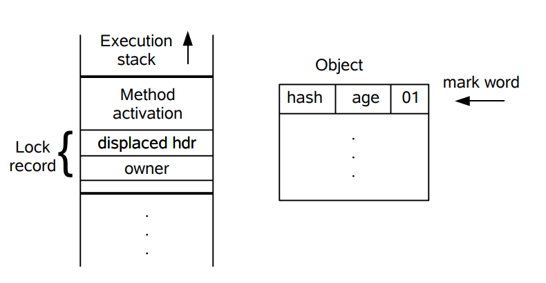 </div><br>

轻量级锁是相对于传统的重量级锁而言，它使用 CAS 操作来避免重量级锁使用互斥量的开销。对于绝大部分的锁，在整个同步周期内都是不存在竞争的，因此也就不需要都使用互斥量进行同步，可以先采用 CAS 操作进行同步，如果 CAS 失败了再改用互斥量进行同步。

当尝试获取一个锁对象时，如果锁对象标记为 0 01，说明锁对象的锁未锁定（unlocked）状态。此时虚拟机在当前线程的虚拟机栈中创建 Lock Record，然后使用 CAS 操作将对象的 Mark Word 更新为 Lock Record 指针。如果 CAS 操作成功了，那么线程就获取了该对象上的锁，并且对象的 Mark Word 的锁标记变为 00，表示该对象处于轻量级锁状态。

<div align="center">  </div><br>

如果 CAS 操作失败了，虚拟机首先会检查对象的 Mark Word 是否指向当前线程的虚拟机栈，如果是的话说明当前线程已经拥有了这个锁对象，那就可以直接进入同步块继续执行，否则说明这个锁对象已经被其他线程线程抢占了。如果有两条以上的线程争用同一个锁，那轻量级锁就不再有效，要膨胀为重量级锁。

## 偏向锁

偏向锁的思想是偏向于让第一个获取锁对象的线程，这个线程在之后获取该锁就不再需要进行同步操作，甚至连 CAS 操作也不再需要。

当锁对象第一次被线程获得的时候，进入偏向状态，标记为 1 01。同时使用 CAS 操作将线程 ID 记录到 Mark Word 中，如果 CAS 操作成功，这个线程以后每次进入这个锁相关的同步块就不需要再进行任何同步操作。

当有另外一个线程去尝试获取这个锁对象时，偏向状态就宣告结束，此时撤销偏向（Revoke Bias）后恢复到未锁定状态或者轻量级锁状态。

<div align="center">  </div><br>

# 十三、多线程开发良好的实践

- 给线程起个有意义的名字，这样可以方便找 Bug。

- 缩小同步范围，从而减少锁争用。例如对于 synchronized，应该尽量使用同步块而不是同步方法。

- 多用同步工具少用 wait() 和 notify()。首先，CountDownLatch, CyclicBarrier, Semaphore 和 Exchanger 这些同步类简化了编码操作，而用 wait() 和 notify() 很难实现复杂控制流；其次，这些同步类是由最好的企业编写和维护，在后续的 JDK 中还会不断优化和完善。

- 使用 BlockingQueue 实现生产者消费者问题。

- 多用并发集合少用同步集合，例如应该使用 ConcurrentHashMap 而不是 Hashtable。

- 使用本地变量和不可变类来保证线程安全。

- 使用线程池而不是直接创建线程，这是因为创建线程代价很高，线程池可以有效地利用有限的线程来启动任务。
