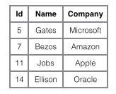

<!-- TOC START min:1 max:3 link:true update:true -->
- [一、索引](#一索引)
  - [B Tree 索引](#b-tree-索引)
    - [平衡扩张](#平衡扩张)
    - [存在的问题](#存在的问题)
  - [B+ Tree 原理](#b-tree-原理)
    - [1. 数据结构](#1-数据结构)
    - [2. 操作](#2-操作)
    - [3. 与红黑树的比较](#3-与红黑树的比较)
  - [MySQL 索引](#mysql-索引)
    - [1. B+Tree 索引](#1-btree-索引)
    - [聚簇索引和非聚簇索引](#聚簇索引和非聚簇索引)
    - [2. 哈希索引](#2-哈希索引)
    - [3. 全文索引](#3-全文索引)
    - [4. 空间数据索引](#4-空间数据索引)
    - [5. 联合索引和单列索引！](#5-联合索引和单列索引)
  - [索引优化](#索引优化)
    - [1. 独立的列](#1-独立的列)
    - [2. 多列索引](#2-多列索引)
    - [3. 索引列的顺序](#3-索引列的顺序)
    - [4. 前缀索引](#4-前缀索引)
    - [5. 覆盖索引](#5-覆盖索引)
  - [索引的优点](#索引的优点)
  - [索引的使用条件](#索引的使用条件)
- [二、查询性能优化](#二查询性能优化)
  - [使用 Explain 进行分析](#使用-explain-进行分析)
  - [优化数据访问](#优化数据访问)
    - [1. 减少请求的数据量](#1-减少请求的数据量)
    - [2. 减少服务器端扫描的行数](#2-减少服务器端扫描的行数)
  - [重构查询方式](#重构查询方式)
    - [1. 切分大查询](#1-切分大查询)
    - [2. 分解大连接查询](#2-分解大连接查询)
- [三、存储引擎](#三存储引擎)
  - [InnoDB](#innodb)
  - [MyISAM](#myisam)
  - [比较](#比较)
- [四、数据类型](#四数据类型)
  - [整型](#整型)
  - [浮点数](#浮点数)
  - [字符串](#字符串)
  - [时间和日期](#时间和日期)
    - [1. DATETIME](#1-datetime)
    - [2. TIMESTAMP](#2-timestamp)
- [五、切分](#五切分)
  - [水平切分](#水平切分)
  - [垂直切分](#垂直切分)
  - [Sharding 策略](#sharding-策略)
  - [Sharding 存在的问题](#sharding-存在的问题)
    - [1. 事务问题](#1-事务问题)
    - [2. 连接](#2-连接)
    - [3. ID 唯一性](#3-id-唯一性)
- [六、复制](#六复制)
  - [主从复制](#主从复制)
  - [读写分离](#读写分离)
- [参考](#参考)

<!-- TOC END -->


# 一、索引

## B Tree 索引
Btree索引(或Balanced Tree)，是一种很普遍的数据库索引结构，oracle默认的索引类型（本文也主要依据oracle来讲）。其特点是定位高效、利用率高、自我平衡，特别适用于高基数字段，定位单条或小范围数据非常高效。理论上，使用Btree在亿条数据与100条数据中定位记录的花销相同。

**数据结构利用率高、定位高效**

Btree索引的数据结构如下：

<div align="center">  </div><br>

结构看起来Btree索引与Binary Tree相似，但在细节上有所不同，上图中用不同颜色的标示出了Btree索引的几个主要特点：
  - 树形结构：由根节(root)、分支(branches)、叶(leaves)三级节点组成，其中分支节点可以有多层。
  - 多分支结构：与binary tree不相同的是，btree索引中单root/branch可以有多个子节点(超过2个)。
  - 双向链表：整个叶子节点部分是一个双向链表(后面会描述这个设计的作用)
  - 单个数据块中包括多条索引记录

结构上Btree与Binary Tree的区别，在于binary中每节点代表一个数值，而balanced中root和Btree节点中记录了多条”值范围”条目(如:\[60-70][70-80])，这些”值范围”条目分别指向在其范围内的叶子节点。既root与branch可以有多个分支，而不一定是两个，对数据块的利用率更高。

在Leaf节点中，同样也是存放了多条索引记录，这些记录就是具体的索引列值，和与其对应的rowid。另外，在叶节点层上，所有的节点在组成了一个双向链表。
<div align="center">  </div><br>

```text
演算如下：
读取root节点，判断82大于在0-120之间，走左边分支。
读取左边branch节点，判断82大于80且小于等于120，走右边分支。
读取右边leaf节点，在该节点中找到数据82及对应的rowid
使用rowid去物理表中读取记录数据块(如果是count或者只select rowid，则最后一次读取不需要)
```

在整个索引定位过程中，数据块的读取只有3次。既三次I/O后定位到rowid。

而由于Btree索引对结构的利用率很高，定位高效。当1千万条数据时，Btree索引也是三层结构。定位记录仍只需要三次I/O，这便是开头所说的，100条数据和1千万条数据的定位，在btree索引中的花销是一样的。

### 平衡扩张
除了利用率高、定位高效外，Btree的另一个特点是能够永远保持平衡，这与它的扩张方式有关。，先描述下Btree索引的扩张方式：

新建一个索引，索引上只会有一个leaf节点，取名为Node A，不断的向这个leaf节点中插入数据后，直到这个节点满，这个过程如下图（绿色表示新建/空闲状态，红色表示节点没有空余空间）：

<div align="center">  </div><br>

当Node A满之后，我们再向表中插入一条记录，此时索引就需要做拆分处理：会新分配两个数据块NodeB & C，如果新插入的值，大于当前最大值，则将Node A中的值全部插入Node B中，将新插入的值放到Node C中；否则按照5-5比例，将已有数据分别插入到NodeB与C中。

无论采用哪种分割方式，之前的leaf节点A，将变成一个root节点，保存两个范围条目，指向B与C，结构如下图（按第一种拆分形式）：

<div align="center">  </div><br>

当Node C满之后，此时 Node A仍有空余空间存放条目，所以不需要再拆分，而只是新分配一个数据块Node D，将在Node A中创建指定到Node D的条目：
<div align="center">  </div><br>

在整个扩张过程中，Btree自身总能保持平衡，Leaf节点的深度能一直保持一致。

### 存在的问题
1. 单一方向扩展引起的索引竞争(Index Contention)

    若索引列使用sequence或者timestamp这类只增不减的数据类型。这种情况下Btree索引的增长方向总是不变的，不断的向右边扩展，因为新插入的值永远是最大的。

    当一个最大值插入到leaf block中后，leaf block要向上传播，通知上层节点更新所对应的“值范围”条目中的最大值，因此所有靠右边的block(从leaf 到branch甚至root)都需要做更新操作，并且可能因为块写满后执行块拆分。

    如果并发插入多个最大值，则最右边索引数据块的的更新与拆分都会存在争抢，影响效率。
2. Index Browning 索引枯萎

    我们知道当表中的数据删除后，索引上对应的索引值是不会删除的，特别是在一性次删除大批量数据后，会造成大量的dead leaf挂到索引树上。考虑以下示例，如果表100以上的数据会部被删除了，但这些记录仍在索引中存在，此时若对该列取max()：

    <div align="center">  </div><br>

    通过与之前相同演算，找到了索引树上最大的数据块，按照记录最大的值应该在这里，但发现这数据块里的数据已经被清空了，与是利用Btree索引的另一个特点：leaves节点是一个双向列表，若数据没有找到就去临近的一个数据块中看看，在这个数据块中发现了最大值99。

    在计算最大值的过程中，这次的定位多加载了一个数据块，再极端的情况下，大批量的数据被删除，就会造成大量访问这些dead leaves。

    针对这个问题的一般解决办法是重建索引

## B+ Tree 原理

### 1. 数据结构

B Tree 指的是 Balance Tree，也就是平衡树。平衡树是一颗查找树，并且所有叶子节点位于同一层。

B+ Tree 是基于 B Tree 和叶子节点顺序访问指针进行实现，它具有 B Tree 的平衡性，并且通过顺序访问指针来提高区间查询的性能。

在 B+ Tree 中，一个节点中的 key 从左到右非递减排列，如果某个指针的左右相邻 key 分别是 key<sub>i</sub> 和 key<sub>i+1</sub>，且不为 null，则该指针指向节点的所有 key 大于等于 key<sub>i</sub> 且小于等于 key<sub>i+1</sub>。

<div align="center">  </div><br>

### 2. 操作

进行查找操作时，首先在根节点进行二分查找，找到一个 key 所在的指针，然后递归地在指针所指向的节点进行查找。直到查找到叶子节点，然后在叶子节点上进行二分查找，找出 key 所对应的 data。

插入删除操作会破坏平衡树的平衡性，因此在插入删除操作之后，需要对树进行一个分裂、合并、旋转等操作来维护平衡性。

### 3. 与红黑树的比较

红黑树等平衡树也可以用来实现索引，但是文件系统及数据库系统普遍采用 B+ Tree 作为索引结构，主要有以下两个原因：

（一）更少的查找次数

平衡树查找操作的时间复杂度和树高 h 相关，O(h)=O(log<sub>d</sub>N)，其中 d 为每个节点的出度。

红黑树的出度为 2，而 B+ Tree 的出度一般都非常大，所以红黑树的树高 h 很明显比 B+ Tree 大非常多，查找的次数也就更多。

（二）利用磁盘预读特性

为了减少磁盘 I/O 操作，磁盘往往不是严格按需读取，而是每次都会预读。预读过程中，磁盘进行顺序读取，顺序读取不需要进行磁盘寻道，并且只需要很短的旋转时间，速度会非常快。

操作系统一般将内存和磁盘分割成固定大小的块，每一块称为一页，内存与磁盘以页为单位交换数据。数据库系统将索引的一个节点的大小设置为页的大小，使得一次 I/O 就能完全载入一个节点。并且可以利用预读特性，相邻的节点也能够被预先载入。

## MySQL 索引

索引是在存储引擎层实现的，而不是在服务器层实现的，所以不同存储引擎具有不同的索引类型和实现。

### 1. B+Tree 索引

是大多数 MySQL 存储引擎的默认索引类型。

因为不再需要进行全表扫描，只需要对树进行搜索即可，所以查找速度快很多。

除了用于查找，还可以用于排序和分组。

可以指定多个列作为索引列，多个索引列共同组成键。

适用于全键值、键值范围和键前缀查找，其中键前缀查找只适用于最左前缀查找。如果不是按照索引列的顺序进行查找，则无法使用索引。

InnoDB 的 B+Tree 索引分为主索引和辅助索引。主索引的叶子节点 data 域记录着完整的数据记录，**这种索引方式被称为聚簇索引**。因为无法把数据行存放在两个不同的地方，所以一个表只能有一个聚簇索引。

<div align="center">  </div><br>

辅助索引的叶子节点的 data 域记录着主键的值，因此在使用辅助索引进行查找时，需要先查找到主键值，然后再到主索引中进行查找。

<div align="center">  </div><br>

### 聚簇索引和非聚簇索引
聚簇索引的叶子节点就是数据节点，而非聚簇索引的叶子节点仍然是索引节点，只不过有指向对应数据块的指针。

如果我们定义了主键(PRIMARY KEY)，那么InnoDB会选择主键作为聚集索引、如果没有显式定义主键，则InnoDB会选择第一个不包含有NULL值的唯一索引作为主键索引、如果也没有这样的唯一索引，则InnoDB会选择内置6字节长的ROWID作为隐含的聚集索引(ROWID随着行记录的写入而主键递增，这个ROWID不像ORACLE的ROWID那样可引用，是隐含的)。




1. InnoDB使用的是聚簇索引，将主键组织到一棵B+树中，而行数据就储存在叶子节点上，若使用"where id = 14"这样的条件查找主键，则按照B+树的检索算法即可查找到对应的叶节点，之后获得行数据。

2. 数据记录本身被存于主索引（一颗B+Tree）的叶子节点上。这就要求同一个叶子节点内（大小为一个内存页或磁盘页）的各条数据记录按主键顺序存放，因此每当有一条新的记录插入时，MySQL会根据其主键将其插入适当的节点和位置，如果页面达到装载因子（InnoDB默认为15/16），则开辟一个新的页（节点）

3. 若对Name列进行条件搜索，则需要两个步骤：第一步在辅助索引B+树中检索Name，到达其叶子节点获取对应的主键。第二步使用主键在主索引B+树种再执行一次B+树检索操作，最终到达叶子节点即可获取整行数据。（重点在于通过其他键需要建立辅助索引）

4. MyISM使用的是非聚簇索引，非聚簇索引的两棵B+树看上去没什么不同，节点的结构完全一致只是存储的内容不同而已，主键索引B+树的节点存储了主键，辅助键索引B+树存储了辅助键。表数据存储在独立的地方，这两颗B+树的叶子节点都使用一个地址指向真正的表数据，对于表数据来说，这两个键没有任何差别。由于索引树是独立的，通过辅助键检索无需访问主键的索引树。

#### 为什么 MySQL 推荐用自增列作为主键
如果表使用自增主键，那么每次插入新的记录，记录就会顺序添加到当前索引节点的后续位置，当一页写满，就会自动开辟一个新的页

如果使用非自增主键（如果身份证号或学号等），由于每次插入主键的值近似于随机，因此每次新纪录都要被插到现有索引页得中间某个位置，此时MySQL不得不为了将新记录插到合适位置而移动数据，甚至目标页面可能已经被回写到磁盘上而从缓存中清掉，此时又要从磁盘上读回来，这增加了很多开销，同时频繁的移动、分页操作造成了大量的碎片，得到了不够紧凑的索引结构，后续不得不通过OPTIMIZE TABLE来重建表并优化填充页面。

### 2. 哈希索引

哈希索引能以 O(1) 时间进行查找，但是失去了有序性：

- 无法用于排序与分组；
- 只支持精确查找，无法用于部分查找和范围查找。

InnoDB 存储引擎有一个特殊的功能叫“自适应哈希索引”，当某个索引值被使用的非常频繁时，会在 B+Tree 索引之上再创建一个哈希索引，这样就让 B+Tree 索引具有哈希索引的一些优点，比如快速的哈希查找。

### 3. 全文索引

MyISAM 存储引擎支持全文索引，用于查找文本中的关键词，而不是直接比较是否相等。

查找条件使用 MATCH AGAINST，而不是普通的 WHERE。

全文索引使用倒排索引实现，它记录着关键词到其所在文档的映射。

InnoDB 存储引擎在 MySQL 5.6.4 版本中也开始支持全文索引。

### 4. 空间数据索引

MyISAM 存储引擎支持空间数据索引（R-Tree），可以用于地理数据存储。空间数据索引会从所有维度来索引数据，可以有效地使用任意维度来进行组合查询。

必须使用 GIS 相关的函数来维护数据。

### 5. 联合索引和单列索引！
假设有一个用户信息表，我们设置 userId, mobile, billMonth 三个字段添加上联合索引

测试联合索引的效果：
```SQL
-- 测试联合索引
-- 1. 条件为 userid, 索引有效
EXPLAIN SELECT * FROM `t_mobilesms_11` WHERE userid='2222';   

-- 2. 条件为 mobile, 索引无效
EXPLAIN SELECT * FROM `t_mobilesms_11` WHERE mobile='13281899972';

-- 3. 条件为 billMonth 索引无效
EXPLAIN SELECT * FROM `t_mobilesms_11` WHERE billMonth='2018-04';  

-- 4. 条件为 userid, mobile 索引有效
SELECT * FROM `t_mobilesms_11` WHERE userid='2222' AND mobile='13281899972';

-- 5. 在上面的基础上调换顺序，索引依旧有效
EXPLAIN SELECT * FROM `t_mobilesms_11` WHERE  mobile='13281899972' AND userid='2222' ;

-- 6. 上面基础上 and 变为 or, 索引无效
EXPLAIN SELECT * FROM `t_mobilesms_11` WHERE userid='2222' OR mobile='13281899972';  

-- 7. 条件分别位于联合索引位置的第一和第三，测试联合索引依旧有效！
EXPLAIN SELECT * FROM `t_mobilesms_11` WHERE userid='2222' AND billMonth='2018-04';

-- 8. 条件分别位于联合索引位置的第二和第三，发现联合索引无效！
EXPLAIN SELECT * FROM `t_mobilesms_11` WHERE mobile='13281899972' AND billMonth='2018-04';  

-- 9. 所有条件一起查询，联合索引有效！（当然，这才是最正统的用法啊！）
EXPLAIN SELECT * FROM `t_mobilesms_11` WHERE  userid='2222' AND mobile='13281899972' AND billMonth='2018-04'
```
```SQL
-- 单个索引测试，为 userid, mobile, billMonth 创建 3 个单列索引
-- 1. 查询条件为 userid and mobile and billMonth, 结果只有 useri 生效
EXPLAIN SELECT * FROM `t_mobilesms_11` WHERE  userid='2222' AND mobile='13281899972' AND billMonth='2018-04'

-- 2. 查询条件为 mobile and billMonth, 只有 mobile 生效（位置也为查询条件第一个）
EXPLAIN SELECT * FROM `t_mobilesms_11` WHERE mobile='13281899972' AND billMonth='2018-04'

-- 3. 查询条件为 userid or mobile, 发现两个查询条件都用上索引了！
EXPLAIN SELECT * FROM `t_mobilesms_11` WHERE  userid='2222' OR mobile='13281899972'

```

**结论：**

利用索引中的附加列，您可以缩小搜索的范围，但使用一个具有两列的索引 不同于使用两个单独的索引。复合索引的结构与电话簿类似，人名由姓和名构成，电话簿首先按姓氏对进行排序，然后按名字对有相同姓氏的人进行排序。如果您知道姓，电话簿将非常有用；如果您知道姓和名，电话簿则更为有用，但如果您只知道名不姓，电话簿将没有用处。

所以说创建复合索引时，应该仔细考虑列的顺序。对索引中的所有列执行搜索或仅对前几列执行搜索时，复合索引非常有用；仅对后面的任意列执行搜索时，复合索引则没有用处。

多个单列索引在多条件查询时优化器会选择最优索引策略，可能只用一个索引，也可能将多个索引全用上！ 但多个单列索引底层会建立多个B+索引树，比较占用空间，也会浪费一定搜索效率，故如果只有多条件联合查询时最好建联合索引！

**最左前缀原则：**

顾名思义是最左优先，以最左边的为起点任何连续的索引都能匹配上，在创建联合索引时，要根据业务需求，where子句中使用最频繁的一列放在最左边。这样的话扩展性较好，比如 userid 经常需要作为查询条件，而 mobile 不常常用，则需要把 userid 放在联合索引的第一位置，即最左边

**联合索引本质：**

当创建 **(a,b,c)联合索引时，相当于创建了(a)单列索引，(a,b)联合索引以及(a,b,c)联合索引**
想要索引生效的话,只能使用 a和a,b和a,b,c三种组合；当然，我们上面测试过，a,c组合也可以，但实际上只用到了a的索引，c并没有用到！

联合索引比对每个列分别建索引更有优势，因为索引建立得越多就越占磁盘空间，在更新数据的时候速度会更慢。另外建立多列索引时，顺序也是需要注意的，应该将严格的索引放在前面，这样筛选的力度会更大，效率更高。（例如我们上面把 userid 作为联合索引的第一个值。）

## 索引优化

### 1. 独立的列

在进行查询时，索引列不能是表达式的一部分，也不能是函数的参数，否则无法使用索引。

例如下面的查询不能使用 actor_id 列的索引：

```sql
SELECT actor_id FROM sakila.actor WHERE actor_id + 1 = 5;
```

### 2. 多列索引

在需要使用多个列作为条件进行查询时，使用多列索引比使用多个单列索引性能更好。例如下面的语句中，最好把 actor_id 和 film_id 设置为多列索引。

```sql
SELECT film_id, actor_ id FROM sakila.film_actor
WHERE actor_id = 1 AND film_id = 1;
```

### 3. 索引列的顺序

让选择性最强的索引列放在前面。

索引的选择性是指：不重复的索引值和记录总数的比值。最大值为 1，此时每个记录都有唯一的索引与其对应。选择性越高，查询效率也越高。

例如下面显示的结果中 customer_id 的选择性比 staff_id 更高，因此最好把 customer_id 列放在多列索引的前面。

```sql
SELECT COUNT(DISTINCT staff_id)/COUNT(*) AS staff_id_selectivity,
COUNT(DISTINCT customer_id)/COUNT(*) AS customer_id_selectivity,
COUNT(*)
FROM payment;
```

```html
   staff_id_selectivity: 0.0001
customer_id_selectivity: 0.0373
               COUNT(*): 16049
```

### 4. 前缀索引

对于 BLOB、TEXT 和 VARCHAR 类型的列，必须使用前缀索引，只索引开始的部分字符。

对于前缀长度的选取需要根据索引选择性来确定。

### 5. 覆盖索引

索引包含所有需要查询的字段的值。

具有以下优点：

- 索引通常远小于数据行的大小，只读取索引能大大减少数据访问量。
- 一些存储引擎（例如 MyISAM）在内存中只缓存索引，而数据依赖于操作系统来缓存。因此，只访问索引可以不使用系统调用（通常比较费时）。
- 对于 InnoDB 引擎，若辅助索引能够覆盖查询，则无需访问主索引。

## 索引的优点

- 大大减少了服务器需要扫描的数据行数。

- 帮助服务器避免进行排序和分组，以及避免创建临时表（B+Tree 索引是有序的，可以用于 ORDER BY 和 GROUP BY 操作。临时表主要是在排序和分组过程中创建，因为不需要排序和分组，也就不需要创建临时表）。

- 将随机 I/O 变为顺序 I/O（B+Tree 索引是有序的，会将相邻的数据都存储在一起）。

## 索引的使用条件

- 对于非常小的表、大部分情况下简单的全表扫描比建立索引更高效；

- 对于中到大型的表，索引就非常有效；

- 但是对于特大型的表，建立和维护索引的代价将会随之增长。这种情况下，需要用到一种技术可以直接区分出需要查询的一组数据，而不是一条记录一条记录地匹配，例如可以使用分区技术。

# 二、查询性能优化

## 使用 Explain 进行分析

Explain 用来分析 SELECT 查询语句，开发人员可以通过分析 Explain 结果来优化查询语句。

比较重要的字段有：

- select_type : 查询类型，有简单查询、联合查询、子查询等
- key : 使用的索引
- rows : 扫描的行数

## 优化数据访问

### 1. 减少请求的数据量

- 只返回必要的列：最好不要使用 SELECT * 语句。
- 只返回必要的行：使用 LIMIT 语句来限制返回的数据。
- 缓存重复查询的数据：使用缓存可以避免在数据库中进行查询，特别在要查询的数据经常被重复查询时，缓存带来的查询性能提升将会是非常明显的。

### 2. 减少服务器端扫描的行数

最有效的方式是使用索引来覆盖查询。

## 重构查询方式

### 1. 切分大查询

一个大查询如果一次性执行的话，可能一次锁住很多数据、占满整个事务日志、耗尽系统资源、阻塞很多小的但重要的查询。

```sql
DELETE FROM messages WHERE create < DATE_SUB(NOW(), INTERVAL 3 MONTH);
```

```sql
rows_affected = 0
do {
    rows_affected = do_query(
    "DELETE FROM messages WHERE create  < DATE_SUB(NOW(), INTERVAL 3 MONTH) LIMIT 10000")
} while rows_affected > 0
```

### 2. 分解大连接查询

将一个大连接查询分解成对每一个表进行一次单表查询，然后在应用程序中进行关联，这样做的好处有：

- 让缓存更高效。对于连接查询，如果其中一个表发生变化，那么整个查询缓存就无法使用。而分解后的多个查询，即使其中一个表发生变化，对其它表的查询缓存依然可以使用。
- 分解成多个单表查询，这些单表查询的缓存结果更可能被其它查询使用到，从而减少冗余记录的查询。
- 减少锁竞争；
- 在应用层进行连接，可以更容易对数据库进行拆分，从而更容易做到高性能和可伸缩。
- 查询本身效率也可能会有所提升。例如下面的例子中，使用 IN() 代替连接查询，可以让 MySQL 按照 ID 顺序进行查询，这可能比随机的连接要更高效。

```sql
SELECT * FROM tab
JOIN tag_post ON tag_post.tag_id=tag.id
JOIN post ON tag_post.post_id=post.id
WHERE tag.tag='mysql';
```

```sql
SELECT * FROM tag WHERE tag='mysql';
SELECT * FROM tag_post WHERE tag_id=1234;
SELECT * FROM post WHERE post.id IN (123,456,567,9098,8904);
```

# 三、存储引擎

## InnoDB

是 MySQL 默认的事务型存储引擎，只有在需要它不支持的特性时，才考虑使用其它存储引擎。

实现了四个标准的隔离级别，默认级别是可重复读（REPEATABLE READ）。在可重复读隔离级别下，通过多版本并发控制（MVCC）+ 间隙锁（Next-Key Locking）防止幻影读。

主索引是聚簇索引，在索引中保存了数据，从而避免直接读取磁盘，因此对查询性能有很大的提升。

内部做了很多优化，包括从磁盘读取数据时采用的可预测性读、能够加快读操作并且自动创建的自适应哈希索引、能够加速插入操作的插入缓冲区等。

支持真正的在线热备份。其它存储引擎不支持在线热备份，要获取一致性视图需要停止对所有表的写入，而在读写混合场景中，停止写入可能也意味着停止读取。

## MyISAM

设计简单，数据以紧密格式存储。对于只读数据，或者表比较小、可以容忍修复操作，则依然可以使用它。

提供了大量的特性，包括压缩表、空间数据索引等。

不支持事务。

不支持行级锁，只能对整张表加锁，读取时会对需要读到的所有表加共享锁，写入时则对表加排它锁。但在表有读取操作的同时，也可以往表中插入新的记录，这被称为并发插入（CONCURRENT INSERT）。

可以手工或者自动执行检查和修复操作，但是和事务恢复以及崩溃恢复不同，可能导致一些数据丢失，而且修复操作是非常慢的。

如果指定了 DELAY_KEY_WRITE 选项，在每次修改执行完成时，不会立即将修改的索引数据写入磁盘，而是会写到内存中的键缓冲区，只有在清理键缓冲区或者关闭表的时候才会将对应的索引块写入磁盘。这种方式可以极大的提升写入性能，但是在数据库或者主机崩溃时会造成索引损坏，需要执行修复操作。

## 比较

- 事务：InnoDB 是事务型的，可以使用 Commit 和 Rollback 语句。

- 并发：MyISAM 只支持表级锁，而 InnoDB 还支持行级锁。

- 外键：InnoDB 支持外键。

- 备份：InnoDB 支持在线热备份。

- 崩溃恢复：MyISAM 崩溃后发生损坏的概率比 InnoDB 高很多，而且恢复的速度也更慢。

- 其它特性：MyISAM 支持压缩表和空间数据索引。

# 四、数据类型

## 整型

TINYINT, SMALLINT, MEDIUMINT, INT, BIGINT 分别使用 8, 16, 24, 32, 64 位存储空间，一般情况下越小的列越好。

INT(11) 中的数字只是规定了交互工具显示字符的个数，对于存储和计算来说是没有意义的。！！

## 浮点数

FLOAT 和 DOUBLE 为浮点类型，DECIMAL 为高精度小数类型。CPU 原生支持浮点运算，但是不支持 DECIMAl 类型的计算，因此 DECIMAL 的计算比浮点类型需要更高的代价。

FLOAT、DOUBLE 和 DECIMAL 都可以指定列宽，例如 DECIMAL(18, 9) 表示总共 18 位，取 9 位存储小数部分，剩下 9 位存储整数部分。

## 字符串

主要有 CHAR 和 VARCHAR 两种类型，一种是定长的，一种是变长的。

VARCHAR 这种变长类型能够节省空间，因为只需要存储必要的内容。但是在执行 UPDATE 时可能会使行变得比原来长，当超出一个页所能容纳的大小时，就要执行额外的操作。MyISAM 会将行拆成不同的片段存储，而 InnoDB 则需要分裂页来使行放进页内。

在进行存储和检索时，会保留 VARCHAR 末尾的空格，而会删除 CHAR 末尾的空格。

## 时间和日期

MySQL 提供了两种相似的日期时间类型：DATETIME 和 TIMESTAMP。

### 1. DATETIME

能够保存从 1001 年到 9999 年的日期和时间，精度为秒，使用 8 字节的存储空间。

它与时区无关。

默认情况下，MySQL 以一种可排序的、无歧义的格式显示 DATETIME 值，例如“2008-01-16 22:37:08”，这是 ANSI 标准定义的日期和时间表示方法。

### 2. TIMESTAMP

和 UNIX 时间戳相同，保存从 1970 年 1 月 1 日午夜（格林威治时间）以来的秒数，使用 4 个字节，只能表示从 1970 年到 2038 年。

它和时区有关，也就是说一个时间戳在不同的时区所代表的具体时间是不同的。

MySQL 提供了 FROM_UNIXTIME() 函数把 UNIX 时间戳转换为日期，并提供了 UNIX_TIMESTAMP() 函数把日期转换为 UNIX 时间戳。

默认情况下，如果插入时没有指定 TIMESTAMP 列的值，会将这个值设置为当前时间。

应该尽量使用 TIMESTAMP，因为它比 DATETIME 空间效率更高。

# 五、切分

## 水平切分

水平切分又称为 Sharding，它是将同一个表中的记录拆分到多个结构相同的表中。

当一个表的数据不断增多时，Sharding 是必然的选择，它可以将数据分布到集群的不同节点上，从而缓存单个数据库的压力。

<div align="center">  </div><br>

## 垂直切分

垂直切分是将一张表按列切分成多个表，通常是按照列的关系密集程度进行切分，也可以利用垂直切分将经常被使用的列和不经常被使用的列切分到不同的表中。

在数据库的层面使用垂直切分将按数据库中表的密集程度部署到不同的库中，例如将原来的电商数据库垂直切分成商品数据库、用户数据库等。

<div align="center">  </div><br>

## Sharding 策略

- 哈希取模：hash(key) % N；
- 范围：可以是 ID 范围也可以是时间范围；
- 映射表：使用单独的一个数据库来存储映射关系。

## Sharding 存在的问题

### 1. 事务问题

使用分布式事务来解决，比如 XA 接口。

### 2. 连接

可以将原来的连接分解成多个单表查询，然后在用户程序中进行连接。

### 3. ID 唯一性

- 使用全局唯一 ID（GUID）
- 为每个分片指定一个 ID 范围
- 分布式 ID 生成器 (如 Twitter 的 Snowflake 算法)

# 六、复制

## 主从复制

主要涉及三个线程：binlog 线程、I/O 线程和 SQL 线程。

-  **binlog 线程** ：负责将主服务器上的数据更改写入二进制日志（Binary log）中。
-  **I/O 线程** ：负责从主服务器上读取二进制日志，并写入从服务器的重放日志（Replay log）中。
-  **SQL 线程** ：负责读取重放日志并重放其中的 SQL 语句。

<div align="center">  </div><br>

## 读写分离

主服务器处理写操作以及实时性要求比较高的读操作，而从服务器处理读操作。

读写分离能提高性能的原因在于：

- 主从服务器负责各自的读和写，极大程度缓解了锁的争用；
- 从服务器可以使用 MyISAM，提升查询性能以及节约系统开销；
- 增加冗余，提高可用性。

读写分离常用代理方式来实现，**代理服务器接收应用层传来的读写请求，然后决定转发到哪个服务器。**

<div align="center">  </div><br>

# 参考
- [Cyc2018-MySQL](https://github.com/CyC2018/CS-Notes/blob/master/notes/MySQL.md)
- [聚簇索引与非聚簇索引](https://www.jianshu.com/p/fa8192853184)
- [联合索引和单列索引](https://blog.csdn.net/Abysscarry/article/details/80792876)
- [MySQL自增主键](https://blog.csdn.net/wukong_666/article/details/54982712)
