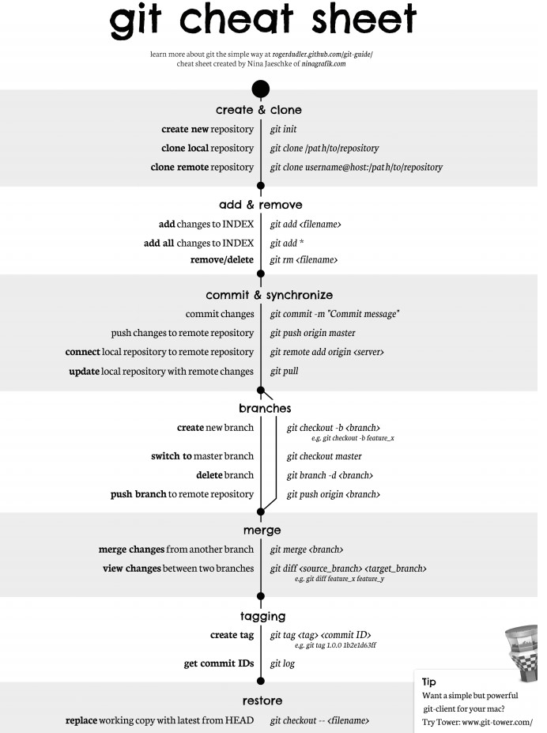
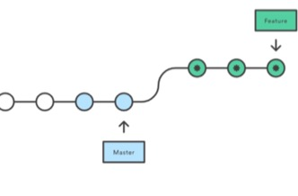
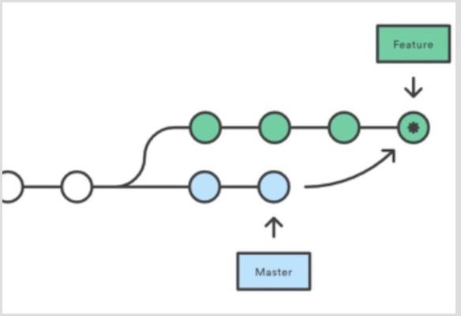

# 集中式与分布式
Git 属于分布式版本控制系统，而 SVN 属于集中式。

集中式版本控制只有中心服务器拥有一份代码，而分布式版本控制每个人的电脑上就有一份完整的代码。

集中式版本控制有安全性问题，当中心服务器挂了所有人都没办法工作了。

集中式版本控制需要连网才能工作，如果网速过慢，那么提交一个文件会慢的无法让人忍受。而分布式版本控制不需要连网就能工作。

分布式版本控制新建分支、合并分支操作速度非常快，而集中式版本控制新建一个分支相当于复制一份完整代码。

# 中心服务器
中心服务器用来交换每个用户的修改，没有中心服务器也能工作，但是中心服务器能够 24 小时保持开机状态，这样就能更方便的交换修改。

Github 就是一个中心服务器。

# Git 命令一览

# 其他问题
## merge和rebase的区别
rebase会把你当前分支的 commit 放到公共分支的最后面,所以叫变基。就好像你从公共分支又重新拉出来这个分支一样。
举例:如果你从 master 拉了个feature分支出来,然后你提交了几个 commit,这个时候刚好有人把他开发的东西合并到 master 了,这个时候 master 就比你拉分支的时候多了几个 commit,如果这个时候你 rebase develop 的话，就会把你当前的几个 commit，放到那个人 commit 的后面。

merge 会把公共分支和你当前的commit 合并在一起，形成一个新的 commit 提交

### 为什么不要再公共分支使用rebase?
因为往后放的这些 commit 都是新的,这样其他从这个公共分支拉出去的人，都需要再 rebase,相当于你 rebase 东西进来，就都是新的 commit 了

1-2-3 是现在的分支状态
这个时候从原来的master ,checkout出来一个prod分支
然后master提交了4.5，prod提交了6.7
这个时候master分支状态就是1-2-3-4-5，prod状态变成1-2-3-6-7
如果在prod上用rebase master ,prod分支状态就成了1-2-3-4-5-6-7
如果是merge
1-2-3-6-7-8
........ |4-5|
会出来一个8，这个8的提交就是把4-5合进来的提交

###merge和rebase实际上只是用的场景不一样

比如rebase,你自己开发分支一直在做,然后某一天，你想把主线的修改合到你的分支上,做一次集成,这种情况就用rebase比较好.把你的提交都放在主线修改的头上
如果用merge，脑袋上顶着一笔merge的8,你如果想回退你分支上的某个提交就很麻烦,还有一个重要的问题,rebase的话,本来我的分支是从3拉出来的,rebase完了之后,就不知道我当时是从哪儿拉出来的我的开发分支
同样的,如果你在主分支上用rebase, rebase其他分支的修改,是不是要是别人想看主分支上有什么历史,他看到的就不是完整的历史课,这个历史已经被你篡改了

# 参考资料
- [Cyc2018-Git](https://github.com/CyC2018/CS-Notes/blob/master/notes/Git.md)
- [merge和rebase](https://www.jianshu.com/p/4079284dd970)
