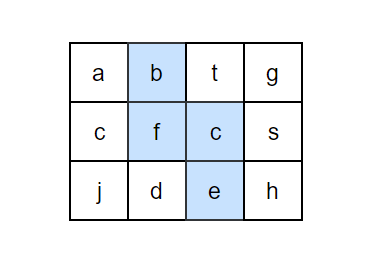

## 1.单例模式
[单例模式](https://github.com/LycPandaria/JavaInterview/blob/master/notes/%E8%AE%BE%E8%AE%A1%E6%A8%A1%E5%BC%8F.md#Singleton-%E5%8D%95%E4%BE%8B)


## 2.数组中重复的数字
[NowCode](https://www.nowcoder.com/practice/623a5ac0ea5b4e5f95552655361ae0a8?tpId=13&tqId=11203&tPage=1&rp=1&ru=/ta/coding-interviews&qru=/ta/coding-interviews/question-ranking)

### 问题描述
在一个长度为n的数组里的所有数字都在0到n-1的范围内。 数组中某些数字是重复的，但不知道有几个数字是重复的。也不知道每个数字重复几次。请找出数组中任意一个重复的数字。 例如，如果输入长度为7的数组{2,3,1,0,2,5,3}，那么对应的输出是第一个重复的数字2。

### 解题思路
解决这个问题最简单的做法是把输入的数组排序，然后遍历数组，判断 arr[i] 是否等于 arr[i+1]即可，这样的时间复杂度为 O(nlogn).

还可以利用哈希表来解决问题，遍历数组并将其尝试放入到哈希表中，如果在哈希表中已经存在，则说明重复了。这样的时间复杂度和空间复杂度都是O(n).

更好的解法是：从头到尾依次扫描这个数组，当扫描到下标为 i 的数字时，首先比较这个数字 arr[i] 是不是等于 i。如果是，则接着扫描下一个数字；如果不是，则拿它和第 arr[i] 个数字进行比较，如果相等，就找到了一个重复的数字，如果不等，就把第 i 个数字和第 arr[i] 个数字进行交换，重复此过程。**相当于每次将值为 i 的数调整到第 i 位**

以 (2, 3, 1, 0, 2, 5) 为例：
```text
position-0 : (2,3,1,0,2,5) // 2 <-> 1
             (1,3,2,0,2,5) // 1 <-> 3
             (3,1,2,0,2,5) // 3 <-> 0
             (0,1,2,3,2,5) // already in position
position-1 : (0,1,2,3,2,5) // already in position
position-2 : (0,1,2,3,2,5) // already in position
position-3 : (0,1,2,3,2,5) // already in position
position-4 : (0,1,2,3,2,5) // nums[i] == nums[nums[i]], exit
```
```java
public boolean duplicate(int numbers[],int length,int [] duplication) {
    // 检查
    if(numbers==null || length <=0)
        return false;
    for(int i = 0; i < length; i++)
        if(numbers[i] < 0 || numbers[i] > length - 1)
            return false;

    for(int i = 0; i < length; i++){
        while(numbers[i] != i){
            if(numbers[i] == numbers[numbers[i]]){
                duplication[0]=numbers[i];
                return true;
            }
            // 交换
            int tmp = numbers[i];
            numbers[i] = numbers[tmp];
            numbers[tmp] = tmp;
        }
    }
    return false;
}
```

## 3.二维数组中的查找
[NowCode](https://www.nowcoder.com/practice/abc3fe2ce8e146608e868a70efebf62e?tpId=13&tqId=11154&tPage=1&rp=1&ru=/ta/coding-interviews&qru=/ta/coding-interviews/question-ranking)
### 问题描述
在一个二维数组中（每个一维数组的长度相同），每一行都按照从左到右递增的顺序排序，每一列都按照从上到下递增的顺序排序。请完成一个函数，输入这样的一个二维数组和一个整数，判断数组中是否含有该整数。
```text
Consider the following matrix:
[
  [1,   4,  7, 11, 15],
  [2,   5,  8, 12, 19],
  [3,   6,  9, 16, 22],
  [10, 13, 14, 17, 24],
  [18, 21, 23, 26, 30]
]

Given target = 5, return true.
Given target = 20, return false.
```

### 解决思路
首先选取数组中右上角的数字 n 如果该数字等于要查找的数字 m，则查找过程结束；如果该数字 n 大于要查找的数字 m，则剔除这个 n 所在的列，因为 n 是该列的最小值，如果 n 小于 要查找的数字 m，则剔除 m 所在的行，因为 n 已经是所在行的最大值。

复杂度：O(M + N) + O(1)

```java
public boolean Find(int target, int [][] array) {
    if(array == null || array.length == 0 || array[0].length == 0)
        return false;
    int rows = array.length;
    int cols = array[0].length;
    int row = 0;
    int col = cols - 1;    // 从右上角开始
    while(col >=0 && row < rows){
        if(array[row][col] == target)
            return true;
        else if(array[row][col] > target){
            col--;
        }else
            row++;
    }
    return false;
}
```

## 4.替换空格
[NowCode](https://www.nowcoder.com/practice/4060ac7e3e404ad1a894ef3e17650423?tpId=13&tqId=11155&tPage=1&rp=1&ru=/ta/coding-interviews&qru=/ta/coding-interviews/question-ranking)
### 问题描述
请实现一个函数，将一个字符串中的每个空格替换成“%20”。例如，当字符串为We Are Happy.则经过替换之后的字符串为We%20Are%20Happy。

### 解题思路
最直观的做法是从头到尾扫描字符串，每次碰到空格字符的时候进行替换，但是这样，我们必须把后面的所有字符往后移两个字节。这样的方法时间复杂度为O(n^2)

更好的解法是：我们先遍历一次字符串，统计出空格的个数，然后计算出替换后的长度。准备两个指针 P1 和 P2，P1 指向原始字符串的末尾，P2 指向替换后的字符串末尾。接下来我们向前移动 P1， 逐个把它复制到 P2 所在位置，然后再遇到空格的时候 P1 向前移动一格，P2 前移3格并插入 "%20" 。**当 P1 和 P2 指向同一个位置，表明所以的空格已经替换完毕**

```java
public String replaceSpace(StringBuffer str) {
  int P1 = str.length() - 1;
    // 计算空格数量，遇到一个空格就在字符串后加"  "2个空格
    // 因为要替换掉 空格 -> %20 所以遇到一个空格，让字符串长度加2即可
    for(int i= 0; i <= P1; i++)
        if(str.charAt(i) == ' ')
            str.append("  ");   //  两个空格
    int P2 = str.length() - 1;
    while(P1 >=0 && P1 < P2){
        char c = str.charAt(P1--);
        if(c == ' '){
            str.setCharAt(P2--,'0');
            str.setCharAt(P2--,'2');
            str.setCharAt(P2--,'%');
        }else
            str.setCharAt(P2--,c);
    }
    return str.toString();
}
```

## 5.从尾到头打印链表
[NowCode](https://www.nowcoder.com/practice/d0267f7f55b3412ba93bd35cfa8e8035?tpId=13&tqId=11156&tPage=1&rp=1&ru=/ta/coding-interviews&qru=/ta/coding-interviews/question-ranking)

### 问题描述
输入一个链表，按链表值从尾到头的顺序返回一个ArrayList。

### 解题思路
1. 栈结构
  每经过一个节点，把该节点放到一个栈中，遍历完整个链表。
  ```java
  public ArrayList<Integer> printListFromTailToHead(ListNode listNode) {
        Stack<Integer> stack = new Stack<>();
        while(listNode != null){
            stack.add(listNode.val);
            listNode = listNode.next;
        }
        ArrayList<Integer> result = new ArrayList<>();
        while(!stack.isEmpty())
            result.add(stack.pop());
        return result;
  }
  ```
2. 递归
  递归在本质上也是一个栈。我们每访问一个节点，先递归到它后面的节点，最后再输出节点的值。
  ```java
  public ArrayList<Integer> result = new ArrayList<>();
    public ArrayList<Integer> printListFromTailToHead(ListNode listNode) {
        if(listNode != null){
            printListFromTailToHead(listNode.next);
            result.add(listNode.val);
        }
        return result;
  }
  ```


## 6.重建二叉树
[NowCode](https://www.nowcoder.com/practice/8a19cbe657394eeaac2f6ea9b0f6fcf6?tpId=13&tqId=11157&tPage=1&rp=1&ru=/ta/coding-interviews&qru=/ta/coding-interviews/question-ranking)
### 问题描述
根据二叉树的前序遍历和中序遍历的结果，重建出该二叉树。假设输入的前序遍历和中序遍历的结果中都不含重复的数字。
```text
preorder = [3,9,20,15,7]
inorder =  [9,3,15,20,7]
```

### 解题思路
前序遍历的第一个数字就是根节点的值，然后在中序遍历中，在根节点的值的位置之前的就是左子树，在根节点的值的位置之后的就是右子树。这样就可以确定出左右子树对应的序列。

```text
根据描述，3是根节点，那么我们可以确认：
左子树为 [9], 右子树为[15,20,7]，根节点为 3.
同样的道理我们把这个方法递归到左右子树，我们也知道左右子树对应的前序和中序，这样便可以重建二叉树
```

```java
/**
 * Definition for binary tree
 * public class TreeNode {
 *     int val;
 *     TreeNode left;
 *     TreeNode right;
 *     TreeNode(int x) { val = x; }
 * }
 */
import java.util.Map;
import java.util.HashMap;
public class Solution {
    // 缓存中序遍历，值及其对应的位置
    private Map<Integer,Integer> inLocMap = new HashMap<Integer,Integer>();

    public TreeNode reConstructBinaryTree(int [] pre,int [] in) {
        for(int i = 0; i < in.length; i++)
            inLocMap.put(in[i], i);
        return reConstructBinaryTree(pre, 0, pre.length-1, 0);
    }
    /*
    preL - 表示当前子树前序遍历的开始位置
    preR - 表示当前子树前序遍历的开始位置
    inL  - 表示当前子树的中序遍历的开始位置
    */
    private TreeNode reConstructBinaryTree(int[] pre, int preL, int preR, int inL){
        if(preL > preR)
            return null;
        // 前序遍历的第一个元素是根元素
        TreeNode root = new TreeNode(pre[preL]);
        // 找出根元素在中序遍历的位置
        int rootLoc = inLocMap.get(root.val);
        // 根据根元素在中序遍历的位置，计算左子树大小，进而我们知道左子树序列在前序中对应的位置
        int leftSize = rootLoc - inL;
        // 遍历构建子树
        // preL+1到preL+leftSize 这个区间就是对应的左子树序列
        root.left = reConstructBinaryTree(pre, preL+1, preL+leftSize, inL);
        // preL+preL+leftSize 到 preR 就是对应右子树的序列，
        // 同时右子树序列对应的中序遍历的开始位置就是 根元素在中序遍历的位置+1
        root.right = reConstructBinaryTree(pre, preL+leftSize+1, preR, rootLoc + 1);
        return root;
    }
}
```

## 7.二叉树的下一个节点
[NowCode](https://www.nowcoder.com/practice/9023a0c988684a53960365b889ceaf5e?tpId=13&tqId=11210&tPage=1&rp=1&ru=/ta/coding-interviews&qru=/ta/coding-interviews/question-ranking)
### 问题描述
给定一个二叉树和其中的一个结点，请找出中序遍历顺序的下一个结点并且返回。注意，树中的结点不仅包含左右子结点，同时包含指向父结点的指针。
```java
public class TreeLinkNode {
    int val;
    TreeLinkNode left = null;
    TreeLinkNode right = null;
    TreeLinkNode next = null; // 指向parent

    TreeLinkNode(int val) {
        this.val = val;
    }
}
```

### 解题思路
这题应该按情况来分析：
1. 如果一个节点有右子树，那么它的下一个节点就是它的右子树的最左子树。从右子节点出发一直沿着左子节点走，遇到 node.left == null 即可返回，这个就是下一个节点。
  
2. 接着分析一个节点没有右子节点的情况，如果节点是它父亲的左子节点，那么父亲节点就是下一个节点
3. 如果一个节点既没有右子节点，而且节点是它父亲的右子节点，我们可以一直沿着父亲节点往上走，知道找到一个是它父节点的左子节点的节点。
  

```java
public TreeLinkNode GetNext(TreeLinkNode pNode){
    if(pNode==null)
        return null;
    if(pNode.right != null){    // 如果有右子节点
        TreeLinkNode node = pNode.right;    // 从右子节点出发
        while(node.left != null){
            node = node.left;
        }
        return node;
    }else{    // 没有右子节点
        while(pNode.next != null){
            TreeLinkNode parent = pNode.next;
            // 节点是它父亲的左子节点
            if(pNode == parent.left)
                return parent;
            // 沿着父亲节点往上走
            pNode = pNode.next;
        }
        return null;
    }
}
```

## 8.用两个栈模拟队列
[NowCode](https://www.nowcoder.com/practice/54275ddae22f475981afa2244dd448c6?tpId=13&tqId=11158&tPage=1&rp=1&ru=/ta/coding-interviews&qru=/ta/coding-interviews/question-ranking)
### 问题描述
用两个栈来实现一个队列，完成队列的Push和Pop操作。 队列中的元素为int类型。

### 解题思路
要入列时，入栈A即可，要出队列则分两种情况：
1. 若栈B不为空，则直接弹出栈B
2. 若栈B为空，则需要依次弹出栈A，入到栈B，在弹出栈B

```java
Stack<Integer> in = new Stack<Integer>();
Stack<Integer> out = new Stack<Integer>();

public void push(int node) {
    // 入列时，直接入到 stack in 即可
    in.push(node);
}

public int pop() {
    // 如果 stack out 不为空，则直接 pop 栈 out
    if(!out.isEmpty())
        return out.pop();
    else{
        // 如果 stack out 为空，则需要先把 stack in 全部 pop 出来，push 到 out 栈
        while(!in.isEmpty())
            out.push(in.pop());
    }
    return out.pop();
}
```

## 9.斐波那契数列
[NowCode](https://www.nowcoder.com/practice/c6c7742f5ba7442aada113136ddea0c3?tpId=13&tqId=11160&tPage=1&rp=1&ru=/ta/coding-interviews&qru=/ta/coding-interviews/question-ranking)

### 问题描述
大家都知道斐波那契数列，现在要求输入一个整数n，请你输出斐波那契数列的第n项（从0开始，第0项为0）。
n<=39

### 解题思路
最简单的办法首先是递归，但是递归在 n 值较大的时候会影响效率，而且很多计算会重复计算。
```java
// 递归
public int Fibonacci(int n) {
    if(n <= 1)
        return n;
    return Fibonacci(n-1) + Fibonacci(n-2);
}
```

递归是将一个问题划分成多个子问题求解，动态规划也是如此，但是动态规划会把子问题的解缓存起来（用一个数组），从而避免重复求解子问题。
```java
// 动态规划
public int Fibonacci(int n) {
    if(n <= 1)
        return n;
    int[] fib = new int[n+1];
    fib[0] = 0;
    fib[1] = 1;    
    for(int i=2; i <=n; i ++)
        //缓存结果
        fib[i] = fib[i-1] + fib[i-2];
    return fib[n];
}
```

但其实可以发现 fib[n] 只跟 fib[n-1] 和 fib[n-2] 有关，所以我们只能保存两个结果，计算出 fib[n] 即可。通过 f(0) 和 f(1) 计算 f(2)，然后根据 f(2) 和 f(1) 计算 f(3)... 以此类推.
```java
public int Fibonacci(int n) {
    if(n <= 1)
        return n;
    int fibN1 = 1;    // fib(n-1)
    int fibN2 = 0;    // fib(n-2)
    int fibN = 0;
    for(int i = 2; i <= n; i++){
        fibN = fibN1 + fibN2;    // 计算 fibN
        fibN2 = fibN1;            // 进入下一次计算，f(n-2) = f(n-1)
        fibN1 = fibN;             // f(n-1) = f(n)
    }
    return fibN;
}
```

## 9.1 跳台阶
[跳台阶](https://www.nowcoder.com/practice/8c82a5b80378478f9484d87d1c5f12a4?tpId=13&tqId=11161&tPage=1&rp=1&ru=%2Fta%2Fcoding-interviews&qru=%2Fta%2Fcoding-interviews%2Fquestion-ranking)

### 问题描述
一只青蛙一次可以跳上1级台阶，也可以跳上2级。求该青蛙跳上一个n级的台阶总共有多少种跳法（先后次序不同算不同的结果）。

### 解题思路
最简单的情况，如果只有 1 级台阶就只有 1 种跳法。有 2 级台阶只有 2 中跳法。

一般情况，我们把 跳 n 级台阶的跳法看成是 n 的函数 f(n)。当 n>2 时，第一次跳的时候就有两种不同的选择，一是第一次只跳 1 级，此时跳法总数等于后面剩下的 n-1 级台阶的跳法总数。第一次只跳 2 级，此时跳法总数等于后面剩下的 n-2 级台阶的跳法总数。这很明显就是一个斐波那契数列。

```java
public int JumpFloor(int target) {
    if(target <= 2)
        return target;
    int jumpN1 = 2;    // 这里表示 f(n-1)
    int jumpN2 = 1;    // f(n-2)
    int jumpN = 1;
    for(int i=3; i <= target; i++){
        jumpN = jumpN1 + jumpN2;
        jumpN2 = jumpN1;
        jumpN1 = jumpN;
    }
    return jumpN;
}
```

## 9.2 变态跳台阶
[变态跳台阶](https://www.nowcoder.com/practice/22243d016f6b47f2a6928b4313c85387?tpId=13&tqId=11162&tPage=1&rp=1&ru=%2Fta%2Fcoding-interviews&qru=%2Fta%2Fcoding-interviews%2Fquestion-ranking)

### 问题描述
一只青蛙一次可以跳上1级台阶，也可以跳上2级……它也可以跳上n级。求该青蛙跳上一个n级的台阶总共有多少种跳法。

### 解题思路
**动态规划**
```java
public int JumpFloorII(int target) {
    int[] dp = new int[target]; // 用于缓存结果
    Arrays.fill(dp, 1);
    for (int i = 1; i < target; i++)
        for (int j = 0; j < i; j++)
            dp[i] += dp[j];
    return dp[target - 1];
}
```

## 9.3 矩形覆盖
[矩形覆盖](https://www.nowcoder.com/practice/72a5a919508a4251859fb2cfb987a0e6?tpId=13&tqId=11163&tPage=1&rp=1&ru=/ta/coding-interviews&qru=/ta/coding-interviews/question-ranking)

### 问题描述
我们可以用2*1的小矩形横着或者竖着去覆盖更大的矩形。请问用n个2*1的小矩形无重叠地覆盖一个2*n的大矩形，总共有多少种方法？

### 解题思路
这其实还是一个 斐波那契数列
```java
public int RectCover(int target) {
    if(target <= 2 )
        return target;
    int rcN1 = 2;
    int rcN2 = 1;
    int rcN = 1;
    for(int i=3; i <= target; i++){
        rcN = rcN1 + rcN2;
        rcN2 = rcN1;
        rcN1 = rcN;
    }
    return rcN;
}
```
# 查找和排序
## 10.旋转数组的最小数字
[旋转数组的最小数字](https://www.nowcoder.com/practice/9f3231a991af4f55b95579b44b7a01ba?tpId=13&tqId=11159&tPage=1&rp=1&ru=/ta/coding-interviews&qru=/ta/coding-interviews/question-ranking)
###问题描述
把一个数组最开始的若干个元素搬到数组的末尾，我们称之为数组的旋转。 输入一个非减排序的数组的一个旋转，输出旋转数组的最小元素。 例如数组{3,4,5,1,2}为{1,2,3,4,5}的一个旋转，该数组的最小值为1。 NOTE：给出的所有元素都大于0，若数组大小为0，请返回0。

### 解题思路
最直观的解法肯定是从头遍历一次数组，然后找出最小的数，但是这种思路的时间复杂度为 O(n)，而且并没有用到数组原来就有序的情况和旋转数组的特性。

我们注意到旋转之后的数组实际上可以划分为两个排序的子数组，而且签名子数组的元素都大于或者等于后面子数组的元素。我们还注意到最小的元素刚好是这两个子数组的分界线。

- 当 nums[m] <= nums[h] 的情况下，说明解在 [l, m] 之间，此时令 h = m；
- 否则解在 [m + 1, h] 之间，令 l = m + 1。

```java
public int minNumberInRotateArray(int [] array) {
    if(array.length == 0)
        return 0;
    int left = 0, right = array.length-1;
    while(left < right){
        int mid = left + (right - left) / 2;    // 中间元素
        if(array[mid] <= array[right])
            // 说明 array[mid...right] 属于右边的排序区间，最小值在 array[left...mid]
            right = mid;
        else
            left = mid + 1;
    }
    return array[left];
}
```

如果数组元素允许重复的话，那么就会出现一个特殊的情况：nums[l] == nums[m] == nums[h]，那么此时无法确定解在哪个区间，需要切换到顺序查找。例如对于数组 {1,1,1,0,1}，l、m 和 h 指向的数都为 1，此时无法知道最小数字 0 在哪个区间。

```java
public int minNumberInRotateArray(int[] nums) {
    if (nums.length == 0)
        return 0;
    int l = 0, h = nums.length - 1;
    while (l < h) {
        int m = l + (h - l) / 2;
        if (nums[l] == nums[m] && nums[m] == nums[h])
            return minNumber(nums, l, h);
        else if (nums[m] <= nums[h])
            h = m;
        else
            l = m + 1;
    }
    return nums[l];
}

private int minNumber(int[] nums, int l, int h) {
    for (int i = l; i < h; i++)
        if (nums[i] > nums[i + 1])
            return nums[i + 1];
    return nums[l];
}
```

## 11.矩阵中的路径
(矩阵中的路径)[https://www.nowcoder.com/practice/c61c6999eecb4b8f88a98f66b273a3cc?tpId=13&tqId=11218&tPage=1&rp=1&ru=/ta/coding-interviews&qru=/ta/coding-interviews/question-ranking]

### 问题描述
请设计一个函数，用来判断在一个矩阵中是否存在一条包含某字符串所有字符的路径。路径可以从矩阵中的任意一个格子开始，每一步可以在矩阵中向左，向右，向上，向下移动一个格子。如果一条路径经过了矩阵中的某一个格子，则之后不能再次进入这个格子。 例如 a b c e s f c s a d e e 这样的3 X 4 矩阵中包含一条字符串"bcced"的路径，但是矩阵中不包含"abcb"路径，因为字符串的第一个字符b占据了矩阵中的第一行第二个格子之后，路径不能再次进入该格子。


### 解题思路
这是一个可以用回溯法解决的问题。首先，在矩阵中任选一个格子作为路径的起点。假设矩阵中某个格子的字符为 ch，而且这个格子对应于路径上的第 i 个字符。如果路径上第 i 个字符不是 ch，那么这个格子不可能处在路径在第 i 的位置。如果路径上的第 i 个字符是 ch，那么到相邻的格子上寻找路径上第 i+1 个字符。重复这个过程，知道路径上所有字符都在矩阵内找到相应位置。

由于回溯法的递归特性，路径可以被看做一个栈。当在矩阵中定位了路径中前 n 个字符的位置之后，在与第 n 个字符对应的格子的周围都未找到第 n+1 个字符，便要回到第 n-1 个字符，重新定位第 n 个字符。

而且由于路径不能重复进入矩阵的格子，所以还要定义个布尔矩阵，标记进入过的格子。

```java
public class Solution {
    public boolean hasPath(char[] array, int rows, int cols, char[] str)
    {
        if(rows < 1 || cols < 1 || str.length < 1 || str == null)
            return false;

        // 布尔矩阵用于标识走路径格子
        boolean visited[][] = new boolean[rows][cols];
        int pathLen = 0; // 用于标记匹配到第几位上了
        char[][] matrix = buildMatrix(array,rows, cols);

        for(int row = 0; row < rows; row++)
            for(int col = 0; col < cols; col++)
                if(hasPathCore(matrix, str, visited, rows, cols, row, col, pathLen))
                    return true;

        return false;
    }

    public boolean hasPathCore(char[][] matrix, char[] str, boolean[][] visited, int rows, int cols,
                               int row, int col,int pathLen){
        if(pathLen == str.length)
            return true;

        boolean hasPath = false;
        if(row >= 0 && col >= 0 && row < rows && col < cols
          && matrix[row][col] == str[pathLen] && !visited[row][col]){
            // 这种情况说明字符串的第 i 个字符和 matrix[row][col] 相等
            pathLen ++ ;    // 第 i 个字符匹配完成
            visited[row][col] = true;
            // 当矩阵中坐标为 (row,col) 的格子和路径字符中下标为 pathLen 的字符一样时候，从四个相邻格子去定位
            // 路径字符串中下标为 pathLe+1 的字符
            hasPath = hasPathCore(matrix, str, visited, rows, cols, row, col-1, pathLen)    //左边一格
                || hasPathCore(matrix, str, visited, rows, cols, row, col+1, pathLen)    // 右边一格
                || hasPathCore(matrix, str, visited, rows, cols, row-1, col, pathLen)    // 上面一格
                || hasPathCore(matrix, str, visited, rows, cols, row+1, col, pathLen);    // 下面一格

            if(!hasPath){    // 没有路径，说明这个格子走不通，走不下去，需要回退
                pathLen--;
                visited[row][col] = false;
            }
        }
        return hasPath;
    }

    private char[][] buildMatrix(char[] array, int rows, int cols) {
        char[][] matrix = new char[rows][cols];
        for (int i = 0, idx = 0; i < rows; i++)
            for (int j = 0; j < cols; j++)
                matrix[i][j] = array[idx++];
        return matrix;
    }

}
```

## 12.机器人运动范围
(机器人运动范围)[https://www.nowcoder.com/practice/6e5207314b5241fb83f2329e89fdecc8?tpId=13&tqId=11219&rp=1&ru=/ta/coding-interviews&qru=/ta/coding-interviews/question-ranking]

### 问题描述
地上有一个m行和n列的方格。一个机器人从坐标0,0的格子开始移动，每一次只能向左，右，上，下四个方向移动一格，但是不能进入行坐标和列坐标的数位之和大于k的格子。 例如，当k为18时，机器人能够进入方格（35,37），因为3+5+3+7 = 18。但是，它不能进入方格（35,38），因为3+5+3+8 = 19。请问该机器人能够达到多少个格子？

### 思路
这个方格可以看做一个 m*n 的矩阵。机器人从坐标(0,0)开始，当它进入坐标 (i,j) 的格子，通过检查坐标的数位和判断机器人是否能够进入。如果机器人能进入坐标 (i,j) 的格子，则再判断它是否能进入相邻格子。

```java
public int movingCount(int threshold, int rows, int cols)
{
    if(threshold < 0 || rows  <= 0 || cols <= 0 )
        return 0;

    boolean visited[][] = new boolean[rows][cols];
    int count = movingCountCore(threshold, rows, cols, 0, 0, visited);

    return count;
}

private int movingCountCore(int threshold, int rows, int cols,
                           int row, int col, boolean[][] visited){
    int count = 0;
    if(check(threshold, rows, cols, row, col, visited)){
        visited[row][col] = true;
        count = 1 + movingCountCore(threshold, rows, cols, row+1, col, visited)
            + movingCountCore(threshold, rows, cols, row-1, col, visited)
            + movingCountCore(threshold, rows, cols, row, col+1, visited)
            + movingCountCore(threshold, rows, cols, row, col-1, visited);
    }
    return count;
}

private boolean check(int threshold, int rows, int cols,
                     int row, int col, boolean[][] visited){
    // 这个函数用于检测机器人能否进入该格子中
    if(row >= 0 && col >=0 && row < rows && col < cols
      && !visited[row][col]
      && getDigiSum(row) + getDigiSum(col) <= threshold)
        return true;
    return false;
}

private int getDigiSum(int number){
    int sum = 0;
    while(number > 0){
        sum+=number%10;
        number /= 10;
    }
    return sum;
}
```

## 动态规划和贪婪算法
动态规划：

如果一个问题是求一个问题的最优解，而且该问题能够分解成若干子问题，并且子问题之间还有重叠的更小的子问题，就可以考虑。

例如在面试题 13 中，我们如何打长度为 n 的绳子剪成若干段，使得各段乘积最大。这个问题是求一个问题的最优解--这是动态规划求解的第一个特点。

我们把长度为 n 的绳子剪成若干段后得到的乘积最大值定义为 f(n)。加入我们把第一刀剪在长度为 i 的位置，我们要得到 f(n), 就要依靠 f(i) 和 f(n-i) 的最优解。也就是说整体问题的最优解是依赖于子问题的最优解-- 这是动态规划求解的第二个特点。

我们把大问题分解成若干个小问题，但是小问题之间还有互相重叠的子问题--这是动态规划求解的第三个特点。例如 f(10) 可以分成 f(6) 和 f(4)，f(6) 可以分成 f(4) 和 f(2)。这就体现了子问题存在重叠的情况

由于子问题在分解过程中重复出现，为了避免重复求解子问题，我们可以从下到上先计算小问题并存储结果，以此为基础求取大问题的最优解。从上往下分析，从下往上求解，这是动态规划的第四个特点。

## 13.剪绳子
[leetcode](https://leetcode.com/problems/integer-break/description/)

### 问题描述
把一根绳子剪成多段，并且使得每段的长度乘积最大。
```text
n = 2
return 1 (2 = 1 + 1)

n = 10
return 36 (10 = 3 + 3 + 4)
```

### 解题思路
我们把长度为 n 的绳子剪成若干段后得到的乘积最大值定义为 f(n)，在剪第一刀的时候，有 n-1 种可能，也就是剪出来的第一段绳子的可能长度可能为 1,2,...n-1. 因此 f(n)=max(f(i)\*f(n-i))

自下而上计算，存储结果。

```java
public int integerBreak(int n) {
    if(n < 2)
      return 0;
    if(n == 2)
      return 1;
    if(n == 3)
      return 2;

    int dp[] = new int [n+1];   // 存储 f(i)
    dp[0] = 0;
    dp[1] = 1;
    dp[2] = 2;
    dp[3] = 3;

    int max = 0;

    // 代码解释在下面
    for(int i = 2; i <=n; i++){
        // 因为对称，只需要循环到 i/2 即可
        for(int j=4; j <= i/2; j++){
          int product = dp[j] * dp[i-j];
          if(max < product)
            max = product;
          dp[i] = max;
        }
    }
    max = dp[n];
    return max;
}
```

在上述的代码中，子问题的最优解存在数组 dp 中，dp[i] 即为 把长度为 i 的绳子剪成若干段后的乘积最大值。第一个循环的 i 是递增的，说明计算是自下而上的。因此在求 f(i) 之前，对于每一个 j(0<j<i),f(j) 都是求出来的并保存在 dp[j] 中。 为了求解 f(i)，我们需要求出所有可能的 f(i)\*f(i-j) 并比较得出最大值。这就是代码中第二个 for 的功能。

### 贪婪算法
尽可能多剪长度为 3 的绳子，并且不允许有长度为 1 的绳子出现。如果出现了，就从已经切好长度为 3 的绳子中拿出一段与长度为 1 的绳子重新组合，把它们切成两段长度为 2 的绳子。

证明：当 n >= 5 时，3(n - 3) - n = 2n - 9 > 0，且 2(n - 2) - n = n - 4 > 0。因此在 n >= 5 的情况下，将绳子剪成一段为 2 或者 3，得到的乘积会更大。又因为 3(n - 3) - 2(n - 2) = n - 5 >= 0，所以剪成一段长度为 3 比长度为 2 得到的乘积更大。

```java
public int integerBreak(int n) {
    if(n < 2)
      return 0;
    if(n == 2)
      return 1;
    if(n == 3)
      return 2;

    // 尽可能剪去长度为 3 的绳子
    int timeOf3 = n / 3;

    // 当绳子最后剩下的长度为 4，不能再剪去长度为 3 的短，拿出一个 3 米的组成 2*2 会更好
    if((n - timeOf3*3) == 1)
      timeOf3 -= 1;

    int timeOf2 = (n - timeOf3*3) / 2;

    return (int)(Math.powerN(3,timeOf3) * Math.powerN(2, timeOf2));
}
```
## 14.二进制中 1 的个数
[NowCode](https://www.nowcoder.com/practice/8ee967e43c2c4ec193b040ea7fbb10b8?tpId=13&tqId=11164&tPage=1&rp=1&ru=/ta/coding-interviews&qru=/ta/coding-interviews/question-ranking)

### 问题描述
输入一个整数，输出该数二进制表示中1的个数。其中负数用补码表示。

### 解题思路
**运用n&n-1**

该位运算去除 n 的位级表示中最低的那一位。
```text
n       : 10110100
n-1     : 10110011
n&(n-1) : 10110000
```

```java
public static int countOne(int n){
  int count = 0;
  while(n!=0){
    n = n&(n-1);
    count++;
  }
  return count;
}
```

**Integer.bitCount()**
```java
public int NumberOf1(int n) {
    return Integer.bitCount(n);
}
```


## 15.数值的整数次方
[NowCode](https://www.nowcoder.com/practice/1a834e5e3e1a4b7ba251417554e07c00?tpId=13&tqId=11165&tPage=1&rp=1&ru=/ta/coding-interviews&qru=/ta/coding-interviews/question-ranking)

### 问题的描述
给定一个double类型的浮点数base和int类型的整数exponent。求base的exponent次方。

### 解题思路
这道题的陷阱主要在于特殊情况的处理。比如：
1. 当 exponent = 0 的时候和 exponent = 1 的时候
2. 当 exponent < 0 的时候，要先求 base 的 abs(exponent) 次方，然后求倒数
3. 层层递进的算法，比如要求 2^16, 可以从 2^2 -> 2^4 -> 2^8 -> 2^16 这样进行加速

```java
public double Power(double base, int exponent) {
  if(exponent == 1)
      return base;
  if(exponent == 0)
      return 1;
  // 处理负数指数
  boolean isNagetive = false;
  if(exponent < 0){
      exponent = -exponent;
      isNagetive = true;
  }
  double result = Power(base * base, exponent / 2);
  if(exponent % 2 != 0)    // 指数为基数时候， 需要再乘一次
      result *= base;
  return isNagetive? 1/result: result;
}
```

## 16.打印从 1 到最大的 n 位数
### 问题描述
输入数字 n，按顺序打印出从 1 到最大的 n 位十进制数。比如输入 3，则打印出 1、2、3 一直到最大的 3 位数即 999。

### 解题思路
由于 n 可能会非常大，因此不能直接用 int 表示数字，而是用 char 数组进行存储。

使用回溯法得到所有的数。
```java
public void print1ToMaxOfNDigits(int n) {
    if (n <= 0)
        return;
    char[] number = new char[n];
    print1ToMaxOfNDigits(number, 0);
}

private void print1ToMaxOfNDigits(char[] number, int digit) {
    if (digit == number.length) {
        printNumber(number);
        return;
    }
    for (int i = 0; i < 10; i++) {
        number[digit] = (char) (i + '0');
        print1ToMaxOfNDigits(number, digit + 1);
    }
}

private void printNumber(char[] number) {
    int index = 0;
    while (index < number.length && number[index] == '0')
        index++;
    while (index < number.length)
        System.out.print(number[index++]);
    System.out.println();
}
```

## 17.1在 O(1) 时间内删除链表节点
### 问题描述
给定单向链表的头指针和一个节点指针，定义一个函数在 O(1) 时间内删除该节点。

### 解题思路
分两种情况：
1. 若待删除的节点是链表的尾节点，因为删除之后无法给前置节点的next设置为null，所以必须要从头开始遍历到最后再执行删除。
2. 若待删除的节点不是尾节点，则可以通过交换这个节点与其后记节点的值，然后删除后继节点。

```java
public boolean deleteNode(Node n, Node head){
  if(n == null || head == null )
    return false;
  if(n.next != null){   // 该节点不是尾节点
    //交换n节点与后继节点的值
    int tmp = n.data;
    n.data = n.next.data;
    n.next.data = tmp;
    //删除后继节点
    n.next = n.next.next;
  }else {   // n 是尾节点
    Node cur = head;
    while(cur.next != n){
      // 遍历到最后
      cur = cur.next;
    }
    cur.next = null;
  }
  return true;
}
```

## 17.2删除链表中重复的结点
[NowCode](https://www.nowcoder.com/practice/fc533c45b73a41b0b44ccba763f866ef?tpId=13&tqId=11209&tPage=1&rp=1&ru=/ta/coding-interviews&qru=/ta/coding-interviews/question-ranking)

### 问题描述
在一个排序的链表中，存在重复的结点，请删除该链表中重复的结点，重复的结点不保留，返回链表头指针。 例如，链表1->2->3->3->4->4->5 处理后为 1->2->5

### 解题思路
用递归的方式看起来更简洁

```java
public ListNode deleteDuplication(ListNode pHead){
    if(pHead == null || pHead.next ==null)
        return pHead;

    ListNode pNext = pHead.next;
    if(pNext.val == pHead.val){
        // 处理相等的情况
        while(pNext != null && pNext.val == pHead.val)
            pNext = pNext.next;
        return deleteDuplication(pNext);
    }else{
        pHead.next = deleteDuplication(pHead.next);
        return pHead;
    }
}
```

## 18.正则表达式匹配
[NowCode](https://www.nowcoder.com/practice/45327ae22b7b413ea21df13ee7d6429c?tpId=13&tqId=11205&tPage=1&rp=1&ru=/ta/coding-interviews&qru=/ta/coding-interviews/question-ranking)

### 问题描述
请实现一个函数用来匹配包括'.'和'\*'的正则表达式。模式中的字符'.'表示任意一个字符，而'\*'表示它前面的字符可以出现任意次（包含0次）。 在本题中，匹配是指字符串的所有字符匹配整个模式。例如，字符串"aaa"与模式"a.a"和"ab*ac*a"匹配，但是与"aa.a"和"ab*a"均不匹配

### 解题思路

```java
// 没搞懂
public boolean match(char[] str, char[] pattern) {

    int m = str.length, n = pattern.length;
    boolean[][] dp = new boolean[m + 1][n + 1];

    dp[0][0] = true;
    for (int i = 1; i <= n; i++)
        if (pattern[i - 1] == '*')
            dp[0][i] = dp[0][i - 2];

    for (int i = 1; i <= m; i++)
        for (int j = 1; j <= n; j++)
            if (str[i - 1] == pattern[j - 1] || pattern[j - 1] == '.')
                dp[i][j] = dp[i - 1][j - 1];
            else if (pattern[j - 1] == '*')
                if (pattern[j - 2] == str[i - 1] || pattern[j - 2] == '.') {
                    dp[i][j] |= dp[i][j - 1]; // a* counts as single a
                    dp[i][j] |= dp[i - 1][j]; // a* counts as multiple a
                    dp[i][j] |= dp[i][j - 2]; // a* counts as empty
                } else
                    dp[i][j] = dp[i][j - 2];   // a* only counts as empty

    return dp[m][n];
}
```

## 19.表示数值的字符串
[NowCode](https://www.nowcoder.com/practice/6f8c901d091949a5837e24bb82a731f2?tpId=13&tqId=11206&tPage=1&rp=1&ru=/ta/coding-interviews&qru=/ta/coding-interviews/question-ranking)

### 问题描述
请实现一个函数用来判断字符串是否表示数值（包括整数和小数）。例如，字符串"+100","5e2","-123","3.1416"和"-1E-16"都表示数值。 但是"12e","1a3.14","1.2.3","+-5"和"12e+4.3"都不是。

### 解题思路
使用正则表达式进行匹配。
```text
[]  ： 字符集合
()  ： 分组
?   ： 重复 0 ~ 1
+   ： 重复 1 ~ n
*   ： 重复 0 ~ n
.   ： 任意字符
\\. ： 转义后的 .
\\d ： 数字
```

```java
public boolean isNumeric(char[] str) {
    if (str == null || str.length == 0)
        return false;
    return new String(str).matches("[+-]?\\d*(\\.\\d+)?([eE][+-]?\\d+)?");
}
```

## 20.调整数组顺序使奇数位于偶数前面
[NowCode](https://www.nowcoder.com/practice/beb5aa231adc45b2a5dcc5b62c93f593?tpId=13&tqId=11166&tPage=1&rp=1&ru=/ta/coding-interviews&qru=/ta/coding-interviews/question-ranking)

### 问题描述
输入一个整数数组，实现一个函数来调整该数组中数字的顺序，使得所有的奇数位于数组的前半部分，所有的偶数位于数组的后半部分，并保证奇数和奇数，偶数和偶数之间的相对位置不变。

### 解题思路
先遍历数组，然后得到奇数的个数 n，新建一个数组，遍历之前的数组，奇数从 0 位置开始插入，偶数从 n位置插入

```java
public void reOrderArray(int [] array) {
    int oddCount = 0; // 奇数个数
    for(int i=0; i < array.length; i++){
        if(array[i] % 2 == 1)
            oddCount++;
    }
    int[] arrCp = array.clone();
    int k = 0;
    int j = oddCount;
    for(int num : arrCp){
        if(num % 2 == 0)
            array[j++] = num;
        else
            array[k++] = num;
    }
}
```

## 21.链表中倒数第 K 个结点
[NowCode](https://www.nowcoder.com/practice/529d3ae5a407492994ad2a246518148a?tpId=13&tqId=11167&tPage=1&rp=1&ru=/ta/coding-interviews&qru=/ta/coding-interviews/question-ranking)

### 问题描述
输入一个链表，输出该链表中倒数第k个结点。

### 解题思路
1. 比较容易想到的是先遍历一遍算出链表的节点个数n，然后再遍历到第n-k个元素。但是这种方式需要遍历两次列表。
2. 还有一种做法是对于每个节点，遍历k个元素，如果刚好到结尾，那么那个节点就是倒数第k个节点。这种办法的问题在于
对同一批元素进行反复多次的遍历，时间复杂度为O(kn)，效率太低。
3. 更高效的方法是：设置两个指针，让其中一个比另一个先行**k-1**步，这样，当先行的指针到链表尾部时候，后行指针所指位置就是所要找的位置。

**注意程序的鲁棒性**
1. 链表是否为空
2. 输入的 k 大于链表的长度
3. 输入 k=0 的情况

```java
public ListNode FindKthToTail(ListNode head,int k) {
    if(k < 1)
        return null;
    if(head == null)
        return null;
    ListNode p1 = head;
    ListNode p2 = head;
    // p1 先走 k-1 步
    for(int i=0; i < k-1 && p1 != null; i++)
        p1 = p1.next;
    if(p1 == null)
        return null;    // k 值大于链表长度
    while(p1.next != null){
        p1 = p1.next;
        p2 = p2.next;
    }
    return p2;
}
```

## 22.链表中环的入口结点
[NowCode](https://www.nowcoder.com/practice/253d2c59ec3e4bc68da16833f79a38e4?tpId=13&tqId=11208&tPage=1&rp=1&ru=/ta/coding-interviews&qru=/ta/coding-interviews/question-ranking)

### 问题描述
给一个链表，若其中包含环，请找出该链表的环的入口结点，否则，输出null。

### 解题思路

使用双指针，一个指针 fast 每次移动两个节点，一个指针 slow 每次移动一个节点。因为存在环，所以两个指针必定相遇在环中的某个节点上。假设相遇点在下图的 y6 位置，此时 fast 移动的节点数为 x+2y+z，slow 为 x+y，由于 fast 速度比 slow 快一倍，因此 x+2y+z=2(x+y)，得到 x=z。

在相遇点，slow 要到环的入口点还需要移动 z 个节点，如果让 fast 重新从头开始移动，并且速度变为每次移动一个节点，那么它到环入口点还需要移动 x 个节点。在上面已经推导出 x=z，因此 fast 和 slow 将在环入口点相遇。

```java
public ListNode EntryNodeOfLoop(ListNode pHead){
    ListNode slow = pHead;
    ListNode fast = pHead;
    if(pHead == null)
        return null;
    // 先找相遇点，一个走一次一步，一个一次两步
    while(fast != null && fast.next != null){
        fast = fast.next.next;
        slow = slow.next;
        if(fast == slow)
            break;
    }
    if(fast == null || fast.next ==null)
        return null;    // 这种情况是没有环的
    // 开始找环入口点
    // 在链表头和相遇点各设一个指针，每次走一步，两个指针必定相遇且相遇第一点即为环入口点。
    slow = pHead;
    while(slow != fast){
        slow = slow.next;
        fast = fast.next;
    }
    return slow;
}
```


## 23.反转链表
[nowcoder](https://www.nowcoder.com/practice/75e878df47f24fdc9dc3e400ec6058ca?tpId=13&tqId=11168&rp=1&ru=/ta/coding-interviews&qru=/ta/coding-interviews/question-ranking)

### 问题描述
输入一个链表，反转链表后，输出新链表的表头。

### 解题思路
链表的反转需要注意的是，比如i,m,n 3个相连节点，i节点已经完成反转，在处理m节点的时候，不能直接将
m.next=i；因为这样的话就没有办法能够找到n，因为链接断裂，所以在处理m.next之前需要将n保存下来。

```java
public ListNode ReverseList(ListNode head) {
    if(head == null)
        return null;
    if(head.next == null)
        return head;
    ListNode rHead = null;
    ListNode nodePre = null;
    ListNode nodeCur = head;
    ListNode nodeNext = null; // 存储 next 节点
    while(nodeCur!= null){
        nodeNext = nodeCur.next;
        if(nodeNext == null){
            // 尾节点
            rHead = nodeCur;
        }
        nodeCur.next = nodePre;    // 反转
        nodePre = nodeCur;
        nodeCur = nodeNext;
    }
    return rHead;
}
```

```java
public ListNode ReverseList(ListNode head) {
  if(head == null || head.next == null)
    return null;
  ListNode pNext = head.next; // 存储该节点的下个节点，方便下一步断开关系
  head.next = null; // 断开该节点与下个节点的关系，等待重建
  ListNode newHead = ReverseList(pNext);  // 递归进行关系重建
  pNext.next = head;  // 倒序，这个时候 pNext 之后的关系都已经重建完成了
  return newHead;
}
```

## 24.合并两个排序的链表
[NowCode](https://www.nowcoder.com/practice/d8b6b4358f774294a89de2a6ac4d9337?tpId=13&tqId=11169&tPage=1&rp=1&ru=/ta/coding-interviews&qru=/ta/coding-interviews/question-ranking)

### 问题描述
输入两个单调递增的链表，输出两个链表合成后的链表，当然我们需要合成后的链表满足单调不减规则。


### 解题思路
从两个节点的头节点开始，因为链表 1 的头结点小，所以链表 1 的头结点是合并后的头结点。

这时候我们把链表 1 的下一个节点作为头结点，又回到了比较两个链表的头结点，然后找出更小的头结点作为 '1' 的 next 即可。这是典型的递归过程。

```java
public ListNode Merge(ListNode list1,ListNode list2) {
        // 鲁棒性检查
        if(list1 == null)
            return list2;
        if(list2 == null)
            return list1;
        ListNode mergeHead = null;
        if(list1.val < list2.val){
            mergeHead = list1;
            mergeHead.next = Merge(list1.next, list2);
        }else{
            mergeHead = list2;
            mergeHead.next = Merge(list1, list2.next);
        }
        return mergeHead;
    }
```

```java
public ListNode Merge(ListNode list1,ListNode list2) {
    // 鲁棒性检查
    if(list1 == null)
        return list2;
    if(list2 == null)
        return list1;
    ListNode mergeHead = new ListNode(-1);
    ListNode node = mergeHead;
    while(list1 != null && list2 != null){
        if(list1.val < list2.val){
            node.next = list1;
            list1 = list1.next;
        }else{
            node.next = list2;
            list2 = list2.next;
        }
        node = node.next;
    }
    if(list1 == null)
        node.next = list2;
    if(list2 == null)
        node.next = list1;
    return mergeHead.next;
}
```
