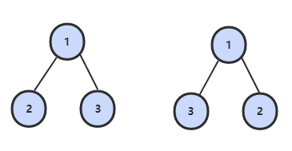
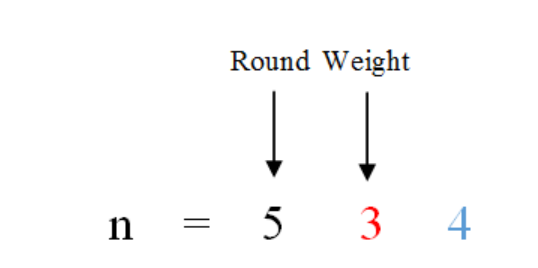
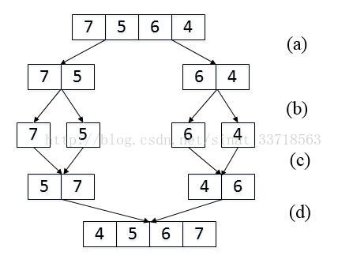

<!-- TOC START min:2 max:2 link:true update:true -->
- [1.单例模式](#1单例模式)
- [2.数组中重复的数字](#2数组中重复的数字)
- [3.二维数组中的查找](#3二维数组中的查找)
- [4.替换空格](#4替换空格)
- [5.从尾到头打印链表](#5从尾到头打印链表)
- [6.重建二叉树](#6重建二叉树)
- [7.二叉树的下一个节点](#7二叉树的下一个节点)
- [8.用两个栈模拟队列](#8用两个栈模拟队列)
- [9.斐波那契数列](#9斐波那契数列)
- [9.1 跳台阶](#91-跳台阶)
- [9.2 变态跳台阶](#92-变态跳台阶)
- [9.3 矩形覆盖](#93-矩形覆盖)
- [10.旋转数组的最小数字](#10旋转数组的最小数字)
- [11.矩阵中的路径](#11矩阵中的路径)
- [12.机器人运动范围](#12机器人运动范围)
- [动态规划和贪婪算法](#动态规划和贪婪算法)
- [13.剪绳子](#13剪绳子)
- [14.二进制中 1 的个数](#14二进制中-1-的个数)
- [15.数值的整数次方](#15数值的整数次方)
- [16.打印从 1 到最大的 n 位数](#16打印从-1-到最大的-n-位数)
- [17.1在 O(1) 时间内删除链表节点](#171在-o1-时间内删除链表节点)
- [17.2删除链表中重复的结点](#172删除链表中重复的结点)
- [18.正则表达式匹配](#18正则表达式匹配)
- [19.表示数值的字符串](#19表示数值的字符串)
- [20.调整数组顺序使奇数位于偶数前面](#20调整数组顺序使奇数位于偶数前面)
- [21.链表中倒数第 K 个结点](#21链表中倒数第-k-个结点)
- [22.链表中环的入口结点](#22链表中环的入口结点)
- [23.反转链表](#23反转链表)
- [24.合并两个排序的链表](#24合并两个排序的链表)
- [25.树的子结构](#25树的子结构)
- [26.二叉树的镜像](#26二叉树的镜像)
- [27.对称的二叉树](#27对称的二叉树)
- [28.顺时针打印矩阵](#28顺时针打印矩阵)
- [29.包含min函数的栈](#29包含min函数的栈)
- [30.栈的压入、弹出序列](#30栈的压入弹出序列)
- [31.1从上往下打印二叉树](#311从上往下打印二叉树)
- [31.2 把二叉树打印成多行](#312-把二叉树打印成多行)
- [32.3 按之字形顺序打印二叉树](#323-按之字形顺序打印二叉树)
- [33. 二叉搜索树的后序遍历序列](#33-二叉搜索树的后序遍历序列)
- [34.二叉树中和为某一值的路径](#34二叉树中和为某一值的路径)
- [35. 复杂链表的复制](#35-复杂链表的复制)
- [36.二叉搜索树和双向链表](#36二叉搜索树和双向链表)
- [37.序列化二叉树](#37序列化二叉树)
- [38.字符串的排列](#38字符串的排列)
- [39.数组中出现次数超过一半的数字](#39数组中出现次数超过一半的数字)
- [40.最小的 K 个数](#40最小的-k-个数)
- [41.1数据流中的中位数](#411数据流中的中位数)
- [41.2字符流中第一个不重复的字符](#412字符流中第一个不重复的字符)
- [42.连续子数组的最大和](#42连续子数组的最大和)
- [43.从 1 到 n 整数中 1 出现的次数](#43从-1-到-n-整数中-1-出现的次数)
- [44.数字序列中的某一位数字](#44数字序列中的某一位数字)
- [45.把数组排成最小的数](#45把数组排成最小的数)
- [46.把数字翻译成字符串](#46把数字翻译成字符串)
- [47.礼物的最大价值](#47礼物的最大价值)
- [48.最长不含重复字符的子字符串](#48最长不含重复字符的子字符串)
- [49.丑数](#49丑数)
- [50.第一个只出现一次的字符位置](#50第一个只出现一次的字符位置)
- [51.数组中的逆序对](#51数组中的逆序对)
- [52.两个链表的第一个公共节点](#52两个链表的第一个公共节点)
- [53.数字在排序数组中出现的次数](#53数字在排序数组中出现的次数)
- [53.1 0~n-1中缺失的数字](#531-0n-1中缺失的数字)
- [53.2 数组中数值和下标相等的元素](#532-数组中数值和下标相等的元素)
- [54.二叉查找树的第 K 个结点](#54二叉查找树的第-k-个结点)
- [55.1二叉树的深度](#551二叉树的深度)
- [55.2平衡二叉树](#552平衡二叉树)
- [56.数组中只出现一次的数字](#56数组中只出现一次的数字)
- [57.1和为 S 的两个数字](#571和为-s-的两个数字)
- [57.2和为 S 的连续正数序列](#572和为-s-的连续正数序列)
- [58.1翻转单词顺序列](#581翻转单词顺序列)
- [58.2 左旋转字符串](#582-左旋转字符串)
- [59.滑动窗口的最大值](#59滑动窗口的最大值)
- [60.扑克牌顺子](#60扑克牌顺子)
- [61.圆圈中最后剩下的数](#61圆圈中最后剩下的数)
- [62.股票的最大利润](#62股票的最大利润)
- [小结](#小结)

<!-- TOC END -->


## 1.单例模式
[单例模式](https://github.com/LycPandaria/JavaInterview/blob/master/notes/%E8%AE%BE%E8%AE%A1%E6%A8%A1%E5%BC%8F.md#Singleton-%E5%8D%95%E4%BE%8B)


## 2.数组中重复的数字
[NowCode](https://www.nowcoder.com/practice/623a5ac0ea5b4e5f95552655361ae0a8?tpId=13&tqId=11203&tPage=1&rp=1&ru=/ta/coding-interviews&qru=/ta/coding-interviews/question-ranking)

### 问题描述
在一个长度为n的数组里的所有数字都在0到n-1的范围内。 数组中某些数字是重复的，但不知道有几个数字是重复的。也不知道每个数字重复几次。请找出数组中任意一个重复的数字。 例如，如果输入长度为7的数组{2,3,1,0,2,5,3}，那么对应的输出是第一个重复的数字2。

### 解题思路
解决这个问题最简单的做法是把输入的数组排序，然后遍历数组，判断 arr[i] 是否等于 arr[i+1]即可，这样的时间复杂度为 O(nlogn).

还可以利用哈希表来解决问题，遍历数组并将其尝试放入到哈希表中，如果在哈希表中已经存在，则说明重复了。这样的时间复杂度和空间复杂度都是O(n).

更好的解法是：从头到尾依次扫描这个数组，当扫描到下标为 i 的数字时，首先比较这个数字 arr[i] 是不是等于 i。如果是，则接着扫描下一个数字；如果不是，则拿它和第 arr[i] 个数字进行比较，如果相等，就找到了一个重复的数字，如果不等，就把第 i 个数字和第 arr[i] 个数字进行交换，重复此过程。**相当于每次将值为 i 的数调整到第 i 位**

以 (2, 3, 1, 0, 2, 5) 为例：
```text
position-0 : (2,3,1,0,2,5) // 2 <-> 1
             (1,3,2,0,2,5) // 1 <-> 3
             (3,1,2,0,2,5) // 3 <-> 0
             (0,1,2,3,2,5) // already in position
position-1 : (0,1,2,3,2,5) // already in position
position-2 : (0,1,2,3,2,5) // already in position
position-3 : (0,1,2,3,2,5) // already in position
position-4 : (0,1,2,3,2,5) // nums[i] == nums[nums[i]], exit
```
```java
public boolean duplicate(int numbers[],int length,int [] duplication) {
    // 数组检查
    if(numbers==null || length <=0)
        return false;
    for(Integer num : numbers)   // 迭代器只能用包装类 Integer,不能用 int
        if(num < 0 || num > length-1)
            return false;

    // 算法在这一步相当于将数组进行排序，0放到 numbers[0] 处，1 放到 numbers[1] 处
    for(int i = 0; i < length; i++){
        while(numbers[i] != i){
            if(numbers[i] == numbers[numbers[i]]){
                duplication[0]=numbers[i];
                return true;
            }
            // 交换完成排序
            int tmp = numbers[i];
            numbers[i] = numbers[tmp];
            numbers[tmp] = tmp;
        }
    }
    // 循环了一遍没 return true，那就是没找到，返回false
    return false;
}
```

## 3.二维数组中的查找
[NowCode](https://www.nowcoder.com/practice/abc3fe2ce8e146608e868a70efebf62e?tpId=13&tqId=11154&tPage=1&rp=1&ru=/ta/coding-interviews&qru=/ta/coding-interviews/question-ranking)
### 问题描述
在一个二维数组中（每个一维数组的长度相同），每一行都按照从左到右递增的顺序排序，每一列都按照从上到下递增的顺序排序。请完成一个函数，输入这样的一个二维数组和一个整数，判断数组中是否含有该整数。
```text
Consider the following matrix:
[
  [1,   4,  7, 11, 15],
  [2,   5,  8, 12, 19],
  [3,   6,  9, 16, 22],
  [10, 13, 14, 17, 24],
  [18, 21, 23, 26, 30]
]

Given target = 5, return true.
Given target = 20, return false.
```

### 解决思路
首先选取数组中右上角的数字 n 如果该数字等于要查找的数字 m，则查找过程结束；如果该数字 n 大于要查找的数字 m，则剔除这个 n 所在的列，因为 n 是该列的最小值，如果 n 小于 要查找的数字 m，则剔除 m 所在的行，因为 n 已经是所在行的最大值。

复杂度：O(M + N) + O(1)

```java
public boolean Find(int target, int [][] array) {
    if(array == null || array.length == 0 || array[0].length == 0)
        return false;
    int rows = array.length;
    int cols = array[0].length;
    int row = 0;
    int col = cols - 1;    // 从右上角开始
    while(col >=0 && row < rows){
        if(array[row][col] == target)
            return true;
        // 要找的数比 arr[row][col] 小，则在该位置的左侧继续找( col-1 )
        else if(array[row][col] > target){
            col--;
        // 要找的数比 arr[row][col] 大，则在该位置的下方继续找( row+1 )
        }else
            row++;
    }
    return false;
}
```

## 4.替换空格
[NowCode](https://www.nowcoder.com/practice/4060ac7e3e404ad1a894ef3e17650423?tpId=13&tqId=11155&tPage=1&rp=1&ru=/ta/coding-interviews&qru=/ta/coding-interviews/question-ranking)
### 问题描述
请实现一个函数，将一个字符串中的每个空格替换成“%20”。例如，当字符串为We Are Happy.则经过替换之后的字符串为We%20Are%20Happy。

### 解题思路
最直观的做法是从头到尾扫描字符串，每次碰到空格字符的时候进行替换，但是这样，我们必须把后面的所有字符往后移两个字节。这样的方法时间复杂度为O(n^2)

更好的解法是：我们先遍历一次字符串，统计出空格的个数，然后计算出替换后的长度。准备两个指针 P1 和 P2，P1 指向原始字符串的末尾，P2 指向替换后的字符串末尾。接下来我们向前移动 P1， 逐个把它复制到 P2 所在位置，然后再遇到空格的时候 P1 向前移动一格，P2 前移3格并插入 "%20" 。**当 P1 和 P2 指向同一个位置，表明所以的空格已经替换完毕**

```java
public String replaceSpace(StringBuffer str) {
  int P1 = str.length() - 1;
    // 计算空格数量，遇到一个空格就在字符串后加"  "2个空格
    // 因为要替换掉 空格 -> %20 所以遇到一个空格，让字符串长度加2即可
    for(int i= 0; i <= P1; i++)
        if(str.charAt(i) == ' ')
            str.append("  ");   //  两个空格
    int P2 = str.length() - 1;
    while(P1 >=0 && P1 < P2){   // P1 >= P2 说明已经没空格了
        char c = str.charAt(P1--);  // c 存储现在要处理的字符，P1 指向前一个字符
        if(c == ' '){
            str.setCharAt(P2--,'0');
            str.setCharAt(P2--,'2');
            str.setCharAt(P2--,'%');
        }else
            str.setCharAt(P2--,c);
    }
    return str.toString();
}
```

## 5.从尾到头打印链表
[NowCode](https://www.nowcoder.com/practice/d0267f7f55b3412ba93bd35cfa8e8035?tpId=13&tqId=11156&tPage=1&rp=1&ru=/ta/coding-interviews&qru=/ta/coding-interviews/question-ranking)

### 问题描述
输入一个链表，按链表值从尾到头的顺序返回一个ArrayList。

### 解题思路
1. 栈结构
  每经过一个节点，把该节点放到一个栈中，遍历完整个链表。
  ```java
  public ArrayList<Integer> printListFromTailToHead(ListNode listNode) {
        Stack<Integer> stack = new Stack<>();
        while(listNode != null){
            stack.add(listNode.val);
            listNode = listNode.next;
        }
        ArrayList<Integer> result = new ArrayList<>();
        while(!stack.isEmpty())
            result.add(stack.pop());
        return result;
  }
  ```
2. 递归
  递归在本质上也是一个栈。我们每访问一个节点，先递归到它后面的节点，最后再输出节点的值。
  ```java
  public ArrayList<Integer> result = new ArrayList<>();
  public ArrayList<Integer> printListFromTailToHead(ListNode listNode) {
      if(listNode != null){
          printListFromTailToHead(listNode.next);
          result.add(listNode.val);
      }
      return result;
  }
  ```


## 6.重建二叉树
[NowCode](https://www.nowcoder.com/practice/8a19cbe657394eeaac2f6ea9b0f6fcf6?tpId=13&tqId=11157&tPage=1&rp=1&ru=/ta/coding-interviews&qru=/ta/coding-interviews/question-ranking)
### 问题描述
根据二叉树的前序遍历和中序遍历的结果，重建出该二叉树。假设输入的前序遍历和中序遍历的结果中都不含重复的数字。
```text
preorder = [3,9,20,15,7]
inorder =  [9,3,15,20,7]
```

### 解题思路
前序遍历的第一个数字就是根节点的值，然后在中序遍历中，在根节点的值的位置之前的就是左子树，在根节点的值的位置之后的就是右子树。这样就可以确定出左右子树对应的序列。

```text
根据描述，3是根节点，那么我们可以确认：
左子树为 [9], 右子树为[15,20,7]，根节点为 3.
同样的道理我们把这个方法递归到左右子树，我们也知道左右子树对应的前序和中序，这样便可以重建二叉树
```

```java
/**
 * Definition for binary tree
 * public class TreeNode {
 *     int val;
 *     TreeNode left;
 *     TreeNode right;
 *     TreeNode(int x) { val = x; }
 * }
 */
import java.util.Map;
import java.util.HashMap;
public class Solution {
    // 缓存中序遍历，值及其对应的位置
    private Map<Integer,Integer> inLocMap = new HashMap<Integer,Integer>();

    public TreeNode reConstructBinaryTree(int [] pre,int [] in) {
        for(int i = 0; i < in.length; i++)
            inLocMap.put(in[i], i);
        return reConstructBinaryTree(pre, 0, pre.length-1, 0);
    }
    /*
    pre  - 前序遍历数组
    preL - 表示当前子树前序遍历的开始位置
    preR - 表示当前子树前序遍历的结束位置
    inL  - 表示当前子树的中序遍历的开始位置
    */
    private TreeNode reConstructBinaryTree(int[] pre, int preL, int preR, int inL){
        if(preL > preR)
            return null;
        // 前序遍历的第一个元素是根元素
        TreeNode root = new TreeNode(pre[preL]);
        // 找出根元素在中序遍历的位置
        int rootLoc = inLocMap.get(root.val);
        // 根据根元素在中序遍历的位置，计算左子树大小，进而我们知道左子树序列在前序中对应的位置
        int leftSize = rootLoc - inL;
        // 遍历构建子树
        // preL+1到preL+leftSize 这个区间就是对应的左子树序列
        root.left = reConstructBinaryTree(pre, preL+1, preL+leftSize, inL);
        // preL+leftSize 到 preR 就是对应右子树的序列，
        // 同时右子树序列对应的中序遍历的开始位置就是 根元素在中序遍历的位置+1
        root.right = reConstructBinaryTree(pre, preL+leftSize+1, preR, rootLoc + 1);
        return root;
    }
}
```

## 7.二叉树的下一个节点
[NowCode](https://www.nowcoder.com/practice/9023a0c988684a53960365b889ceaf5e?tpId=13&tqId=11210&tPage=1&rp=1&ru=/ta/coding-interviews&qru=/ta/coding-interviews/question-ranking)
### 问题描述
给定一个二叉树和其中的一个结点，请找出中序遍历顺序的下一个结点并且返回。注意，树中的结点不仅包含左右子结点，同时包含指向父结点的指针。
```java
public class TreeLinkNode {
    int val;
    TreeLinkNode left = null;
    TreeLinkNode right = null;
    TreeLinkNode next = null; // 指向parent

    TreeLinkNode(int val) {
        this.val = val;
    }
}
```

### 解题思路
这题应该按情况来分析：
1. 如果一个节点有右子树，那么它的下一个节点就是它的右子树的最左子树。从右子节点出发一直沿着左子节点走，遇到 node.left == null 即可返回，这个就是下一个节点。

  

2. 接着分析一个节点没有右子节点的情况，如果节点是它父亲的左子节点，那么父亲节点就是下一个节点
3. 如果一个节点既没有右子节点，而且节点是它父亲的右子节点，我们可以一直沿着父亲节点往上走，知道找到一个是它父节点的左子节点的节点。

  

```java
public TreeLinkNode GetNext(TreeLinkNode pNode){
    if(pNode==null)
        return null;
    if(pNode.right != null){    // 如果有右子节点
        TreeLinkNode node = pNode.right;    // 从右子节点出发
        while(node.left != null){
            node = node.left;
        }
        return node;
    }else{    // 没有右子节点
        while(pNode.next != null){
            TreeLinkNode parent = pNode.next;
            // 节点是它父亲的左子节点
            if(pNode == parent.left)
                return parent;
            // 沿着父亲节点往上走
            pNode = pNode.next;
        }
        return null;
    }
}
```

## 8.用两个栈模拟队列
[NowCode](https://www.nowcoder.com/practice/54275ddae22f475981afa2244dd448c6?tpId=13&tqId=11158&tPage=1&rp=1&ru=/ta/coding-interviews&qru=/ta/coding-interviews/question-ranking)
### 问题描述
用两个栈来实现一个队列，完成队列的Push和Pop操作。 队列中的元素为int类型。

### 解题思路
要入列时，入栈A即可，要出队列则分两种情况：
1. 若栈B不为空，则直接弹出栈B
2. 若栈B为空，则需要依次弹出栈A，入到栈B，在弹出栈B

```java
Stack<Integer> in = new Stack<Integer>();
Stack<Integer> out = new Stack<Integer>();

public void push(int node) {
    // 入列时，直接入到 stack in 即可
    in.push(node);
}

public int pop() {
    // 如果 stack out 不为空，则直接 pop 栈 out
    if(!out.isEmpty())
        return out.pop();
    else{
        // 如果 stack out 为空，则需要先把 stack in 全部 pop 出来，push 到 out 栈
        while(!in.isEmpty())
            out.push(in.pop());
    }
    return out.pop();
}
```

## 9.斐波那契数列
[NowCode](https://www.nowcoder.com/practice/c6c7742f5ba7442aada113136ddea0c3?tpId=13&tqId=11160&tPage=1&rp=1&ru=/ta/coding-interviews&qru=/ta/coding-interviews/question-ranking)

### 问题描述
大家都知道斐波那契数列，现在要求输入一个整数n，请你输出斐波那契数列的第n项（从0开始，第0项为0）。
n<=39

### 解题思路
最简单的办法首先是递归，但是递归在 n 值较大的时候会影响效率，而且很多计算会重复计算。
```java
// 递归
public int Fibonacci(int n) {
    if(n <= 1)
        return n;
    return Fibonacci(n-1) + Fibonacci(n-2);
}
```

递归是将一个问题划分成多个子问题求解，动态规划也是如此，但是动态规划会把子问题的解缓存起来（用一个数组），从而避免重复求解子问题。
```java
// 动态规划
public int Fibonacci(int n) {
    if(n <= 1)
        return n;
    int[] fib = new int[n+1];
    fib[0] = 0;
    fib[1] = 1;    
    for(int i=2; i <=n; i ++)
        //缓存结果
        fib[i] = fib[i-1] + fib[i-2];
    return fib[n];
}
```

但其实可以发现 fib[n] 只跟 fib[n-1] 和 fib[n-2] 有关，所以我们只能保存两个结果，计算出 fib[n] 即可。通过 f(0) 和 f(1) 计算 f(2)，然后根据 f(2) 和 f(1) 计算 f(3)... 以此类推.
```java
public int Fibonacci(int n) {
    if(n <= 1)
        return n;
    int fibN1 = 1;    // fib(n-1)
    int fibN2 = 0;    // fib(n-2)
    int fibN = 0;
    for(int i = 2; i <= n; i++){
        fibN = fibN1 + fibN2;    // 计算 fibN
        fibN2 = fibN1;            // 进入下一次计算，f(n-2) = f(n-1)
        fibN1 = fibN;             // f(n-1) = f(n)
    }
    return fibN;
}
```

## 9.1 跳台阶
[跳台阶](https://www.nowcoder.com/practice/8c82a5b80378478f9484d87d1c5f12a4?tpId=13&tqId=11161&tPage=1&rp=1&ru=%2Fta%2Fcoding-interviews&qru=%2Fta%2Fcoding-interviews%2Fquestion-ranking)

### 问题描述
一只青蛙一次可以跳上1级台阶，也可以跳上2级。求该青蛙跳上一个n级的台阶总共有多少种跳法（先后次序不同算不同的结果）。

### 解题思路
最简单的情况，如果只有 1 级台阶就只有 1 种跳法。有 2 级台阶只有 2 中跳法。

一般情况，我们把 跳 n 级台阶的跳法看成是 n 的函数 f(n)。当 n>2 时，第一次跳的时候就有两种不同的选择，一是第一次只跳 1 级，此时跳法总数等于后面剩下的 n-1 级台阶的跳法总数。第一次只跳 2 级，此时跳法总数等于后面剩下的 n-2 级台阶的跳法总数。这很明显就是一个斐波那契数列。

```java
public int JumpFloor(int target) {
    if(target <= 2)
        return target;
    int jumpN1 = 2;    // 这里表示 f(n-1)
    int jumpN2 = 1;    // f(n-2)
    int jumpN = 1;
    for(int i=3; i <= target; i++){
        jumpN = jumpN1 + jumpN2;
        jumpN2 = jumpN1;
        jumpN1 = jumpN;
    }
    return jumpN;
}
```

## 9.2 变态跳台阶
[变态跳台阶](https://www.nowcoder.com/practice/22243d016f6b47f2a6928b4313c85387?tpId=13&tqId=11162&tPage=1&rp=1&ru=%2Fta%2Fcoding-interviews&qru=%2Fta%2Fcoding-interviews%2Fquestion-ranking)

### 问题描述
一只青蛙一次可以跳上1级台阶，也可以跳上2级……它也可以跳上n级。求该青蛙跳上一个n级的台阶总共有多少种跳法。

### 解题思路
**动态规划**
```java
public int JumpFloorII(int target) {
    int[] dp = new int[target]; // 用于缓存结果
    Arrays.fill(dp, 1);   // 预设为 1，因为一次性跳 n 次台阶的方法为1次
    for (int i = 1; i < target; i++)
        for (int j = 0; j < i; j++)
            dp[i] += dp[j];   // 根据之前的结果累加到当前台阶的跳法总数
    return dp[target - 1];
}
```

## 9.3 矩形覆盖
[矩形覆盖](https://www.nowcoder.com/practice/72a5a919508a4251859fb2cfb987a0e6?tpId=13&tqId=11163&tPage=1&rp=1&ru=/ta/coding-interviews&qru=/ta/coding-interviews/question-ranking)

### 问题描述
我们可以用2\*1的小矩形横着或者竖着去覆盖更大的矩形。请问用n个2\*1的小矩形无重叠地覆盖一个2\*n的大矩形，总共有多少种方法？

### 解题思路
这其实还是一个 斐波那契数列
```java
public int RectCover(int target) {
    if(target <= 2 )
        return target;
    int rcN1 = 2;
    int rcN2 = 1;
    int rcN = 1;
    for(int i=3; i <= target; i++){
        rcN = rcN1 + rcN2;
        rcN2 = rcN1;
        rcN1 = rcN;
    }
    return rcN;
}
```
# 查找和排序
## 10.旋转数组的最小数字
[旋转数组的最小数字](https://www.nowcoder.com/practice/9f3231a991af4f55b95579b44b7a01ba?tpId=13&tqId=11159&tPage=1&rp=1&ru=/ta/coding-interviews&qru=/ta/coding-interviews/question-ranking)

### 问题描述
把一个数组最开始的若干个元素搬到数组的末尾，我们称之为数组的旋转。 输入一个非减排序的数组的一个旋转，输出旋转数组的最小元素。 例如数组{3,4,5,1,2}为{1,2,3,4,5}的一个旋转，该数组的最小值为1。

NOTE：给出的所有元素都大于0，若数组大小为0，请返回0。

### 解题思路
最直观的解法肯定是从头遍历一次数组，然后找出最小的数，但是这种思路的时间复杂度为 O(n)，而且并没有用到数组原来就有序的情况和旋转数组的特性。

我们注意到旋转之后的数组实际上可以划分为两个排序的子数组，而且前面子数组的元素都大于或者等于后面子数组的元素。我们还注意到最小的元素刚好是这两个子数组的分界线。

- 当 nums[m] <= nums[h] 的情况下，说明解在 [l, m] 之间，此时令 h = m；
- 否则解在 [m + 1, h] 之间，令 l = m + 1。

```java
public int minNumberInRotateArray(int [] array) {
    if(array.length == 0)
        return 0;
    int left = 0, right = array.length-1;
    while(left < right){
        int mid = left + (right - left) / 2;    // 中间元素
        if(array[mid] <= array[right])
            // 说明 array[mid...right] 属于右边的排序区间，最小值在 array[left...mid]
            right = mid;
        else
            left = mid + 1;
    }
    return array[left];
}
```

如果数组元素允许重复的话，那么就会出现一个特殊的情况：nums[l] == nums[m] == nums[h]，那么此时无法确定解在哪个区间，需要切换到顺序查找。例如对于数组 {1,1,1,0,1}，l、m 和 h 指向的数都为 1，此时无法知道最小数字 0 在哪个区间。

```java
public int minNumberInRotateArray(int[] nums) {
    if (nums.length == 0)
        return 0;
    int l = 0, h = nums.length - 1;
    while (l < h) {
        int m = l + (h - l) / 2;
        if (nums[l] == nums[m] && nums[m] == nums[h])
            return minNumber(nums, l, h);
        else if (nums[m] <= nums[h])
            h = m;
        else
            l = m + 1;
    }
    return nums[l];
}
// l--h 区间无法区分解在哪个区间，需在 l--h 区间进行顺序查找
private int minNumber(int[] nums, int l, int h) {
    for (int i = l; i < h; i++)
        if (nums[i] > nums[i + 1])  // 遇到了分界线，则分界线右边第一个就是最小的
            return nums[i + 1];
    return nums[l];
}
```

## 11.矩阵中的路径
[矩阵中的路径](https://www.nowcoder.com/practice/c61c6999eecb4b8f88a98f66b273a3cc?tpId=13&tqId=11218&tPage=1&rp=1&ru=/ta/coding-interviews&qru=/ta/coding-interviews/question-ranking)

### 问题描述
请设计一个函数，用来判断在一个矩阵中是否存在一条包含某字符串所有字符的路径。路径可以从矩阵中的任意一个格子开始，每一步可以在矩阵中向左，向右，向上，向下移动一个格子。如果一条路径经过了矩阵中的某一个格子，则之后不能再次进入这个格子。 例如 a b c e s f c s a d e e 这样的3 X 4 矩阵中包含一条字符串"bcced"的路径，但是矩阵中不包含"abcb"路径，因为字符串的第一个字符b占据了矩阵中的第一行第二个格子之后，路径不能再次进入该格子。


### 解题思路
这是一个可以用回溯法解决的问题。首先，在矩阵中任选一个格子作为路径的起点。假设矩阵中某个格子的字符为 ch，而且这个格子对应于路径上的第 i 个字符。如果路径上第 i 个字符不是 ch，那么这个格子不可能处在路径在第 i 的位置。如果路径上的第 i 个字符是 ch，那么到相邻的格子上寻找路径上第 i+1 个字符。重复这个过程，知道路径上所有字符都在矩阵内找到相应位置。

由于回溯法的递归特性，路径可以被看做一个栈。当在矩阵中定位了路径中前 n 个字符的位置之后，在与第 n 个字符对应的格子的周围都未找到第 n+1 个字符，便要回到第 n-1 个字符，重新定位第 n 个字符。

而且由于路径不能重复进入矩阵的格子，所以还要定义个布尔矩阵，标记进入过的格子。

```java
public class Solution {
    public boolean hasPath(char[] array, int rows, int cols, char[] str)
    {
        if(rows < 1 || cols < 1 || str == null || str.length < 1)
            return false;

        // 布尔矩阵用于标识走路径格子
        boolean visited[][] = new boolean[rows][cols];
        int pathLen = 0; // 用于标记匹配到第几位上了
        char[][] matrix = buildMatrix(array,rows, cols);

        for(int row = 0; row < rows; row++)
            for(int col = 0; col < cols; col++)
                if(hasPathCore(matrix, str, visited, rows, cols, row, col, pathLen))
                    return true;

        return false;
    }

    public boolean hasPathCore(char[][] matrix, char[] str, boolean[][] visited, int rows, int cols,
                               int row, int col,int pathLen){
        if(pathLen == str.length)
            return true;

        boolean hasPath = false;
        if(row >= 0 && col >= 0 && row < rows && col < cols
          && matrix[row][col] == str[pathLen] && !visited[row][col]){
            // 这种情况说明字符串的第 i 个字符和 matrix[row][col] 相等
            pathLen ++ ;    // 第 i 个字符匹配完成
            visited[row][col] = true;
            // 当矩阵中坐标为 (row,col) 的格子和路径字符中下标为 pathLen 的字符一样时候，从四个相邻格子去定位
            // 路径字符串中下标为 pathLe+1 的字符
            hasPath = hasPathCore(matrix, str, visited, rows, cols, row, col-1, pathLen)    //左边一格
                || hasPathCore(matrix, str, visited, rows, cols, row, col+1, pathLen)    // 右边一格
                || hasPathCore(matrix, str, visited, rows, cols, row-1, col, pathLen)    // 上面一格
                || hasPathCore(matrix, str, visited, rows, cols, row+1, col, pathLen);    // 下面一格

            if(!hasPath){    // 没有路径，说明这个格子走不通，走不下去，需要回退
                pathLen--;
                visited[row][col] = false;
            }
        }
        return hasPath;
    }

    private char[][] buildMatrix(char[] array, int rows, int cols) {
        char[][] matrix = new char[rows][cols];
        for (int i = 0, idx = 0; i < rows; i++)
            for (int j = 0; j < cols; j++)
                matrix[i][j] = array[idx++];
        return matrix;
    }

}
```

## 12.机器人运动范围
[机器人运动范围](https://www.nowcoder.com/practice/6e5207314b5241fb83f2329e89fdecc8?tpId=13&tqId=11219&rp=1&ru=/ta/coding-interviews&qru=/ta/coding-interviews/question-ranking)

### 问题描述
地上有一个m行和n列的方格。一个机器人从坐标0,0的格子开始移动，每一次只能向左，右，上，下四个方向移动一格，但是不能进入行坐标和列坐标的数位之和大于k的格子。 例如，当k为18时，机器人能够进入方格（35,37），因为3+5+3+7 = 18。但是，它不能进入方格（35,38），因为3+5+3+8 = 19。请问该机器人能够达到多少个格子？

### 思路
这个方格可以看做一个 m*n 的矩阵。机器人从坐标(0,0)开始，当它进入坐标 (i,j) 的格子，通过检查坐标的数位和判断机器人是否能够进入。如果机器人能进入坐标 (i,j) 的格子，则再判断它是否能进入相邻格子。

```java
public int movingCount(int threshold, int rows, int cols)
{
    if(threshold < 0 || rows  <= 0 || cols <= 0 )
        return 0;

    boolean visited[][] = new boolean[rows][cols];
    int count = movingCountCore(threshold, rows, cols, 0, 0, visited);

    return count;
}

private int movingCountCore(int threshold, int rows, int cols,
                           int row, int col, boolean[][] visited){
    int count = 0;
    if(check(threshold, rows, cols, row, col, visited)){
        visited[row][col] = true;
        count = 1 + movingCountCore(threshold, rows, cols, row+1, col, visited)
            + movingCountCore(threshold, rows, cols, row-1, col, visited)
            + movingCountCore(threshold, rows, cols, row, col+1, visited)
            + movingCountCore(threshold, rows, cols, row, col-1, visited);
    }
    return count;
}

private boolean check(int threshold, int rows, int cols,
                     int row, int col, boolean[][] visited){
    // 这个函数用于检测机器人能否进入该格子中
    if(row >= 0 && col >=0 && row < rows && col < cols
      && !visited[row][col]
      && getDigiSum(row) + getDigiSum(col) <= threshold)
        return true;
    return false;
}

private int getDigiSum(int number){
    int sum = 0;
    while(number > 0){
        sum+=number%10;
        number /= 10;
    }
    return sum;
}
```

## 动态规划和贪婪算法
动态规划：

如果一个问题是求一个问题的最优解，而且该问题能够分解成若干子问题，并且子问题之间还有重叠的更小的子问题，就可以考虑。

例如在面试题 13 中，我们如何打长度为 n 的绳子剪成若干段，使得各段乘积最大。这个问题是求一个问题的最优解--这是动态规划求解的第一个特点。

我们把长度为 n 的绳子剪成若干段后得到的乘积最大值定义为 f(n)。加入我们把第一刀剪在长度为 i 的位置，我们要得到 f(n), 就要依靠 f(i) 和 f(n-i) 的最优解。也就是说整体问题的最优解是依赖于子问题的最优解-- 这是动态规划求解的第二个特点。

我们把大问题分解成若干个小问题，但是小问题之间还有互相重叠的子问题--这是动态规划求解的第三个特点。例如 f(10) 可以分成 f(6) 和 f(4)，f(6) 可以分成 f(4) 和 f(2)。这就体现了子问题存在重叠的情况

由于子问题在分解过程中重复出现，为了避免重复求解子问题，我们可以从下到上先计算小问题并存储结果，以此为基础求取大问题的最优解。从上往下分析，从下往上求解，这是动态规划的第四个特点。

## 13.剪绳子
[leetcode](https://leetcode.com/problems/integer-break/description/)

### 问题描述
把一根绳子剪成多段，并且使得每段的长度乘积最大。
```text
n = 2
return 1 (2 = 1 + 1)

n = 10
return 36 (10 = 3 + 3 + 4)
```

### 解题思路
我们把长度为 n 的绳子剪成若干段后得到的乘积最大值定义为 f(n)，在剪第一刀的时候，有 n-1 种可能，也就是剪出来的第一段绳子的可能长度可能为 1,2,...n-1. 因此 f(n)=max(f(i)\*f(n-i))

自下而上计算，存储结果。

```java
public int integerBreak(int n) {
    if(n < 2) return 0;
    if(n == 2) return 1;
    if(n == 3) return 2;

    int dp[] = new int [n+1];   // 存储 f(i)
    dp[0] = 0;
    dp[1] = 1;
    dp[2] = 2;
    dp[3] = 3;

    int max = 0;

    // 代码解释在下面
    for(int i = 4; i <=n; i++){
        // 因为对称，只需要循环到 i/2 即可
        for(int j=1; j <= i/2; j++){
          int product = dp[j] * dp[i-j];
          if(max < product)
            max = product;
          dp[i] = max;
        }
    }
    max = dp[n];
    return max;
}
```

在上述的代码中，子问题的最优解存在数组 dp 中，dp[i] 即为 把长度为 i 的绳子剪成若干段后的乘积最大值。第一个循环的 i 是递增的，说明计算是自下而上的。因此在求 f(i) 之前，对于每一个 j(0<j<i),f(j) 都是求出来的并保存在 dp[j] 中。 为了求解 f(i)，我们需要 **求出所有可能的 f(i)\*f(i-j) 并比较得出最大值**。这就是代码中第二个 for 的功能。

### 贪婪算法
尽可能多剪长度为 3 的绳子，并且不允许有长度为 1 的绳子出现。如果出现了，就从已经切好长度为 3 的绳子中拿出一段与长度为 1 的绳子重新组合，把它们切成两段长度为 2 的绳子。

证明：当 n >= 5 时，3(n - 3) - n = 2n - 9 > 0，且 2(n - 2) - n = n - 4 > 0。因此在 n >= 5 的情况下，将绳子剪成一段为 2 或者 3，得到的乘积会更大。又因为 3(n - 3) - 2(n - 2) = n - 5 >= 0，所以剪成一段长度为 3 比长度为 2 得到的乘积更大。

```java
public int integerBreak(int n) {
    if(n < 2)
      return 0;
    if(n == 2)
      return 1;
    if(n == 3)
      return 2;

    // 尽可能剪去长度为 3 的绳子
    int timeOf3 = n / 3;

    // 当绳子最后剩下的长度为 4，不能再剪去长度为 3 的短，拿出一个 3 米的组成 2*2 会更好
    if((n - timeOf3*3) == 1)
      timeOf3 -= 1;

    int timeOf2 = (n - timeOf3*3) / 2;

    return (int)(Math.powerN(3,timeOf3) * Math.powerN(2, timeOf2));
}
```
## 14.二进制中 1 的个数
[NowCode](https://www.nowcoder.com/practice/8ee967e43c2c4ec193b040ea7fbb10b8?tpId=13&tqId=11164&tPage=1&rp=1&ru=/ta/coding-interviews&qru=/ta/coding-interviews/question-ranking)

### 问题描述
输入一个整数，输出该数二进制表示中1的个数。其中负数用补码表示。

### 解题思路
**运用n&n-1**

该位运算去除 n 的位级表示中最低的那一位。
```text
n       : 10110100
n-1     : 10110011
n&(n-1) : 10110000
```

```java
public static int countOne(int n){
  int count = 0;
  while(n!=0){
    n = n&(n-1);
    count++;
  }
  return count;
}
```

**Integer.bitCount()**
```java
public int NumberOf1(int n) {
    return Integer.bitCount(n);
}
```


## 15.数值的整数次方
[NowCode](https://www.nowcoder.com/practice/1a834e5e3e1a4b7ba251417554e07c00?tpId=13&tqId=11165&tPage=1&rp=1&ru=/ta/coding-interviews&qru=/ta/coding-interviews/question-ranking)

### 问题的描述
给定一个double类型的浮点数base和int类型的整数exponent。求base的exponent次方。

### 解题思路
这道题的陷阱主要在于特殊情况的处理。比如：
1. 当 exponent = 0 的时候和 exponent = 1 的时候
2. 当 exponent < 0 的时候，要先求 base 的 abs(exponent) 次方，然后求倒数
3. 层层递进的算法，比如要求 2^16, 可以从 2^2 -> 2^4 -> 2^8 -> 2^16 这样进行加速

```java
public double Power(double base, int exponent) {
  // 特殊情况处理
  if(exponent == 1) return base;
  if(exponent == 0) return 1;
  // 处理负数指数，注意只有第一次才有机会 isNagetive 设为 false
  boolean isNagetive = false;
  if(exponent < 0){
      exponent = -exponent;
      isNagetive = true;
  }
  // 层层递进处理指数
  double result = Power(base * base, exponent / 2);
  // 指数为基数时候， 需要再乘一次
  if(exponent % 2 != 0)    
      result *= base;
  return isNagetive? 1/result: result;
}
```

## 16.打印从 1 到最大的 n 位数
### 问题描述
输入数字 n，按顺序打印出从 1 到最大的 n 位十进制数。比如输入 3，则打印出 1、2、3 一直到最大的 3 位数即 999。

### 解题思路
由于 n 可能会非常大，因此不能直接用 int 表示数字，而是用 char 数组进行存储。

使用回溯法得到所有的数。
```java
public void print1ToMaxOfNDigits(int n) {
    if (n <= 0) return;
    char[] number = new char[n];  // 存储组合结合，供printNumber 函数打印
    // 从第一个位置开始递归
    print1ToMaxOfNDigits(number, 0);
}

private void print1ToMaxOfNDigits(char[] number, int digit) {
    if (digit == number.length) {
      // 组合出一个结果
        printNumber(number);
        return;
    }
    for (int i = 0; i < 10; i++) {
      // 递增设置 digit 位置的字符，每设置一次，digit 后的位置都要重置位置
      // 这就是第二行的递归所作的事，直到满足上面 if 的返回条件
        number[digit] = (char) (i + '0');
        print1ToMaxOfNDigits(number, digit + 1);
    }
}

private void printNumber(char[] number) {
    int index = 0;
    // 移动浮标，定位到非 '0' 位置
    while (index < number.length && number[index] == '0')
        index++;
    // 打印非 '0' 字符
    while (index < number.length)
        System.out.print(number[index++]);
    System.out.println();
}
```

## 17.1在 O(1) 时间内删除链表节点
### 问题描述
给定单向链表的头指针和一个节点指针，定义一个函数在 O(1) 时间内删除该节点。

### 解题思路
分两种情况：
1. 若待删除的节点是链表的尾节点，因为删除之后无法给前置节点的next设置为null，所以必须要从头开始遍历到最后再执行删除。
2. 若待删除的节点不是尾节点，则可以通过交换这个节点与其后记节点的值，然后删除后继节点。

```java
public boolean deleteNode(Node n, Node head){
  if(n == null || head == null ) return false;
  if(n.next != null){   // 该节点不是尾节点
    //交换n节点与后继节点的值
    int tmp = n.data;
    n.data = n.next.data;
    n.next.data = tmp;
    //删除后继节点
    n.next = n.next.next;
  }else {   // n 是尾节点
    Node cur = head;
    while(cur.next != n){
      // 遍历到最后
      cur = cur.next;
    }
    cur.next = null;
  }
  return true;
}
```

## 17.2删除链表中重复的结点
[NowCode](https://www.nowcoder.com/practice/fc533c45b73a41b0b44ccba763f866ef?tpId=13&tqId=11209&tPage=1&rp=1&ru=/ta/coding-interviews&qru=/ta/coding-interviews/question-ranking)

### 问题描述
在一个排序的链表中，存在重复的结点，请删除该链表中重复的结点，重复的结点不保留，返回链表头指针。 例如，链表1->2->3->3->4->4->5 处理后为 1->2->5

### 解题思路
用递归的方式看起来更简洁

```java
public ListNode deleteDuplication(ListNode pHead){
    if(pHead == null || pHead.next ==null) return pHead;

    ListNode pNext = pHead.next;
    if(pNext.val == pHead.val){
        // 处理相等的情况,针对于当前的 pHead.val，相当于把相等的连续节点都跳过去
        while(pNext != null && pNext.val == pHead.val)
            pNext = pNext.next;
        // 当前的 pNext.val ！= pHead.val，就继续往下递归处理 pNext
        return deleteDuplication(pNext);  
    }else{
        // 注意这里要使用 pHead,确保返回的是头节点
        pHead.next = deleteDuplication(pHead.next);
        return pHead;
    }
}
```

## 18.正则表达式匹配
[NowCode](https://www.nowcoder.com/practice/45327ae22b7b413ea21df13ee7d6429c?tpId=13&tqId=11205&tPage=1&rp=1&ru=/ta/coding-interviews&qru=/ta/coding-interviews/question-ranking)

### 问题描述
请实现一个函数用来匹配包括'.'和'\*'的正则表达式。模式中的字符'.'表示任意一个字符，而'\*'表示它前面的字符可以出现任意次（包含0次）。 在本题中，匹配是指字符串的所有字符匹配整个模式。例如，字符串"aaa"与模式"a.a"和"ab*ac*a"匹配，但是与"aa.a"和"ab*a"均不匹配

### 解题思路

```java
// 没搞懂
public boolean match(char[] str, char[] pattern) {

    int m = str.length, n = pattern.length;
    boolean[][] dp = new boolean[m + 1][n + 1];

    dp[0][0] = true;
    for (int i = 1; i <= n; i++)
        if (pattern[i - 1] == '*')
            dp[0][i] = dp[0][i - 2];

    for (int i = 1; i <= m; i++)
        for (int j = 1; j <= n; j++)
            if (str[i - 1] == pattern[j - 1] || pattern[j - 1] == '.')
                dp[i][j] = dp[i - 1][j - 1];
            else if (pattern[j - 1] == '*')
                if (pattern[j - 2] == str[i - 1] || pattern[j - 2] == '.') {
                    dp[i][j] |= dp[i][j - 1]; // a* counts as single a
                    dp[i][j] |= dp[i - 1][j]; // a* counts as multiple a
                    dp[i][j] |= dp[i][j - 2]; // a* counts as empty
                } else
                    dp[i][j] = dp[i][j - 2];   // a* only counts as empty

    return dp[m][n];
}
```

## 19.表示数值的字符串
[NowCode](https://www.nowcoder.com/practice/6f8c901d091949a5837e24bb82a731f2?tpId=13&tqId=11206&tPage=1&rp=1&ru=/ta/coding-interviews&qru=/ta/coding-interviews/question-ranking)

### 问题描述
请实现一个函数用来判断字符串是否表示数值（包括整数和小数）。例如，字符串"+100","5e2","-123","3.1416"和"-1E-16"都表示数值。 但是"12e","1a3.14","1.2.3","+-5"和"12e+4.3"都不是。

### 解题思路
使用正则表达式进行匹配。
```text
[]  ： 字符集合
()  ： 分组
?   ： 重复 0 ~ 1
+   ： 重复 1 ~ n
*   ： 重复 0 ~ n
.   ： 任意字符
\\. ： 转义后的 .
\\d ： 数字
```

```java
public boolean isNumeric(char[] str) {
    if (str == null || str.length == 0)
        return false;
    return new String(str).matches("[+-]?\\d*(\\.\\d+)?([eE][+-]?\\d+)?");
}
```

## 20.调整数组顺序使奇数位于偶数前面
[NowCode](https://www.nowcoder.com/practice/beb5aa231adc45b2a5dcc5b62c93f593?tpId=13&tqId=11166&tPage=1&rp=1&ru=/ta/coding-interviews&qru=/ta/coding-interviews/question-ranking)

### 问题描述
输入一个整数数组，实现一个函数来调整该数组中数字的顺序，使得所有的奇数位于数组的前半部分，所有的偶数位于数组的后半部分，并保证奇数和奇数，偶数和偶数之间的相对位置不变。

### 解题思路
先遍历数组，然后得到奇数的个数 n，新建一个数组，遍历之前的数组，奇数从 0 位置开始插入，偶数从 n位置插入

```java
public void reOrderArray(int [] array) {
    int oddCount = 0; // 奇数个数
    for(int i=0; i < array.length; i++){
        if(array[i] % 2 == 1)
            oddCount++;
    }
    int[] arrCp = array.clone();  // 注意这里不能直接赋值
    int k = 0;
    int j = oddCount;
    for(int num : arrCp){
        if(num % 2 == 0)
            array[j++] = num;
        else
            array[k++] = num;
    }
}
```

## 21.链表中倒数第 K 个结点
[NowCode](https://www.nowcoder.com/practice/529d3ae5a407492994ad2a246518148a?tpId=13&tqId=11167&tPage=1&rp=1&ru=/ta/coding-interviews&qru=/ta/coding-interviews/question-ranking)

### 问题描述
输入一个链表，输出该链表中倒数第k个结点。

### 解题思路
1. 比较容易想到的是先遍历一遍算出链表的节点个数n，然后再遍历到第n-k个元素。但是这种方式需要遍历两次列表。
2. 还有一种做法是对于每个节点，遍历k个元素，如果刚好到结尾，那么那个节点就是倒数第k个节点。这种办法的问题在于
对同一批元素进行反复多次的遍历，时间复杂度为O(kn)，效率太低。
3. 更高效的方法是：设置两个指针，让其中一个比另一个先行 **k-1** 步，这样，当先行的指针到链表尾部时候，后行指针所指位置就是所要找的位置。

**注意程序的鲁棒性**
1. 链表是否为空
2. 输入的 k 大于链表的长度
3. 输入 k=0 的情况

```java
public ListNode FindKthToTail(ListNode head,int k) {
    if(k < 1 || head == null) return null;

    ListNode p1 = head;
    ListNode p2 = head;
    // p1 先走 k-1 步
    for(int i=0; i < k-1 && p1 != null; i++)
        p1 = p1.next;
    if(p1 == null)
        return null;    // k 值大于链表长度
    while(p1.next != null){   // 注意这里是 p1.next，p1走到最后一个节点即可
        p1 = p1.next;
        p2 = p2.next;
    }
    return p2;
}
```

## 22.链表中环的入口结点
[NowCode](https://www.nowcoder.com/practice/253d2c59ec3e4bc68da16833f79a38e4?tpId=13&tqId=11208&tPage=1&rp=1&ru=/ta/coding-interviews&qru=/ta/coding-interviews/question-ranking)

### 问题描述
给一个链表，若其中包含环，请找出该链表的环的入口结点，否则，输出null。

### 解题思路

使用双指针，一个指针 fast 每次移动两个节点，一个指针 slow 每次移动一个节点。因为存在环，所以两个指针必定相遇在环中的某个节点上。假设相遇点在下图的 y6 位置，此时 fast 移动的节点数为 x+2y+z，slow 为 x+y，由于 fast 速度比 slow 快一倍，因此 x+2y+z=2(x+y)，得到 x=z。

在相遇点，slow 要到环的入口点还需要移动 z 个节点，如果让 fast 重新从头开始移动，并且速度变为每次移动一个节点，那么它到环入口点还需要移动 x 个节点。在上面已经推导出 x=z，因此 fast 和 slow 将在环入口点相遇。

```java
public ListNode EntryNodeOfLoop(ListNode pHead){
    if(pHead == null)
      return null;
    ListNode slow = pHead;
    ListNode fast = pHead;
    // 先找相遇点，一个走一次一步，一个一次两步
    while(fast != null && fast.next != null){
        fast = fast.next.next;
        slow = slow.next;
        if(fast == slow)
            break;
    }
    if(fast == null || fast.next ==null)
        return null;    // 这种情况是没有环的
    // 开始找环入口点
    // 在链表头和相遇点各设一个指针，每次走一步，两个指针必定相遇且相遇第一点即为环入口点。
    slow = pHead;
    while(slow != fast){
        slow = slow.next;
        fast = fast.next;
    }
    return slow;
}
```


## 23.反转链表
[nowcoder](https://www.nowcoder.com/practice/75e878df47f24fdc9dc3e400ec6058ca?tpId=13&tqId=11168&rp=1&ru=/ta/coding-interviews&qru=/ta/coding-interviews/question-ranking)

### 问题描述
输入一个链表，反转链表后，输出新链表的表头。

### 解题思路
链表的反转需要注意的是，比如i,m,n 3个相连节点，i节点已经完成反转，在处理m节点的时候，不能直接将
m.next=i；因为这样的话就没有办法能够找到n，因为链接断裂，所以在处理m.next之前需要将n保存下来。

**迭代**
```java
public ListNode ReverseList(ListNode head) {
    if(head == null || head.next == null) return head;

    ListNode rHead = null;    // 反转后的头结点
    ListNode nodePre = null;
    ListNode nodeCur = head;
    ListNode nodeNext = null; // 存储 next 节点
    while(nodeCur!= null){
        nodeNext = nodeCur.next;
        if(nodeNext == null){   // 注意处理尾节点
            // 尾节点
            rHead = nodeCur;
        }
         // 反转
        nodeCur.next = nodePre;   // 反转链接
        nodePre = nodeCur;        // 重新赋值 nodePre和nodeCur
        nodeCur = nodeNext;      // 注意顺序，要先赋值 nodePre，不然nodePre就找不到了
    }
    return rHead;
}
```
**递归**
```java
public ListNode ReverseList(ListNode head) {
  if(head == null || head.next == null)
    return head;
  ListNode pNext = head.next; // 存储该节点的下个节点，方便下一步断开关系
  head.next = null; // 断开该节点与下个节点的关系，等待重建
  ListNode newHead = ReverseList(pNext);  // 递归进行关系重建
  pNext.next = head;  // 倒序，这个时候 pNext 之后的关系都已经重建完成了
  return newHead;
}
```

## 24.合并两个排序的链表
[NowCode](https://www.nowcoder.com/practice/d8b6b4358f774294a89de2a6ac4d9337?tpId=13&tqId=11169&tPage=1&rp=1&ru=/ta/coding-interviews&qru=/ta/coding-interviews/question-ranking)

### 问题描述
输入两个单调递增的链表，输出两个链表合成后的链表，当然我们需要合成后的链表满足单调不减规则。


### 解题思路
从两个节点的头节点开始，因为链表 1 的头结点小，所以链表 1 的头结点是合并后的头结点。

这时候我们把链表 1 的下一个节点作为头结点，又回到了比较两个链表的头结点，然后找出更小的头结点作为 '1' 的 next 即可。这是典型的递归过程。
**递归**
```java
public ListNode Merge(ListNode list1,ListNode list2) {
        // list1到末尾了，那么链表后面直接接上list2
        if(list1 == null)
            return list2;
        // list2到末尾了，那么链表后面直接接上list1
        if(list2 == null)
            return list1;
        ListNode mergeHead = null;
        if(list1.val < list2.val){
            mergeHead = list1;
            mergeHead.next = Merge(list1.next, list2);
        }else{
            mergeHead = list2;
            mergeHead.next = Merge(list1, list2.next);
        }
        return mergeHead;
    }
```
**迭代**
```java
public ListNode Merge(ListNode list1,ListNode list2) {

    ListNode mergeHead = new ListNode(-1);
    ListNode node = mergeHead;
    while(list1 != null && list2 != null){
        if(list1.val < list2.val){
            node.next = list1;
            list1 = list1.next;
        }else{
            node.next = list2;
            list2 = list2.next;
        }
        node = node.next;
    }
    if(list1 == null)
        node.next = list2;
    if(list2 == null)
        node.next = list1;
    // 注意 return 第一个节点是从mergeHead.next
    return mergeHead.next;
}
```

## 25.树的子结构
[NowCode](https://www.nowcoder.com/practice/6e196c44c7004d15b1610b9afca8bd88?tpId=13&tqId=11170&tPage=1&rp=1&ru=/ta/coding-interviews&qru=/ta/coding-interviews/question-ranking)

### 问题描述


### 解题
```java
public static boolean HasSubtree(TreeNode root1, TreeNode root2) {
    boolean result = false;
    //当Tree1和Tree2都不为零的时候，才进行比较。否则直接返回false
    if (root2 != null && root1 != null) {
        //如果找到了对应Tree2的根节点的点
        if(root1.val == root2.val){
            //以这个根节点为为起点判断是否包含Tree2
            result = doesTree1HaveTree2(root1,root2);
        }
        //如果找不到，那么就再去root的左儿子当作起点，去判断时候包含Tree2
        if (!result) {
            result = HasSubtree(root1.left,root2);
        }

        //如果还找不到，那么就再去root的右儿子当作起点，去判断时候包含Tree2
        if (!result) {
            result = HasSubtree(root1.right,root2);
           }
        }
        //返回结果
    return result;
}
public static boolean doesTree1HaveTree2(TreeNode node1, TreeNode node2) {
    //如果Tree2已经遍历完了都能对应的上，返回true
    if (node2 == null) {
        return true;
    }
    //如果Tree2还没有遍历完，Tree1却遍历完了。返回false
    if (node1 == null) {
        return false;
    }
    //如果其中有一个点没有对应上，返回false
    if (node1.val != node2.val) {  
            return false;
    }

    //如果根节点对应的上，那么就分别去子节点里面匹配
    return doesTree1HaveTree2(node1.left,node2.left) && doesTree1HaveTree2(node1.right,node2.right);
}
```

## 26.二叉树的镜像
[NowCode](https://www.nowcoder.com/practice/564f4c26aa584921bc75623e48ca3011?tpId=13&tqId=11171&tPage=1&rp=1&ru=/ta/coding-interviews&qru=/ta/coding-interviews/question-ranking)

### 问题描述
操作给定的二叉树，将其变换为源二叉树的镜像。


### 解题思路
先前序遍历这棵树的每个结点，如果遍历到的结点有子结点，就交换它的两个子节点，
当交换完所有的非叶子结点的左右子结点之后，就得到了树的镜像
```java
public void Mirror(TreeNode root) {
    if(root == null)
        return;
    swap(root);
    Mirror(root.left);
    Mirror(root.right);
}

private void swap(TreeNode root){
    if(root == null)
        return;
    TreeNode tmp = root.left;
    root.left = root.right;
    root.right = tmp;
}
```

## 27.对称的二叉树
[NowCode](https://www.nowcoder.com/practice/ff05d44dfdb04e1d83bdbdab320efbcb?tpId=13&tqId=11211&tPage=1&rp=1&ru=/ta/coding-interviews&qru=/ta/coding-interviews/question-ranking)

### 问题描述
请实现一个函数，用来判断一颗二叉树是不是对称的。注意，如果一个二叉树同此二叉树的镜像是同样的，定义其为对称的。


### 解题
1.只要pRoot.left和pRoot.right是否对称即可
2.左右节点的值相等且对称子树left.left--right.right ;left.rigth--right.left也对称
```java
boolean isSymmetrical(TreeNode pRoot)
{
    if(pRoot == null)
        return true;
    return isSymmetrical(pRoot.left, pRoot.right);
}

private boolean isSymmetrical(TreeNode p1, TreeNode p2){
    if(p1 == null && p2 == null)
        return true;
    if(p1 == null || p2 == null)     // 两个节点有一个为 null，不对称
        return false;
    if(p1.val != p2.val)
        return false;
    return isSymmetrical(p1.left,p2.right) && isSymmetrical(p1.right, p2.left);
}
```

## 28.顺时针打印矩阵
[NowCode](https://www.nowcoder.com/practice/9b4c81a02cd34f76be2659fa0d54342a?tpId=13&tqId=11172&tPage=1&rp=1&ru=/ta/coding-interviews&qru=/ta/coding-interviews/question-ranking)

### 问题描述
输入一个矩阵，按照从外向里以顺时针的顺序依次打印出每一个数字，例如，如果输入如下4 X 4矩阵： 1 2 3 4 5 6 7 8 9 10 11 12 13 14 15 16 则依次打印出数字1,2,3,4,8,12,16,15,14,13,9,5,6,7,11,10.


### 解题思路
可以把矩阵想象成若干个圆，然后每次打印矩阵的一个圈。

循环的条件是 columns > startX * 2 && rows > startY * 2.

但在打印一圈的时候，我们可以把打印分为：
1. 从左到右打印一行
2. 从上到下打印一行
3. 从右到左打印一行
4. 从下到上打印一行

但是并不是每一次都需要进行这 4 步，但是第一步是必须的，但是剩下的情况要具体情况具体分析判断。
```java
public ArrayList<Integer> out = new ArrayList<Integer>();
public ArrayList<Integer> printMatrix(int [][] matrix) {
   if(matrix == null)
       return null;
    int rows = matrix.length;
    int cols = matrix[0].length;
    int start = 0;    // 打印第 n 圈
    // 循环的条件是 columns > startX * 2 && rows > startY * 2
    while(rows > start * 2 && cols > start * 2){
        printMatrixByCycle(matrix, rows, cols, start);
        start++;    // 打印下一圈
    }
    return out;
}

private void printMatrixByCycle(int[][] matrix, int rows, int cols, int start){
    int endX = cols - start - 1;
    int endY = rows - start - 1;

    // 从左打印到右，这一步是必须的
    for(int i = start; i <= endX; i++)
        out.add(matrix[start][i]);

    // 从上打印到下，条件是：终止行号 endY 要大于起始行号 start
    if(start < endY){
        for(int i=start+1; i <= endY; i++)
            out.add(matrix[i][endX]);
    }

    // 从右往左打印，条件是：圈里至少有两行两列，所以除了需要 终止行号 endY 要大于起始行号 start，
    // 还需要终止列号 endX 大于起始列号 start
    if(start < endY && start < endX)
        for(int i = endX-1; i >= start; i--)
            out.add(matrix[endY][i]);

    // 从下往上打印，条件是：圈里至少有三行两列 终止列号 endX 大于起始列号 start，终止行号 endY 比起始行号至少大2
    if(start < endY-1 && start < endX)
        for(int i=endY-1; i >= start+1; i--)
            out.add(matrix[i][start]);
}
```

## 29.包含min函数的栈
[NowCode](https://www.nowcoder.com/practice/4c776177d2c04c2494f2555c9fcc1e49?tpId=13&tqId=11173&tPage=1&rp=1&ru=/ta/coding-interviews&qru=/ta/coding-interviews/question-ranking)

### 问题描述
定义栈的数据结构，请在该类型中实现一个能够得到栈中所含最小元素的min函数（时间复杂度应为O（1））。

### 解题思路
用两个栈，一个是正常的数据栈，一个栈用于保存最小元素(之前的最小元素和新压入栈的元素的较小值)
```java
private Stack<Integer> dataStack = new Stack<>();
private Stack<Integer> minStack = new Stack<>();
public void push(int node) {
    dataStack.push(node);
    // 注意为空的判断
    if(minStack.isEmpty() || node < minStack.peek())
        minStack.push(node);
    else
        minStack.push(minStack.peek());
}

public void pop() {
    // 注意为空的判断
    if(!dataStack.isEmpty()){
        dataStack.pop();
        minStack.pop();
    }
}

public int top() {
    return dataStack.peek();
}

public int min() {
    return minStack.peek();
}
```

## 30.栈的压入、弹出序列
[NowCode](https://www.nowcoder.com/practice/d77d11405cc7470d82554cb392585106?tpId=13&tqId=11174&tPage=1&rp=1&ru=/ta/coding-interviews&qru=/ta/coding-interviews/question-ranking)

### 问题描述
输入两个整数序列，第一个序列表示栈的压入顺序，请判断第二个序列是否可能为该栈的弹出顺序。假设压入栈的所有数字均不相等。例如序列1,2,3,4,5是某栈的压入顺序，序列4,5,3,2,1是该压栈序列对应的一个弹出序列，但4,3,5,1,2就不可能是该压栈序列的弹出序列。（注意：这两个序列的长度是相等的）

### 解题思路
使用一个栈来模拟压入弹出操作。
```java
public boolean IsPopOrder(int [] pushA,int [] popA) {
  int n = pushA.length;
  Stack<Integer> stack = new Stack<Integer>();
  for(int pushIndex=0, popIndex=0; pushIndex < n; pushIndex++){
      // 先压入一个元素，模拟压入顺序
      stack.push(pushA[pushIndex]);
      while(popIndex < n && !stack.isEmpty() && stack.peek() == popA[popIndex]){
          // 这里主要是比较栈顶的元素和弹出序列 popA[popIndex] 是否相等
          // 是就说明现阶段压入顺序和弹出序列是能对上的，弹出栈顶元素，并且 popIndex + 1
          stack.pop();
          popIndex++;
      }
  }
  // 最后如果 stack 为空说明压入顺序和弹出顺序能对上
  return stack.isEmpty();
}
```

## 31.1从上往下打印二叉树

[NowCoder](https://www.nowcoder.com/practice/7fe2212963db4790b57431d9ed259701?tpId=13&tqId=11175&tPage=1&rp=1&ru=/ta/coding-interviews&qru=/ta/coding-interviews/question-ranking)

### 题目描述

从上往下打印出二叉树的每个节点，同层节点从左至右打印。

例如，以下二叉树层次遍历的结果为：1,2,3,4,5,6,7


### 解题思路

使用队列来进行层次遍历。

不需要使用两个队列分别存储当前层的节点和下一层的节点，因为在开始遍历一层的节点时，当前队列中的节点数就是当前层的节点数，只要控制遍历这么多节点数，就能保证这次遍历的都是当前层的节点。

```java
public ArrayList<Integer> PrintFromTopToBottom(TreeNode root) {
    Queue<TreeNode> queue = new LinkedList<>();
    ArrayList<Integer> ret = new ArrayList<>();
    queue.add(root);  // 注意先加入头结点
    // 循环结束条件：队列为空
    while (!queue.isEmpty()) {
        // 这个 size 用来限定这次循环中只处理当前层的节点
        int cnt = queue.size();
        while (cnt-- > 0) {
            TreeNode t = queue.poll();
            if (t == null)
                continue; // 继续处理其他的节点
            ret.add(t.val);
            queue.add(t.left);
            queue.add(t.right);
        }
    }
    return ret;
}
```

## 31.2 把二叉树打印成多行

[NowCoder](https://www.nowcoder.com/practice/445c44d982d04483b04a54f298796288?tpId=13&tqId=11213&tPage=1&rp=1&ru=/ta/coding-interviews&qru=/ta/coding-interviews/question-ranking)

### 题目描述

和上题几乎一样。

### 解题思路

```java
ArrayList<ArrayList<Integer>> Print(TreeNode pRoot) {
    ArrayList<ArrayList<Integer>> ret = new ArrayList<>();
    Queue<TreeNode> queue = new LinkedList<>();
    queue.add(pRoot);
    while (!queue.isEmpty()) {
        ArrayList<Integer> list = new ArrayList<>();
        int cnt = queue.size();
        while (cnt-- > 0) {
            TreeNode node = queue.poll();
            if (node == null)
                continue;
            list.add(node.val);
            queue.add(node.left);
            queue.add(node.right);
        }
        if (list.size() != 0)
            ret.add(list);
    }
    return ret;
}
```

## 32.3 按之字形顺序打印二叉树

[NowCoder](https://www.nowcoder.com/practice/91b69814117f4e8097390d107d2efbe0?tpId=13&tqId=11212&tPage=1&rp=1&ru=/ta/coding-interviews&qru=/ta/coding-interviews/question-ranking)

### 题目描述

请实现一个函数按照之字形打印二叉树，即第一行按照从左到右的顺序打印，第二层按照从右至左的顺序打印，第三行按照从左到右的顺序打印，其他行以此类推。

### 解题思路

```java
public ArrayList<ArrayList<Integer>> Print(TreeNode pRoot) {
    ArrayList<ArrayList<Integer>> ret = new ArrayList<>();
    Queue<TreeNode> queue = new LinkedList<>();
    queue.add(pRoot);
    boolean reverse = false;
    while (!queue.isEmpty()) {
        ArrayList<Integer> list = new ArrayList<>();
        int cnt = queue.size();
        while (cnt-- > 0) {
            TreeNode node = queue.poll();
            if (node == null)
                continue;
            list.add(node.val);
            queue.add(node.left);
            queue.add(node.right);
        }
        if (reverse)
            Collections.reverse(list);
        reverse = !reverse;
        if (list.size() != 0)
            ret.add(list);
    }
    return ret;
}
```
## 33. 二叉搜索树的后序遍历序列

[NowCoder](https://www.nowcoder.com/practice/a861533d45854474ac791d90e447bafd?tpId=13&tqId=11176&tPage=1&rp=1&ru=/ta/coding-interviews&qru=/ta/coding-interviews/question-ranking)

### 题目描述

输入一个整数数组，判断该数组是不是某二叉搜索树的后序遍历的结果。假设输入的数组的任意两个数字都互不相同。

例如，下图是后序遍历序列 1,3,2 所对应的二叉搜索树。


### 解题思路
搜索二叉树，左节点的值小于根节点，右节点的值大于跟节点。若它的左子树不空，则左子树上所有结点的值均小于它的根结点的值； 若它的右子树不空，则右子树上所有结点的值均大于它的根结点的值； 它的左、右子树也分别为二叉排序树。

```java
public boolean VerifySquenceOfBST(int[] sequence) {
    if (sequence == null || sequence.length == 0)
        return false;
    return verify(sequence, 0, sequence.length - 1);
}

private boolean verify(int[] sequence, int first, int last) {
    if (last - first <= 1)
        return true;
    // 1. 对于后序遍历，根节点在末尾，所以通过 rootVal = sequence[last] 指定末尾为根节点
    // 然后再继续分析这个数字符不符合搜索二叉树的特性
    int rootVal = sequence[last];
    // 2.这个 cutIndex 用于分割左右子树，它先从左边遍历，找到第一个比 root 大的值，就从这个位置划分左右子树
    int cutIndex = first;
    // 注意 sequence[cutIndex] <= rootVal, 这个等于是对应没有右子树的情况
    while (cutIndex < last && sequence[cutIndex] <= rootVal)
        cutIndex++;
    // 3. 划分完后检查右子树是否符合搜索二叉树特性
    for (int i = cutIndex; i < last; i++)
        if (sequence[i] < rootVal)
            return false;
    // 4. 从划分出来的左右子树继续检查
    // 注意最后的 last-1，因为 seq[last] 是根节点
    return verify(sequence, first, cutIndex - 1) && verify(sequence, cutIndex, last - 1);
}
```

## 34.二叉树中和为某一值的路径

[NowCoder](https://www.nowcoder.com/practice/b736e784e3e34731af99065031301bca?tpId=13&tqId=11177&tPage=1&rp=1&ru=/ta/coding-interviews&qru=/ta/coding-interviews/question-ranking)

### 题目描述

输入一颗二叉树和一个整数，打印出二叉树中结点值的和为输入整数的所有路径。路径定义为从树的根结点开始往下一直到叶结点所经过的结点形成一条路径。

下图的二叉树有两条和为 22 的路径：10, 5, 7 和 10, 12


### 解题思路

```java
private ArrayList<ArrayList<Integer>> ret = new ArrayList<>();

public ArrayList<ArrayList<Integer>> FindPath(TreeNode root, int target) {
    backtracking(root, target, new ArrayList<>());
    return ret;
}

private void backtracking(TreeNode node, int target, ArrayList<Integer> path) {
    if (node == null)
        return;
    path.add(node.val);
    target -= node.val;
    // 因为题目要求到叶子节点，所以要判断 node.left 和 right 都为 null
    if (target == 0 && node.left == null && node.right == null) {
        ret.add(new ArrayList<>(path));
    } else {
      // 从该节点的左右继续尝试
        backtracking(node.left, target, path);
        backtracking(node.right, target, path);
    }
    // 这个节点往下的所有节点都尝试过了
    path.remove(path.size() - 1);
}
```

## 35. 复杂链表的复制

[NowCoder](https://www.nowcoder.com/practice/f836b2c43afc4b35ad6adc41ec941dba?tpId=13&tqId=11178&tPage=1&rp=1&ru=/ta/coding-interviews&qru=/ta/coding-interviews/question-ranking)

### 题目描述

输入一个复杂链表（每个节点中有节点值，以及两个指针，一个指向下一个节点，另一个特殊指针指向任意一个节点），返回结果为复制后复杂链表的 head。

```java
public class RandomListNode {
    int label;
    RandomListNode next = null;
    RandomListNode random = null;

    RandomListNode(int label) {
        this.label = label;
    }
}
```


### 解题思路

第一步，在每个节点的后面插入复制的节点。


第二步，对复制节点的 random 链接进行赋值。


第三步，拆分。


```java
public RandomListNode Clone(RandomListNode pHead) {
    if (pHead == null)
        return null;
    // 插入新节点
    RandomListNode cur = pHead;
    while (cur != null) {
        RandomListNode clone = new RandomListNode(cur.label);
        clone.next = cur.next;
        cur.next = clone;
        cur = clone.next;
    }
    // 建立 random 链接
    cur = pHead;
    while (cur != null) {
        RandomListNode clone = cur.next;
        if (cur.random != null)
            clone.random = cur.random.next;
        cur = clone.next;
    }
    // 拆分
    cur = pHead;
    RandomListNode pCloneHead = pHead.next;
    // 注意对照图理解，这里的循环是依次拆分原链表和复制的链表
    // 第一步是拆分原链表的一个节点，第二步拆分复制链表的一个节点，如此反复
    while (cur.next != null) {
        RandomListNode next = cur.next;
        cur.next = next.next;
        cur = next;
    }
    return pCloneHead;
}
```

## 36.二叉搜索树和双向链表
[NowCode](https://www.nowcoder.com/practice/947f6eb80d944a84850b0538bf0ec3a5?tpId=13&tqId=11179&tPage=1&rp=1&ru=/ta/coding-interviews&qru=/ta/coding-interviews/question-ranking)

### 问题描述
输入一棵二叉搜索树，将该二叉搜索树转换成一个排序的双向链表。要求不能创建任何新的结点，只能调整树中结点指针的指向。


### 解题思路
由于要求转换之后链表是排好序的，我们可以中序遍历每个节点，这是因为中序遍历算法的特点是按照从小到大顺序遍历二叉树的每个节点。
```java
private TreeNode head = null;
private TreeNode pre = null;
public TreeNode Convert(TreeNode pRootOfTree) {
    inOrder(pRootOfTree);
    return head;
}

public void inOrder(TreeNode node){
    // 中序遍历构建链表
    if(node == null)
        return;
    inOrder(node.left);    // 构建左子树的链表
    node.left = pre;    // 左子树是已经排列好的链表
    if(pre != null)
        pre.right = node;
    pre = node;        // 根节点已经加入到链表中，pre 节点变为当前节点
    if(head == null)
        head = node;
    inOrder(node.right);
}
```

## 37.序列化二叉树
[NowCode](https://www.nowcoder.com/practice/cf7e25aa97c04cc1a68c8f040e71fb84?tpId=13&tqId=11214&tPage=1&rp=1&ru=/ta/coding-interviews&qru=/ta/coding-interviews/question-ranking)

### 问题描述
请实现两个函数，分别用来序列化和反序列化二叉树

### 解题思路


使用先序遍历的方法序列化该树为(节点为 null 则标记为 '$'):1,2,4,$,$,5,$,$,3,$,$

在重建树的时候，便可以根据 1,2,4,$,$,5,$,$,3,$,$ 来，第一个读出的数是 1，说明根节点是 1，然后 2 是 1 的左节点。然后 4 是 2 的左节点，后面的两个 $$ 说明 4 是个叶子节点。回到 2 节点，由于下一个是 5，说明 2 的右节点是 5. 同理可以重建这个树

```java
private String deserializeStr;    // 用于保存需要处理的字符串

String Serialize(TreeNode root) {
    // 先序遍历序列化树
    if(root == null)
        return "$";
    return root.val + "," + Serialize(root.left) + "," + Serialize(root.right);
}
TreeNode Deserialize(String str) {
    deserializeStr = str;
    return Deserialize();
}

TreeNode Deserialize(){
    if(deserializeStr.length() == 0)
       return null;
    int index = deserializeStr.indexOf(",");
    // 处理 index == -1 的情况
    String nodeStr = index == -1 ? deserializeStr : deserializeStr.substring(0, index);     // root 值

    // 剩下待处理的序列化字符串
    deserializeStr = index == -1 ? "" : deserializeStr.substring(index + 1);
    if(nodeStr.equals("$"))
        return null;
    Integer val = Integer.valueOf(nodeStr);
    TreeNode node = new TreeNode(val);
    node.left = Deserialize();
    node.right = Deserialize();
    return node;
}
```

## 38.字符串的排列
[NowCode](https://www.nowcoder.com/practice/fe6b651b66ae47d7acce78ffdd9a96c7?tpId=13&tqId=11180&tPage=1&rp=1&ru=/ta/coding-interviews&qru=/ta/coding-interviews/question-ranking)

### 问题描述
输入一个字符串，按字典序打印出该字符串中字符的所有排列。例如输入字符串 abc，则打印出由字符 a, b, c 所能排列出来的所有字符串 abc, acb, bac, bca, cab 和 cba。

跟第[\(16.打印从 1 到最大的 n 位数\)](#16打印从-1-到最大的-n-位数)题很像：
  - 一种排列结束的结束条件,都是处理的字符是最后一位的时候
  - 对当前字符的后续字符进行递归
    - PermutationHeler(chars, i+1, list);
    - print1ToMaxOfNDigits(number, digit + 1);

### 解题思路
我们求整个字符串的排列，可以看成两步。

1. 求所有可能出现在第一个位置的字符，即把第一个字符和后面所有的字符交换。
2. 第二步固定第一个字符，任把后面的所有字符分成两个部分：后面字符的第一个字符，以及这个字符之后的所有字符。然后把第一个字符逐一和它后面的字符交换

这样就是一个明显的递归过程。

```java
public ArrayList<String> Permutation(String str) {
    ArrayList<String> ret = new ArrayList<>();
    if(str.length() == 0 || str == null)
        return ret;
    PermutationHeler(str.toCharArray(), 0, ret);
    Collections.sort(ret);
    return ret;
}

private void PermutationHeler(char[] chars, int i, ArrayList<String> list){
    // 递归结束的标志就是循环到需要固定的字符已经是字符串的最后一个字符
    if(i == chars.length - 1){
        String val = String.valueOf(chars);
        if(!list.contains(val))
            list.add(val);    // 避免重复
    } else {
        // 第一步：求所有可能出现在第一个位置的字符，即把第一个字符和后面所有的字符交换
        for(int j=i; j < chars.length; j++){
            swap(chars, i, j);
            /*
            第二步固定第一个字符，任把后面的所有字符分成两个部分：
            后面字符的第一个字符，以及这个字符之后的所有字符。
            然后把第一个字符逐一和它后面的字符交换
            */
            PermutationHeler(chars, i+1, list);
            // 然后恢复，进入下一个循环
            swap(chars, i, j);
        }
    }
}

private void swap(char[] chars, int i, int j){
    char temp = chars[i];
    chars[i] = chars[j];
    chars[j] = temp;
}
```

## 39.数组中出现次数超过一半的数字
[NowCode](https://www.nowcoder.com/practice/e8a1b01a2df14cb2b228b30ee6a92163?tpId=13&tqId=11181&tPage=1&rp=1&ru=/ta/coding-interviews&qru=/ta/coding-interviews/question-ranking)

### 问题描述
数组中有一个数字出现的次数超过数组长度的一半，请找出这个数字。例如输入一个长度为9的数组{1,2,3,2,2,2,5,4,2}。由于数字2在数组中出现了5次，超过数组长度的一半，因此输出2。如果不存在则输出0。

### 解题思路
多数投票问题，可以利用 Boyer-Moore Majority Vote Algorithm 来解决这个问题，使得时间复杂度为 O(N)。

使用 cnt 来统计一个元素出现的次数，当遍历到的元素和统计元素相等时，令 cnt++，否则令 cnt--。如果前面查找了 i 个元素，且 cnt == 0，说明前 i 个元素没有 majority，或者有 majority，但是出现的次数少于 i / 2 ，因为如果多于 i / 2 的话 cnt 就一定不会为 0 。此时剩下的 n - i 个元素中，majority 的数目依然多于 (n - i) / 2，因此继续查找就能找出 majority。

```java
public int MoreThanHalfNum_Solution(int [] array) {
    if(array == null || array.length == 0)
        return 0;
    int majority = array[0];
    // 遍历
    for(int i=1, cnt=1; i < array.length; i++){
        // 如果下一个数 == majority, cnt++ else cnt--
        if(array[i] == majority)
            cnt++;
        else
            cnt--;
        // if cnt ==0 , reset majorty, cnt
        if(cnt == 0){
            majority = array[i];
            cnt = 1;
        }
    }

    // check once again
    int cnt = 0;
    for(int val:array)
        if(val == majority)
            cnt++;
    return cnt > array.length/2? majority:0;
}
```

## 40.最小的 K 个数
[NowCode](https://www.nowcoder.com/practice/6a296eb82cf844ca8539b57c23e6e9bf?tpId=13&tqId=11182&tPage=1&rp=1&ru=/ta/coding-interviews&qru=/ta/coding-interviews/question-ranking)

### 问题描述
输入n个整数，找出其中最小的K个数。例如输入4,5,1,6,2,7,3,8这8个数字，则最小的4个数字是1,2,3,4,。

### 解题思路
1. 快速选择
  - 复杂度：O(N) + O(1)
  - 只有当允许修改数组元素时才可以使用
  快速排序的 partition() 方法，会返回一个整数 j 使得 a[l..j-1] 小于等于 a[j]，且 a[j+1..h] 大于等于 a[j]，此时 a[j] 就是数组的第 j 大元素。可以利用这个特性找出数组的第 K 个元素，这种找第 K 个元素的算法称为快速选择算法。
  ```java
  public ArrayList<Integer> GetLeastNumbers_Solution(int [] nums, int k) {
      ArrayList<Integer> ret = new ArrayList<>();
      if(k > nums.length || k <= 0)
          return ret;
      /* findKthSmallest 会改变数组，使得前 k 个数都是最小的 k 个数 */
      findKthSmallest(nums, k-1);
      for(int i=0; i < k; i++)
          ret.add(nums[i]);
      return ret;
  }

  public void findKthSmallest(int[] nums, int k){
      int low = 0;
      int high = nums.length-1;    // 记录处理的数据位置
      while(low < high){
          int j = partition(nums, low, high);    // 类似快排，得到基准元素在low..high中的位置
          // 根据 j 和 k 的位置关系缩小范围
          if(j == k)
              break;    // 分类完成而且基准位置正好是第 k 小的位置
          if(j > k)    // k 在 low...j 之间，需要调整high的位置重新分类
              high = j - 1;
          else
              low = j + 1;
      }
  }

  private int partition(int[] nums, int low, int high){
      int p = nums[low];     // 左边第一个元素作为基准
      int i = low, j = high + 1;
      while(true){
          while(i != high && nums[++i] < p); // 从左侧扫描，寻找比基准元素大的元素
          while(j != low && nums[--j] > p);    // 从左侧扫描，寻找比基准元素小的元素
          if(i >= j)
              break;    // 扫描结束
          swap(nums, i, j);    // 交换两个位置，相当于就把比基准元素大的放右边，小的放左边
      }
      swap(nums, low, j);    // 基准元素归位
      return j;
  }

  private void swap(int[] nums, int i, int j){
      int t = nums[i];
      nums[i] = nums[j];
      nums[j] = t;
  }
  ```

2. 大小为 K 的最小堆
  - 复杂度：O(NlogK) + O(K)
  - 特别适合处理海量数据
  **大顶堆：根结点（亦称为堆顶）的关键字是堆里所有结点关键字中最大者，称为大根堆，又称最大堆（大顶堆）**
  应该使用大顶堆来维护最小堆，而不能直接创建一个小顶堆并设置一个大小，企图让小顶堆中的元素都是最小元素。

  维护一个大小为 K 的最小堆过程如下：在添加一个元素之后，如果大顶堆的大小大于 K，那么需要将大顶堆的堆顶元素去除。
  ```java
  public ArrayList<Integer> GetLeastNumbers_Solution(int[] nums, int k) {
      if (k > nums.length || k <= 0)
          return new ArrayList<>();
      PriorityQueue<Integer> maxHeap = new PriorityQueue<>((o1, o2) -> o2 - o1);  // 大顶堆
      for (int num : nums) {
          maxHeap.add(num);
          if (maxHeap.size() > k)
              maxHeap.poll();
      }
      return new ArrayList<>(maxHeap);
  }
  ```

## 41.1数据流中的中位数
[NowCode](https://www.nowcoder.com/practice/9be0172896bd43948f8a32fb954e1be1?tpId=13&tqId=11216&tPage=1&rp=1&ru=/ta/coding-interviews&qru=/ta/coding-interviews/question-ranking)

### 题目描述
如何得到一个数据流中的中位数？如果从数据流中读出奇数个数值，那么中位数就是所有数值排序之后位于中间的数值。如果从数据流中读出偶数个数值，那么中位数就是所有数值排序之后中间两个数的平均值。我们使用Insert()方法读取数据流，使用GetMedian()方法获取当前读取数据的中位数。

### 解题思路
```java
/* 大顶堆，存储左半边元素 */
private PriorityQueue<Integer> left = new PriorityQueue<>((o1, o2) -> o2 - o1);
/* 小顶堆，存储右半边元素，并且右半边元素都大于左半边 */
private PriorityQueue<Integer> right = new PriorityQueue<>();
/* 当前数据流读入的元素个数 */
private int N = 0;

public void Insert(Integer val) {
    /* 插入要保证两个堆存于平衡状态 */
    if (N % 2 == 0) {
        /* N 为偶数的情况下插入到右半边。
         * 因为右半边元素都要大于左半边，但是新插入的元素不一定比左半边元素来的大，
         * 因此需要先将元素插入左半边，然后利用左半边为大顶堆的特点，取出堆顶元素即为最大元素，此时插入右半边 */
        left.add(val);
        right.add(left.poll());
    } else {
        right.add(val);
        left.add(right.poll());
    }
    N++;
}

public Double GetMedian() {
    if (N % 2 == 0)
        return (left.peek() + right.peek()) / 2.0;
    else
        return (double) right.peek();
}
```

## 41.2字符流中第一个不重复的字符
[NowCode](https://www.nowcoder.com/practice/00de97733b8e4f97a3fb5c680ee10720?tpId=13&tqId=11207&tPage=1&rp=1&ru=/ta/coding-interviews&qru=/ta/coding-interviews/question-ranking)

### 问题描述
请实现一个函数用来找出字符流中第一个只出现一次的字符。例如，当从字符流中只读出前两个字符"go"时，第一个只出现一次的字符是"g"。当从该字符流中读出前六个字符“google"时，第一个只出现一次的字符是"l"。

### 解题思路
```java
private int[] cnts = new int[256];
private Queue<Character> queue = new LinkedList<>();

public void Insert(char ch) {
    cnts[ch]++;
    queue.add(ch);
    // 检查队列首字符的出现次数是否大于1，如果大于1，就需要出列首字符，直到列首字符只出现过1次为止
    while (!queue.isEmpty() && cnts[queue.peek()] > 1)
        queue.poll();
}

public char FirstAppearingOnce() {
    return queue.isEmpty() ? '#' : queue.peek();
}
```

## 42.连续子数组的最大和
[NowCode](https://www.nowcoder.com/practice/459bd355da1549fa8a49e350bf3df484?tpId=13&tqId=11183&tPage=1&rp=1&ru=/ta/coding-interviews&qru=/ta/coding-interviews/question-ranking)

### 问题描述
{6, -3, -2, 7, -15, 1, 2, 2}，连续子数组的最大和为 8（从第 0 个开始，到第 3 个为止）。

### 解题思路
动态规划法：

数组为arr[]，设sum[i-1] 是以arr[i-1]结尾的子数组的最大和，对于元素arr[i], 它有两种选择：
   1. arr[i]接着前面的子数组构成最大和
   2. arr[i]自己单独构成子数组。

则sum[i] = max{sum[i-1]+arr[i],  arr[i]}
```java
public staic int maxSubArray(int arr[]){
  if (arr == null || arr.length == 0)
        return Integer.MIN_VALUE;
  int maxSum = Integer.MIN_VALUE;
  int sum = 0;

  for(int i= 0; i <arr.length; i++){
    sum = max(sum + arr[i], arr[i]);
    maxSum = max(maxSum, sum);
  }
  return maxSum;
})
```


## 43.从 1 到 n 整数中 1 出现的次数
[NowCode](https://www.nowcoder.com/practice/bd7f978302044eee894445e244c7eee6?tpId=13&tqId=11184&tPage=1&rp=1&ru=/ta/coding-interviews&qru=/ta/coding-interviews/question-ranking)

### 问题描述
求出1-13的整数中1出现的次数,并算出100~1300的整数中1出现的次数？为此他特别数了一下1~13中包含1的数字有1、10、11、12、13因此共出现6次,但是对于后面问题他就没辙了。ACMer希望你们帮帮他,并把问题更加普遍化,可以很快的求出任意非负整数区间中1出现的次数（从1 到 n 中1出现的次数）。

### 解题思路
考虑将n的十进制的每一位单独拿出讨论，每一位的值记为weight。

1. 个位
从1到n，每增加1，weight就会加1，当weight加到9时，再加1又会回到0重新开始。那么weight从0-9的这种周期会出现多少次呢？这取决于n的高位是多少，看图：

以534为例，在从1增长到n的过程中，534的个位从0-9变化了53次，记为round。每一轮变化中，1在个位出现一次，所以一共出现了53次。 再来看weight的值。weight为4，大于0，说明第54轮变化是从0-4，1又出现了1次。我们记1出现的次数为count，所以：

  **count = round+1 = 53 + 1 = 54**

如果此时weight为0（n=530），说明第54轮到0就停止了，那么：

**count = round = 53**

2. 十位
对于10位来说，其0-9周期的出现次数与个位的统计方式是相同的，见图：

不同点在于：从1到n，每增加10，十位的weight才会增加1，所以，一轮0-9周期内，1会出现10次。即rount*10。
再来看weight的值。当此时weight为3，大于1，说明第6轮出现了10次1，则：

**count = round\*10+10 = 5\*10+10 = 60**

如果此时weight的值等于0（n=504），说明第6轮到0就停止了，所以：

**count = round\*10+10 = 5\*10 = 50**

如果此时weight的值等于1（n=514），那么第6轮中1出现了多少次呢？很明显，这与个位数的值有关，个位数为k，第6轮中1就出现了k+1次(0-k)。我们记个位数为former，则：

**count = round\*10+former +1= 5\*10+4+1 = 55**

3) 更高位
更高位的计算方式其实与十位是一致的，不再阐述。

4) 总结
将n的各个位分为两类：个位与其它位。
对个位来说：

若个位大于0，1出现的次数为 **round\*1+1**
若个位等于0，1出现的次数为 **round\*1**
对其它位来说，记每一位的权值为base，位值为weight，该位之前的数是former，举例如图：


则：
若weight为0，则1出现次数为 **round*base**
若weight为1，则1出现次数为 **round*base+former+1**
若weight大于1，则1出现次数为 **rount*base+base**

比如：
  - 534 = （个位1出现次数）+（十位1出现次数）+（百位1出现次数）=（53\*1+1）+（5\*10+10）+（0\*100+100）= 214
  - 530 = （53\*1）+（5\*10+10）+（0\*100+100） = 213
  - 504 = （50\*1+1）+（5\*10）+（0\*100+100） = 201
  - 514 = （51\*1+1）+（5\*10+4+1）+（0\*100+100） = 207
  - 10 = (1\*1)+(0\*10+0+1) = 2

```java
public int count(int n){
  if(n < 1)
    return 0;
  int count = 0, base = 1, round = n;
  while(round > 0){
    int weight = round % 10;
    round /= 10;    // 从个位开始计算上去
    count += round*base;
    if(weight == 1) // 特殊情况：若weight为1，则1出现次数为 round*base+former+1
      count += n % base +1; // n%base 为 former
    else if(weight > 1) // 若weight大于1，则1出现次数为 rount*base+base
      count += base;
    base*=10;     // 开始计算下一位
  }
  return count;
}
```

## 44.数字序列中的某一位数字

### 题目描述
数字以 0123456789101112131415... 的格式序列化到一个字符串中，求这个字符串的第 index 位。

### 解题思路
假设我们找第 1001 位，序列的前 10 位是 10 个 1 位数字，所以我们找后面第 991 位（1001-10）

接下来 180 位数字是 90 个 100-999 的三位数。由于 991 > 180，所以我们继续从后面找 811(991-180) 位

接下来是 2700 个三位数。由于 811 < 2700 所以第 811 为是某个三位数，又因为 811 = 270*3+1,所以我们知道 811 位是从 100 开始的 270 个数字 370 的中间一位 -> '7'

```java
public int getDigitAtIndex(int index){
  if(index < 0)
    return -1;
  int place = 1;  // 这个表示位数 1-1位数 2-两位数 3-三位数。。。
  while(true){
    int amount = getAmountOfPlace(place); // 得到 n 位数的个数，1位数10个，2位数90个，3位数900个
    int totalAmount = amount * place; // 在序列中占的总位数 1位数占10个，2位数占90*2个，3位数占900*3个
    if(index < totalAmount) // 如果 index 在总位数之外，说明 index 所属的数字不在 n 位数范围内，
      return getDigitAtIndex(index, place);
    index -= totalAmount;
    place++;  
  }
}

public int getAmountOfPlace(int place){
  // 得到 n 位数的个数，1位数10个，2位数90个，3位数900个
  if(place == 1)
    return 10;
  return (int)Math.pow(10, place-1)*9
}

private int getDigitAtIndex(int index, int place){
  // n 位数的第一个数字 0,10,100...
  int beginNumber = getBeginNumcerOfPlace(place);
  int shift = index / place;  // 表示 index 所属的数位于 beginNumer 的第几个数字之后
  String number = (beginNumer + shift) + "";
  return number.chatAt(index % place) - '0';
}

public int getBeginNumcerOfPlace(place){
  // n 位数的第一个数字 0,10,100...
  if(place == 1)
    return 0;
  return (int)Math.pow(10, place-1);
}
```

## 45.把数组排成最小的数
[NowCode](https://www.nowcoder.com/practice/8fecd3f8ba334add803bf2a06af1b993?tpId=13&tqId=11185&tPage=1&rp=1&ru=/ta/coding-interviews&qru=/ta/coding-interviews/question-ranking)

### 问题描述
输入一个正整数数组，把数组里所有数字拼接起来排成一个数，打印能拼接出的所有数字中最小的一个。例如输入数组{3，32，321}，则打印出这三个数字能排成的最小数字为321323。

### 解题思路
输入一个正整数数组，把数组里所有数字拼接起来排成一个数，打印能拼接出的所有数字中最小的一个。例如输入数组 {3，32，321}，则打印出这三个数字能排成的最小数字为 321323。

```java
public String PrintMinNumber(int [] numbers) {
    if(numbers.length == 0 || numbers == null)
        return "";
    int n = numbers.length;
    String[] numStr = new String[n];
    for(int i = 0; i < n; i++)
        numStr[i] = numbers[i] + "";
    // 学习一下下面这句
    Arrays.sort(numStr, (s1,s2) -> (s1+s2).compareTo(s2+s1));
    StringBuilder sb = new StringBuilder();
    for(String str:numStr)
        sb.append(str);
    return sb.toString();
}
```

## 46.把数字翻译成字符串
[Leetcode](https://leetcode.com/problems/decode-ways/description/)

### 问题描述
给定一个数字，按照如下规则翻译成字符串：1 翻译成“a”，2 翻译成“b”... 26 翻译成“z”。一个数字有多种翻译可能，例如 12258 一共有 5 种，分别是 abbeh，lbeh，aveh，abyh，lyh。实现一个函数，用来计算一个数字有多少种不同的翻译方法。

### 解题思路
我们有两种不同的选择来翻译第一位数字 1.当最开始的一个或者两个字符被翻译了之后，我们接着翻译剩下的字符。这就是一个递归的过程，很像青蛙跳台阶那样。

递归从最大的问题开始自上而下解决问题。我们也可以从最小的子问题开始自下而上而解决问题，这样就可以消除重复的子问题。

```java
public int numDecodings(String s) {
    if (s == null || s.length() == 0)
        return 0;
    if(s.length()==1)
        return 1;
    int n = s.length();
    int[] dp = new int[n + 1];  // 动态规划结果保存
    dp[0] = 1;
    dp[1] = s.charAt(0) == '0' ? 0 : 1;
    for (int i = 2; i <= n; i++) {
        // 这里取的是第 s[i-1],i表示的是字符串的第i位
        int one = Integer.valueOf(s.substring(i - 1, i));
        if (one != 0)
            dp[i] += dp[i - 1];
        if (s.charAt(i - 2) == '0')
            continue;
        // 取的是 s[i-2,i] 两个字符
        int two = Integer.valueOf(s.substring(i - 2, i));
        if (two <= 26)
            dp[i] += dp[i - 2];
    }
    return dp[n];
}
```

## 47.礼物的最大价值
[NowCode](https://www.nowcoder.com/questionTerminal/72a99e28381a407991f2c96d8cb238ab)

### 问题描述
在一个 m*n 的棋盘的每一个格都放有一个礼物，每个礼物都有一定价值（大于 0）。从左上角开始拿礼物，每次向右或向下移动一格，直到右下角结束。给定一个棋盘，求拿到礼物的最大价值。例如，对于如下棋盘：
```text
1    10   3    8
12   2    9    6
5    7    4    11
3    7    16   5
```
礼物的最大价值为 1+12+5+7+7+16+5=53。

### 解题思路
典型的动态规划问题。我们定义一个函数 f(i,j) 表示到达坐标为 (i,j) 的格子适合能拿到的礼物总和的最大值。根据题目要求，我们有两种可能的途径到达坐标 (i,j) 的格子：通过格子 (i-1,j) 或者 (i,j-1)。所以 f(i,j)=max(f(i-1,j),f(i,j-1) + gift[i,j]), g[i,j] 表示坐标为 (i,j) 格子里的礼物的价值。

第一种解法是运用一个同样的二维数组来存储结果：
```java
public int getMost(int[][] board) {
  for(int i = 0 ; i<board.length ; i++){
      for(int j = 0 ; j <board[0].length ; j++){
          if(i==0&&j==0){
              //如果是起点坐标，不做任何处理。
          }else if(i == 0){
              //如果走在行的临界边，也就是第一行，那么他只能向右走
              //向右走的时候该点就要将后面的值加起来。
              board[i][j] += board[i][j-1];
          }else if(j == 0){
              //如果走在列的临界边，也就是第一列，那么他只能向下走
              //向下走的时候该点就要将上面的值加起来。
              board[i][j] += board[i-1][j];
          }else{
              //核心点在这，除去两个临界边，剩下的就是既能向右走，也能向下走，
              //那么这时候就要考虑走到当前点的所有可能得情况，也就是走到当前点
              //各自路径的和是不是这些所有到达该点路径当中最大的了。
              //temup用来存储从该点上面走下来的最大路径和。
              //templeft用来存储从该点左边走过来的最大路径的和，
              int temup = board[i-1][j];
              int templeft = board[i][j-1];
            //这两者肯定只能选其一，进行比较，那个大，就把这个值加给当前点，
            //因为从一开始我们就进行了大小的比较，每一个点存储的都是到达当前点
            //的最大值。所以直到最后一个点为止，她的值就是当前最大值的和。只要返回
            //最后一个点的内容就可以了。
              if(temup>templeft){
                  board[i][j] +=temup ;
              }else{
                  board[i][j] +=templeft;
              }
          }
      }
  }
}
```

以上的方法可以进一步优化：到达坐标为 (i,j) 的格子时能够拿到的礼物的最大价值只依赖坐标为 (i-1,j) 和 (i,j-1) 的两个格子，因此第 i-2 行及以上的格子礼物的最大价值实际上没有必要保存下来。我们可以用一个一维数组来替代签名代码中的二维矩阵。该一维矩阵的数字长度为棋盘的列数 n。当我们计算到达坐标 (i,j) 的格子时能够拿到的礼物的最大价值 f(i,j)，数组中前 j 个数字分别是 f(i,0), f(i,1)...f(i,j-1)，数组从下表为 j 的数字开始到最后一个数字，分别为 f(i-1, j), f(i-1, j+1)...f(i-1,n-1)。也就是说，该数组前面 j 个数字分别是当前第 i 行前面 j 个格子的礼物最大价值，而之后的数字分别保存前面 第 i-1 行 n-j 个格子礼物的最大值
```java
import java.util.*;

public class Bonus {
    public int getMost(int[][] vals) {
        if(vals == null || vals.length == 0 || vals[0].length == 0)
            return 0;
        int n = vals[0].length;    // 数组的列数
        int[] dp = new int[n];    // 用一维数组存储动态规划的结果
        for(int[] val : vals){
            // 每循环到一行(vals[k]), dp[0] += vals[k][0]，因为这种情况下运功方向是
            // 向下移动，相当于 dp[0] 存储的是一直往下走的礼物的最大值情况
            dp[0] += val[0];
            // 每循环到一行(vals[k]), dp[0..n-1]都会得到更新
            // 新的值取值依据为 dp[i](new) = Math.max(dp[i], dp[i-1]) + val[i];
            // 毕竟我们说过只有 往下走一格或者 往右走一格才能到达 (k,i)
            // 其中dp[i] 存的值是它的上一行的相同列的礼物最大值 f(k-1,i),往下走一格到达(k,i)
            // dp[i-1] 存的是 同列它的左边的礼物最大值 f(k,i-1),往右走一格到达(k,i)
            // 新的 dp[i] 值即从两者中最大值加上 (k,i) 的礼物值
            for(int i=1; i < n; i++)
                dp[i] = Math.max(dp[i], dp[i-1]) + val[i];
        }
        return dp[n-1];
    }
}
```

## 48.最长不含重复字符的子字符串

### 题目描述
输入一个字符串（只包含 a~z 的字符），求其最长不含重复字符的子字符串的长度。例如对于 arabcacfr，最长不含重复字符的子字符串为 acfr，长度为 4。

### 解题思路
```java
/**
 * 我们设 f(i) 表示以第 i 个字符为结尾并且不包含重复字符的字符串
 * 如果第 i 个字符之前没有出现过，则很明显 f(i) = f(i-1)+1
 * 如果出现过，我们首先计算该字符上次出现的位置到现在的位置的距离 d。然后我们要分两种情况：
 * 1. d <= f(i-1): 说明第 i 个字符上次出现的位置是被包含在 f(i-1)中，则 f(i)=d
 * 2. d > f(i-1)： 说明第 i 个字符上次出现的位置是在 f(i-1) 之外的，此时 f(i)=f(i-1)+1 任然是成立的
 * 注意每一次操作后，都要比较 f(i) 的长度和 maxLen
 */
public int longestSubStringWithoutDuplication(String str) {
  int curLen = 0;   // f(i)
  int maxLen = 0;   // 记录最大长度
  // 这个数组用于方便我们计算当我们碰到一个重复的字符之后，它的上一次出现的位置
  int[] preIndexs = new int[26];  
  Arrays.fill(preIndexs, -1);   // 如果该字符没有出现记录，则上次出现的位置为 -1
  for(int curI = 0; curI < str.length(); curI++){
    int c = str.charAt(curI) - 'a';
    int preI = preIndexs[c];   //上次出现的位置
    if(preI == -1 || curI-preI > curLen)  // 该字符还没出现过 || d > f(i-1)
      curLen++;
    else{ // d <= f(i-1)
      maxLen = Math.max(maxLen, curLen);
      curLen = curI-preI; // f(i) = d, 所以在更新 curLen 之前要比较它和 maxLen 的大小
    }
    preIndexs[c] = curI;    // 更新该字符出现的位置
  }
  maxLen = Math.max(maxLen, curLen);
  return maxLen;
}
```

## 49.丑数
[NowCode](https://www.nowcoder.com/practice/6aa9e04fc3794f68acf8778237ba065b?tpId=13&tqId=11186&tPage=1&rp=1&ru=/ta/coding-interviews&qru=/ta/coding-interviews/question-ranking)

### 问题描述
把只包含质因子2、3和5的数称作丑数（Ugly Number）。例如6、8都是丑数，但14不是，因为它包含质因子7。 习惯上我们把1当做是第一个丑数。求按从小到大的顺序的第N个丑数。

### 解题思路
最容易想到的办法是逐个判断整数是不是丑数。判断这个数是不是丑数：如果它能被 2 整除，就连续除以2，能被 3 整除，就连续除以3，能被 5 整除，就连续除以5. 如果最后为 1，则说明是丑数。

这种方法虽然直观但是不够高效。
```java
boolean isUgly(int n){
  while(n % 2 == 0)
    n/=2;
  while(n % 3 == 0)
    n/=3;
  while(n % 5 == 0)
    n/=5;

  return n==1?true:false;
}
```

更好的解法是我们可以创建一个数组，里面的数字时排序好的丑数，每个丑数都是前面的数乘以 2,3或者5得到的
```java
/**
 * 问题的关键是如何我们知道现在数组里最大的丑数是 M 时候，怎么求下一个丑数，这个数肯定是前面某个丑数
 * 乘以 2,3 或者 5 得到的。
 * 解决的办法是我们要记录上 i2, i3, i5，表示 num[i2] 这个丑数 *2 是一定大于或等于 M 的，然后我们再取 num[i2]*2, num[i3]*3, num[i5]*5 的最小值作为下一个丑数
 */
 import java.util.Math;
 public class Solution {
     public int GetUglyNumber_Solution(int index) {
         if(index <= 6)
             return index;
         int i2 = 0, i3 = 0, i5 = 0;
         int num[] = new int[index];    // 丑数数组
         num[0] = 1;    // 第一个丑数
         for(int i = 1; i < index; i++){
             // 这三个数字都是大于 M 的，M为当前丑数数组的最大值
             int next2 = num[i2] * 2;
             int next3 = num[i3] * 3;
             int next5 = num[i5] * 5;
             // 将最小值放入丑数数组中
             num[i] = Math.min(next2, Math.min(next3,next5));
             // 更新 i2,i3,i5,确保num[i2]*2, num[i3]*3, num[i5]*5 是下一个丑数的候选
             if(num[i] == next2) i2++;
             if(num[i] == next3) i3++;
             if(num[i] == next5) i5++;
         }
         return num[index-1];
     }
 }
```

## 50.第一个只出现一次的字符位置
[NowCode](https://www.nowcoder.com/practice/1c82e8cf713b4bbeb2a5b31cf5b0417c?tpId=13&tqId=11187&tPage=1&rp=1&ru=/ta/coding-interviews&qru=/ta/coding-interviews/question-ranking)

### 问题描述
在一个字符串(0<=字符串长度<=10000，全部由字母组成)中找到第一个只出现一次的字符,并返回它的位置, 如果没有则返回 -1（需要区分大小写）.

### 解题思路
可以使用 HashMap 或者 BitSet
```java
public int FirstNotRepeatingChar(String str) {
  int[] cnts = new int[256];  // 每一位都可以对应到一个字符,空间换时间
  for(int i = 0; i < str.length(); i++)
    cnts[str.charAt(i)] ++;   // 出现过一次，相应的位置 +1
  for(int i = 0; i < str.length(); i++)
    if(cnts[str.charAt(i)] == 1)
      return i;
  return -1;
}
```

```java
public int FirstNotRepeatingChar2(String str) {
    BitSet bs1 = new BitSet(256);
    BitSet bs2 = new BitSet(256);
    for (char c : str.toCharArray()) {
        if (!bs1.get(c) && !bs2.get(c))
            bs1.set(c);     // 如果该字符没有出现过，0 0 -> 0 1
        else if (bs1.get(c) && !bs2.get(c))
            bs2.set(c);     // 如果该数字又出现了一遍，0 1 -> 1 1
    }
    for (int i = 0; i < str.length(); i++) {
        char c = str.charAt(i);
        if (bs1.get(c) && !bs2.get(c))  // 0 1 -- 只出现过一次
            return i;
    }
    return -1;
}
```

## 51.数组中的逆序对
[NowCode](https://www.nowcoder.com/practice/96bd6684e04a44eb80e6a68efc0ec6c5?tpId=13&tqId=11188&tPage=1&rp=1&ru=/ta/coding-interviews&qru=/ta/coding-interviews/question-ranking)

### 问题描述
在数组中的两个数字，如果前面一个数字大于后面的数字，则这两个数字组成一个逆序对。输入一个数组,求出这个数组中的逆序对的总数P。并将P对1000000007取模的结果输出。 即输出P%1000000007

### 解题思路
**蛮力法：** 对数组中每一个数字，遍历它后面的所有数组，如果后面的数字比它小，那么就是一对反序对
```java
public static int reverseCount(int arr[]){
  int count = 0;
  int len = arr.length;
  for(int i=0; i < len; i++){
    for(int j = i+1; j < len; j++)
      if(arr[i] > arr[j])
        count++;
  }
  return count;
}
```

**分治归并:**

我们以数组{7,5,6,4}为例来分析统计逆序对的过程。每次扫描到一个数字的时候，我们不拿ta和后面的每一个数字作比较，否则时间复杂度就是O(n^2)，因此我们可以考虑先比较两个相邻的数字。


(a) 把长度为4的数组分解成两个长度为2的子数组；

(b) 把长度为2的数组分解成两个成都为1的子数组；

(c) 把长度为1的子数组 合并、排序并统计逆序对 ；

(d) 把长度为2的子数组合并、排序，并统计逆序对；

在上图（a）和（b）中，我们先把数组分解成两个长度为2的子数组，再把这两个子数组分别拆成两个长度为1的子数组。接下来一边合并相邻的子数组，一边统计逆序对的数目。在第一对长度为1的子数组{7}、{5}中7大于5，因此（7,5）组成一个逆序对。同样在第二对长度为1的子数组{6}、{4}中也有逆序对（6,4）。由于我们已经统计了这两对子数组内部的逆序对，因此需要把这两对子数组 排序 如上图（c）所示， 以免在以后的统计过程中再重复统计。

接下来我们统计两个长度为2的子数组子数组之间的逆序对。合并子数组并统计逆序对的过程如下图如下图所示。


我们先用两个指针分别指向两个子数组的末尾，并每次比较两个指针指向的数字。如果第一个子数组中的数字大于第二个数组中的数字，则构成逆序对，并且逆序对的数目等于第二个子数组中剩余数字的个数，如下图（a）和（c）所示。如果第一个数组的数字小于或等于第二个数组中的数字，则不构成逆序对，如图b所示。每一次比较的时候，我们都把较大的数字从后面往前复制到一个辅助数组中，确保 辅助数组（记为copy） 中的数字是递增排序的。在把较大的数字复制到辅助数组之后，把对应的指针向前移动一位，接下来进行下一轮比较。
```java
private long cnt = 0;
private int[] tmp;

public int InverseParis(int[] nums){
  tmp = new int[nums.length];
  mergeSort(nums, 0, nums.length-1);
  return (int)(cnt % 1000000007);
}

private void mergeSort(int[] nums, int l, int h){
  if(l < h){
    int m = (l + h) / 2;
    mergeSort(nums, l, m);
    mergeSort(nums, m+1, h);
    merge(nums, l, m, h);
  }
}

private void merge(int[] nums, int low, int mid, int high){
  int i = low;  // 左边下标
  int j = mid+1;  // 右边下标
  int k = low;    // tmp 数组下标
  while(i <= mid || j <= high){
    if(i > mid)
      tmp[k] = nums[j++]; // 这一步代表 左边的数已经全部放入tmp中，把右边的部分依次顺序放入tmp中
    else if(j > high)
      tmp[k] = nums[i++]; // 这一步代表 右边的数已经全部放入tmp中，把左边的部分依次顺序放入tmp中
    else if(nums[i] < nums[j])
      tmp[k] = nums[i++]; // 左边下标的数小于右边下标的数，把左边下标的数移到tmp中，然后移动左边下标
    else {
      tmp[k] = nums[j++]; // 左边下标的数大于右边下标的数，把右边下标的数移到tmp中，然后移动右边下标
      this.cnt += mid - i + 1;  // 统计反序对数量：nums[i] >= nums[j]，说明 nums[i...mid] 都大于 nums[j]
    }
    k++;  // 移动 tmp 下标
  }
  for(k = low; k <= high; k++)
    nums[k] = tmp[k];   // tmp中是排序好的，复制到nums中
}
```

## 52.两个链表的第一个公共节点
[NowCode](https://www.nowcoder.com/practice/6ab1d9a29e88450685099d45c9e31e46?tpId=13&tqId=11189&tPage=1&rp=1&ru=/ta/coding-interviews&qru=/ta/coding-interviews/question-ranking)

### 问题描述
输入两个链表，找出它们的第一个公共结点。

### 解题思路
这题的第一个解法可以参考 数据结构与算法中的--9-判断两个链表是否相交。思想是先算出两个链表的长度差 d，然后让长的链表先走 d 步，然后短的链表从头出发，两个指针所指相等的点即为交点。

第二种解法：

设 A 的长度为 a + c，B 的长度为 b + c，其中 c 为尾部公共部分长度，可知 a + c + b = b + c + a。

当访问链表 A 的指针访问到链表尾部时，令它从链表 B 的头部重新开始访问链表 B；同样地，当访问链表 B 的指针访问到链表尾部时，令它从链表 A 的头部重新开始访问链表 A。这样就能控制访问 A 和 B 两个链表的指针能同时访问到交点。

当然，当两个链表没有交点的时候，两个指针在遍历完两个链表后会同时得到 null 而退出循环
```java
public ListNode FindFirstCommonNode(ListNode pHead1, ListNode pHead2) {
    ListNode p1 = pHead1, p2 = pHead2;
    while(p1 != p2){
        p1 = (p1 == null ? pHead2: p1.next);
        p2 = (p2 == null ? pHead1: p2.next);
    }
    return p1;
}
```

## 53.数字在排序数组中出现的次数
[NowCode](https://www.nowcoder.com/practice/70610bf967994b22bb1c26f9ae901fa2?tpId=13&tqId=11190&tPage=1&rp=1&ru=/ta/coding-interviews&qru=/ta/coding-interviews/question-ranking)

### 问题描述
```text
Input:
nums = 1, 2, 3, 3, 3, 3, 4, 6
K = 3

Output:
4
```
### 解题思路
由于数组是排序好的，很容易想到用二分查找来寻找数字 3.但是问题就在于如何找到第一个 3 和 最后一个 3.

所以这个的二分查找唯一的不同就是，当 num[mid] 中间的数等于 3 的时候不能停止查找，我们要判断这个是不是第一个 3，即比较 mid-1 位置的数是不是3，如果是，则说明我们还需要在前半部分继续找，如果不是，则 mid 就是第一个 3
```java
public int GetNumberOfK(int [] array , int k) {
   if(array == null || array.length == 0)
       return 0;
    int len = array.length;
    int first = getFirstK(array, len, k, 0, len-1);
    int last = getLastK(array, len, k, 0, len-1);

    if(first > -1 && last > -1)
        return last - first + 1;
    else
        return 0;
}

public int getFirstK(int[] arr, int len, int k, int start, int end){
    if(start > end)
        return -1;    // 找不到 K
    int mid = (start + end) / 2;
    if(arr[mid] == k){
        // 这里判读 mid 是不是第一个 K 的位置(跟前一个元素比较)
        if((mid > 0 && arr[mid-1]!=k) || mid == 0)
            return mid;
        else    // 如果不是第一个 K，继续在前半部分找
            end = mid-1;
    }else if(arr[mid] > k)    // 在前半部分找
        end = mid - 1;
    else
        start = mid + 1;
    return getFirstK(arr, len, k, start, end);
}

public int getLastK(int[] arr, int len, int k, int start, int end){
    if(start > end)
        return -1;    // 找不到 K
    int mid = (start + end) / 2;
    if(arr[mid] == k){
        // 这里判断 mid 是不是最后一个 K 的位置(跟后一个元素比较)
        if((mid < len-1 && arr[mid+1]!=k) || mid == len-1)
            return mid;
        else    // 如果不是最后 K，继续在后半部分找
            start = mid + 1;
    }else if(arr[mid] > k)    // 在后半部分找
        end = mid - 1;
    else
        start = mid + 1;
    return getLastK(arr, len, k, start, end);
}
```

## 53.1 0~n-1中缺失的数字
### 问题描述
一个长度为 n-1 的递增排序数组中的所有数字都是唯一的，并且每个数字都在 0\~n-1 范围之内，在范围 0\~n-1 内的 n 个数字有且只有一个不再数组中。

### 解题思路
二分查找：
1. 如果中间元素的值和下标相等，则下一轮只需要从右半边开始查
2. 如果不等，并且前一个数的值和下标相等，说明中间元素下标就是确实的数字
3. 如果不等，并且前一个数也不等，下一轮从左半边开始查即可

```java
int GetMissingNum(int[] arr, int len){
  if(arr == null || arr.length == 0)
    return -1;

  int left = 0;
  int right = len-1;
  while(left <= right){
    int mid = (left + right) >> 1;
    if(arr[mid] != mid){
      if(mid == 0 || arr[mid-1] == mid-1)
        return mid; // 第二种情况：不等，并且前一个数的值和下标相等，说明中间元素下标就是确实的数字
      right = mid - 1;  //  第三种情况: 不等，并且前一个数也不等，下一轮从左半边开始查即可
    }else
      left = mid + 1; // 中间元素的值和下标相等，则下一轮只需要从右半边开始查
  }

  if(left == length);
    return left;  // 没有缺失数字的情况

  // 无效的输入，比如数组不是按要求排列，或者有数字不在 0~n-1 内
  return -1；
}
```

## 53.2 数组中数值和下标相等的元素
### 问题描述
假设一个单调递增数组每个元素都是整数而且唯一。请找出任意一个数值等于其下标的元素。例如{-3,-1,1,3,5}，数组 3 和它的下标相等

### 解题思路
二分查找：
1. 如果中间元素下标等于数值，返回
2. 如果中间元素下标大于数值，在右半边找，因为左半边已经不可能存在符合条件的数
3. 如果中间元素下标小于数值，在左半边找

```java
int getIndexSameAsValue(int[] arr, int len){
  if(arr == null || arr.length == 0)
    return -1;

  int left = 0;
  int right = len-1;
  while(left <= right){
    int mid = (left + right) >> 1;
    if(arr[mid] == mid)
      return mid;
    else if(arr[mid] < mid)   // 中间元素下标大于数值，在右半边找
      left = mid + 1;
    else
      right = mid - 1;
  }

  return -1;
}
```

## 54.二叉查找树的第 K 个结点
[NowCode](https://www.nowcoder.com/practice/ef068f602dde4d28aab2b210e859150a?tpId=13&tqId=11215&tPage=1&rp=1&ru=/ta/coding-interviews&qru=/ta/coding-interviews/question-ranking)

### 问题描述
给定一棵二叉搜索树，请找出其中的第k小的结点。例如， （5，3，7，2，4，6，8）    中，按结点数值大小顺序第三小结点的值为4。

### 解题思路
利用二叉查找树中序遍历有序的特点。
```java
TreeNode ret;
int cnt = 0;
TreeNode KthNode(TreeNode pRoot, int k)
{
    inOrder(pRoot, k);
    return ret;
}
void inOrder(TreeNode node, int k){
    if(node == null || cnt >= k)
        return;
    inOrder(node.left, k);
    cnt++;
    if(cnt==k)
        ret = node;
    inOrder(node.right, k);
}
```

## 55.1二叉树的深度
[NowCode](https://www.nowcoder.com/practice/435fb86331474282a3499955f0a41e8b?tpId=13&tqId=11191&tPage=1&rp=1&ru=/ta/coding-interviews&qru=/ta/coding-interviews/question-ranking)

### 问题描述
输入一棵二叉树，求该树的深度。从根结点到叶结点依次经过的结点（含根、叶结点）形成树的一条路径，最长路径的长度为树的深度。

### 解题思路
```java
// 树的问题尝试用递归解决
public int TreeDepth(TreeNode root) {
    return root == null ? 0 : 1 + Math.max(TreeDepth(root.left), TreeDepth(root.right));
}
```

## 55.2平衡二叉树
[NowCode](https://www.nowcoder.com/practice/8b3b95850edb4115918ecebdf1b4d222?tpId=13&tqId=11192&tPage=1&rp=1&ru=/ta/coding-interviews&qru=/ta/coding-interviews/question-ranking)

### 问题描述
输入一棵二叉树，判断该二叉树是否是平衡二叉树。

平衡二叉树左右子树高度差不超过 1。


### 解题思路
如果我们用后续遍历的方式遍历二叉树的每个节点，那么在遍历到一个节点之前我们就已经遍历了它的左右子树。只要在遍历每个节点的时候记录深度，就可以一边遍历一边判断
```java
private boolean isBalanced = true;
public boolean IsBalanced_Solution(TreeNode root) {
    height(root);
    return isBalanced;
}
private int heigth(TreeNode root){
    // 后序遍历
    if(root == null || !isBalanced)
        return 0;
    int left = height(root.left);    // 得到左右子树的高度
    int right = height(root.right);
    if(Math.abs(left-right) > 1)
        isBalanced = false;
    return 1 + Math.max(left, right);   // 这里加 max 是为了让父节点得到左右子节点的最大深度
}
```

## 56.数组中只出现一次的数字
[NowCode](https://www.nowcoder.com/practice/e02fdb54d7524710a7d664d082bb7811?tpId=13&tqId=11193&tPage=1&rp=1&ru=/ta/coding-interviews&qru=/ta/coding-interviews/question-ranking)

### 问题描述
一个整型数组里除了两个数字之外，其他的数字都出现了两次，找出这两个数。

### 解题思路
两个不相等的元素在位级表示上必定会有一位存在不同，将数组的所有元素异或得到的结果为不存在重复的两个元素异或的结果。

diff &= -diff 得到出 diff 最右侧不为 0 的位，也就是不存在重复的两个元素在位级表示上最右侧不同的那一位，利用这一位就可以将两个元素区分开来。

```java
public void FindNumsAppearOnce(int[] nums, int num1[], int num2[]) {
    int diff = 0;
    for (int num : nums)
        diff ^= num;  // 得到两个不同的元素的异或
    diff &= -diff;      // 找到最右为 1 的那一位，记为 n
    for (int num : nums) {
      // 这里是对数进行分类，通过 第 n 位是不是 0 来分类，第一个数组中每个数字的第 n 位都是 1
      // 第 n 位是 0 的在第二个数组(相同的数会被分到一个组中)，然后在两个数组中再做一次异或，就能分别得到那两个不相同的数
        if ((num & diff) == 0)    
            num1[0] ^= num;
        else
            num2[0] ^= num;
    }
}
```

## 57.1和为 S 的两个数字
[NowCode](https://www.nowcoder.com/practice/390da4f7a00f44bea7c2f3d19491311b?tpId=13&tqId=11195&tPage=1&rp=1&ru=/ta/coding-interviews&qru=/ta/coding-interviews/question-ranking)

### 问题描述
输入一个递增排序的数组和一个数字 S，在数组中查找两个数，使得他们的和正好是 S。如果有多对数字的和等于 S，输出两个数的乘积最小的。

### 解题思路
分别从前和后对数组进行遍历，如果arr[begin] +arr[end] < S.如果存在两个数合为 S，那么这两个数一定在arr[begin+1]到arr[end]之间。
如果arr[begin] +arr[end] > S.如果存在两个数合为 S，那么这两个数一定在arr[begin]到arr[end-1]之间。

```java
public ArrayList<Integer> FindNumbersWithSum(int [] array,int sum) {
    ArrayList<Integer> ret = new ArrayList<>();
    if(array == null || array.length==0)
        return ret;
    int begin = 0;
    int end = array.length - 1;
    while(begin < end){
        int cur = array[begin] + array[end];
        if(cur > sum)
            end--;
        else if(cur < sum)
            begin++;
        else{
            ret.add(array[begin]);
            ret.add(array[end]);
            return ret;
        }
    }
    return ret;
}
```

## 57.2和为 S 的连续正数序列
[NowCode](https://www.nowcoder.com/practice/c451a3fd84b64cb19485dad758a55ebe?tpId=13&tqId=11194&tPage=1&rp=1&ru=/ta/coding-interviews&qru=/ta/coding-interviews/question-ranking)

### 问题描述
输出所有和为 S 的连续正数序列。

例如和为 100 的连续序列有：
```text
[9, 10, 11, 12, 13, 14, 15, 16]
[18, 19, 20, 21, 22]
```

### 解题思路
用两个数 small 和 big 分别表示序列的最小值和最大值，首先初始化 small = 1，big = 2，如果从 small 到 big 的序列和大于 s，则可以去掉较小的值，也就是 small ++ ，如果从 small 到 big 的序列和小于 s，则可以增大 big，让这个序列包含更多的数字。因为这个序列至少要两个数字，所以我们一直增加 small 到 (1+s)/2

```java
public ArrayList<ArrayList<Integer> > FindContinuousSequence(int sum) {
   // 所以可能的序列
    ArrayList<ArrayList<Integer>> ret = new ArrayList<>();
    int small = 1, big = 2;
    int curSum = small + big;
    int end = (1+sum)/2;    // small 从1增到end
    while(small < end){
        if(curSum > sum){
            // 和大于sum，需要去掉序列中最小的值，即small++
            curSum -= small;
            small++;
        } else if(curSum < sum){
            // 和小于sum,需要加入更大的数，big++
            big++;
            curSum += big;
        }else{
            // 符合要求的序列
            ArrayList<Integer> list = new ArrayList<>();
            for(int i=small; i<=big; i++)
                list.add(i);
            ret.add(list);
            // 继续寻找符合的序列
            curSum -= small;
            small++;
            big++;
            curSum += big;
        }
    }
    return ret;
}
```

## 58.1翻转单词顺序列
[NowCode](https://www.nowcoder.com/practice/3194a4f4cf814f63919d0790578d51f3?tpId=13&tqId=11197&tPage=1&rp=1&ru=/ta/coding-interviews&qru=/ta/coding-interviews/question-ranking)

### 问题描述
把一个句子中的单词进行反转，列如："how are you" -> "you are how".

### 解题思路
对字符进行两次反转，第一次对整个字符串中的字符反转 -> "uoy era woh"， 然后对给个单词进行反转。
```java
public String ReverseSentence(String str) {
    char[] carr = str.toCharArray();
    // 对整个反转
    swap(carr, 0, carr.length-1);
    // 对单词反转
    int begin = 0;    // 每次遇到空格后都会更新，更新为空格后第一个字符的位置
    for(int i=1; i <= carr.length; i++){
        // 注意这个条件 i==carr.length，最后达到字符串
        // 末尾的时候，也要记得进行一个反转，比如 字符串只有一个单词
        if(i==carr.length || carr[i] == ' '){
            // 遇到空格，则进行一个反转
            swap(carr, begin, i-1);
            begin = i+1;
        }
    }
    return new String(carr);
}

private void swap(char[] carr, int front, int end){
    while(front < end){
        char tmp = carr[front];
        carr[front] = carr[end];
        carr[end] = tmp;
        front++;
        end--;
    }
}
```

## 58.2 左旋转字符串
[NowCode](https://www.nowcoder.com/practice/12d959b108cb42b1ab72cef4d36af5ec?tpId=13&tqId=11196&tPage=1&rp=1&ru=/ta/coding-interviews&qru=/ta/coding-interviews/question-ranking)

### 问题描述
汇编语言中有一种移位指令叫做循环左移（ROL），现在有个简单的任务，就是用字符串模拟这个指令的运算结果。对于一个给定的字符序列S，请你把其循环左移K位后的序列输出。例如，字符序列S=”abcXYZdef”,要求输出循环左移3位后的结果，即“XYZdefabc”。是不是很简单？OK，搞定它！

### 解题思路
先将 "abc" 和 "XYZdef" 分别翻转，得到 "cbafedZYX"，然后再把整个字符串翻转得到 "XYZdefabc"。
```java
public String LeftRotateString(String str,int n) {
    if(str.length()==0 || str==null)
        return "";
    char[] carr = str.toCharArray();
    int len = str.length();
    n = n % len;
    // 反转 abc
    swap(carr, 0, n-1);
    // 反转 XYZdef
    swap(carr, n, len-1);
    // 最后整体反转一遍
    swap(carr, 0, len-1);
    return new String(carr);
}

private void swap(char[] carr, int begin, int end){
    while(begin < end){
        char tmp = carr[begin];
        carr[begin] = carr[end];
        carr[end] = tmp;
        begin++;
        end--;
    }
}
```

## 59.滑动窗口的最大值
[NowCode](https://www.nowcoder.com/practice/1624bc35a45c42c0bc17d17fa0cba788?tpId=13&tqId=11217&tPage=1&rp=1&ru=/ta/coding-interviews&qru=/ta/coding-interviews/question-ranking)

### 问题描述
给定一个数组和滑动窗口的大小，找出所有滑动窗口里数值的最大值。例如，如果输入数组{2,3,4,2,6,2,5,1}及滑动窗口的大小3，那么一共存在6个滑动窗口，他们的最大值分别为{4,4,6,6,6,5}； 针对数组{2,3,4,2,6,2,5,1}的滑动窗口有以下6个： {[2,3,4],2,6,2,5,1}， {2,[3,4,2],6,2,5,1}， {2,3,[4,2,6],2,5,1}， {2,3,4,[2,6,2],5,1}， {2,3,4,2,[6,2,5],1}， {2,3,4,2,6,[2,5,1]}。

### 解题思路
维护一个大小为 size 的大顶堆(根节点是最大的)
```java
public ArrayList<Integer> maxInWindows(int [] num, int size)
{
    ArrayList<Integer> ret = new ArrayList<>();
    if(num == null || num .length==0 || size < 1 || size > num.length)
        return ret;
    // 大顶堆
    PriorityQueue<Integer> heap = new PriorityQueue<>((o1,o2) -> (o2 - o1));
    for(int i=0; i < size; i++)
        heap.add(num[i]);
    ret.add(heap.peek());
    for(int i = 0, j = i + size; j < num.length; i++, j++){
        heap.remove(num[i]);
        heap.add(num[j]);
        ret.add(heap.peek());
    }
    return ret;
}
```

## 60.扑克牌顺子
[NowCode](https://www.nowcoder.com/practice/762836f4d43d43ca9deb273b3de8e1f4?tpId=13&tqId=11198&tPage=1&rp=1&ru=/ta/coding-interviews&qru=/ta/coding-interviews/question-ranking)

### 问题描述
五张牌，其中大小鬼为癞子，牌面大小为 0。判断这五张牌是否能组成顺子。

### 解题思路
```java
public boolean isContinuous(int[] nums) {

    if (nums.length < 5)
        return false;

    Arrays.sort(nums);

    // 统计癞子数量
    int cnt = 0;
    for (int num : nums)
        if (num == 0)
            cnt++;

    // 使用癞子去补全不连续的顺子
    for (int i = cnt; i < nums.length - 1; i++) {
        if (nums[i + 1] == nums[i])
            return false;
        cnt -= nums[i + 1] - nums[i] - 1;
    }

    return cnt >= 0;
}
```

## 61.圆圈中最后剩下的数
[NowCode](https://www.nowcoder.com/practice/f78a359491e64a50bce2d89cff857eb6?tpId=13&tqId=11199&tPage=1&rp=1&ru=/ta/coding-interviews&qru=/ta/coding-interviews/question-ranking)

### 问题描述
让小朋友们围成一个大圈。然后，随机指定一个数 m，让编号为 0 的小朋友开始报数。每次喊到 m-1 的那个小朋友要出列唱首歌，然后可以在礼品箱中任意的挑选礼物，并且不再回到圈中，从他的下一个小朋友开始，继续 0...m-1 报数 .... 这样下去 .... 直到剩下最后一个小朋友，可以不用表演。

### 解题思路
```java
// 用链表来模拟游戏过程
import java.util.LinkedList;

public class Solution {
    public int LastRemaining_Solution(int n, int m) {
        LinkedList<Integer> list = new LinkedList<Integer>();
        for (int i = 0; i < n; i ++) {
            list.add(i);
        }

        int bt = 0;
        while (list.size() > 1) {
            bt = (bt + m - 1) % list.size();
            list.remove(bt);
        }

        return list.size() == 1 ? list.get(0) : -1;
    }
}
```

## 62.股票的最大利润
[Leetcode](https://leetcode.com/problems/best-time-to-buy-and-sell-stock/description/)

### 问题描述
可以有一次买入和一次卖出，那么买入必须在前。求最大收益。

### 解题思路
使用贪心策略，假设第 i 轮进行卖出操作，买入操作价格应该在 i 之前并且价格最低。

定义 diff(i) 为卖出价位数组中第 i 个数字时候能获得最大利润。也就是说，如果在扫描到数组中的第 i 个数字时，只要我们能记住之前的 i-1 个数字中的最小值，就能算出在当前价位卖出得到的最大利润。

```java
public int maxProfit(int[] prices) {
    if(prices == null && prices.length < 2)
      return 0;

    int min = prices[0];  // 记录最小值
    int maxDiff = prices[1] - min;

    for(int i=2; i < prices.length; i++){
      if(prices[i] < min)
        min = prices[i];  // 更新最小值
      int curDiff = prices[i] - min;
      if(curDiff > maxDiff)
        maxDiff = curDiff;
    }
    return maxDiff;
}
```

## 小结
1. 在树的问题中，经常会用到递归求解，就要考虑递归退出条件，要递归的那个函数一般会在一开始的地方
判断传入的树节点是否为空了，这样来返回相应的值。

2. 跟第[\(16.打印从 1 到最大的 n 位数\)](#16打印从-1-到最大的-n-位数)题和第[\(38.字符串的排列\)](#38字符串的排列)很像：
  - 一种排列结束的结束条件,都是处理的字符是最后一位的时候
    - if(i == chars.length - 1)
    - if (digit == number.length)
  - 对当前字符的后续字符进行递归
    - PermutationHeler(chars, i+1, list);
    - print1ToMaxOfNDigits(number, digit + 1);

3. Boyer-Moore Majority Vote Algorithm
  使用 cnt 来统计一个元素出现的次数，当遍历到的元素和统计元素相等时，令 cnt++，否则令 cnt--。如果前面查找了 i 个元素，且 cnt == 0，说明前 i 个元素没有 majority，或者有 majority，但是出现的次数少于 i / 2 ，因为如果多于 i / 2 的话 cnt 就一定不会为 0 。此时剩下的 n - i 个元素中，majority 的数目依然多于 (n - i) / 2，因此继续查找就能找出 majority。

4. 分治归并模板代码
  以下代码是一个我觉得写的比较清晰的分治归并排序的例子，在处理相关问题时候尽量把风格写成这样

  用到的题目有：[51.数组中的逆序对](#51数组中的逆序对)
  ```java
  private void mergeSort(int[] nums, int l, int h){
    if(l < h){
      int m = (l + h) / 2;
      mergeSort(nums, l, m);
      mergeSort(nums, m+1, h);
      merge(nums, l, m, h);
    }
  }

  private void merge(int[] nums, int low, int mid, int high){
    int i = low;  // 左边下标
    int j = mid+1;  // 右边下标
    int k = low;    // tmp 数组下标
    while(i <= mid || j <= high){
      if(i > mid)
        tmp[k] = nums[j++]; // 这一步代表 左边的数已经全部放入tmp中，把右边的部分依次顺序放入tmp中
      else if(j > high)
        tmp[k] = nums[i++]; // 这一步代表 右边的数已经全部放入tmp中，把左边的部分依次顺序放入tmp中
      else if(nums[i] < nums[j])
        tmp[k] = nums[i++]; // 左边下标的数小于右边下标的数，把左边下标的数移到tmp中，然后移动左边下标
      else {
        tmp[k] = nums[j++]; // 左边下标的数大于右边下标的数，把右边下标的数移到tmp中，然后移动右边下标
        //this.cnt += mid - i + 1;  // 统计反序对数量：nums[i] >= nums[j]，说明 nums[i...mid] 都大于 nums[j]
      }
      k++;  // 移动 tmp 下标
    }
    for(k = low; k <= high; k++)
      nums[k] = tmp[k];   // tmp中是排序好的，复制到nums中
  }
  ```

5. 数组操作时候注意边界，比如arr[mid-1]或者arr[mid+1]要考虑到是否存在越界的情况
  例子：[53.数字在排序数组中出现的次数](#53数字在排序数组中出现的次数)中的二分查找中都有对于mid的判断
