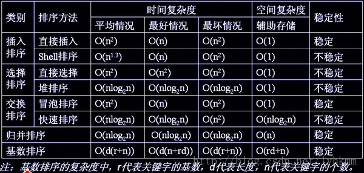

<!-- TOC START min:1 max:3 link:true update:true -->
- [链表](#链表)
  - [1-链表的增删改查](#1-链表的增删改查)
  - [2-如何从链表中删除重复数据](#2-如何从链表中删除重复数据)
  - [3-找出单链表中倒数第k个元素](#3-找出单链表中倒数第k个元素)
  - [4-链表的反转](#4-链表的反转)
  - [5-从尾到头输出单链表](#5-从尾到头输出单链表)
  - [6-寻找单链表中间节点](#6-寻找单链表中间节点)
  - [7-监测链表是否有环](#7-监测链表是否有环)
  - [8-在不知道头指针的情况下删除指定节点](#8-在不知道头指针的情况下删除指定节点)
  - [9-判断两个链表是否相交](#9-判断两个链表是否相交)
- [栈和队列](#栈和队列)
  - [1-实现栈](#1-实现栈)
  - [2-实现队列](#2-实现队列)
  - [3-如何用两个栈模拟队列](#3-如何用两个栈模拟队列)
- [排序](#排序)
  - [1-选择排序](#1-选择排序)
  - [2-插入排序](#2-插入排序)
  - [3-冒泡排序](#3-冒泡排序)
  - [4-归并排序](#4-归并排序)
  - [5-快速排序](#5-快速排序)
  - [6-希尔排序](#6-希尔排序)
  - [7-堆排序](#7-堆排序)
  - [8-排序算法性能](#8-排序算法性能)
- [位运算](#位运算)
  - [1-用移位代替乘法](#1-用移位代替乘法)
  - [2-如何判断一个数是不是2的n次方](#2-如何判断一个数是不是2的n次方)
  - [3-求一个二进制数中1的个数](#3-求一个二进制数中1的个数)
- [数组](#数组)
  - [1-求最大子数组之和](#1-求最大子数组之和)
  - [2-如何找出数组中重复最多的数](#2-如何找出数组中重复最多的数)
  - [3-如何求数组中两两相加等于20的组合种树](#3-如何求数组中两两相加等于20的组合种树)
  - [4-如何把一个数组循环右移k位](#4-如何把一个数组循环右移k位)
  - [5-如何找出数组中第k个最小的数](#5-如何找出数组中第k个最小的数)
  - [6-如何找出数组中只出现一次的数字](#6-如何找出数组中只出现一次的数字)
  - [7-如何找出数组中唯一的重复元素](#7-如何找出数组中唯一的重复元素)
  - [8-如何用递归方法求数组最大元素](#8-如何用递归方法求数组最大元素)
  - [9-如何求数对之差的最大值](#9-如何求数对之差的最大值)
  - [10-如何求数组中两个元素的最小距离](#10-如何求数组中两个元素的最小距离)
  - [11-如何对数组的两个子有序段进行合并](#11-如何对数组的两个子有序段进行合并)

<!-- TOC END -->


# 链表
## 1-链表的增删改查
```java
class Node{
  Node next = null;
  int data;
  public Node(int data){
    this.data = data;
  }
}
```
下面链表操作给出了链表的基本操作
```java
public class MyLinkedList{
  Node head = null;
  // 插入数据
  public void addNode(int d){
    Node node = new Node(d);
    if(head == null){
      head = node;  // 设置头结点
      return;
    }
    Node tmp = head;  // 从头遍历
    while(tmp.next != null)
      tmp = tmp.next;
    // add node to end
    tmp.next=node;
  }

  //删除第index个节点。
  public Boolean deleteNode(int index){
    if(index < 1 || index > length())
      return false;
    if(index==1){
      head = head.next;
      return true;
    }
    int i = 2;  // 从第二个节点开始
    Node preNode = head;
    Node curNode = preNode.next;
    while(curNode != null){
      if(i == index){
        preNode.next = curNode.next;
        return true;
      }
      preNode = curNode;
      curNode = curNode.next;
      i++;
    }
    return true;
  }

  // 长度
  public int length(){
    int l = 0;
    Node tmp = head;
    while(tmp!= null){
      l++;
      tmp = tmp.next;
    }
    return l;
  }

  // 链表排序（这个排序方法是冒泡）
  public Node orderList(){
    Node nextNode = null;
    int tmp = 0;
    Node curNode = head;
    whilc(curNode != null){
      nextNode = curNode.next;
      while(nextNode!= null){
        if(curNode.data > nextNode.data){
          tmp = curNode.data;
          curNode.data = nextNode.data;
          nextNode.data = tmp;
        }
        nextNode = nextNode.next;
      }
      curNode = curNode.next;
    }
    return head;
  }

  // 输出列表
  public void printList(){
    Node tmp = head;
    while(tmp != null){
      System.out.println(tmp.data);
      tmp = tmp.next;
    }
  }
}
```

## 2-如何从链表中删除重复数据
1. 最容易想到的办法是遍历列表，将遍历的值放到HashTable中，在遍历过程中，若当前访问的值在
HashTable中，说明是重复的。
```java
public void deleteDuplecate(Node head){
  Hashtable<Integer,Integer> table = new Hashtable<Integer,Integer>();
  Node tmp = head;
  Node pre = null;
  while(tmp != null){
    if(table.containsKey(tmp.data))
      pre.next = tmp.next;
    else{
      table.put(tmp.data,1);
      pre = tmp;
    }
    tmp = tmp.next;
  }
}
```
这种方法时间复杂度低，但是需要额外的储存空间来保存已遍历过的值。

2. 对链表进行双重遍历循环*(像冒泡那样)。这种方法不需要额外的存储空间，但是时间复杂度比上面的高。
```java
public void deleteDuplecate(Node head){
  Node p = head;
  while(p != null){
    Node q = p;
    while(q.next != null){ // q会从p节点开始遍历p到链表结尾
      if(p.date == q.next.data)
        q.next = q.next.next; //删除重复数据
      else
        q = q.next;
    }
    p = p.next;
  }
}
```

## 3-找出单链表中倒数第k个元素
1. 比较容易想到的是先遍历一遍算出链表的节点个数n，然后再遍历到第n-k个元素。但是这种方式需要遍历两次列表。
2. 还有一种做法是对于每个节点，遍历k个元素，如果刚好到结尾，那么那个节点就是倒数第k个节点。这种办法的问题在于
对同一批元素进行反复多次的遍历，时间复杂度为O(kn)，效率太低。
3. 更高效的方法是：设置两个指针，让其中一个比另一个先行**k-1**步，这样，当先行的指针到链表尾部时候，后行指针所指位置就是所要找的位置。
```java
//寻找倒数第k个元素
public Node findElemFromEnd(Node head, int k){
  if(k < 1)
    return null;
  Node p1 = head;
  Node p2 = head;
  // p1 先行k步
  for(int i = 0; i < k-1 && p1 != null;i++)
    p1 = p1.next;
  if(p1 == null){
    System.out.println("k不合法")
    return null;
  }
  while(p1.next != null){
    p1 = p1.next;
    p2 = p2.next;
  }
  return p2;
}
```

## 4-链表的反转
链表的反转需要注意的是，比如i,m,n 3个相连节点，i节点已经完成反转，在处理m节点的时候，不能直接将
m.next=i；因为这样的话就没有办法能够找到n，因为链接断裂，所以在处理m.next之前需要将n保存下来。
```java
public void ReserveList(Node head){
  Node pReservedHead = head;
  Node pNode = head;
  Node pPrev = null;
  while(pNode != null){
    Node pNext = pNode.next;  // 保存当前节点的next节点
    if(pNext == null) // 尾节点
      pReservedHead = pNode;  // 反转前的尾节点成为头结点
    pNode.next = pPrev;
    pPrev = pNode;
    pNode = pNext;
  }
  this.head = pReservedHead;
}
```

## 5-从尾到头输出单链表
1. 从上面得到启发，先反转链表再输出。
2. 遍历一遍列表，然后将每个元素放入一个栈中，然后输出栈。这样只需要遍历一次，但是需要维护一个
栈空间，实现比较麻烦。
3. 其实**递归本质上就是一个栈的结构，所以可以用递归来实现**
```java
public void printListReversely(Node head){
  if(head != null){
    printListReversely(head.next);
    System.out.println(head.data);
  }
}
```

## 6-寻找单链表中间节点
1. 最容易想到的办法是遍历列表取得长度n，然后遍历到n/2个节点。但是要遍历两次。
2. 优化的方法是用两个指针，一个每次走2步，一个每次走一步。当快指针到达尾部时候，慢指针位置刚好为链表中间节点（当链表长度为基数时，慢指针指向的即为中间指针，当链表长度为偶数时，慢指针所指向的节点和下一个节点都是中间节点）
```java
public Node SearchMid(Node head){
  Node fast = head;
  Node slow = head;
  while(fast =! null && fast.next != null && fast.next.next != null){
    fast = fast.next.next;
    slow = slow.next;
  }
  return slow;
}
```

## 7-监测链表是否有环
同上，快慢两个指针一起走，如果某个时间快指针等于慢指针，则说明有环。如果fast指针先行到尾部为null，则说明没环
```java
public boolean IsLoop(Node head){
  if(head == null)
    return false;
  Node fast = head;
  Node slow = head;
  while(fast != null & fast.next != null){
    fast = fast.next.next;
    slow = slow.next;
    if(fast == slow)
      return true;
  }
  return !(fast == null || fast.next == null);
}
```
寻找环的入口点：   
在找到相遇点后，在链表头和相遇点各设一个指针，每次走一步，两个指针必定相遇且相遇第一点即为环入口点。
```java
public Node findLoopPort(Node head){
  Node slow = head, fast = head;
  // 先找相遇点
  while(fast != null & fast.next != null){
    fast = fast.next.next;
    slow = slow.next;
    if(fast == slow)
      return break;
  }
  if(fast == null || fast.next == null) //这种情况说明链表是没环的
    return null;
  // 开始找环入口点
  // 在链表头和相遇点各设一个指针，每次走一步，两个指针必定相遇且相遇第一点即为环入口点。
  slow = head;
  while(slow != fast){
    slow = slow.next;   
    fast = fast.next;
  }
  return slow;
}
```

## 8-在不知道头指针的情况下删除指定节点
分两种情况：
1. 若待删除的节点是链表的尾节点，则无法删除，因为删除之后无法给前置节点的next设置为null。
2. 若待删除的节点不是尾节点，则可以通过交换这个节点与其后记节点的值，然后删除后继节点。
```java
public boolean deleteNode(Node n){
  if(n == null || n.next == null)
    return false;
  //交换n节点与后继节点的值
  int tmp = n.data;
  n.data = n.next.data;
  n.next.data = tmp;
  //删除后继节点
  n.next = n.next.next;
  return true;
}
```

## 9-判断两个链表是否相交
1. 若两个链表相交，则他们有着相同的尾节点。
```java
public boolean isIntersect(Node h1, Node h2){
  if(h1 == null || h2 == null)
    return false;
  Node tail1 = h1;
  //找链表1的尾节点
  while(tail1.next != null)
    tail1 = tail1.next;
  Node tail2 = h2;
  while(tail2.next != null)
    tail2 = tail2.next;

  return tail1 == tail2;
}
```
2. 那么如何找出他们相交的第一个点呢？   
  首先需要计算两个链表head1，head2长度len1和len2，假设len1>len2,则让head1先遍历（len1-len2）个节点，然后head2开始遍历，这样遇到的第一个相同的节点就是他们相交的点。不过前提条件是他们相交。
  ```java
  public Node getFirstMeetNode(Node h1, Node h2){
    if(h1 == null || h2 == null)
      return false;
      Node tail1 = h1;
      int len1 = 1;
  //找链表1的尾节点
  while(tail1.next != null){
    tail1 = tail1.next;
    len1++;
  }
  Node tail2 = h2;
  int len2 = 1;
  while(tail2.next != null){
    tail2 = tail2.next;
    len2++;
  }
  //两表不相交
  if( tail1 != tail2)
    return null;

  Node t1 = h1;
  Node t2 = h2;
  //先找出较长的链表，并先开始遍历
  if(len1 > len2){
    int d = len1 - len2;
    while(d!=0){
      t1 = t1.next;
      d--;
    }
  }else {
    int d = len2 - len1;
    while(d!=0){
      t2 = t2.next;
      d--;
  }
}
while(t1 != t2){
    t1 = t1.next;
    t2 = t2.next;
  }
  return t1;
}
  ```

# 栈和队列
## 1-实现栈
1. 用数组实现
```java
public class MyStack<E>{
  private Object[] stack;
  private int size;
  public MyStack() {
    stack = new Object[10];
  }

  public boolean isEmpty(){
    return size == 0;
  }

  public E peek(){
    if(isEmpty())
      return null;
    return (E)stack[size-1];
  }

  public E pop(){
    if(isEmpty())
      return null;
    E e = peek();
    stack[size-1] = null;
    size--;
    return e;
  }

  public E push(E item){
    ensureCapacity(size+1); //  检查容量
    stack[size++] = item;
    return item;
  }

  private void ensureCapacity(int size){
    if(size > stack.length)
      stack = Arrays.copyOf(stack, 10);
  }

}
```
2. 链表实现
```java
class Node<E>{
  Node<E> next = null;
  E data;
  public Node(E data){
    this.data = data;
  }
}
```
```java
public class Stack<E> {
  Node<E> top = null;

  public boolean isEmpty(){
    return top == null;
  }

  public void push(E data){
    Node<E> newNode = new Node<E>(data);
    newNode.next = top;
    top = newNode;
  }

  public E pop(){
    if(isEmpty())
      return null;
    E date = top.data;
    top = top.next;
    return data;
  }

  public E peek(){
    if(isEmpty())
      return null;
    return top.data;
  }
}
```

## 2-实现队列
1. 用链表实现
```java
class Node<E>{
  Node<E> next = null;
  E data;
  public Node(E data){
    this.data = data;
  }
}
```
```java
public class MyQueue<E> {
  private Node<E> head = null;
  private Node<E> tail = null;

  public boolean isEmpty(){
    return head == tail;
  }

  public void put(E data){
    Node<E> newNode = new Node<E>(data);
    if(isEmpty())
      head = tail = newNode;
    else{
      tail.next = newNode;
      tail = NewNode;
    }
  }

  public E pop(){
    if(isEmpty())
      return null;
    E data = head.data;
    head = head.next;
    return data;
  }

  public int size(){
    Node<E> tmp = head;
    int n = 0;
    while(tmp != null){
      n++;
      tmp = tmp.next;
    }
    return n;
  }
}
```
2. 用数组实现（LinkedList),并增加了线程安全
```java
public class MyQueue<E> {
  private LinkedList<E> list = new LinkedList<E>();
  private int size = 0;

  public synchronized void put(E e){
    list.addLast(e);
    size++;
  }

  public synchronized E pop(){
    if(size == 0)
      return null;
    return list.removeFirst();
  }

  public synchronized boolean empty(){
    return size == 0;
  }

  public synchronized int getSize(){
    return size;
  }
}
```

## 3-如何用两个栈模拟队列
要入列时，入栈A即可，要出队列则分两种情况：
1. 若栈B不为空，则直接弹出栈B
2. 若栈B为空，则需要依次弹出栈A，入到栈B，在弹出栈B
```java
public class MyQueue<E> {
  private Stack<E> s1 = new Stack<E>();
  private Stack<E> s2 = new Stack<E>();

  public synchronized void put(E e){
    s1.push(e);
  }

  public synchronized E pop(){
    if(s2.isEmpty())    //若栈B为空，则需要依次弹出栈A，入到栈B，在弹出栈B
      while(!s1.isEmpty())  
        s2.push(s1.pop());
    return s2.pop();
  }

  public synchronized isEmpty(){
    return s1.isEmpty() && s2.isEmpty();
  }
}
```

# 排序
## 1-选择排序
对于给定的一组记录，经过第一轮比较后得到最小的记录，然后将该记录与第一个记录的位置进行交换；接着对不包括第一个记录以外的进行第二轮比较，得到最小的记录并与第二个记录进行位置交换。重复该过程，直到进行比较的记录只有一个为止。   

举例：数组 int[] arr={5,2,8,4,9,1};
- 第一趟排序： 原始数据：5  2  8  4  9  1   
  最小数据1，把1放在首位，也就是1和5互换位置，

  排序结果：1  2  8  4  9  5
- 第二趟排序：
  第1以外的数据{2  8  4  9  5}进行比较，2最小，

  排序结果：1  2  8  4  9  5
- 第三趟排序：

  除1、2以外的数据{8  4  9  5}进行比较，4最小，8和4交换

  排序结果：1  2  4  8  9  5
- 第四趟排序：

  除第1、2、4以外的其他数据{8  9  5}进行比较，5最小，8和5交换

  排序结果：1  2  4  5  9  8
- 第五趟排序：

  除第1、2、4、5以外的其他数据{9  8}进行比较，8最小，8和9交换

  排序结果：1  2  4  5  8  9
```java
public void selectionSort(int[] arr){
  if(arr == null)
    return;
  for(int i = 0; i < arr.length-1; i++){
    //做第i趟排序
    int k = i;
    for(int j = k+1; j < arr.length; i++){
      // 选择最小的记录
      if(arr[j] < arr[k])
        k = j;  // 记录最小值位置
    }
    // 在完成内层循环够，再交换
    if(i != k){
      int tmp = arr[i];
      arr[i] = arr[k];
      arr[k] = tmp;
    }
  }
}
```
## 2-插入排序
直接插入排序基本思想是每一步将一个待排序的记录，插入到前面已经排好序的有序序列中去，直到插完所有元素为止。

```java
public void insertSort(int[] arr){
  if(arr == null)
    return;
  for (int i = 1; i < arr.length; i++) {
    // 初始第一个元素是被认为排好序的，从arr[1]开始排序操作
    for(int j = i; j>0 && a[j] < a[j-1]; j--){
      // 这个循环将a[i]元素加入到排好的序列中
      // 如果不满足a[j] < a[j-1]，说明a[i]刚好比排好的序列的尾元素大，就不要再对a[i]进行处理
      // 如果a[j] < a[j-1]，就需要把a[i]调整到相应的位置去
      int tmp = a[j];
      a[j] = a[j-1];
      a[j-1] = tmp;
    }
  }
}
```

## 3-冒泡排序
依次比较相邻的两个数，将小数放在前面，大数放在后面。即在第一趟：首先比较第1个和第2个数，将小数放前，大数放后。然后比较第2个数和第3个数，将小数放前，大数放后，如此继续，直至比较最后两个数，将小数放前，大数放后。重复第一趟步骤，直至全部排序完成。

第一趟比较完成后，最后一个数一定是数组中最大的一个数，所以第二趟比较的时候最后一个数不参与比较；

第二趟比较完成后，倒数第二个数也一定是数组中第二大的数，所以第三趟比较的时候最后两个数不参与比较；

依次类推，每一趟比较次数-1；
```java
public static void BubbleSort(int arr[]){
  if(arr == null)
    return;
  for(int i = 0; i < arr.length; i++){
    for (int j = 0; j < arr.length - 1 -i; j++){
      if(arr[j] > arr[j+1]){
        int tmp = arr[j];
        arr[j] = arr[j+1];
        a[j+1] = tmp;
      }
    }
  }
}
```

## 4-归并排序
归并排序（MERGE-SORT）是利用归并的思想实现的排序方法，该算法采用经典的分治（divide-and-conquer）策略（分治法将问题分(divide)成一些小的问题然后递归求解，而治(conquer)的阶段则将分的阶段得到的各答案"修补"在一起，即分而治之)。
！[归并1](../pic/归并1.png)
在“治”的阶段，我们需要将两个已经有序的子序列合并成一个有序序列。
！[归并2](../pic/归并2.png)
！[归并3](../pic/归并3.png)
```java
public static void sort(int[] arr){
  // 排序前，先建好一个长度等于原长度的临时数组，避免递归中频繁开辟空间
  int[] tmp = new int[arr.length];
  sort(arr, 0, arr.length - 1, tmp);
}

private static void sort(int[] arr, int left, int right, int[] tmp){
  if(left < right){
    int mid = (left+right) / 2;
    sort(arr, left, mid, tmp);  // 左边归并排序，使得左子序列有序
    sort(arr, mid+1, right, tmp); // 右边归并排序，使得右子序列有序
    merge(arr, left, mid, right, tmp);  // 将两个有序子序列合并
  }
}

private static void merge(int[] arr, int left, int mid, int right, int[] tmp){
  int i = left; // 左序列指针
  int j = mid + 1;  // 右序列指针
  int t = 0;  //临时数组指针
  while(i <= mid && j <= right){
    if(arr[i] < arr[j])
      tmp[t++] = arr[i++];
    else
      tmp[t++] = arr[j++];
  }
  while(i <= mid){
    // 将左边剩余元素填入tmp中
    tmp[t++] = arr[i++];
  }
  while(j <= right){
    // 将右边剩余元素填入tmp中
    tmp[t++] = arr[j++];
  }
  t = 0;
  // 将tmp中的元素拷贝到原数组
  while(left <= right)
    arr[left++] = tmp[t++];
}
```
归并排序是稳定排序，它也是一种十分高效的排序，能利用完全二叉树特性的排序一般性能都不会太差。java中Arrays.sort()采用了一种名为TimSort的排序算法，就是归并排序的优化版本。从上文的图中可看出，每次合并操作的平均时间复杂度为O(n)，而完全二叉树的深度为|log2n|。总的平均时间复杂度为O(nlogn)。而且，归并排序的最好，最坏，平均时间复杂度均为O(nlogn)。

[图解排序算法之归并排序](https://www.cnblogs.com/chengxiao/p/6194356.html)

## 5-快速排序
快速排序是冒泡排序的改进版，也是最好的一种内排序，在很多面试题中都会出现，也是作为程序员必须掌握的一种排序方法。

思想:
1. 在待排序的元素任取一个元素作为基准(通常选第一个元素，但最的选择方法是从待排序元素中随机选取一个作为基准)，称为基准元素；
2. 将待排序的元素进行分区，比基准元素大的元素放在它的右边，比其小的放在它的左边；
3. 对左右两个分区重复以上步骤直到所有元素都是有序的。

```java
public static void quickSort(int[] arr, int _left, int _right){
  int left = _left;
  int right = _left;
  int tmp = 0;

  if(left < right){  // 待排序的元素至少有两个
    tmp = arr[left];  //  待排序的第一个元素作为基准元素
    while(left != right){ // 从左右两边交替扫描，直到 left == right
      while(right > left && arr[right] >= tmp)
        right --;         // 从右往左扫描，找到第一个比基准元素小的元素
      arr[left] = arr[right]; // 找到这个元素后，将其放到arr[left]中

      while(left < right && arr[left] <= tmp)
        left ++;         // 从左往右扫描，找到第一个比基准元素大的元素
      arr[right] = arr[left]; // 找到这个元素后，将其放到arr[right]中
    }
    arr[right] = tmp;   // 基准元素归位
    quickSort(arr, _left, left-1)   //对基准左边的元素排序
    quickSort(arr, right+1, _right) // 对基准右边的元素排序
  }
}
```
[图解快速排序](https://www.cnblogs.com/MOBIN/p/4681369.html)

## 6-希尔排序
希尔排序是把记录按下标的一定增量分组，对每组使用直接插入排序算法排序；随着增量逐渐减少，每组包含的关键词越来越多，当增量减至1时，整个文件恰被分成一组，算法便终止。

简单插入排序很循规蹈矩，不管数组分布是怎么样的，依然一步一步的对元素进行比较，移动，插入，比如[5,4,3,2,1,0]这种倒序序列，数组末端的0要回到首位置很是费劲，比较和移动元素均需n-1次。而希尔排序在数组中采用跳跃式分组的策略，通过某个增量将数组元素划分为若干组，然后分组进行插入排序，随后逐步缩小增量，继续按组进行插入排序操作，直至增量为1。希尔排序通过这种策略使得整个数组在初始阶段达到从宏观上看基本有序，小的基本在前，大的基本在后。然后缩小增量，到增量为1时，其实多数情况下只需微调即可，不会涉及过多的数据移动。

```java
public static void ShellSort(int[] arr){
  // 增量gap，并逐渐缩小gap
  for(int gap = arr.length/2; gap > 0; gap /= 2){
    // 从第gap个元素，逐渐对其所在组进行直接插入排序
    for(int i = gap; i < arr.length; i++){
      for(int j = i; j-gap >= 0 && arr[j] < arr[j-gap]; j -= gap){
        int tmp = arr[j];
        arr[j] = arr[j-gap];
        arr[j-gap] = tmp;
      }
    }
  }
}
```

## 7-堆排序
堆排序的基本思想是：将待排序序列构造成一个大顶堆，此时，整个序列的最大值就是堆顶的根节点。将其与末尾元素进行交换，此时末尾就为最大值。然后将剩余n-1个元素重新构造成一个堆，这样会得到n个元素的次小值。如此反复执行，便能得到一个有序序列了

步骤一 构造初始堆。将给定无序序列构造成一个大顶堆（一般升序采用大顶堆，降序采用小顶堆)。

1. 假设给定无序序列结构如下:

2. 此时我们从最后一个非叶子结点开始（叶结点自然不用调整，第一个非叶子结点 arr.length/2-1=5/2-1=1，也就是下面的6结点），从左至右，从下至上进行调整。

3. 找到第二个非叶节点4，由于[4,9,8]中9元素最大，4和9交换。

4. 这时，交换导致了子根[4,5,6]结构混乱，继续调整，[4,5,6]中6最大，交换4和6。

此时，我们就将一个无需序列构造成了一个大顶堆。

步骤二 将堆顶元素与末尾元素进行交换，使末尾元素最大。然后继续调整堆，再将堆顶元素与末尾元素交换，得到第二大元素。如此反复进行交换、重建、交换。
1. 将堆顶元素9和末尾元素4进行交换

2. 重新调整结构，使其继续满足堆定义

3. 再将堆顶元素8与末尾元素5进行交换，得到第二大元素8.

4. 后续过程，继续进行调整，交换，如此反复进行，最终使得整个序列有序


```java
public static void heapSort(int[] arr){
  // 1-构建大顶堆
  for(int i = arr.length/2-1; i >=0; i--){
    // 从第一个非叶子节点从下而上，从右至左调整
    adjustHeap(arr, i, arr.length);
  }
  // 2-调整堆结构+交换堆顶元素与末尾元素
  for(int j=arr.length-1; j > 0; j--){
    swap(arr, 0 ,j);    // 交换堆顶元素与末尾元素
    adjustHeap(arr, 0, j);  // 重新对堆进行调整
  }
}

public static adjustHeap(int[] arr, int i, int length){
  int tmp = arr[i];   // 先取出当前元素i
  for(int k = 2*i+1; k < length; k = k*2+1){ // 从i节点的左子节点开始，也就是2i+1
    // 注意这是个循环，因为有可能在调整完节点之后之前的结构又混乱了，就像上面第4个图那样，这样的话就需要从这个子节点处接着调整子树，完成大顶堆的构建
    if(k+1<length && arr[k] < arr[k+1])
      k++;      // //如果左子结点小于右子结点，k指向右子结点
    if(arr[k] > tmp){   // 如果子节点大于父节点，将子节点值赋给父节点（不用进行交换），父节点的值在tmp中
      arr[i] = arr[k];
      i = k;
    } else
      break;
  }
  arr[i] = tmp;   // //将temp值放到最终的位置
}
```

## 8-排序算法性能



# 位运算
## 1-用移位代替乘法
把一个数左移n位相当于把该数乘以 2 的 n 次方；
```java
public static int powerN(int m, int n){ // m乘以2的n次方
  for(int i=0; i<n; i++)
    m = m << 1;
  return m;
}
```

## 2-如何判断一个数是不是2的n次方
根据上面的思路，可以让 1 做移位操作，判断移位后是否与给定的数相等。
```java
public static boolean isPower(int n){
  if(n < 1) return false;
  int i = 1;
  while(i <= n){
    if(i == n)
      return true;
    i = i << 1;
  }
  return false;
}
```
这种算法时间复杂度为O(logN)，但是如果一个数是2的n次方，那么这个数的二进制标识为：1,10,100，...如果num=00010000,那么num-1就是00001111，这时候num&num-1就为0，我们可以根据这个特点来判断。
```java
public static boolean isPower(int n){
  if(n < 1) return false;
  int m = n&(n-1);
  return m==0;
}
```

## 3-求一个二进制数中1的个数
1. 判断这个数的最后一位是不是1，如果是1，则计数器加1，然后通过右移丢弃最后一位。
```java
public static int countOne(int n){
  int count = 0;
  while(n > 0){
    if((n & 1) == 1)  // 判断最后一位是不是1
      count++;
    n >> 1; //右移一位
  }
  return count;
}
```

2. 运用n&n-1
```java
public static int countOne(int n){
  int count = 0;
  while(n > 0){
    if(n !=0 )  // 判断最后一位是不是1
      n = n&(n-1);
    count++;
  }
  return count;
}
```

# 数组
## 1-求最大子数组之和
有一个n个元素的数组，可以是正数也可能是负数 ，求子数组和的最大值。
1. 蛮力法：找出所以子数组，然后求和找最大值
```java
public static int maxSubArray(int arr[]){
  if(arr == null)
    return null;

  int thisSum = 0; maxSum = 0; i, j, k;
  for(i = 0; i < arr.length; i ++){
    for(j = i; j < arr.length; j++){
      thisSum = 0;
      for(k = i; k < j; k++)
        thisSum += arr[k];
      if(thisSum > maxSum)
        maxSum = thisSum;
    }
  }
  return maxSum;
}
```
这种算法时间复杂度为O(n^3)，效率太低。

2. 重复利用已经计算的子数组和
例如sum[i,j] = sum[i, j-1]+arr[j],这种时间复杂度为O(n^2)
```java
public static int maxSubArray(int arr[]){
  if(arr == null)
    return null;
  int size = arr.length;
  int maxSum = Integer.MIN_VALUE;
  for(int i = 0; i < size; i++){
    int sum = 0;        // 跟上面相比，就是sum的位置变化了.
    for(int j = i; j < size; j++){
      sum += arr[j];
      if(sum > maxSum)
        maxSum = sum;
    }
  }
  return maxSum;
}
```

3. 动态规划法
数组为arr[]，设sum[i-1] 是以arr[i-1]结尾的子数组的最大和，对于元素arr[i], 它有两种选择：
   1. arr[i]接着前面的子数组构成最大和
   2. arr[i]自己单独构成子数组。
则sum[i] = max{sum[i-1]+arr[i],  arr[i]}
```java
public staic int maxSubArray(int arr[]{
  int maxSum = Integer.MIN_VALUE;
  int sum = 0;

  for(int i= 0; i <arr.length; i++){
    sum = max(sum + arr[i], arr[i]);
    maxSum = max(maxSum, sum);
  }
  return maxSum;
})
```
对以上代码换个写法，并记录最大子数组的位置
```java
public staic int maxSubArray(int arr[], int &left, int &right){
  int maxSum = Integer.MIN_VALUE;
  int sum = 0;
  int begin = 0;

  for (int i = 0; i < arr.length; i++){
    if(sum >= 0){
      sum += arr[i];
    }else{
      sum = arr[i];
      begin=i;
    }
    if(maxSum < sum){
      maxSum = sum;
      left = begin;
      right = i;
    }
  }
}
```

## 2-如何找出数组中重复最多的数
HashMap

## 3-如何求数组中两两相加等于20的组合种树
{1,7,17,2,6,3,14} -> (17,3),(6,14)
1. 蛮力法，时间复杂度O(n^2)
采用两重循环遍历数组，判断两个数和是不是20
```java
public class void findSum(int arr[], int sum){
  int len = arr.length
  for(int i = 0; i < len; i ++)
    for(int j = i; j < len; j++)
      if(a[i]+a[j] == sum)
        System.out.println("( " + a[i] + "," + a[j] +")");
}
```

2. 排序法
选择排序时间为O(nlogn)的排序算法之后，分别从前和后对数组进行遍历，如果arr[begin] +arr[end] < 20.如果存在两个数合为20，那么这两个数一定在arr[begin+1]到arr[end]之间。
如果arr[begin] +arr[end] > 20.如果存在两个数合为20，那么这两个数一定在arr[begin]到arr[end-1]之间。
```java
public static void findSum(int[] arr, sum){
  Arrays.sort(a);
  int begin = 0;
  int end = arr.length - 1;
  while(begin < end){
    if(arr[begin] + arr[end] < sum)
      begin++;
    else if(arr[begin] + arr[end] > sum)
      end--;
    else{
      System.out.println("( " + a[i] + "," + a[j] +")");
      begin++;
      end--;
    }

  }
}
```

## 4-如何把一个数组循环右移k位
假设要把数组序列12345678右移两位变成78123456，可以发现其中有两段序列是不变的，可以把这两段看做两个整体，右移k位就是把数组两部分交换一下。
步骤为：
1. 逆序数组123456 -> 65432178
2. 逆序数组78 -> 65432187
3. 整体逆序 -> 78123456
```java
// 逆序数组 arr[begin-end]
public static void reverse(int arr[], int begin, int end){
  for(; begin < end; begin++, end--){
    int tmp = arr[end];
    arr[end] = arr[begin];
    arr[begin] = tmp;

  }
}

public static void shift_k(int arr[], int k){
  int len = arr.length;
  k = k % len;  // 防止k比n大
  reverse(arr, 0, len-k-1);
  reverse(arr, len-k, len-1);
  reverse(arr, 0, len-1)
}
```
## 5-如何找出数组中第k个最小的数
1. 排序法
最容易想到的办法是对数组进行排序，排序后的数组中第k-1个位置上的数即为第k小的数。这种办法最好的时间复杂度是O(nlogn)。

2. 剪枝法
采用快排的思想：选一个数tmp = a[left]作为枢纽，把比它小的放在左边，比它大的放在右边，然后判断tmp的位置，如果它的位置为k-1，那么它就是第k小的数，如果它的位置小于k-1，那么说明第k小的元素一定在数组的右半部分，采用递归的办法在右半部分继续找。如果就在左半部分继续找。
```java
public staic int quickSort(int arr[], int _left, int _right, int k){
  if(_left > _right)
    return Integer.MIN_VALUE;
  int left = _left;
  int right = _left;
  int tmp = 0;

  if(left < right){  // 待排序的元素至少有两个
    tmp = arr[left];  //  待排序的第一个元素作为基准元素
    while(left != right){ // 从左右两边交替扫描，直到 left == right
      while(right > left && arr[right] >= tmp)
        right --;         // 从右往左扫描，找到第一个比基准元素小的元素
      arr[left] = arr[right]; // 找到这个元素后，将其放到arr[left]中

      while(left < right && arr[left] <= tmp)
        left ++;         // 从左往右扫描，找到第一个比基准元素大的元素
      arr[right] = arr[left]; // 找到这个元素后，将其放到arr[right]中
    }
    arr[right] = tmp;   // 基准元素归位

    if( right == k-1)
      return tmp;
    else if( right > k-1 )
      return quickSort(arr, _left, left - 1, k);  // 在左半部分查找
    else
      return quickSort(arr, right+1, _right, k);  // 在右半部分查找
}
}

public static int getKMin(int arr[], int k){
  if(arr == null)
    return Integer.MIN_VALUE;
  if(arr.length < k)
    return Integer.MIN_VALUE;
  return quickSort(arr, 0, arr.length, k);
}
```

## 6-如何找出数组中只出现一次的数字
问题描述：一个整形数组中除了一个数字外，其他数字出现了两次，找出这个出现了1次的数字。要求时间复杂度O(n),空间复杂度O(1)。

如果不要求时间复杂度的话，最容易想到的办法是先对数组排序，然后遍历数组即可。这种方法时间复杂度最好的是O(nlogn).

题目只强调了该数出现了1次，其他出现了两次，首先想到异或运算，这样重复的数字在异或时候回相互抵消。
```java
public static int findNotDouble(int arr[]){
  int result = arr[0];
  for(int i = 0; i < n; i++)
    result ^= arr[i];
  return result;
}
```

**引申：** 如果其他数字出现了3次呢？
如果出现了一次的数字为a，那么除去a，之后所有数字对应的二进制数中各个位置上1的个数是3的倍数。因此，可以对数组中所有数字对应的二进制中各个位置上1的个数取余。
```java
public static int findOne(int[] arr, int appearTime){
  int[] bitCount = new int[32];
  // 计算数组中所有数对应的二进制各个位置上出现1的次数
  for(int i=0; i<arr.length; i++)
    for(int j=0; j < 32; j ++)
      bitCount[j] += ()(arr[i] >> j) & 1);
  // 若某位上的结果不能被整除，则肯定目标数字在这一位上
  int appearOne = 0;
  for(int i = 0; i < 32; i++)
    if(bitCount[i] % appearTime != 0)
      appearOne += (1 << i);
}
```

## 7-如何找出数组中唯一的重复元素
问题描述：数组arr[N], 1~N-1这N-1个数存放在arr[N]中，其中有个数重复了一次，找出这个重复的数。要求每个数组元素只访问一次，且不用辅助存储空间。
1. 数学求和
对数组所有项求和，然后减去1~N-1的和，即为所求的重复数
```java
public static int xor_findDup(int[] arr){
  int sum1 = 0; // 数组所有项求和
  int sum2 = 0; // 1~N-1的和
  for(int i = 0; i < arr.length -1; i ++){
    sum1 += arr[i];
    sum2 += (i+1);
  }
  sum1 += arr[arr.length-1];  // 加上最后一个元素
  return sum1 - sum2;
}
```

2. 异或法
数组arr[N]中N个数的异或结果与1~N-1的异或结果再做一次异或，即得所求。(两个相同的数异或为0，0与X异或得到X)
```java
public static int xor_findDup(int[] arr){
  int result = 0;
  for(int i = 0; i < arr.length; i++)
    result ^= arr[i];
  for(int i=1; i < n; i++)
    result ^= i;
  return result;
}
```

3. 空间换时间
申请长度为N-1的整形数组flag并初始化为0，然后从头遍历数组，取每个数组元素arr[i]的值，将其对应数组flag中的元素赋值为1，如果已经置过1，那么该数就是重复的。
```java
public static int findInteger(int[] arr){
  boolean[] arrayflag = new boolean[arr.length];
  int i = 1;
  int result = Integer.MAX_VALUE;
  while( i < n){
    arrayflag[i] = false;
    i++;
  }
  for(int i = 0; i < n; i++){
    if(arrayflag[arr[i]] == false)
      arrayflag[arr[i]] = true;
    else
      result=arr[i];
  }
  return result;
}
```
这种方法可以通过使用位图的方法来降低空间复杂度。

## 8-如何用递归方法求数组最大元素
主要思路是：递归的求解“数组第一个元素”与“数组中其他元素组成的子数组的最大值”的最大值
```java
public int maxnum(int arr[], int index){  // index表示现在的位置
  int length = arr.length-index;  // 剩下的长度
  if(length == 1)
    return arr[index];
  else
    return max(arr[index], maxnum(arr, index + 1));
}
```

## 9-如何求数对之差的最大值
问题描述：数组中的一个数字减去它右边子数组的一个数字可以得到一个差值，求所有可能的差值中的最大值。例如数组{1,4,17,3,2,9}，最大差值为17-2=15.
1. 蛮力法
```java
public static int getMax(int arr[]){
  if(arr==null)
    return Integer.MIN_VALUE;
  if(arr.length <= 1)
    retunr Integer.MIN_VALUE;
  int max = Integer.MIN_VALUE;
  for(int i=0; i < arr.length-1; i++){    // 只遍历到arr[length-2],因为最后要满足 arr[length-2]-arr[length-1]
    for(int j=i+1; j < arr.length; j++)
      if((arr[i] - arr[j]) > max )
        max = arr[i] - arrp[j];
  return max;
  }
}
```

2. 动态规划
设diff[i]为前i+1个数组成的子数组中最大的差值，max[i]为前i+1个数中最大的值，那么就有diff[i+1] = max(diff[i], max[i-1] - arr[i])
```java
public static int getMax(int arr[]){
  if(arr==null)
    return Integer.MIN_VALUE;
  if(arr.length <= 1)
    retunr Integer.MIN_VALUE;
  int diff = 0; // 前i+1个数组成的子数组中最大的差值
  int max = arr[0]; // max[i]为前i+1个数中最大的值

  for(int i=1; i < arr.length; i++){
    diff = Math.max(diff, max-arr[i]); // diff[i+1] = max(diff[i], max[i-1] - arr[i])
    max = Math.max(max, arr[i]);  // 记录前i+1个数中最大的值
  }
  return diff;
}
```

## 10-如何求数组中两个元素的最小距离
问题描述：给定一个数组，数组中含有重复元素，给出两个数n1和n2，求这两个数字在数组中所出现位置的最小距离。

例如数组{4,5,6,7,4,6,4,7,8,5,6,4,3,10,8}中，4和8最小距离是2

思路如下：遍历数组，会遇到以下两种情况：
   1. 当遇到n1时，记录下n1值对应的数组下表的位置n1_index,通过求n1_index与上次遍历到n2的下标值 n2_index 做差，可以求出最近一次遍历到 n1 和 n2 的距离。
   2. 当遇到n2时，记录下n2值对应的数组下表的位置n2_index,通过求n2_index与上次遍历到n1的下标值 n1_index 做差，可以求出最近一次遍历到 n1 和 n2 的距离。
   3. 定义一个遍历记录最短距离。
```java
public static int minDistance(int[] arr, int n1, int n2){
  if(arr == null)
    return Integer.MIN_VALUE;
  int len = arr.length;
  int n1_index = -1;
  int n2_index = -2;
  int min_dis = Integer.MIN_VALUE+1;
  for(int i = 0; i < len; i++){
    if(a[i] == n1){
      n1_index = i;
      if(n2_index >= 0)
        min_dis = min(Math.abs(min_dis), Math.abs(n1_index - n2_index));
    }
    if(a[i] == n2){
      n2_index = i;
      if(n1_index >= 0)
        min_dis = min(Math.abs(min_dis), Math.abs(n2_index - n1_index));
    }
  }
  return min_dis;
}
```

## 11-如何对数组的两个子有序段进行合并
问题描述：
