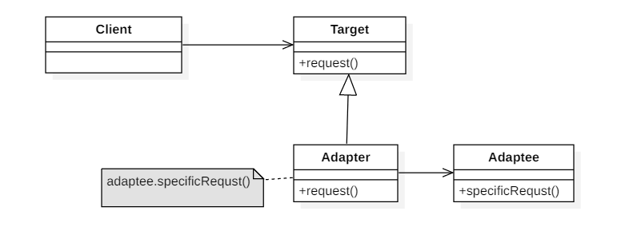

<!-- TOC START min:1 max:3 link:true update:true -->
- [一、23种设计模式](#一23种设计模式)
- [二、创建型](#二创建型)
	- [简单工厂-Simple Factory](#简单工厂-simple-factory)
	- [工厂方法-Factory-Method](#工厂方法-factory-method)
	- [抽象工厂-Abstract-Factory](#抽象工厂-abstract-factory)
- [二、结构型](#二结构型)
	- [适配器-Adapter](#适配器-adapter)
	- [Builder](#builder)
- [三、行为型](#三行为型)
	- [观察者模式-Observer](#观察者模式-observer)
	- [责任链-ChainOfResponsibility](#责任链-chainofresponsibility)

<!-- TOC END -->


# 一、23种设计模式
|        | 创建型 | 结构型 | 行为型 |
| :----: | :----: | :----: | :----: |
| 类     | [Factory Method 工厂方法](#工厂方法-Factory-Method) | [Adapter_Class 适配器类](#适配器-Adapter) | Interpreter 解释器<br>Template Method 模板方式 |
| 对象   | [Abstract Factory 抽象工厂](#抽象工厂-Abstract-Factory)<br>[Builder 生成器](#Builder)<br>Prototype 原型<br>[Singleton 单例](#Singleton-单例) | [Adapter_Object 适配器对象](#适配器-Adapter) <br>Bridge 桥接<br>Composit 组合<br>Decorator 装饰<br>Facade 外观<br>Flyweight 享元<br>Proxy 代理 | [Chain of Responsibility 职责链](#责任链-ChainOfResponsibility)<br>Command 命令<br>Iterator 迭代器<br>Mediator 中介者<br>Memento 备忘录<br>[Observer 观察者](#观察者模式-Observer)<br>State 状态<br>Strategy 策略<br>Visitor 访问者模式 |


# 二、结构型
## 适配器-Adapter
适配器模式是把一个类的接口转换成客户端所期望的另一种接口。同时，适配器模式有对象适配器和类适配器两张形式实现方式，但是类适配器采用“多继承”的实现方式，会引起程序的高耦合，所以不推荐使用；而对象适配器采用“对象组合”的方式，耦合度低，应用更广泛。

鸭子（Duck）和火鸡（Turkey）拥有不同的叫声，Duck 的叫声调用 quack() 方法，而 Turkey 调用 gobble() 方法。   
要求将 Turkey 的 gobble() 方法适配成 Duck 的 quack() 方法，从而让火鸡冒充鸭子！
```java
public interface Duck { void quack();}
public interface Turkey { void gobble(); }
```

```java
public class WildTurkey implements Turkey{
	@Override
	public void gobble(){
		System.out.println("gobble!")
	}
}
```
```java
public class TurkeyAdapter implements Duck{
	Turkey turkey;
	public TurkeyAdapter(Turkey turkey){
		this.turkey = turkey;
	}
	@Override
	public void quack() {
		turkey.gobble();
	}
}
```
```java
public class Client{
	public static void main(String[] args){
		Turkey turkey = new WildTurkey();
		Duck duck = new TurkeyAdapter(turkey);
		duck.quack();
	}
}
```

## Builder
封装一个对象的构造过程，并允许按步骤构造。

```java
// 封装了String的构造过程
public class AbstractStringBuilder {
    protected char[] value;

    protected int count;

    public AbstractStringBuilder(int capacity) {
        count = 0;
        value = new char[capacity];
    }
    public AbstractStringBuilder append(char c) {
        ensureCapacityInternal(count + 1);
        value[count++] = c;
        return this;
    }
    private void ensureCapacityInternal(int minimumCapacity) {
        // overflow-conscious code
        if (minimumCapacity - value.length > 0)
            expandCapacity(minimumCapacity);
    }
    void expandCapacity(int minimumCapacity) {
        int newCapacity = value.length * 2 + 2;
        if (newCapacity - minimumCapacity < 0)
            newCapacity = minimumCapacity;
        if (newCapacity < 0) {
            if (minimumCapacity < 0) // overflow
                throw new OutOfMemoryError();
            newCapacity = Integer.MAX_VALUE;
        }
        value = Arrays.copyOf(value, newCapacity);
    }
}
```
```java
// 实现这个构造类
public class StringBuilder extends AbstractStringBuilder {
    public StringBuilder() {
        super(16);
    }

    @Override
    public String toString() {
        // Create a copy, don't share the array
        return new String(value, 0, count);
    }
}
```
```java
public class Client {
    public static void main(String[] args) {
        StringBuilder sb = new StringBuilder();
        final int count = 26;
        for (int i = 0; i < count; i++) {
            sb.append((char) ('a' + i));
        }
        System.out.println(sb.toString());
    }
}
```

# 三、行为型
## 观察者模式-Observer
定义对象之间的一对多依赖，当一个对象状态改变时，它的所有依赖都会收到通知并且自动更新状态。

主题（Subject）是被观察的对象，而其所有依赖者（Observer）称为观察者。

主题（Subject）具有注册和移除观察者、并通知所有观察者的功能，主题是通过维护一张观察者列表来实现这些操作的。

观察者（Observer）的注册功能需要调用主题的 registerObserver() 方法。

```java
//天气数据布告板会在天气信息发生改变时更新其内容，布告板有多个，并且在将来会继续增加。
//被观察者
public interface Subject{
	void registerObserver(Observer o);
	void removeOnserver(Observer o);
	void notifyObservers();
}
```
```java
public class WeatherData implements Subject {
    private List<Observer> observers;
    private float temperature;
    private float humidity;
    private float pressure;

    public WeatherData() {
        observers = new ArrayList<>();
    }

    public void setMeasurements(float temperature, float humidity, float pressure) {
        this.temperature = temperature;
        this.humidity = humidity;
        this.pressure = pressure;
        notifyObserver();
    }

    @Override
    public void resisterObserver(Observer o) {
        observers.add(o);
    }

    @Override
    public void removeObserver(Observer o) {
        int i = observers.indexOf(o);
        if (i >= 0) {
            observers.remove(i);
        }
    }

    @Override
    public void notifyObserver() {
        for (Observer o : observers) {
            o.update(temperature, humidity, pressure);
        }
    }
}
```
```java
//观察者
public interface Observer {
    void update(float temp, float humidity, float pressure);
}
```
```java
//两种不同类型的观察者
public class StatisticsDisplay implements Observer {

    public StatisticsDisplay(Subject weatherData) {
        weatherData.resisterObserver(this);
    }

    @Override
    public void update(float temp, float humidity, float pressure) {
        System.out.println("StatisticsDisplay.update: " + temp + " " + humidity + " " + pressure);
    }
}
public class CurrentConditionsDisplay implements Observer {

    public CurrentConditionsDisplay(Subject weatherData) {
        weatherData.resisterObserver(this);
    }

    @Override
    public void update(float temp, float humidity, float pressure) {
        System.out.println("CurrentConditionsDisplay.update: " + temp + " " + humidity + " " + pressure);
    }
}
```
```java
public class WeatherStation {
    public static void main(String[] args) {
        WeatherData weatherData = new WeatherData(); //Subject
        CurrentConditionsDisplay currentConditionsDisplay = new CurrentConditionsDisplay(weatherData);
        StatisticsDisplay statisticsDisplay = new StatisticsDisplay(weatherData);

        weatherData.setMeasurements(0, 0, 0);
        weatherData.setMeasurements(1, 1, 1);
    }
}
```
```java
CurrentConditionsDisplay.update: 0.0 0.0 0.0
StatisticsDisplay.update: 0.0 0.0 0.0
CurrentConditionsDisplay.update: 1.0 1.0 1.0
StatisticsDisplay.update: 1.0 1.0 1.0
```

## 责任链-ChainOfResponsibility
使多个对象都有机会处理请求，从而避免请求的发送者和接收者之间的耦合关系。将这些对象连成一条链，并沿着这条链发送该请求，直到有一个对象处理它为止。

```java
public abstract class Handler{
	protected Handler successor;
	public Handler(Handler successor){
		this.successor = successor;
	}
	protected abstract void handleRequest(Request request);
}
```

```java
public class ConcreteHandler1 extends Handler{
	public ConcreteHandler1(Handler successor){
		super(successor);
	}
	@Override
	protected void handleRequest(Request request){
		if(request.getType()==RequestType.TYPE1) {
			System.out.println(request.getName() + " is handle by ConcreteHandler1")
		}
		if(successor != null)
			successor.handleRequest(request);
	}
}
```

```java
public class ConcreteHandler2 extends Handler{
	public ConcreteHandler2(Handler successor){
		super(successor);
	}
	@Override
	protected void handleRequest(Request request){
		if(request.getType()==RequestType.TYPE2) {
			System.out.println(request.getName() + " is handle by ConcreteHandler2")
		}
		if(successor != null)
			successor.handleRequest(request);
	}
}
```

```java
public class Request{
	private RequestType type;
	private String name;
	//省略 getter和setter
}
```

```java
public enum RequestType {
    TYPE1, TYPE2
}
```

```java
public class Client {

    public static void main(String[] args) {

		//构建责任链
        Handler1 handler1 = new ConcreteHandler1(null);
		Handler2 handler2 = new ConcreteHandler2(handler1);

        Request request1 = new Request(RequestType.TYPE1, "request1");
        handler2.handleRequest(request1);

        Request request2 = new Request(RequestType.TYPE2, "request2");
        handler2.handleRequest(request2);
    }
}
```

```java
request1 is handle by ConcreteHandler1
request2 is handle by ConcreteHandler2
```
